# 01 — Product Vision

> Cluster A · Product & Discovery
> Up: [00-README-INDEX.md](00-README-INDEX.md) · Foundations: [0A-DESIGN-FOUNDATIONS.md](0A-DESIGN-FOUNDATIONS.md)
> Siblings: [02-stakeholder-analysis.md](02-stakeholder-analysis.md) · [03-user-personas.md](03-user-personas.md) · [04-patient-journey-maps.md](04-patient-journey-maps.md) · [28-mvp-definition.md](28-mvp-definition.md)

---

## 1. Vision statement

**For** the refugee and vulnerable beneficiaries served by Mersal Foundation, and the internal teams and contracted providers who care for them,
**the Mersal Healthcare Benefit Management Platform (HBMP)** is a service-oriented benefit-administration and clinical platform
**that** digitizes the entire medical journey — from the moment a beneficiary is registered, through eligibility, appointments, consultations, lab and imaging, pharmacy, and high-cost approvals — as a single, secure, auditable, bilingual record.
**Unlike** the paper files, spreadsheets, WhatsApp threads, and disconnected clinic tools in use today,
**HBMP** treats *benefit administration* as the reusable core (Beneficiaries, Eligibility, Coverage, Provider Network, Authorizations, Orders, Prescriptions) and layers clinical/EMR and operational workflows on top — so Mersal can scale from a charity workflow tool today into a full third-party administrator (TPA) platform tomorrow, adding claims, PBM, inventory, telemedicine, and UNHCR/government interoperability *without re-platforming*.

> **One line:** Give every Mersal beneficiary one secure medical identity and one continuous, benefit-aware journey — and give every Mersal team the least-privilege tool they need to move that journey forward, with nothing lost to paper.

---

## 2. Problem statement

Mersal Foundation delivers medical charity at scale to a population that is, by definition, hard to serve: refugees and vulnerable Egyptians who often arrive **without stable identity documents, without prior records, and without the means to pay**. Today that care is coordinated through a patchwork of paper referral forms, Excel eligibility lists, phone calls, and messaging apps. This creates four compounding problems.

### 2.1 Paperwork & administrative burden
Every step — registration, eligibility confirmation, referral, approval for a costly scan, dispensing a prescription — currently produces or consumes paper. Staff re-key the same beneficiary details into multiple forms; approvals travel by phone and photo; a beneficiary may carry a paper referral between a clinic, a lab, and a pharmacy. The burden falls hardest on the teams with the least slack (Registration, Call Center, Medical Approval) and directly reduces how many beneficiaries can be helped per day. Manual re-entry is also the largest single source of data error.

### 2.2 Fragmentation & loss of continuity
There is **no single longitudinal record**. A beneficiary's history is scattered across whichever clinic, lab, or pharmacy they visited, each holding a fragment. When the same person returns — possibly months later, possibly with a different document — staff cannot reliably link them to their prior care. Chronic conditions are managed blind; duplicate tests are ordered; drug interactions and allergies are invisible to the next clinician. Fragmentation is not just inefficient — for a chronic-illness or emergency beneficiary it is a clinical safety risk.

### 2.3 Quality, safety & decision gaps
Without structured clinical data, Medical Directors and Case Managers cannot see patterns, cannot enforce formulary or referral policy consistently, and cannot answer basic questions ("how many MRIs did we fund last quarter, and were they justified?"). High-cost services are approved case-by-case with inconsistent evidence. There is no systematic capture of allergies, active medications, or prior results at the point of care, so avoidable adverse events go unprevented.

### 2.4 Security, privacy & accountability gaps
Refugee health data is among the most sensitive data that exists — it can expose vulnerable people to real harm. Paper files and shared spreadsheets offer **no access control, no audit trail, and no data-minimization**. Anyone with the file sees everything; no one can prove who saw what, when. For a foundation accountable to donors, regulators, and partner agencies (and, in future, to UNHCR and government bodies), the absence of an immutable audit trail and least-privilege access is both an ethical and an operational liability.

**The cost of the status quo:** slower throughput (fewer beneficiaries helped), avoidable clinical risk, uncontrolled spend on high-cost services, and an inability to demonstrate stewardship to the donors and partners who fund the mission.

---

## 3. Product goals & non-goals

### 3.1 Goals (what HBMP is for)

1. **One beneficiary identity, many documents.** Establish a single immutable beneficiary record that can be matched from any identifier (National ID, Passport, Refugee ID, UNHCR number, Member number), so returning beneficiaries are never lost or duplicated.
2. **Real-time, benefit-aware eligibility.** Answer "can this person receive this service, now, under their coverage?" instantly and consistently at every touchpoint — no phone calls, no stale spreadsheets.
3. **A continuous, structured medical journey.** Digitize all 7 phases end-to-end (Registration → Eligibility → Appointments → Consultation → Lab & Imaging → Pharmacy → Approval) into one longitudinal, event-driven record.
4. **Controlled, evidence-based approvals.** Route high-cost/controlled services (e.g., MRI, expensive medications) through a consistent, auditable approval workflow with turnaround-time (TAT) visibility.
5. **Impossible-to-double-use orders & prescriptions.** Guarantee that an order line or prescription is consumed exactly once, atomically, by exactly one provider (see [0A §7](0A-DESIGN-FOUNDATIONS.md)).
6. **Least-privilege, provider-isolated access.** Every user and every contracted provider sees only the minimum data needed for the task, with default-deny authorization at row and field level.
7. **Immutable accountability.** Every clinically or financially meaningful action is captured in an append-only, hash-chained audit trail — no hard deletes of clinical/benefit data.
8. **Accessible & bilingual by default.** WCAG 2.2 AA, full Arabic RTL and English LTR, on the modest devices staff and providers actually use.
9. **A reusable HBMP core, not a one-off clinic app.** Build benefit administration as domain services so future capabilities (claims, PBM, inventory, integrations) bolt on without rework.

### 3.2 Non-goals (explicitly out of scope for the product's identity — some are future roadmap)

- **Not a general hospital information system (HIS)** with bed management, OR scheduling, or inpatient billing. HBMP is outpatient-journey and benefit-centric.
- **Not an accounting/ERP system.** Finance integrates with, but HBMP does not replace, Mersal's general ledger or donor-accounting systems.
- **Not a public-facing patient app in v1.** Beneficiary self-service (mobile app, portal) is future roadmap, not launch scope (see [28-mvp-definition.md](28-mvp-definition.md)).
- **Not an insurance claims engine in v1.** Claims adjudication, capitation, and full PBM are architected-for but deferred (roadmap).
- **Not a telemedicine/video platform in v1.** Deferred.
- **Not an AI diagnostic authority.** Future AI clinical decision support is advisory only; it never auto-approves or auto-prescribes.
- **Not a replacement for clinician judgment or medical-director authority.** The platform enforces policy and surfaces evidence; humans decide.

---

## 4. Value proposition by stakeholder

See [02-stakeholder-analysis.md](02-stakeholder-analysis.md) for the full register; this is the "why they'll care" summary.

| Stakeholder | What they get | The pain it removes |
|-------------|---------------|---------------------|
| **Beneficiaries** | One identity that follows them; faster service; no repeated paperwork; safer care (allergies/history visible) | Being turned away, re-explaining their story, lost referrals, duplicate tests |
| **Registration / Beneficiary Mgmt** | Fast, de-duplicated registration; document capture; instant member issuance | Re-keying, duplicate records, illegible paper |
| **Call Center** | Single lookup for status, eligibility, appointments | Hunting across spreadsheets and phone chains |
| **Appointment Team** | Central scheduling with provider availability & eligibility gating | Double-booking, ineligible bookings, no-show chaos |
| **Doctors / Nurses (clinical)** | Longitudinal record at the point of care; structured orders & prescriptions; allergy/interaction visibility | Blind consultations, illegible histories, duplicate orders |
| **Medical Approval Team** | A structured queue with evidence attached; consistent policy; TAT tracking | Approvals by phone/photo, inconsistent decisions, no record |
| **Medical Directors** | Oversight, policy enforcement, analytics, escalation authority | No visibility into cost, quality, or patterns |
| **Case Managers** | Whole-journey view for complex/chronic beneficiaries | Coordinating care across disconnected fragments |
| **Finance** | Trustworthy spend data on funded services; approval/utilization reporting | No line of sight into what was authorized vs. delivered |
| **Network / Provider Admin** | Managed provider directory, contracts, isolated provider portals | Manual provider coordination, no isolation controls |
| **External providers (Clinics, Labs, Imaging, Pharmacies)** | A simple isolated queue of *their* orders; consume-once fulfillment; result upload | Paper referrals, phone confirmation, uncertain eligibility |
| **Mersal leadership & donors** | Demonstrable stewardship: throughput, outcomes, spend control, audit | Inability to prove impact and controls |
| **Future partners (UNHCR / government)** | A platform ready for FHIR/HL7 interoperability & data-sharing agreements | Non-interoperable, non-auditable data |

---

## 5. Guiding principles

These extend the cross-cutting principles in [0A §7](0A-DESIGN-FOUNDATIONS.md) and govern every product decision:

1. **Data minimization & need-to-know first.** The default answer to "should this screen show this field?" is *no* unless the task requires it. Privacy is a design constraint, not a setting.
2. **Least privilege, default-deny.** No role sees anything by default; access is granted explicitly and audited.
3. **Immutable audit & no clinical hard-deletes.** If it mattered, it's recorded; if it's recorded, it can't be silently changed.
4. **Event-driven, loosely coupled.** Orders becoming available to providers, notifications, and reporting flow from domain events — services don't reach into each other.
5. **Provider & tenant isolation.** A provider is a walled garden: their queue, their minimum data, nothing more.
6. **Benefit-awareness everywhere.** Eligibility and coverage are checked at the point of every service, not assumed.
7. **Accessibility & bilingualism are acceptance criteria.** Arabic RTL / English LTR and WCAG 2.2 AA are non-negotiable, not enhancements.
8. **Reusable core over bespoke features.** Prefer a benefit-management service that many workflows share over a one-off feature.
9. **Human authority preserved.** Automation enforces policy and surfaces evidence; clinicians and medical directors decide.
10. **Design for the modest device.** Assume shared, mid-range hardware and imperfect connectivity in the field.

---

## 6. Success metrics & OKRs

Metrics are grouped by the outcome they prove. Baselines are to be captured during discovery; targets are for the first 12 months post-MVP and should be reconciled with Mersal leadership.

### Objective 1 — Eliminate the paperwork burden
- **KR1.1** ≥ 90% of beneficiary registrations completed digitally (0% paper re-entry) within 3 months of rollout.
- **KR1.2** Median registration time reduced by ≥ 50% vs. paper baseline.
- **KR1.3** Duplicate-beneficiary rate < 1% (measured by identity-matching audits).

### Objective 2 — Make care continuous and safe
- **KR2.1** 100% of consultations create a structured encounter linked to the beneficiary's longitudinal record.
- **KR2.2** Allergy/active-medication data surfaced at ≥ 95% of prescribing events.
- **KR2.3** Duplicate lab/imaging orders reduced by ≥ 30% (system flags prior recent results).

### Objective 3 — Control high-cost spend with consistent approvals
- **KR3.1** 100% of high-cost/controlled services routed through the approval workflow (no out-of-band approvals).
- **KR3.2** Median approval TAT ≤ 24h; ≥ 80% within SLA.
- **KR3.3** Every approval decision has attached clinical evidence and an audit record (100%).

### Objective 4 — Prove security & accountability
- **KR4.1** 100% of clinically/financially meaningful actions produce an immutable audit event.
- **KR4.2** Zero unauthorized cross-provider data exposures (verified by access-review audits).
- **KR4.3** 100% of external provider access is provider-isolated and least-privilege.

### Objective 5 — Increase throughput / mission reach
- **KR5.1** Increase beneficiaries served per staff-day by ≥ 25% vs. baseline.
- **KR5.2** Reduce order-to-fulfillment cycle time (order → provider consumes) by ≥ 40%.
- **KR5.3** ≥ 80% internal-user task-success and satisfaction in usability testing (bilingual).

### Objective 6 — Build a platform, not a tool
- **KR6.1** Core benefit domains (Beneficiaries, Eligibility, Coverage, Provider Network, Authorizations, Orders, Prescriptions) delivered as independently deployable services.
- **KR6.2** FHIR R4-aligned resource models for beneficiary, encounter, medication, and diagnostic report (readiness, not integration).

> Metrics feed the executive reading path (01 → 28 → 29 → 27 → 33). Instrumentation is defined with [19-audit-strategy.md](19-audit-strategy.md) and observability in [25-deployment-architecture.md](25-deployment-architecture.md).

---

## 7. Positioning: HBMP vs. a clinic system

The single most important framing decision (from the sponsor, see [0A §1](0A-DESIGN-FOUNDATIONS.md)) is that HBMP is a **benefit-management platform**, not a clinic management system. This shapes architecture, data model, and roadmap.

| Dimension | A typical clinic/EMR system | **Mersal HBMP** |
|-----------|-----------------------------|-----------------|
| **Center of gravity** | The clinic and its visits | The **beneficiary and their benefit/coverage** |
| **Core abstraction** | Patient chart | **Member + Policy + Eligibility** as reusable services, with the clinical record on top |
| **Who it serves** | One clinic's staff | Mersal's internal teams **and** a network of isolated external providers |
| **Eligibility** | Usually implicit / billing-time | **First-class, real-time, at every touchpoint** |
| **Approvals** | Ad hoc or insurer-external | **Built-in authorization domain** with TAT & audit |
| **Providers** | Internal only | **Contracted network, provider-isolated portals** |
| **Extensibility** | Clinical modules | **Benefit-admin core → claims, PBM, capitation, integrations** |
| **Data governance** | Clinic-level | **Data minimization, least privilege, immutable audit, tenant isolation** |

**Why it matters for engineering:** treating benefit administration as the reusable spine means the clinical workflows (consultation, lab, pharmacy) *consume* shared services (eligibility, coverage, orders, authorizations) rather than owning their own copies. When Mersal later adds claims adjudication or a PBM formulary engine, those attach to the same core — no re-platforming. See [16-service-architecture.md](16-service-architecture.md).

---

## 8. High-level scope map — the 7 phases on the core spine

```mermaid
flowchart TB
    subgraph CORE["Reusable HBMP core (the spine)"]
        B[Beneficiaries]
        EL[Eligibility]
        COV[Coverage / Policy]
        NET[Provider Network]
        AUTH[Authorizations / Approvals]
        ORD[Orders]
        RX[Prescriptions]
    end

    subgraph CLIN["Clinical & operational domains (on the spine)"]
        EMR[EMR / Clinical]
        APPT[Appointments]
        LAB[Lab & Imaging]
        PHARM[Pharmacy]
        NOTIF[Notifications]
        REP[Reporting]
        DOC[Documents]
        AUD[Audit]
    end

    subgraph PHASES["The 7 patient-journey phases"]
        P1[1. Beneficiary Registration]
        P2[2. Eligibility Check]
        P3[3. Appointment Management]
        P4[4. Clinical Consultation]
        P5[5. Lab & Imaging]
        P6[6. Pharmacy]
        P7[7. Medical Approval]
    end

    P1 --> B
    P2 --> EL
    P2 --> COV
    P3 --> APPT
    P4 --> EMR
    P4 --> ORD
    P4 --> RX
    P5 --> LAB
    P5 --> ORD
    P6 --> PHARM
    P6 --> RX
    P7 --> AUTH

    NET --- LAB
    NET --- PHARM
    NET --- APPT
    AUD -.-> CORE
    AUD -.-> CLIN
    NOTIF -.-> PHASES
```

### 8.1 The 7 phases at a glance

| # | Phase | Primary actors | Core services engaged | Key output |
|---|-------|----------------|----------------------|------------|
| 1 | **Beneficiary Registration** | Registration/Beneficiary Mgmt | Beneficiaries, Documents | Immutable beneficiary + member identity |
| 2 | **Eligibility Check** | Call Center, any point of service | Eligibility, Coverage/Policy | Real-time eligible/ineligible decision |
| 3 | **Appointment Management** | Appointment Team, Call Center | Appointments, Provider Network, Eligibility | Scheduled, eligibility-gated visit |
| 4 | **Clinical Consultation** | Doctors, Nurses | EMR/Clinical, Orders, Prescriptions, Eligibility | Encounter (SOAP), orders, prescriptions, referrals |
| 5 | **Lab & Imaging** | Labs, Imaging Centers (external) | Orders, Provider Network, Documents, Authorizations | Consumed order + uploaded result |
| 6 | **Pharmacy** | Pharmacies (external) | Prescriptions, Coverage, Provider Network | Fully/partially dispensed prescription |
| 7 | **Medical Approval** | Medical Approval Team, Medical Directors | Authorizations, Orders/Prescriptions, EMR (evidence) | Auditable approve / partial / reject / info-request |

Cross-cutting **Notifications** (SMS/WhatsApp are **future**; in-app + email at launch), **Reporting**, **Documents**, and **Audit** span all phases.

Detailed phase behavior is mapped in [04-patient-journey-maps.md](04-patient-journey-maps.md); processes in [05-business-process-maps.md](05-business-process-maps.md); state machines in [23-state-machines.md](23-state-machines.md).

---

## 9. Product themes & (indicative) roadmap horizons

| Horizon | Theme | Representative capabilities |
|---------|-------|-----------------------------|
| **Now (MVP / v1)** | Walking skeleton of the journey | Registration, eligibility, appointments (basic), consultation/EMR, orders, prescriptions, provider fulfillment, medical approval, audit, RBAC/ABAC, bilingual UI. See [28-mvp-definition.md](28-mvp-definition.md). |
| **Next (v1.x)** | Depth & throughput | Richer scheduling, SMS/WhatsApp notifications, QR-based beneficiary/order handoff, reporting dashboards, formulary rules v1. |
| **Later** | Platform expansion | Claims/adjudication, full PBM, inventory & stock, capitation, telemedicine, beneficiary mobile app. |
| **Future** | Ecosystem & intelligence | UNHCR/government integration, FHIR/HL7 exchange, AI clinical decision support (advisory), donor/impact analytics. |

Roadmap is intentionally staged so the reusable core is proven first. Sequencing and dependencies live in [29-delivery-plan.md](29-delivery-plan.md) and [33-sprint-roadmap.md](33-sprint-roadmap.md).

---

## 10. What "done well" looks like

If HBMP succeeds, a returning refugee is recognized instantly from whatever document they carry; a nurse sees their allergies before a drug is prescribed; a costly MRI is approved within a day on documented evidence; a pharmacy dispenses exactly what was authorized, once; and Mersal's leadership can show a donor precisely how many people were helped, how safely, and at what cost — with an audit trail that proves every claim. The paper is gone; the care, the accountability, and the reach are not.

---

*Continue: [02-stakeholder-analysis.md](02-stakeholder-analysis.md) → [03-user-personas.md](03-user-personas.md) → [04-patient-journey-maps.md](04-patient-journey-maps.md) · MVP boundary in [28-mvp-definition.md](28-mvp-definition.md).*
