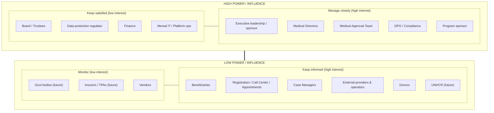

# 02 — Stakeholder Analysis

> Cluster A · Product & Discovery
> Up: [00-README-INDEX.md](00-README-INDEX.md) · Foundations: [0A-DESIGN-FOUNDATIONS.md](0A-DESIGN-FOUNDATIONS.md)
> Siblings: [01-product-vision.md](01-product-vision.md) · [03-user-personas.md](03-user-personas.md) · [04-patient-journey-maps.md](04-patient-journey-maps.md)

---

## 1. Purpose & how to read this

This document identifies **everyone whose needs, decisions, or cooperation shape HBMP** and defines how the program engages each of them. It answers three questions per stakeholder: *what do they care about (interest)*, *how much can they help or block (influence)*, and *how do we work with them (engagement strategy)*.

Stakeholders here are **classes of people/organizations**; their individual working realities (devices, tasks, data boundaries, quotes) are detailed as personas in [03-user-personas.md](03-user-personas.md). The involvement summary in §5 is a program-governance RACI, distinct from the runtime access-control RACI in [10-role-matrix.md](10-role-matrix.md) and [11-permission-matrix.md](11-permission-matrix.md).

**Legend** — Influence/Interest: `H` high, `M` medium, `L` low.

---

## 2. Stakeholder register

### 2.1 Internal teams (Mersal staff — users & operators)

| Stakeholder | Interest | Infl. | Int. | Core needs | Key pains today | Engagement strategy |
|-------------|----------|:---:|:---:|------------|-----------------|---------------------|
| **Registration / Beneficiary Management** | Register and de-duplicate beneficiaries fast; issue membership | M | H | Fast multi-document capture; reliable identity matching; instant member issuance | Re-keying, duplicate records, illegible paper, no match on return | Deep involvement in Phase-1 design & UAT; co-design registration screens; early pilot users |
| **Call Center** | Answer beneficiary queries; check status/eligibility; book/route | M | H | One-screen lookup of identity, eligibility, appointments | Hunting across spreadsheets & phone chains; can't confirm eligibility | Involve in Phase-2/3 flows; validate the unified lookup; measure handle time |
| **Appointment Team** | Schedule visits against provider availability & eligibility | M | H | Central calendar; eligibility gating; reschedule/no-show handling | Double-booking, ineligible bookings, manual reminders | Co-design scheduling; pilot; feed reminder-channel roadmap (SMS/WhatsApp future) |
| **Medical Approval Team** | Consistent, evidence-based approvals of high-cost/controlled services | H | H | Structured queue with clinical evidence; policy rules; TAT tracking | Approvals by phone/photo; inconsistent decisions; no record | **Primary design partner** for Phase-7 authorization workflow; define policy rules & SLAs |
| **Medical Directors** | Clinical governance, cost/quality oversight, escalation authority | H | H | Oversight dashboards; policy config; override/escalation authority; analytics | No visibility into spend, quality, or patterns; can't enforce policy | Executive-adjacent; approve clinical policy, formulary posture, override rules; steering committee seat |
| **Case Managers** | Coordinate complex/chronic beneficiaries end-to-end | M | H | Whole-journey view; cross-phase timeline; task/follow-up tracking | Fragmented care, no continuity, manual coordination | Co-design the longitudinal/timeline view; validate chronic-care scenarios |
| **Finance** | Trustworthy spend data on funded services; utilization reporting | H | M | Authorized-vs-delivered reporting; approval/utilization exports; cost controls | No line of sight into funded spend; reconciliation is manual | Define reporting requirements; integration boundary with GL/donor accounting (no ERP replacement) |
| **Network Team** | Recruit, contract, and manage the provider network | M | M | Provider directory; contract/coverage terms; onboarding & performance | Manual provider coordination; no central directory | Own provider onboarding flows; define contract/coverage data model with [15-database-erd.md](15-database-erd.md) |
| **Provider Admin** | Administer provider portals, accounts, and isolation | M | M | Provider user management; scope/isolation controls; queue config | No tooling; ad hoc access | Define provider-portal admin model; validate isolation with security |
| **Super Admin** | Platform configuration, roles, tenant/system health | H | M | Role/permission config; system config; least-privilege administration; break-glass | No system; everything manual | Define admin & break-glass procedures with [18-security-model.md](18-security-model.md); tightly audited |
| **Mersal IT / Platform ops** | Run, secure, and support the platform | H | M | Deployability, observability, supportability, security posture | Legacy tools, no ops model | Engage on [25-deployment-architecture.md](25-deployment-architecture.md), SLAs, runbooks; own environments |
| **Data Protection Officer / Compliance (if designated)** | Lawful, ethical handling of sensitive refugee data | H | H | Data minimization, audit, retention, lawful basis, breach process | No controls, no audit, high exposure | Sign-off authority on [18](18-security-model.md)/[19](19-audit-strategy.md)/[20](20-compliance-checklist.md); involved from discovery |

### 2.2 External providers (contracted network — users, isolated)

| Stakeholder | Interest | Infl. | Int. | Core needs | Key pains today | Engagement strategy |
|-------------|----------|:---:|:---:|------------|-----------------|---------------------|
| **Clinics** | Receive referrals/appointments; deliver consultations | M | M | Their queue only; minimal beneficiary data; simple workflow | Paper referrals, phone confirmation, no eligibility certainty | Onboard a pilot clinic; validate provider isolation & minimal-data screens |
| **Doctors** (in network) | Consult efficiently with adequate context | M | H | Point-of-care record access (scoped); easy ordering/prescribing | Blind consultations; illegible histories; duplicate orders | Clinical co-design; usability testing on modest devices |
| **Nurses** (in network) | Triage, vitals, support the consultation | L | M | Vitals capture; task lists; scoped record | Paper vitals; no structured capture | Include in clinical UAT; keep data entry minimal & fast |
| **Laboratories** | Fulfill investigation orders; upload results | M | M | Isolated order queue; consume-once; result upload | Paper orders; uncertain eligibility; phone chasing | Pilot lab; validate order-consume atomicity & result upload |
| **Imaging Centers** | Fulfill radiology orders (some high-cost, needing approval) | M | M | Order queue; approval status visibility; result/report upload | Paper orders; approval by phone; no status | Pilot imaging center; tie into approval-status visibility (Phase 7) |
| **Pharmacies** | Dispense prescriptions (full/partial) within coverage | M | M | Prescription queue; coverage check; partial-dispense recording | Paper scripts; no coverage certainty; can't record partials | Pilot pharmacy; validate partial-dispense & consume-once |
| **Lab / Imaging technicians; Pharmacists** (operators) | Do the fulfillment task quickly & correctly | L | M | Minimal, fast task screens; clear consume/dispense actions | Manual logs; error-prone paper | Persona-level UAT (see [03-user-personas.md](03-user-personas.md)) |

### 2.3 Beneficiaries (the people served)

| Stakeholder | Interest | Infl. | Int. | Core needs | Key pains today | Engagement strategy |
|-------------|----------|:---:|:---:|------------|-----------------|---------------------|
| **Beneficiaries — general** | Get care without friction, cost, or stigma | L | H | To be recognized; fast service; safety; dignity; privacy | Turned away, re-explaining their story, lost referrals, duplicate tests | Represented by proxy (Case Managers, front-line staff) in design; validated via journey testing; **no v1 self-service app** |
| **Newly-arrived refugee family head** | Register the family; access first care | L | H | Simple registration despite incomplete documents; language support | Documentation gaps; language barrier; unfamiliar process | Design for document-flexible identity ([0A §3](0A-DESIGN-FOUNDATIONS.md)); Arabic-first; low-literacy-aware flows |
| **Chronic-illness beneficiary** | Continuous management of an ongoing condition | L | H | Continuity of record; medication continuity; timely approvals | Fragmented history; interrupted meds; repeat tests | Prioritize longitudinal record & Case Manager tooling; test chronic scenarios in [04-patient-journey-maps.md](04-patient-journey-maps.md) |

> **Ethical note:** beneficiaries have the *highest interest* and the *lowest formal influence*. The program compensates by making their needs a design constraint (data minimization, dignity, accessibility) and by giving front-line staff and Case Managers an explicit mandate to represent them. This asymmetry is deliberate and must not be "optimized away."

### 2.4 Leadership, sponsors & funders

| Stakeholder | Interest | Infl. | Int. | Core needs | Key pains today | Engagement strategy |
|-------------|----------|:---:|:---:|------------|-----------------|---------------------|
| **Mersal executive leadership / sponsor** | Mission reach, stewardship, risk control | H | H | Throughput, outcomes, spend control, demonstrable governance; roadmap confidence | Can't prove impact or controls; scaling is manual | **Steering committee & sign-off**; own vision & MVP scope ([01](01-product-vision.md)/[28](28-mvp-definition.md)); executive reading path |
| **Board / Trustees** | Fiduciary & reputational assurance | H | L | Assurance that data & funds are well-governed | Reputational exposure of sensitive-data mishandling | Periodic milestone reporting; risk posture ([27-risk-assessment.md](27-risk-assessment.md)) |
| **Donors / grant funders** | Evidence their funds create impact safely | M | M | Impact metrics; cost transparency; data-protection assurance | Opaque, non-auditable outcomes | Reporting outputs designed for donor-grade evidence; not direct users |
| **Program / project sponsor (internal)** | Delivery on time, on scope, adopted | H | H | Clear scope, phased delivery, adoption, change management | — | Owns backlog priorities with product; drives [29-delivery-plan.md](29-delivery-plan.md)/[33-sprint-roadmap.md](33-sprint-roadmap.md) |

### 2.5 Regulators, partners & future integrators

| Stakeholder | Interest | Infl. | Int. | Core needs | Key pains today | Engagement strategy |
|-------------|----------|:---:|:---:|------------|-----------------|---------------------|
| **Egyptian data-protection / health regulators** | Lawful handling of health & personal data | H | M | Compliance with applicable data-protection & health regulation; retention; breach handling | N/A (compliance obligation) | Design to comply; [20-compliance-checklist.md](20-compliance-checklist.md); DPO liaison; not a user |
| **UNHCR (future partner)** | Coordinated care & data-sharing for refugees | M | M | Interoperable, auditable exchange; refugee-ID linkage; minimal disclosure | Non-interoperable, non-auditable data | Architect for FHIR/HL7 & data-sharing agreements; **integration deferred** (roadmap) |
| **Government health bodies (future)** | Reporting, referral, public-health linkage | M | L | Standards-based exchange; reporting | Non-interoperable | Interoperability readiness now; integration later |
| **Insurers / TPAs (future)** | Claims & benefit administration partnership | L | L | Claims/adjudication interfaces; coverage data | N/A | Core designed as HBMP so claims/PBM attach without re-platform ([01 §7](01-product-vision.md)) |
| **Technology vendors (infrastructure/hosting, identity, comms)** | Supply platform capabilities | L | M | Clear requirements; standards adherence | — | Managed via architecture ([16](16-service-architecture.md)/[25](25-deployment-architecture.md)); commercial, not stakeholder-managed here |
| **Delivery/engineering team** | Build a coherent, maintainable system | M | H | Clear, stable requirements; sound architecture; testability | Ambiguity, churn | Own [30](30-technical-backlog.md)/[32](32-user-stories.md)/[34](34-technical-documentation.md); embedded throughout |

---

## 3. Power / interest grid

Classic Mendelow grid. Position drives engagement intensity: **Manage closely** (high power, high interest), **Keep satisfied** (high power, low interest), **Keep informed** (low power, high interest), **Monitor** (low power, low interest).

> Reading: **Manage closely** stakeholders (leadership, medical directors, approval team, DPO, program sponsor) are design partners and sign-off authorities. **Keep informed** stakeholders — critically, **beneficiaries and front-line/provider users** — have high stake and are engaged through co-design, UAT, and journey validation even though their formal decision power is low. **Keep satisfied** (board, regulator, finance, IT) receive governance-grade assurance without day-to-day involvement. **Monitor** (future partners, vendors) are tracked for readiness.

---

## 4. Engagement cadence & channels

| Group (grid quadrant) | Cadence | Channel / mechanism | Primary artifacts they consume/produce |
|-----------------------|---------|---------------------|----------------------------------------|
| Manage closely | Weekly / per-sprint | Steering committee, design reviews, backlog grooming | [01](01-product-vision.md), [28](28-mvp-definition.md), [29](29-delivery-plan.md), policy config, sign-offs |
| Keep satisfied | Milestone / monthly | Governance reports, compliance reviews, ops reviews | [20](20-compliance-checklist.md), [27](27-risk-assessment.md), [25](25-deployment-architecture.md), finance reports |
| Keep informed | Continuous during their phase | Co-design workshops, pilots, UAT, usability testing | [03](03-user-personas.md), [04](04-patient-journey-maps.md), [12](12-ui-wireframes.md), [13](13-ux-flows.md) |
| Monitor | As roadmap approaches | Readiness reviews, standards alignment | Interoperability readiness (FHIR/HL7), roadmap items |

**Change management** for internal & provider users (Keep informed but high-adoption-risk): phased pilots per journey phase, bilingual training material, and a feedback loop into the product backlog ([31-product-backlog.md](31-product-backlog.md)). Adoption is a first-class success metric (see [01 §6, Objective 5](01-product-vision.md)).

---

## 5. Program-governance RACI (involvement summary)

This RACI concerns **program decisions and deliverables**, not runtime system permissions (for those see [10-role-matrix.md](10-role-matrix.md)). **R** = Responsible (does the work), **A** = Accountable (final sign-off, one per row), **C** = Consulted, **I** = Informed.

| Decision / deliverable | Exec / Sponsor | Medical Directors | Approval Team | DPO / Compliance | Front-line & Providers | Finance / Ops | Delivery team |
|------------------------|:---:|:---:|:---:|:---:|:---:|:---:|:---:|
| Product vision & goals ([01](01-product-vision.md)) | **A** | C | I | C | I | I | R |
| MVP scope ([28](28-mvp-definition.md)) | **A** | C | C | C | C | C | R |
| Clinical & formulary policy | C | **A** | R | C | C | I | R |
| Approval workflow & SLAs (Phase 7) | I | A | **R/A** | C | I | C | R |
| Security & privacy model ([18](18-security-model.md)) | A | C | I | **A** | I | C | R |
| Audit & retention ([19](19-audit-strategy.md)) | I | C | I | **A** | I | C | R |
| Data model & identity ([15](15-database-erd.md), [0A §3](0A-DESIGN-FOUNDATIONS.md)) | I | C | I | C | I | I | **R/A** |
| Provider network & contracts | C | C | I | C | C (Network Team **R**) | A | R |
| Journey / UX design ([04](04-patient-journey-maps.md),[12](12-ui-wireframes.md),[13](13-ux-flows.md)) | I | C | C | C | **C (co-design)** | I | **R/A** |
| Reporting & finance requirements | C | C | I | C | I | **A** | R |
| Delivery plan & roadmap ([29](29-delivery-plan.md),[33](33-sprint-roadmap.md)) | **A** | C | C | C | I | C | R |
| Go-live / phase acceptance | **A** | C | C | C | C (UAT **R**) | C | R |

> Where a cell shows two letters (e.g., **R/A**), that group both does the work and holds sign-off for that item within delegated authority. Any ambiguity resolves upward to the Exec/Sponsor as overall Accountable.

---

## 6. Stakeholder risks & watch-items

| Risk | Stakeholders affected | Mitigation | Ref |
|------|-----------------------|-----------|-----|
| Low adoption by front-line/provider users | Registration, Call Center, providers | Co-design, pilots, bilingual training, adoption metric | [27](27-risk-assessment.md), [01 §6](01-product-vision.md) |
| Approval workflow seen as slower than the phone | Approval Team, clinicians, beneficiaries | TAT SLAs, structured evidence, mobile-friendly queues | [04](04-patient-journey-maps.md) |
| Beneficiary needs under-represented (low formal power) | Beneficiaries | Explicit proxy mandate for Case Managers/front-line; journey testing | this doc §2.3 |
| Privacy/compliance sign-off delays delivery | DPO, regulator, delivery | Early DPO involvement; compliance-by-design | [20](20-compliance-checklist.md) |
| Provider-isolation breach erodes trust | Providers, beneficiaries, leadership | Provider-isolation design, access reviews, audit | [18](18-security-model.md), [19](19-audit-strategy.md) |
| Scope creep toward full HIS/claims in v1 | Sponsor, delivery | MVP guardrails; roadmap staging | [28](28-mvp-definition.md), [29](29-delivery-plan.md) |
| Future-partner (UNHCR/gov) expectations pull scope early | Leadership, partners | Interoperability *readiness* now, integration later | [01 §9](01-product-vision.md) |

---

*Continue: [03-user-personas.md](03-user-personas.md) turns these stakeholder classes into working personas; [04-patient-journey-maps.md](04-patient-journey-maps.md) shows them in the journey.*
