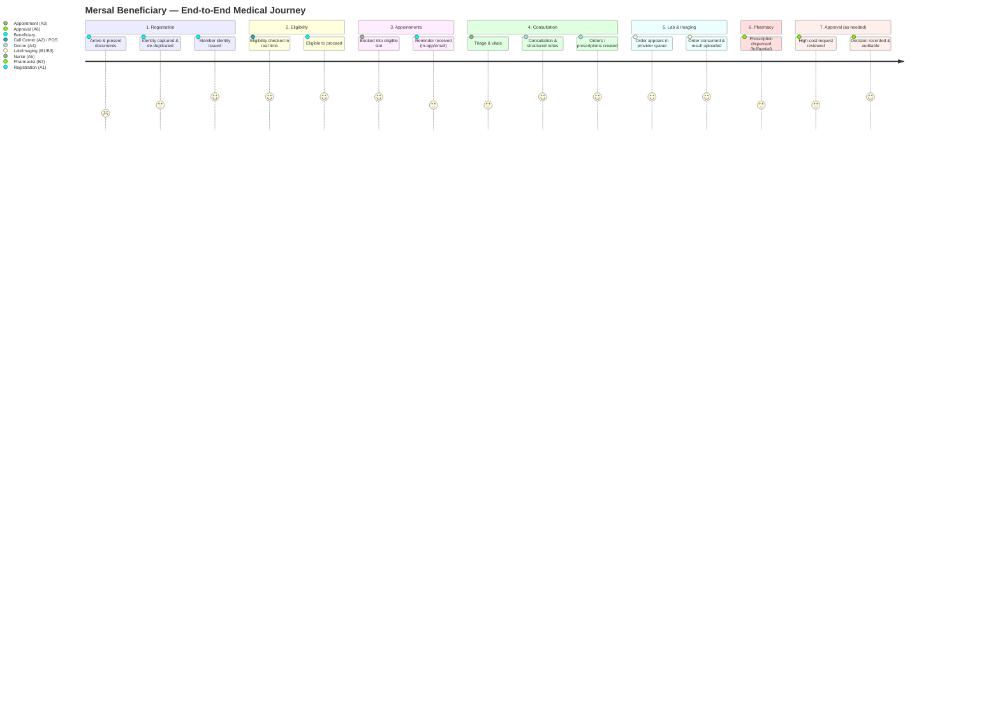
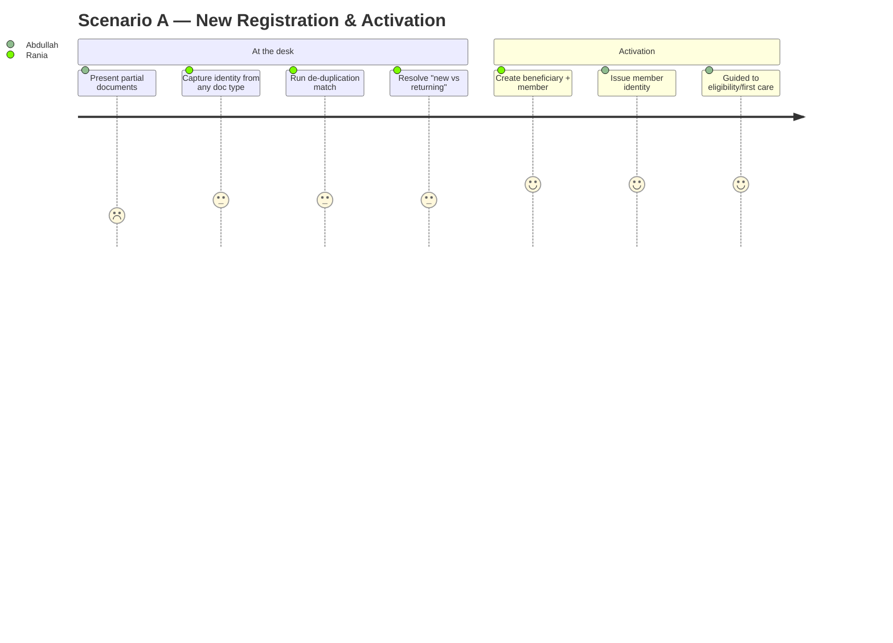
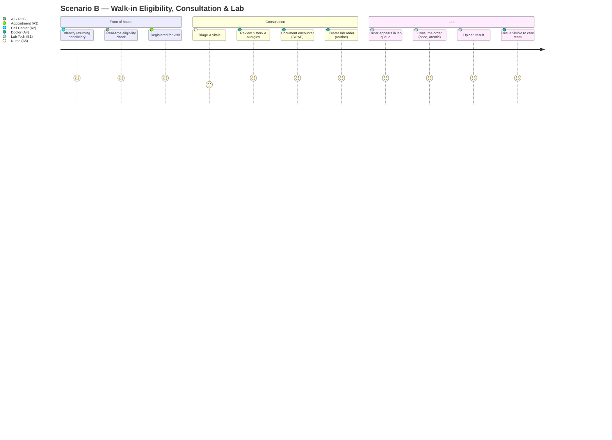
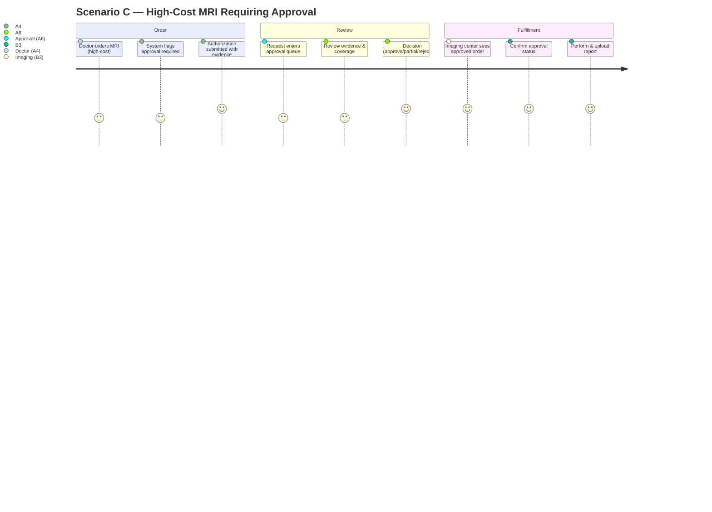
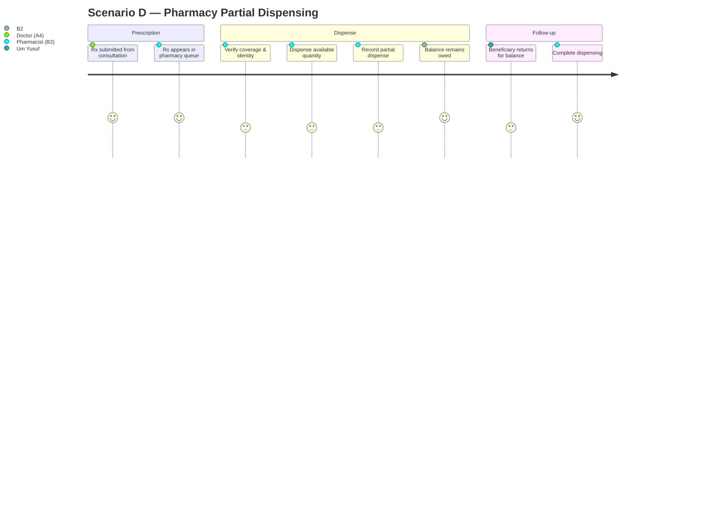

# 04 — Patient Journey Maps

> Cluster A · Product & Discovery
> Up: [00-README-INDEX.md](00-README-INDEX.md) · Foundations: [0A-DESIGN-FOUNDATIONS.md](0A-DESIGN-FOUNDATIONS.md)
> Siblings: [01-product-vision.md](01-product-vision.md) · [02-stakeholder-analysis.md](02-stakeholder-analysis.md) · [03-user-personas.md](03-user-personas.md)

---

## How to read this document

This maps the **end-to-end medical journey** of a Mersal beneficiary across the 7 phases ([0A §1](0A-DESIGN-FOUNDATIONS.md), [01 §8](01-product-vision.md)), then drills into **four detailed scenarios**. Journey diagrams use Mermaid `journey` (emotion scored 1–5). Each stage table has a fixed shape: **Stage · Actor (persona) · Actions · System touchpoints · Data shown (minimum-necessary) · Emotion · Pain points · Opportunities**.

Personas referenced (A1–C2) are defined in [03-user-personas.md](03-user-personas.md). Processes/state are formalized in [05-business-process-maps.md](05-business-process-maps.md) and [23-state-machines.md](23-state-machines.md).

**Channel note (recurs throughout):** at launch, notifications are **in-app + email**; **SMS/WhatsApp reminders and QR-based beneficiary/order handoff are future** (roadmap, [01 §9](01-product-vision.md)). Where a step would benefit from SMS/WhatsApp/QR, it is tagged **[FUTURE]**.

---

## 1. End-to-end journey (all 7 phases)

### 1.1 Phase overview table

| Phase | Trigger | Primary persona(s) | Core services ([0A §1](0A-DESIGN-FOUNDATIONS.md)) | Key entity/state ([0A §6](0A-DESIGN-FOUNDATIONS.md)) | Exit condition |
|-------|---------|--------------------|----------------------|-----------------------|----------------|
| 1 Registration | Beneficiary arrives | A1 Rania | Beneficiaries, Documents | Beneficiary/Member `Pending`→`Active` | Member identity issued |
| 2 Eligibility | Any point of service | A2 Karim / any POS | Eligibility, Coverage | Eligibility decision | Eligible/ineligible answered |
| 3 Appointments | Care needed | A3 Mona | Appointments, Provider Network, Eligibility | Appointment scheduled | Visit booked (eligibility-gated) |
| 4 Consultation | Beneficiary presents | A4 Hossam, A5 Salma | EMR, Orders, Prescriptions | Encounter `ENC-…`; Order `Requested`; Rx `Draft`→`Submitted` | Encounter documented; orders/Rx created |
| 5 Lab & Imaging | Order created | B1 Fatma, B3 Omar | Orders, Provider Network, Documents, Authorizations | Order `Active`→`PartiallyUsed`→`Completed` | Order consumed; result uploaded |
| 6 Pharmacy | Prescription submitted | B2 Amir | Prescriptions, Coverage | Rx `PartiallyDispensed`→`Dispensed` | Medication dispensed (full/partial) |
| 7 Approval | High-cost/controlled item | A6 Yasmin, A7 Adel | Authorizations, EMR (evidence) | Authorization `Submitted`→`UnderReview`→decision | Approve / partial / reject / info-request recorded |

> Note the journey is **not strictly linear**: Phase 7 (Approval) is invoked *within* Phases 5/6 when a high-cost or controlled item is ordered; Phase 2 (Eligibility) is re-checked at every point of service, not just once. The scenarios below show these interleavings.

---

## 2. Scenario A — New registration & activation

**Persona:** C1 Abdullah (newly-arrived refugee family head), served by A1 Rania.
**Goal:** Establish a de-duplicated beneficiary identity and issue membership despite incomplete documents.

| Stage | Actor | Actions | System touchpoints | Data shown (min-necessary) | Emotion | Pain points | Opportunities |
|-------|-------|---------|--------------------|-----------------------------|---------|-------------|---------------|
| Arrival | C1 Abdullah | Presents whatever docs he has | — (front desk) | — | Anxious (2) | Fears being turned away for missing papers | Document-flexible identity ([0A §3](0A-DESIGN-FOUNDATIONS.md)); plain-language reassurance |
| Capture | A1 Rania | Enters identity from any type; scans docs | Beneficiaries, Documents (upload + virus scan) | Identity/demographic fields; document capture | Focused (3) | Re-keying; illegible paper | Multi-identifier capture; scanner-assisted; autofill |
| De-duplicate | A1 Rania | Runs identity match across identifiers | Beneficiaries (identity matching) | Candidate matches (disambiguation minimum only) | Cautious (3) | Duplicate creation risk for returnees | Strong matching on National ID/Passport/Refugee ID/UNHCR; typo tolerance |
| Resolve | A1 Rania | Confirms new vs. returning | Beneficiaries | Match candidates | Reassured (4) | Uncertain matches | Clear "same person?" UX; audit of the merge/decision |
| Activate | A1 Rania | Creates beneficiary + member; status `Pending`→`Active` | Beneficiaries, Coverage/Policy | Member no. `MRS-M-…`; status | Relieved (4) | — | Instant member issuance; immutable `beneficiary_id` (UUID v7) |
| Handover | C1 Abdullah | Receives member identity; guided onward | Notifications (in-app/email); **QR handoff [FUTURE]** | Member number; next step | Hopeful (4) | Paper card loss | **[FUTURE]** QR/member card; SMS confirmation |

**Emotional arc:** anxiety → reassurance → relief. **Design imperative:** no dead-ends when documents are incomplete; dignity in framing; every identity decision audited ([19-audit-strategy.md](19-audit-strategy.md)).

---

## 3. Scenario B — Walk-in: eligibility → consultation → lab

**Persona:** C2 Um Yusuf (chronic), served by A2/A3, A5 Salma, A4 Dr. Hossam, fulfilled by B1 Fatma.
**Goal:** A returning beneficiary walks in, is confirmed eligible, is seen, and a routine lab test is ordered and fulfilled.

| Stage | Actor | Actions | System touchpoints | Data shown (min-necessary) | Emotion | Pain points | Opportunities |
|-------|-------|---------|--------------------|-----------------------------|---------|-------------|---------------|
| Identify | A2 Karim | Matches returning beneficiary | Beneficiaries (search) | Identity match, status | Neutral (3) | Slow multi-source lookup (legacy) | One-search unified lookup |
| Eligibility | A2 / POS | Real-time eligibility check | Eligibility, Coverage | Eligible/ineligible + reason | Confident (4) | Legacy: phone/spreadsheet uncertainty | Instant, benefit-aware decision at POS |
| Register visit | A3 Mona | Books/records the walk-in visit | Appointments, Eligibility gate | Availability, eligibility | Smooth (4) | Ineligible bookings (legacy) | Eligibility-gated booking prevents wasted trips |
| Triage | A5 Salma | Captures vitals & triage | EMR (vitals) | Care-relevant fields, allergies | Efficient (4) | Paper vitals re-entry (legacy) | Enter once; flows to doctor |
| Review | A4 Hossam | Reviews longitudinal record | EMR (longitudinal) | History, allergies, active meds, prior results | Informed (4) | Blind consult (legacy) | Continuity for chronic care; prior-result reuse |
| Document | A4 Hossam | Writes structured SOAP note | EMR (encounter `ENC-…`) | Current encounter | Focused (4) | Illegible/unstructured notes (legacy) | Structured, longitudinal record |
| Order | A4 Hossam | Creates routine lab order | Orders (`Requested`→`Active`, no approval needed) | Order detail, coverage | Confident (4) | Duplicate ordering (legacy) | Flag recent prior results to avoid duplication |
| Queue | B1 Fatma | Sees order in lab's isolated queue | Orders, Provider Network (isolation) | Order + minimum beneficiary identity only | Clear (4) | Paper orders, wrong-patient risk (legacy) | Provider-isolated queue; min-necessary data |
| Consume | B1 Fatma | Consumes order line atomically | Orders (consume-once, [0A §7](0A-DESIGN-FOUNDATIONS.md)) | The order line | Assured (4) | Double-run risk (legacy) | Atomic consume — duplicate use impossible |
| Result | B1 Fatma | Uploads result | Documents, Orders (`Completed`) | Result upload | Done (4) | Phone chasing (legacy) | Event-driven: result visible to care team automatically |
| Close loop | A4 Hossam | Reviews result | EMR, Orders | Result linked to encounter | Satisfied (4) | Lost results (legacy) | `OrderConsumed`/result events close the loop |

**Emotional arc:** steady confidence — the value is *removal of friction and uncertainty*. **Key system guarantees on display:** real-time eligibility, provider isolation, consume-once atomicity, event-driven result visibility.

---

## 4. Scenario C — High-cost MRI needing approval (Phase 7 within Phase 5)

**Persona:** C2 Um Yusuf, ordered by A4 Dr. Hossam, reviewed by A6 Yasmin (escalation to A7 Dr. Adel), fulfilled by B3 Omar.
**Goal:** A high-cost imaging study is ordered, routed for approval, decided with evidence, then fulfilled only once approved.

| Stage | Actor | Actions | System touchpoints | Data shown (min-necessary) | Emotion | Pain points | Opportunities |
|-------|-------|---------|--------------------|-----------------------------|---------|-------------|---------------|
| Order | A4 Hossam | Orders MRI | Orders (`Requested`) | Order, coverage, cost tier | Focused (3) | Unsure if it'll be funded | Auto-detect high-cost/controlled → approval routing |
| Flag | System | Detects approval requirement | Authorizations, Coverage rules | "Approval required" + why | Aware (3) | Legacy: approval by phone/photo | Rule-driven, consistent gating |
| Submit | A4 Hossam | Attaches clinical evidence; submits | Authorizations (`Submitted`→`UnderReview`); EMR evidence | Evidence set, request | Hopeful (3) | Legacy: no structured evidence | Structured evidence attach; `ORD`/`AUTH` linkage |
| Queue | A6 Yasmin | Picks up request from queue | Authorizations (queue) | Request, evidence, coverage/limits, min identity | Diligent (3) | Legacy: inconsistent, no record | TAT-tracked queue; policy rules surfaced |
| Review | A6 Yasmin | Assesses vs. policy; may request info/escalate | Authorizations; policy engine | Evidence, rule, prior similar decisions | Careful (3) | Ambiguous cases | `InfoRequested` loop; escalate to A7 Dr. Adel |
| Decide | A6 Yasmin / A7 Adel | Records approve/partial/reject with rationale | Authorizations (decision); Audit | Decision + rationale | Resolved (4) | Legacy: undocumented decisions | Immutable, auditable decision; TAT metric |
| Notify | System | Notifies clinician/queue | Notifications (in-app/email); **SMS [FUTURE]** | Decision status | Informed (4) | Legacy: chase by phone | Event-driven status; **[FUTURE]** SMS/WhatsApp |
| Fulfill | B3 Omar | Confirms approval, consumes, performs | Orders (consume-once), Authorizations (status), Documents | Order + **approval status**; min identity | Confident (4) | Legacy: perform-before-approval risk | Approval status visible before performing |
| Report | B3 Omar | Uploads report | Documents, Orders (`Completed`) | Report upload | Done (4) | Lost reports (legacy) | Result linked to encounter & authorization |

**Emotional arc:** uncertainty at order → resolution at decision → confidence at fulfillment. **Critical controls:** no out-of-band approvals (100% routed, [01 §6 KR3.1](01-product-vision.md)); every decision carries evidence + rationale + audit; imaging performed **only** after approval status confirmed; TAT measured (target ≤24h median).

---

## 5. Scenario D — Pharmacy partial dispensing (Phase 6)

**Persona:** C2 Um Yusuf's prescription, dispensed by B2 Amir under stock constraint.
**Goal:** A prescription is dispensed partially because of limited stock, with the remaining balance accurately tracked and consume-once integrity preserved.

| Stage | Actor | Actions | System touchpoints | Data shown (min-necessary) | Emotion | Pain points | Opportunities |
|-------|-------|---------|--------------------|-----------------------------|---------|-------------|---------------|
| Submit Rx | A4 Hossam | Prescribes; submits | Prescriptions (`Draft`→`Submitted`) | Rx detail, coverage | Confident (4) | — | Allergy/interaction check at prescribing |
| Queue | B2 Amir | Sees Rx in pharmacy's isolated queue | Prescriptions, Provider Network (isolation) | Rx + min beneficiary identity + coverage | Clear (4) | Paper scripts (legacy) | Provider-isolated; coverage certainty |
| Verify | B2 Amir | Checks coverage & identity | Coverage; Prescriptions | Coverage/limits for the item | Careful (3) | No coverage certainty (legacy) | Coverage-aware dispensing |
| Dispense partial | B2 Amir | Dispenses available quantity | Prescriptions (`PartiallyDispensed`, [0A §6](0A-DESIGN-FOUNDATIONS.md)) | Quantity dispensed vs. owed | Constrained (3) | Legacy: partials untracked | Accurate partial capture; balance owed persists |
| Record | B2 Amir | Records the partial atomically | Prescriptions (consume-once semantics) | Dispensed line | Assured (4) | Double-dispense risk (legacy) | Atomic dispense event `PrescriptionDispensed` |
| Notify | System | Flags remaining balance | Notifications (in-app/email); **SMS/WhatsApp [FUTURE]** | Balance owed | Informed (3) | Legacy: beneficiary unaware | **[FUTURE]** SMS reminder to return for balance |
| Return | C2 Um Yusuf | Returns for the balance | Prescriptions | — | Hopeful (3) | Repeat trips | Continuity: system knows exactly what's owed |
| Complete | B2 Amir | Dispenses balance | Prescriptions (`Dispensed`) | Remaining line | Done (4) | — | Full audit of full+partial history |

**Emotional arc:** constraint (partial) → assurance (balance tracked) → completion. **Key guarantee:** partial dispensing is a *first-class* state, not a workaround; the record always knows what has been dispensed and what remains owed, with consume-once integrity across both events.

---

## 6. Cross-journey pain points → opportunities (roll-up)

| Recurring pain (status quo) | Where it hurts | HBMP opportunity | Proof metric ([01 §6](01-product-vision.md)) |
|-----------------------------|----------------|------------------|-----------------|
| Re-keying & duplicate records | Phase 1 | One identity, many documents; de-duplication | KR1.1–1.3 |
| Eligibility uncertainty | Phases 2,3,5,6 | Real-time, benefit-aware eligibility at every POS | KR3.1 |
| Blind consultations | Phase 4 | Longitudinal record with allergies/meds/prior results | KR2.1–2.3 |
| Duplicate tests | Phases 4,5 | Prior-result flagging before ordering | KR2.3 |
| Paper orders / phone chasing | Phases 5,6 | Provider-isolated queues; event-driven results | KR5.2 |
| Double-run / double-dispense | Phases 5,6 | Consume-once atomicity ([0A §7](0A-DESIGN-FOUNDATIONS.md)) | — |
| Ad hoc, undocumented approvals | Phase 7 | Structured, evidence-based, audited approval + TAT | KR3.1–3.3 |
| No accountability / audit | All | Immutable, hash-chained audit trail | KR4.1 |
| Beneficiary re-tells their story | All | Continuity via one record | KR5.1 |

---

## 7. Channel & interaction maturity (what's launch vs. future)

| Interaction | Launch (MVP) | Future (roadmap) |
|-------------|--------------|------------------|
| Notifications | In-app + email | **SMS / WhatsApp** reminders & status |
| Beneficiary/order handoff | Member number, printed/desk | **QR** code scan for beneficiary & order handoff |
| Beneficiary self-service | None (served via staff) | Beneficiary mobile app / portal |
| Provider access | Web provider-isolated portal | Deeper integrations |
| Result exchange | Upload to Documents | **FHIR/HL7** exchange with partners |

These maturity boundaries are consistent with [28-mvp-definition.md](28-mvp-definition.md) and the roadmap horizons in [01 §9](01-product-vision.md).

---

## 8. Notes for downstream design

- These journeys are the source for process models in [05-business-process-maps.md](05-business-process-maps.md) / [06-bpmn-diagrams.md](06-bpmn-diagrams.md), the state machines in [23-state-machines.md](23-state-machines.md), and sequence diagrams in [24-sequence-diagrams.md](24-sequence-diagrams.md).
- Every "Data shown" column is a **minimum-necessary** claim to be enforced by [11-permission-matrix.md](11-permission-matrix.md) and [18-security-model.md](18-security-model.md).
- Emotional low points (registration anxiety, approval uncertainty, partial-dispense constraint) are priority UX targets for [12-ui-wireframes.md](12-ui-wireframes.md) / [13-ux-flows.md](13-ux-flows.md).

---

*Continue: [28-mvp-definition.md](28-mvp-definition.md) draws the launch line through this journey (the "walking skeleton").*
