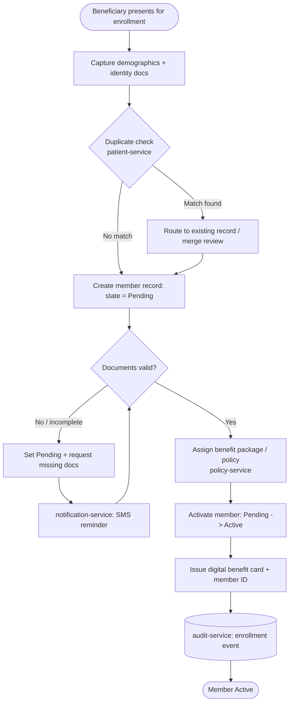
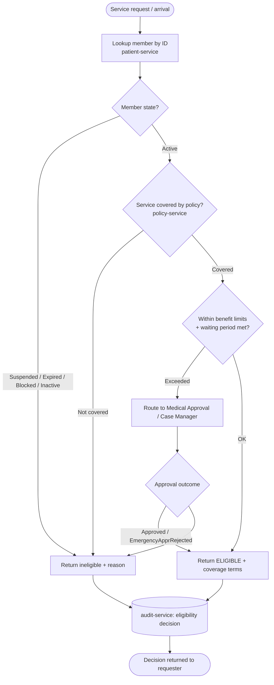
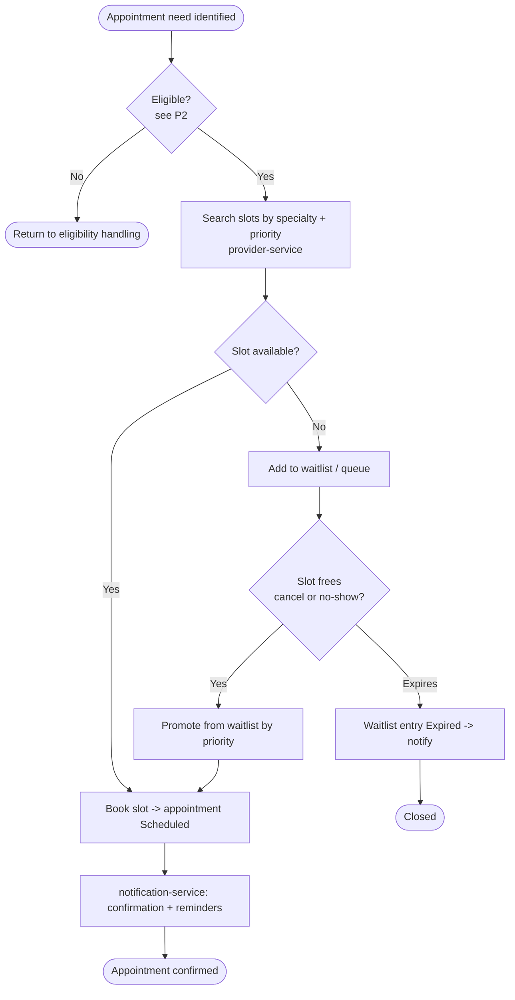
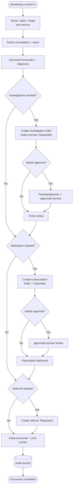
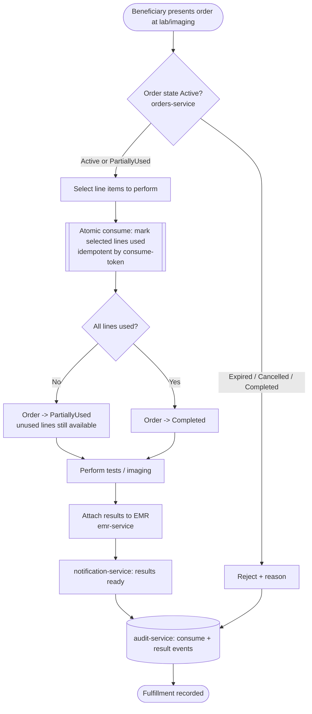
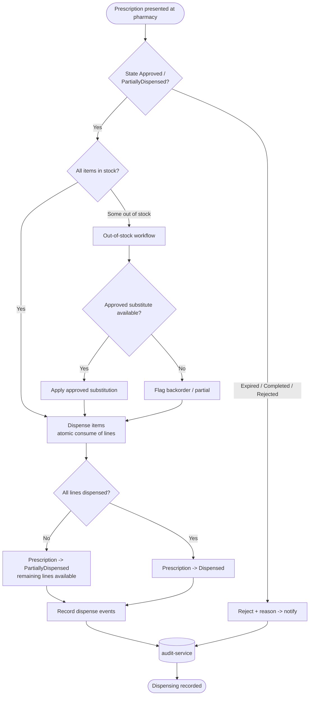
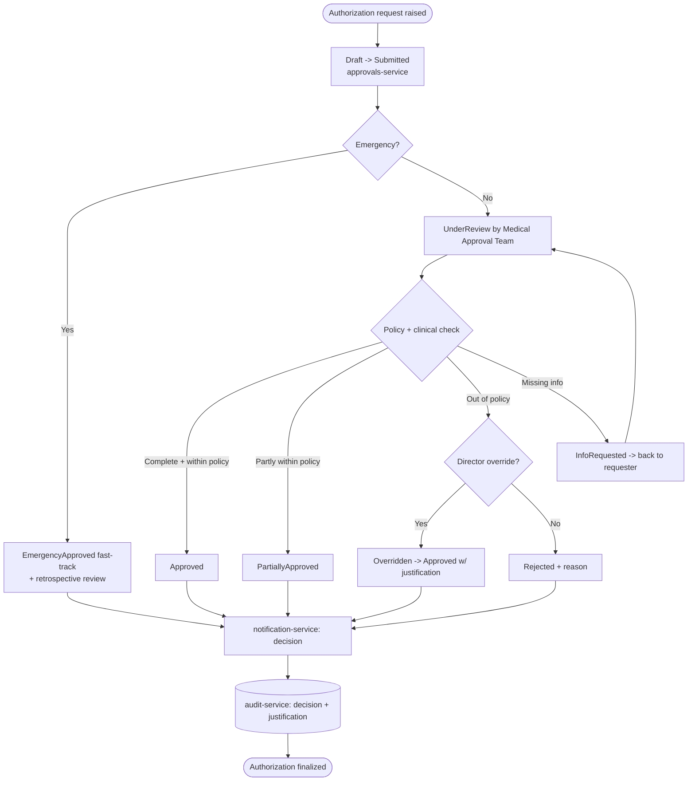
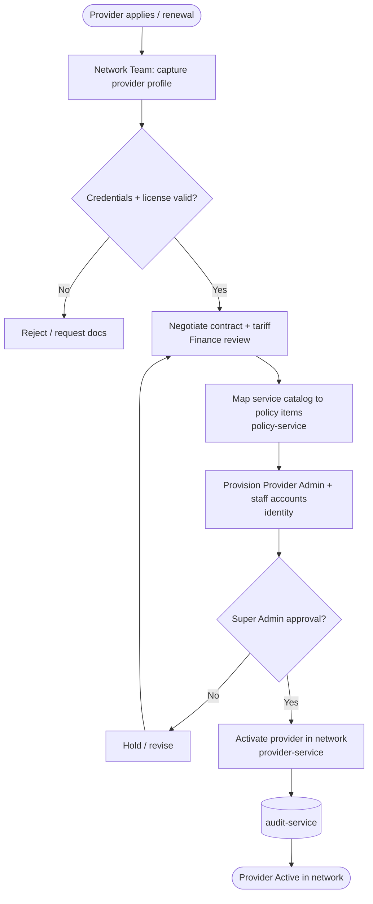
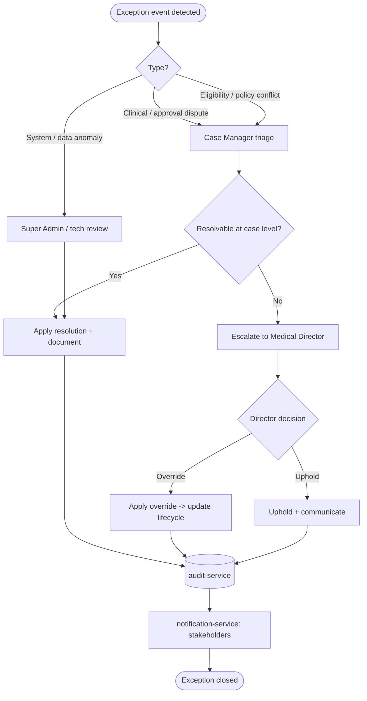
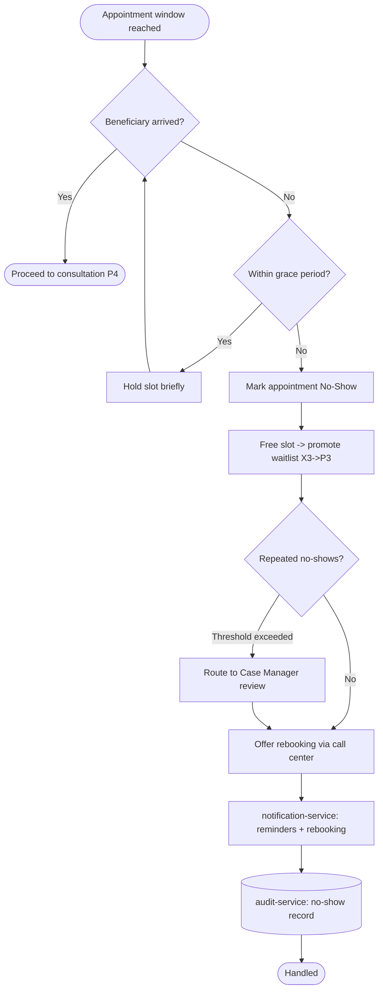

# 05 — Business Process Maps

> Part of the **Mersal Healthcare Benefit Management Platform (HBMP)** design workspace.
> Back to: [00-README-INDEX.md](00-README-INDEX.md) · [0A-DESIGN-FOUNDATIONS.md](0A-DESIGN-FOUNDATIONS.md)
> Siblings: [06-bpmn-diagrams.md](06-bpmn-diagrams.md) · [23-state-machines.md](23-state-machines.md) · [24-sequence-diagrams.md](24-sequence-diagrams.md)

This document maps the **as-is** (manual / paper / WhatsApp-driven) processes against the **to-be** digital flows for each of the 7 HBMP phases, plus the cross-phase processes (provider onboarding, exceptions/escalations, no-show handling). Each phase carries a narrative, a pain-point list, and a Mermaid `flowchart` process map.

Diagrams are intentionally BPMN-adjacent; the strict swimlane BPMN pool/lane models live in [06-bpmn-diagrams.md](06-bpmn-diagrams.md). The lifecycle state machines referenced here are formalized in [23-state-machines.md](23-state-machines.md).

---

## 0. Process Inventory

| Process ID | Name | Trigger | Primary Actors | Key Inputs | Key Outputs | Systems / Services |
|---|---|---|---|---|---|---|
| P1 | Beneficiary Registration & Activation | Refugee presents for enrollment | Registration/Beneficiary Mgmt, Beneficiary | Identity docs, UNHCR/asylum card, demographics | Active member record, benefit card, member ID | patient-service, policy-service, identity, notification-service, audit-service |
| P2 | Eligibility Check | Beneficiary arrives at reception / requests service | Call Center, Reception (Registration), Beneficiary | Member ID, service type, policy | Eligibility decision (eligible/ineligible/needs-review) | eligibility, policy-service, patient-service, audit-service |
| P3 | Appointment Management | Service need identified (self, referral, follow-up) | Appointment Team, Call Center, Doctors, Beneficiary | Slot availability, specialty, priority | Booked appointment / waitlist entry | provider-service, emr-service (scheduling), notification-service |
| P4 | Clinical Consultation | Beneficiary checks in for appointment | Doctors, Nurses, Beneficiary | Vitals, history, complaint, EMR | Encounter note, diagnosis, orders, prescription, referral | emr-service, orders-service, approvals-service, audit-service |
| P5 | Lab & Imaging Fulfillment | Investigation order created & activated | Labs, Imaging Centers, Doctors | Investigation order (Active), sample/patient | Results, consumed order lines | orders-service, provider-service, emr-service, notification-service |
| P6 | Pharmacy Dispensing | Prescription submitted/approved | Pharmacies, Beneficiary, Approvals Team | Prescription (Approved), stock levels | Dispense records, partial/substitution events | pharmacy, approvals-service, orders-service, notification-service |
| P7 | Medical Approval / Authorization | High-cost/gated service requested | Medical Approval Team, Medical Director, Case Managers | Authorization request, clinical justification, policy limits | Authorization decision (approve/partial/reject/info) | approvals-service, policy-service, emr-service, audit-service |
| X1 | Provider Onboarding & Network Mgmt | New provider applies / contract renewal | Network Team, Provider Admin, Finance, Super Admin | Provider credentials, contract, tariff | Active provider in network, catalog mapping | provider-service, policy-service, identity, audit-service |
| X2 | Exceptions & Escalations | SLA breach / rule conflict / dispute | Case Managers, Medical Director, Super Admin | Exception event, case context | Resolution, override, policy adjustment | approvals-service, audit-service, notification-service |
| X3 | No-Show & Cancellation Handling | Missed/late-cancelled appointment | Appointment Team, Call Center, Doctors | Appointment status, no-show flag | Rebook, waitlist promotion, no-show record | provider-service, emr-service, notification-service |

---

## Phase 1 — Beneficiary Registration & Activation (P1)

### Narrative
A refugee beneficiary is enrolled into the Mersal benefit program. The registration team captures identity and demographic data, verifies eligibility documents (UNHCR/asylum registration, ID), assigns a policy/benefit package, and issues a member record. The member begins in **Pending** and is activated (**Active**) once documents pass verification. See the Beneficiary lifecycle in [23-state-machines.md](23-state-machines.md).

### As-Is Pain Points
- Paper intake forms; duplicate records for the same person across intake days.
- No document verification audit trail; fraud and double-enrollment risk.
- Manual member-card issuance; cards lost, no revocation.
- No data minimization — full file visible to every desk.

### To-Be Digital Flow

### Notes
- Activation is the only path from **Pending → Active**; suspension/expiry/blocking are downstream lifecycle transitions.
- Reception-level roles get a minimized projection (no clinical/diagnostic fields) per data-minimization rules.

---

## Phase 2 — Eligibility Check (P2)

### Narrative
Before any service is delivered, the platform confirms the beneficiary is **Active**, that the policy covers the requested service, and that benefit limits (visit caps, annual ceilings, waiting periods) are not exhausted. Eligibility runs at reception, at the call center, and is re-checked at point-of-service by clinical/pharmacy/lab systems.

### As-Is Pain Points
- Verbal confirmation by phone; no record of who was told what.
- No real-time benefit-limit tracking; over-utilization discovered only at reconciliation.
- Suspended/expired members still served due to stale printed lists.

### To-Be Digital Flow

### Notes
- Eligibility is **stateless per call** but writes an immutable decision record for audit/dispute.
- Finance never sees diagnoses; eligibility exposes only coverage flags, not clinical reasons.

---

## Phase 3 — Appointment Management (P3)

### Narrative
Appointments are booked against provider slots by specialty and priority. When no slot is available the request enters a **waitlist/queue**, promoted automatically on cancellation/no-show. Sources: self-request (call center), clinical follow-up, or referral (see Referral lifecycle in [23-state-machines.md](23-state-machines.md)).

### As-Is Pain Points
- Double-booking; slots tracked in shared spreadsheets.
- No waitlist — cancellations wasted, beneficiaries re-queued manually.
- No reminders; high no-show rate.

### To-Be Digital Flow

### Notes
- Priority scoring (clinical urgency, referral, vulnerability) governs waitlist promotion order.
- Appointment/Encounter state machine detailed in [23-state-machines.md](23-state-machines.md).

---

## Phase 4 — Clinical Consultation (P4)

### Narrative
The beneficiary is seen by a nurse (triage/vitals) then a doctor. The doctor documents the encounter in the EMR, records diagnosis, and may raise **investigation orders**, **e-prescriptions**, **referrals**, and **authorization requests**. Orders/prescriptions requiring approval are routed to the Medical Approval process (P7).

### As-Is Pain Points
- Paper notes, illegible; no longitudinal record.
- Orders written on prescription pads — no linkage, no consume-control.
- Referrals lost between departments.

### To-Be Digital Flow

### Notes
- Every order/prescription/referral is a first-class object with its own lifecycle and full audit trail.
- Labs cannot see prescriptions; pharmacies cannot see investigation results (data minimization enforced at service boundaries).

---

## Phase 5 — Lab & Imaging Fulfillment (P5)

### Narrative
An **Active** investigation order is presented at a lab or imaging center. The provider **consumes** order lines atomically and idempotently: unused lines remain available, used lines cannot be reused, partial fulfillment is allowed, and duplicate usage is impossible. Results are attached back to the EMR.

### As-Is Pain Points
- Paper orders reused / photocopied — double billing.
- No partial fulfillment tracking; whole order re-issued for one missing test.
- Results returned by hand, sometimes to wrong file.

### To-Be Digital Flow

### Notes
- The **atomic-consume guard** and no-reuse invariant are formalized as transition guards in [23-state-machines.md](23-state-machines.md) and sequenced in [24-sequence-diagrams.md](24-sequence-diagrams.md).
- Idempotency key = (orderId, lineId, consumeToken); replays return the prior result without re-consuming.

---

## Phase 6 — Pharmacy Dispensing (P6)

### Narrative
A pharmacy receives an **Approved** prescription and dispenses medications. It supports **partial dispensing**, **substitution with approved alternatives**, an **out-of-stock workflow**, and must **reject** prescriptions that are expired or already completed. Dispensing consumes prescription lines atomically like investigation orders.

### As-Is Pain Points
- Handwritten scripts; no substitution governance.
- No partial-fill record — beneficiary loses remainder.
- Expired scripts honored; stock-outs handled ad hoc.

### To-Be Digital Flow

### Notes
- Substitution only from a policy-approved alternatives list (policy-service); otherwise routed to approvals.
- Pharmacies never see investigation results; finance never sees diagnosis codes attached to the script.

---

## Phase 7 — Medical Approval / Authorization (P7)

### Narrative
Gated services (high-cost, out-of-network, over-limit) require an **Authorization**. The Medical Approval Team reviews clinical justification against policy; the Medical Director can override; emergencies get expedited **EmergencyApproved**; outcomes include full approve, **PartiallyApproved**, reject, or **InfoRequested**. Case Managers coordinate complex cases.

### As-Is Pain Points
- Approvals by phone/WhatsApp; no SLA, no audit.
- No partial approval concept; all-or-nothing delays care.
- Overrides undocumented.

### To-Be Digital Flow

### Notes
- Every decision (incl. override and emergency) carries mandatory justification captured in the audit trail.
- Authorization lifecycle formalized in [23-state-machines.md](23-state-machines.md); decision sequence in [24-sequence-diagrams.md](24-sequence-diagrams.md).

---

## Cross-Phase X1 — Provider Onboarding & Network Management

### Narrative
The Network Team onboards labs, imaging centers, pharmacies, and clinics: credentialing, contract/tariff setup, catalog mapping (which services map to which policy items), and go-live. Provider Admins manage their own staff; Finance validates tariffs; Super Admin approves activation.

### Notes
- Tariff/catalog mapping feeds eligibility and approval rules; changes are versioned and audited.
- Deactivation/suspension of a provider follows a symmetric flow (contract breach, expiry, quality issues).

---

## Cross-Phase X2 — Exceptions & Escalations

### Narrative
Any SLA breach, rule conflict, disputed decision, or data-integrity anomaly raises an exception. Case Managers triage; unresolved or policy-level issues escalate to the Medical Director or Super Admin. Overrides and emergency actions loop back into the relevant lifecycle with justification.

### Notes
- SLA timers on each phase emit breach events into this process automatically.
- Every escalation and override is fully audited with actor, timestamp, and justification.

---

## Cross-Phase X3 — No-Show & Cancellation Handling

### Narrative
When a beneficiary misses or late-cancels an appointment, the platform records the no-show, frees the slot, promotes the waitlist, and manages rebooking. Repeated no-shows may trigger case-management review (vulnerability vs. abuse).

### Notes
- Cancellation (beneficiary- or provider-initiated) differs from no-show but shares slot-release + waitlist-promotion logic.
- No-show statistics feed provider capacity planning and beneficiary vulnerability flags — never used punitively without case review.

---

## Cross-References
- Swimlane BPMN models with explicit gateways: [06-bpmn-diagrams.md](06-bpmn-diagrams.md)
- Lifecycle state machines + transition tables: [23-state-machines.md](23-state-machines.md)
- Microservice sequence diagrams: [24-sequence-diagrams.md](24-sequence-diagrams.md)
- Design foundations & glossary: [0A-DESIGN-FOUNDATIONS.md](0A-DESIGN-FOUNDATIONS.md)
