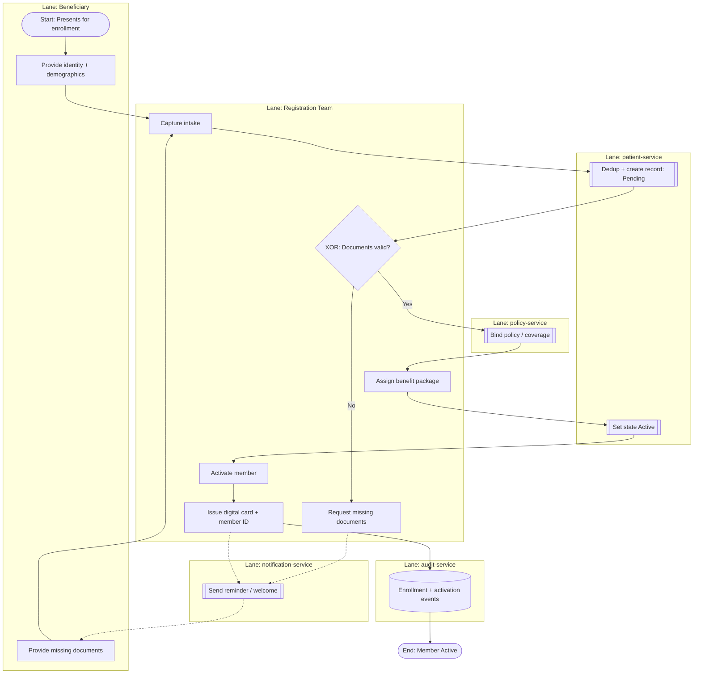
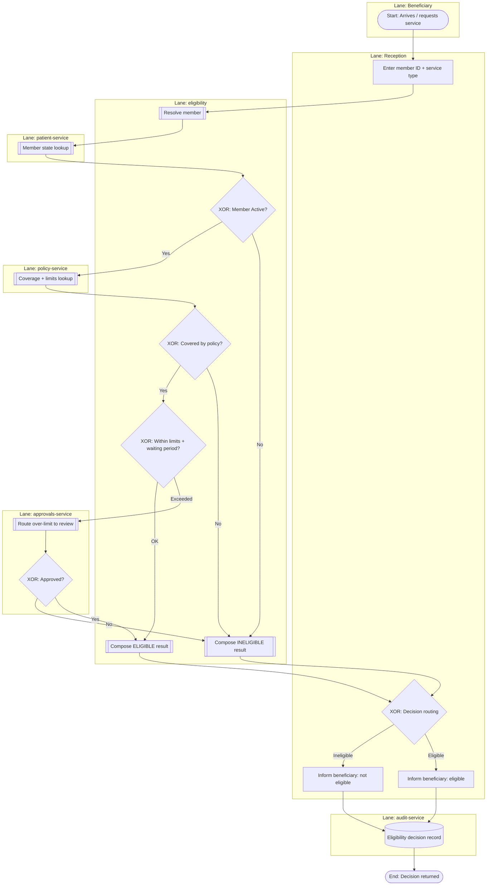
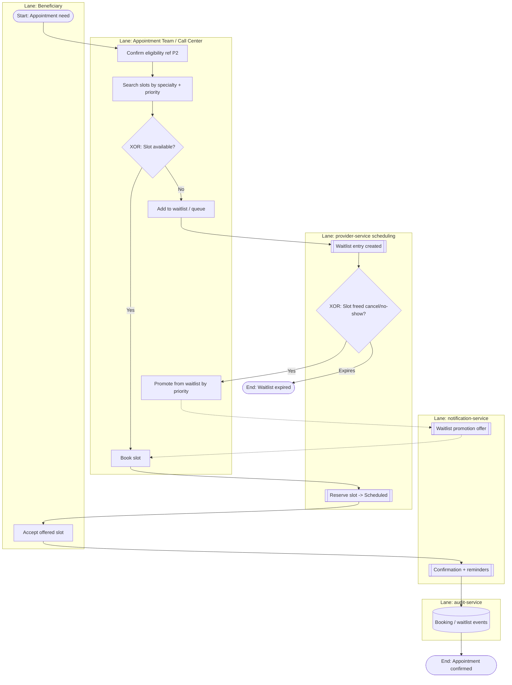
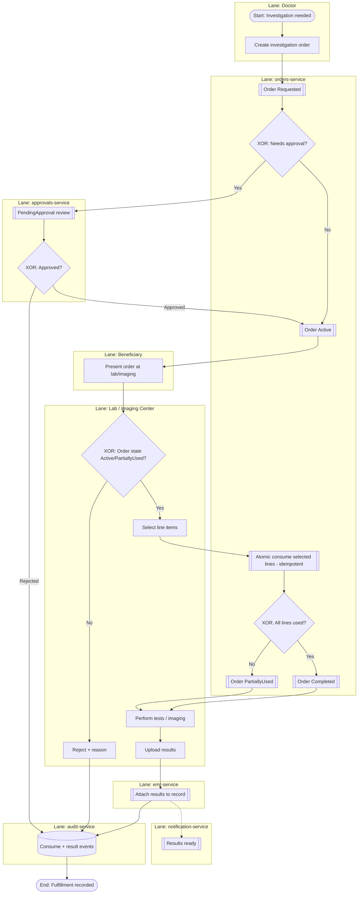
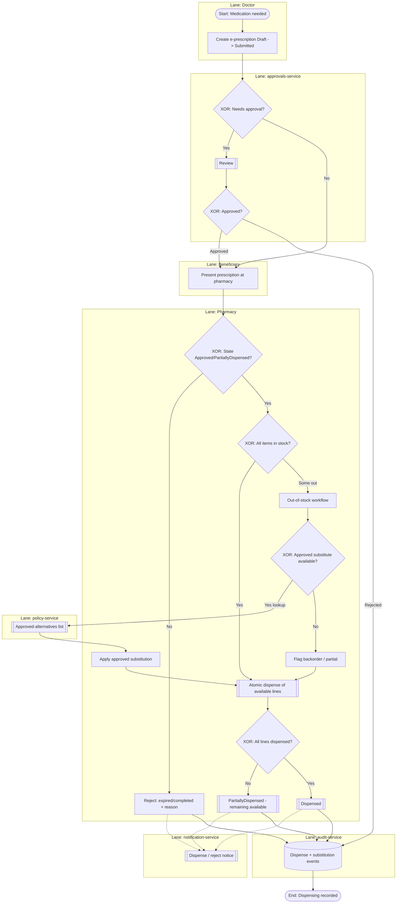
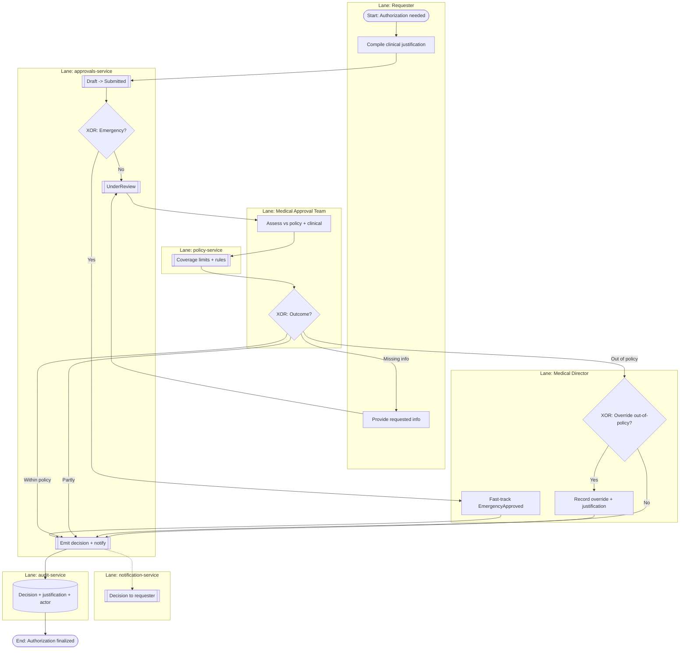
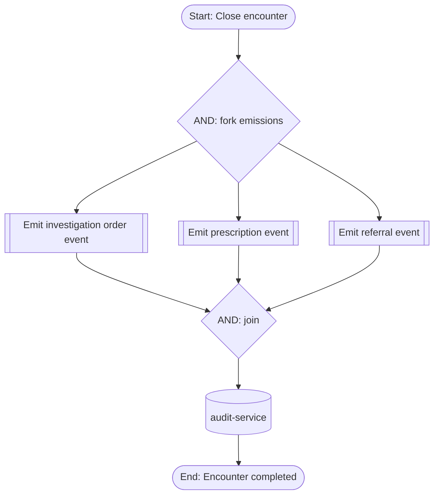

# 06 — BPMN-Style Diagrams (Swimlane Models)

> Part of the **Mersal Healthcare Benefit Management Platform (HBMP)** design workspace.
> Back to: [00-README-INDEX.md](00-README-INDEX.md) · [0A-DESIGN-FOUNDATIONS.md](0A-DESIGN-FOUNDATIONS.md)
> Siblings: [05-business-process-maps.md](05-business-process-maps.md) · [23-state-machines.md](23-state-machines.md) · [24-sequence-diagrams.md](24-sequence-diagrams.md)

This document renders BPMN-style process models **emulated in Mermaid `flowchart`**, using `subgraph` blocks as **pools/lanes** (one per actor/system) and explicit **gateway** labels. Because Mermaid has no native BPMN shapes, we adopt the notation convention below and apply it consistently.

---

## BPMN Notation Conventions (Mermaid emulation)

| BPMN element | Meaning | Mermaid emulation |
|---|---|---|
| Start event | Process trigger | `([Start ...])` stadium node, prefixed `Start` |
| End event | Process outcome | `([End ...])` stadium node, prefixed `End` |
| Task / Activity | Unit of work | `[Rectangle task]` |
| Service task | Automated/system task | `[[Double-border task]]` |
| Exclusive gateway (XOR) | One path chosen | `{XOR: condition?}` diamond |
| Parallel gateway (AND) | All paths taken | `{AND: fork/join}` diamond, fan-out/fan-in |
| Pool / Lane | Actor or system boundary | `subgraph LaneName` |
| Message / event flow | Async signal | dashed arrow `-.->` |
| Data / audit store | Persistent write | `[(Cylinder)]` |

**Gateway labeling rule:** every gateway is prefixed `XOR:` or `AND:` so the split semantics are unambiguous. XOR = exactly one outgoing path; AND = all outgoing paths concurrently (join waits for all).

---

## BPMN-1 — Registration & Activation

**Pools:** Beneficiary · Registration/Beneficiary Mgmt · patient-service · policy-service · notification-service · audit-service.

**Gateways:** R2 is an **XOR** on document validity. No parallel gateways in this model.

---

## BPMN-2 — Eligibility Check at Reception

**Pools:** Beneficiary · Reception (Registration) · eligibility · policy-service · patient-service · approvals-service · audit-service.

**Gateways:** E2/E3/E4/AP2/R2 are all **XOR**. Finance/clinical detail is excluded (data minimization: reception sees coverage flags only).

---

## BPMN-3 — Appointment Scheduling (incl. Waitlist / Queue)

**Pools:** Beneficiary · Call Center / Appointment Team · provider-service (scheduling) · notification-service · audit-service.

**Gateways:** A3 and PR3 are **XOR**. Waitlist promotion (A6) re-enters the booking task via message flow.

---

## BPMN-4 — Investigation Order → Lab / Imaging Fulfillment

**Pools:** Beneficiary · Doctor · orders-service · Lab / Imaging Center · emr-service · notification-service · audit-service.
Highlights the **atomic, idempotent consume** with an XOR on remaining lines (PartiallyUsed vs Completed).

**Gateways:** O2/O5/AP2/L1 are **XOR**. The **consume task O4** is the atomicity boundary: unused lines survive, used lines are locked, replays are idempotent by `(orderId, lineId, consumeToken)`.

---

## BPMN-5 — e-Prescription → Pharmacy Dispensing

**Pools:** Doctor · Beneficiary · pharmacy · approvals-service · policy-service · notification-service · audit-service.
Covers **partial dispensing**, **substitution with approved alternatives**, and **out-of-stock** workflow, and rejects expired/completed prescriptions.

**Gateways:** AP0/AP2/P1/P3/P5/P9 are **XOR**. Substitution is constrained to the policy-approved alternatives list; anything outside routes back to approvals. Dispense (P8) is atomic/idempotent on prescription lines.

---

## BPMN-6 — Medical Approval / Authorization (Partial, Override, Emergency, Manual)

**Pools:** Requester (Doctor/Case Manager) · approvals-service · Medical Approval Team · Medical Director · policy-service · notification-service · audit-service.
Includes **PartiallyApproved**, **Overridden**, **EmergencyApproved**, **InfoRequested**, and manual authorization.

**Gateways:** A2/M2/DI1 are **XOR**. M2 fans to four outcomes (Approved, PartiallyApproved, InfoRequested, out-of-policy→override branch). Emergency path bypasses standard review with mandatory retrospective audit. Manual authorization = Medical Director acting directly at DI2 with justification.

---

## Notes on Parallelism (AND gateways)

Most HBMP flows are decision-heavy (XOR). AND gateways appear where independent work runs concurrently — e.g. at **encounter close** an order, prescription, and referral may be emitted in parallel:

The **AND join** waits for all three emissions before the encounter is marked complete, guaranteeing no orphaned clinical artifacts.

---

## Cross-References
- Narrative process maps + pain points: [05-business-process-maps.md](05-business-process-maps.md)
- State machines behind each object (Order, Prescription, Authorization, ...): [23-state-machines.md](23-state-machines.md)
- Sequence diagrams across microservices: [24-sequence-diagrams.md](24-sequence-diagrams.md)
- Foundations & glossary: [0A-DESIGN-FOUNDATIONS.md](0A-DESIGN-FOUNDATIONS.md)
