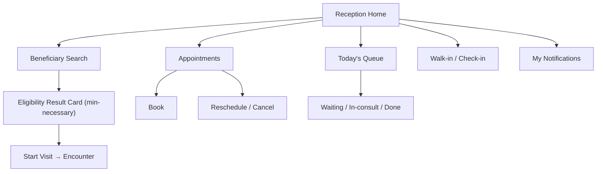
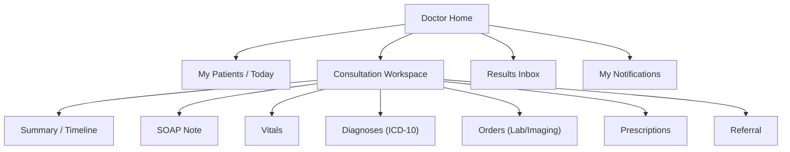
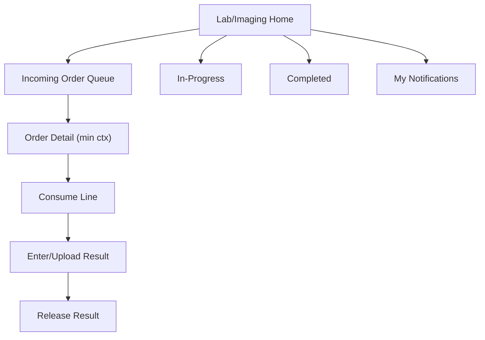
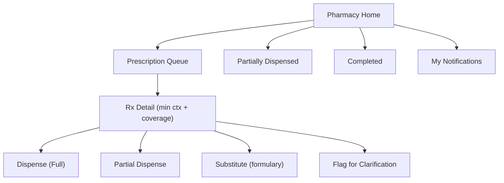
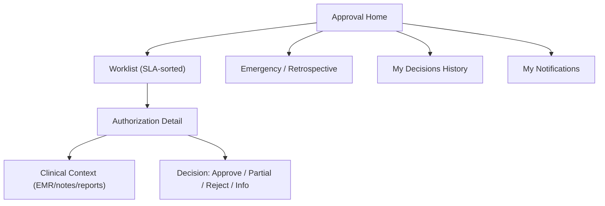
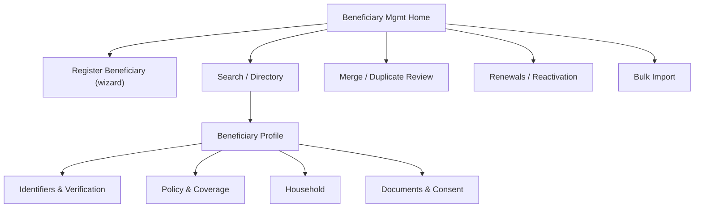
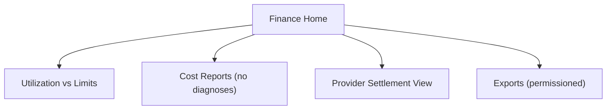
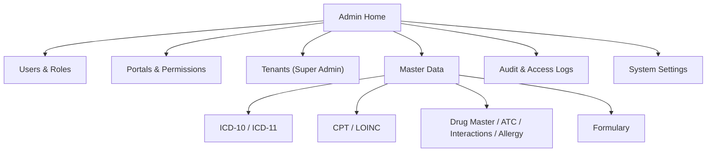
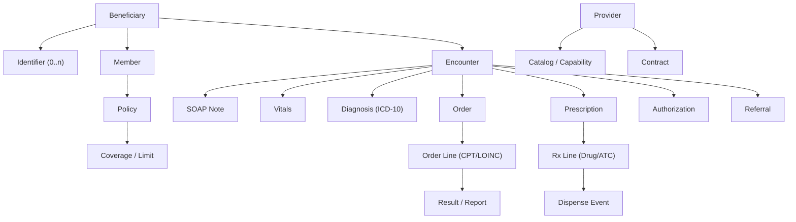

# 09 — Information Architecture

> Back to [00-README-INDEX.md](00-README-INDEX.md) · [0A-DESIGN-FOUNDATIONS.md](0A-DESIGN-FOUNDATIONS.md)
> Siblings: [07-functional-requirements.md](07-functional-requirements.md) · [12-ui-wireframes.md](12-ui-wireframes.md) · [13-ux-flows.md](13-ux-flows.md) · [14-navigation-structure.md](14-navigation-structure.md) · [10-role-matrix.md](10-role-matrix.md) · [11-permission-matrix.md](11-permission-matrix.md)

The Information Architecture (IA) defines **how content, entities, and functionality are organized, labeled, and navigated** across the HBMP's many role portals — and, critically, **how minimum-necessary data zoning is expressed structurally** so a role literally cannot navigate to data it may not see.

---

## 1. IA principles for HBMP

1. **Portal-first, not app-first.** There is no single "app" — there is a family of **role portals** sharing a design system and a reusable domain core. IA is organized per portal.
2. **Structure enforces privacy.** Data minimization is expressed in the IA itself: a portal's sitemap contains **no routes** to forbidden data. Reception has no "Clinical" node; Pharmacy has no "Lab Results" node; Finance has no "Diagnosis" node.
3. **Entity-centric spine.** All portals orbit the same canonical entities (Beneficiary, Encounter, Order, Prescription, Authorization, Provider) but expose **different projections** of them.
4. **Task-oriented top level.** Primary navigation reflects the user's jobs-to-be-done (e.g., "Queue", "Search", "Worklist"), not the internal domain model.
5. **Consistent labeling, bilingual.** Every label has an AR and EN form; terminology follows the [0A glossary](0A-DESIGN-FOUNDATIONS.md#2-glossary--canonical-terms).
6. **Predictable depth.** Target ≤ 3 clicks to any primary task; deep-linkable entity pages.

---

## 2. Content domains (global)

| Domain | Description | Primary entities |
|--------|-------------|------------------|
| **Identity & Access** | Users, roles, tenants, sessions, consent | User, Role, Tenant, Consent |
| **Beneficiary & Membership** | The person and their benefit capacity | Beneficiary, Identifier, Member, Policy, Household |
| **Eligibility & Coverage** | Real-time entitlement | EligibilityResult, Coverage, Limit |
| **Scheduling** | Appointments & provider availability | Appointment, Slot, Schedule, Queue |
| **Clinical / EMR** | Longitudinal medical record | Encounter, SOAPNote, Vitals, Diagnosis, ProblemList, AllergyList, MedicationList |
| **Orders & Diagnostics** | Investigation orders + results | Order, OrderLine, Result, Report |
| **Pharmacy** | Prescriptions & dispensing | Prescription, RxLine, DispenseEvent, Formulary |
| **Authorizations** | Pre-service approvals | Authorization, Decision, Referral |
| **Provider Network** | Contracted providers | Provider, Contract, Catalog, Credential |
| **Notifications** | Multi-channel comms | Notification, Template |
| **Reporting & Analytics** | Dashboards & reports | Report, Metric, Dashboard |
| **Master Data** | Reference terminologies | ICD, CPT, LOINC, Drug/ATC, Interaction, Allergy |
| **Audit & Governance** | Trail & attestations | AuditEvent, AccessLog |

---

## 3. The multi-portal model

```mermaid
flowchart TD
    ROOT["HBMP Platform<br/>(shared design system + domain core)"]
    ROOT --> BEN["Beneficiary Mgmt Portal"]
    ROOT --> REC["Reception Portal"]
    ROOT --> CC["Call Center Portal"]
    ROOT --> DOC["Doctors Portal"]
    ROOT --> NUR["Nurses Portal"]
    ROOT --> LAB["Labs Portal"]
    ROOT --> IMG["Imaging Portal"]
    ROOT --> PHA["Pharmacies Portal"]
    ROOT --> APR["Medical Approval Portal"]
    ROOT --> MDR["Medical Director Portal"]
    ROOT --> CM["Case Managers Portal"]
    ROOT --> FIN["Finance Portal"]
    ROOT --> PA["Provider Admin Portal"]
    ROOT --> NT["Network Team Portal"]
    ROOT --> OA["Org Admin Portal"]
    ROOT --> SA["Super Admin Portal"]

    subgraph zoneClinical["Clinical-visibility zone"]
      DOC
      NUR
      APR
      MDR
      CM
    end
    subgraph zoneProvider["Provider-isolated zone"]
      LAB
      IMG
      PHA
      PA
    end
    subgraph zoneAdmin["Ops / non-clinical zone"]
      REC
      CC
      FIN
      NT
      OA
      SA
      BEN
    end
```



Each portal is a **routing + permission boundary**. Users authenticate once (SSO) and are routed to the portal(s) their role grants. A user with multiple roles gets a **portal switcher**, never a merged super-view.

---

## 4. Data zoning by portal (minimum-necessary)

This table is the **structural expression** of the permission matrix. "—" means the IA contains **no route** to that content for the portal. See [11-permission-matrix.md](11-permission-matrix.md) for field-level detail.

| Portal | Beneficiary demo | Eligibility/Coverage | Clinical/EMR | Diagnoses | Orders | Lab/Imaging results | Prescriptions | Rx dispense | Finance | Admin |
|--------|:---:|:---:|:---:|:---:|:---:|:---:|:---:|:---:|:---:|:---:|
| Beneficiary Mgmt | ✔ full | ✔ | — | — | — | — | — | — | — | scoped |
| Reception | ✔ min | ✔ (result card) | **—** | **—** | create/track | **—** | **—** | — | — | — |
| Call Center | ✔ min | ✔ (schedule ctx) | — | — | — | — | — | — | — | — |
| Doctors | ✔ (treated) | ✔ | ✔ | ✔ | ✔ create/view | ✔ view | ✔ create | — | — | — |
| Nurses | ✔ (assigned) | ✔ | ✔ scoped | view | ✔ assist | ✔ view scoped | view scoped | — | — | — |
| Labs | ✔ min (order ctx) | — | **—** | **—** | ✔ their queue | ✔ upload own | **—** | — | — | — |
| Imaging | ✔ min (order ctx) | — | **—** | **—** | ✔ their queue | ✔ upload own | **—** | — | — | — |
| Pharmacies | ✔ min (Rx ctx) | ✔ (coverage) | **—** | **—** | **—** | **—** | ✔ their queue | ✔ dispense | — | — |
| Medical Approval | ✔ | ✔ | ✔ | ✔ | ✔ view | ✔ view | ✔ view | — | — | — |
| Medical Director | ✔ | ✔ | ✔ | ✔ | ✔ | ✔ | ✔ | — | oversight | scoped |
| Case Managers | ✔ | ✔ | ✔ scoped | ✔ | ✔ view | ✔ view | ✔ view | — | — | — |
| Finance | ✔ min | ✔ (utilization) | **—** | **—** | cost view | **—** | cost view | — | ✔ | — |
| Provider Admin | ✔ min (own org) | — | — | — | own org queues | own org | own org | own org | — | own org |
| Network Team | provider-facing | — | — | — | — | — | — | — | — | network |
| Org Admin | scoped | scoped | — | — | — | — | — | — | — | ✔ tenant |
| Super Admin | scoped | scoped | — | — | — | — | — | — | — | ✔ platform |

> **Bold "—"** marks the four headline data-minimization rules from the brief. These are enforced at the API layer (NFR-040/041), not merely hidden in the UI.

---

## 5. Sitemaps per major portal (Mermaid trees)

### 5.1 Reception Portal


### 5.2 Doctors Portal


### 5.3 Labs / Imaging Portal


### 5.4 Pharmacies Portal


### 5.5 Medical Approval Portal


### 5.6 Beneficiary Management Portal


### 5.7 Finance Portal


### 5.8 Org / Super Admin Portal


---

## 6. Entity taxonomy



- **Cardinality highlights:** Beneficiary 1—n Identifier; Beneficiary 1—1 Member (per tenant); Encounter 1—n Order/Prescription; Order 1—n OrderLine; OrderLine 1—n Result (but consumed once — see [FR-INV](07-functional-requirements.md#13-order--prescription-consumption-invariants-inv--first-class-frs)).

---

## 7. Search model

| Aspect | Design |
|--------|--------|
| **Scope** | Portal-scoped and permission-filtered — results never include entities the role can't see. |
| **Primary indices** | Beneficiary (name/identifier/member no.), Order (`ORD-…`), Prescription (`RX-…`), Authorization (`AUTH-…`), Encounter (`ENC-…`). |
| **Matching** | Typo-tolerant, bilingual (AR/EN), diacritic-insensitive for Arabic; identifier exact-match prioritized. |
| **Reception search** | Returns identity + eligibility summary only — **no clinical fields** (min-necessary). |
| **Master-data search** | ICD/CPT/Drug lookups by code or term, AR/EN, inline in clinical forms. |
| **Result actions** | Contextual, role-aware (e.g., "Start Visit", "Open Order", "Dispense"). |
| **Audit** | Sensitive searches (EMR/PHI) are access-logged (NFR-121). |

---

## 8. Labeling standards

| Rule | Example |
|------|---------|
| Use glossary canonical terms | "Beneficiary" in data; "Patient" only as clinical UI synonym (0A §2). |
| Verbs for actions, nouns for objects | "Start Visit", "Dispense", "Consume Line". |
| Bilingual pairs everywhere | EN: "Eligibility" / AR: "الأهلية". |
| Status labels match taxonomy | "Eligible", "Pending approval", "Partially used" (0A §5.2). |
| Avoid ambiguous abbreviations | Prefer "Turnaround Time (TAT)" on first use. |
| Business keys shown human-readable | `MRS-M-…`, `ORD-…`, `RX-…`, `AUTH-…`, `REF-…`. |
| Sentence case for UI labels | "Book appointment" not "Book Appointment". |

---

## 9. Bilingual / RTL IA considerations

- **Directional layout:** In Arabic (RTL), the entire IA mirrors — primary nav moves to the right, breadcrumbs read right-to-left, progress wizards flow right-to-left. This is layout mirroring, not just text (NFR-061).
- **Icon mirroring:** Directional icons (back/forward, next-step chevrons) flip; non-directional icons (status glyphs) do not.
- **Label parity:** No screen ships with an untranslated string; language toggle persists per user (0A §5.3).
- **Numerals & dates:** Configurable Arabic-Indic vs. Western numerals; dates in `Africa/Cairo`.
- **Search:** Arabic diacritic/hamza normalization so "أحمد/احمد" match.
- **Sort order:** Locale-aware collation for AR and EN directories.

---

## 10. Global navigation shell (shared)

Every portal shares a consistent shell, differing only in the **content** of primary nav (defined per portal in [14-navigation-structure.md](14-navigation-structure.md)):

```
+------------------------------------------------------------------+
| [Mersal logo]  Portal name        [Search]   [AR/EN] [🔔] [User▾] |
+----------------+-------------------------------------------------+
| PRIMARY NAV    |  Breadcrumb ▸ ▸                                  |
| (role-aware)   |                                                 |
|  • Home        |  <Content area — task/entity views>             |
|  • Queue/Work  |                                                 |
|  • Search      |  [Contextual actions bar]                       |
|  • Reports*    |                                                 |
|  • Settings*   |                                                 |
+----------------+-------------------------------------------------+
```
`*` shown only if the role permits. The **portal switcher** appears in `[User▾]` for multi-role users.

---

## 11. IA acceptance criteria

- [ ] Each portal's sitemap contains **no route** to data forbidden by [11-permission-matrix.md](11-permission-matrix.md).
- [ ] The four headline minimization rules are structurally absent from the offending portals (Reception≠EMR, Labs≠Rx, Pharmacy≠results, Finance≠diagnoses).
- [ ] Every primary task reachable in ≤ 3 clicks; every entity deep-linkable.
- [ ] All labels have AR + EN forms; layout mirrors correctly in RTL.
- [ ] Search results are permission-filtered and (for PHI) access-logged.
- [ ] Status labels conform to the canonical taxonomy (0A §5.2).

---

### Cross-references
- Screens: [12-ui-wireframes.md](12-ui-wireframes.md) · Flows: [13-ux-flows.md](13-ux-flows.md) · Nav: [14-navigation-structure.md](14-navigation-structure.md)
- Permissions/roles: [10-role-matrix.md](10-role-matrix.md) · [11-permission-matrix.md](11-permission-matrix.md)
- Accessibility: [21-accessibility-checklist.md](21-accessibility-checklist.md)
