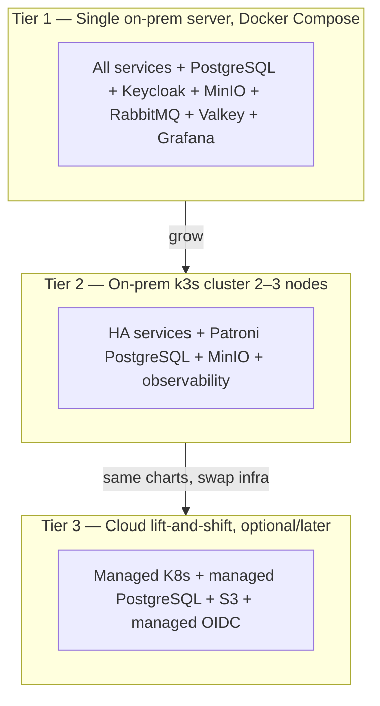

# 0C — Open-Source, On-Prem-First, Cloud-Ready Stack (Zero Licensing Cost)

> Back to [00-README-INDEX.md](00-README-INDEX.md) · [0A-DESIGN-FOUNDATIONS.md](0A-DESIGN-FOUNDATIONS.md)
> Supersedes the Azure-first defaults in [0A §4](0A-DESIGN-FOUNDATIONS.md), [16-service-architecture.md](16-service-architecture.md), and [25-deployment-architecture.md](25-deployment-architecture.md). This is now the **authoritative stack**.

## Why this exists
Mersal is a charity with little or no budget. The original design defaulted to managed Azure services, which carry real recurring cost. This decision record replaces every paid/managed dependency with a **free, open-source, self-hostable** equivalent that Mersal can run on a **single on-prem server** (or a cheap VPS) at **$0 software-licensing cost** — while keeping the **same security, integrity, and application quality**, and staying **cloud-ready** so Mersal can lift-and-shift to any cloud later without changing application code.

Three principles make this work:
1. **Containers + Kubernetes everywhere.** The app is packaged as OCI containers and deployed with Helm. On-prem uses **k3s** (a certified, lightweight Kubernetes); any managed Kubernetes (EKS/GKE/AKS) is a drop-in later. Nothing in the code knows where it runs.
2. **Open standards, not proprietary APIs.** S3-compatible storage, OIDC/OAuth2 identity, SQL (PostgreSQL), OpenTelemetry, CloudEvents. Swapping a provider is a config change, not a rewrite.
3. **Security parity by construction.** Encryption in transit and at rest, an immutable audit trail, RBAC+ABAC, and least privilege are delivered by open-source tools that meet the same bar as the managed services they replace.

---

## The stack — managed Azure → open-source equivalent

| Concern | Was (Azure) | **Open-source / on-prem (now)** | Notes |
|--------|-------------|----------------------------------|-------|
| App runtime | .NET 8 on AKS | **.NET 8** (MIT, free, Linux) | Language stack unchanged — no license cost |
| Orchestration | AKS | **k3s** on-prem (single- or multi-node); **Docker Compose** for the smallest footprint | Cloud-ready: portable to EKS/GKE/AKS |
| Packaging/deploy | — | **Helm** charts + **OCI containers** | Same artifacts on-prem and cloud |
| Relational DB | PostgreSQL Flexible + TDE | **PostgreSQL** (self-hosted) | At-rest via LUKS + pgcrypto (below); HA via Patroni |
| DB backup/PITR | Azure backup/geo | **pgBackRest** (full + WAL PITR) to a second disk/site | RPO ≤ 15 min achievable |
| Identity / IdP + MFA | Entra ID | **Keycloak** | OIDC/OAuth2, MFA (TOTP/WebAuthn), RBAC, brute-force protection, LDAP federation |
| Authorization (ABAC) | OPA/Cerbos | **OPA** or **Cerbos** (unchanged) / **OpenFGA** | Already OSS; policy-as-code |
| API gateway | Azure API Management | **Kong Gateway (OSS)** (or APISIX / Traefik) | JWT validation, rate limiting, OpenAPI, correlation IDs |
| Ingress + WAF + TLS | Front Door + WAF | **Traefik / NGINX Ingress** + **ModSecurity (OWASP CRS)** + **Let's Encrypt / internal CA** | WAF = OWASP Core Rule Set |
| Service mesh / mTLS | (Istio/OSM) | **Linkerd** | Lightweight automatic mTLS between services |
| Object storage | Blob (CMK, WORM) | **MinIO** (S3-compatible) | Server-side encryption (SSE-KMS via Vault), **object-lock = WORM** for audit archives |
| Command queue | Service Bus | **RabbitMQ** | Durable queues, DLQ, quorum queues |
| Event stream | Event Grid | **NATS JetStream** (light) or **Redpanda** (Kafka-API) | CloudEvents envelopes unchanged; transactional outbox unchanged |
| Cache | Azure Cache for Redis | **Valkey** (BSD fork of Redis) | Fully open — avoids Redis licensing change |
| Search | Azure AI Search | **OpenSearch** (Apache-2.0) or **Meilisearch/Typesense** (lightweight) | Index only minimum-necessary fields |
| Secrets / KMS | Key Vault (CMK) | **OpenBao** (or HashiCorp Vault) | `transit` engine = KMS for AES-256 keys; **SOPS** for GitOps-encrypted secrets |
| Observability | Azure Monitor / App Insights | **OpenTelemetry** + **Prometheus** + **Grafana** + **Loki** (logs) + **Tempo/Jaeger** (traces) | "LGTM" stack; OTel instrumentation is identical |
| CI/CD + registry | GitHub Actions / Azure DevOps + ACR | **GitLab CE** (repo+CI+registry+scanning) or **Gitea + Woodpecker CI** + **Harbor** | Self-hosted; **Trivy** image/dep scanning |
| IaC / provisioning | Bicep/Terraform | **OpenTofu** + **Ansible** + **Helm** | OpenTofu = OSS Terraform fork |
| Malware scan on upload | Defender | **ClamAV** | Scan every document on ingest |
| K8s backup / DR | Azure backup | **Velero** (cluster state/volumes) + **restic** (files/MinIO) | Offsite copy to a second location |
| Email / notifications | — | **Postfix/SMTP** (self-host) or free relay; SMS via a local Egyptian gateway later | In-app + email first; SMS/WhatsApp future |

**Unchanged from 0A:** the whole application layer — .NET 8 services, React/TypeScript portals, REST + OpenAPI 3.1 + FHIR R4, PostgreSQL schema-per-service, RBAC+ABAC, transactional outbox, CloudEvents, the domain model, and every invariant. **Only the infrastructure substrate changed.**

---

## Deployment topology — grows with Mersal, cloud-ready throughout

- **Tier 1 (start here, ~$0):** one reasonably specced server (or VPS). Everything runs via **Docker Compose**. Enough for the pilot clinic. Full-disk **LUKS** encryption; nightly **pgBackRest** + **restic** offsite copy.
- **Tier 2 (scale on-prem):** move to **k3s** (2–3 nodes) with Helm; PostgreSQL HA via **Patroni**; MinIO distributed; Linkerd mTLS; Prometheus/Grafana/Loki/Tempo. Same containers, more resilience.
- **Tier 3 (cloud, only if/when funded):** deploy the **same Helm charts** to managed Kubernetes; point at managed PostgreSQL, S3, and a managed OIDC — application code untouched. This is the "cloud-ready" guarantee.

**Data residency bonus:** running on-prem in Egypt keeps regulated refugee data in-country, which *simplifies* Egypt PDPL (Law 151/2020) compliance and any UNHCR data-sharing posture (see [20-compliance-checklist.md](20-compliance-checklist.md)).

---

## Security & integrity parity (same bar as the managed stack)

| Control | How it's met with open source |
|--------|-------------------------------|
| Encryption in transit | TLS 1.2+ at ingress (Let's Encrypt/internal CA); **mTLS** service-to-service via **Linkerd** |
| Encryption at rest | **LUKS** full-disk on every server; **pgcrypto** column-level for PHI/PII; **MinIO SSE**; keys in **OpenBao** transit engine (AES-256), rotated |
| Secrets management | **OpenBao/Vault** + **SOPS**; no secrets in images or git; workload identity via Kubernetes ServiceAccounts |
| Identity + MFA | **Keycloak** — OIDC/OAuth2, TOTP/WebAuthn MFA, password policy, session timeout, brute-force lockout, IP rules |
| AuthZ (RBAC+ABAC) | **Keycloak roles/claims** + **OPA/Cerbos** for field/row-level + **PostgreSQL RLS** — minimum-necessary unchanged |
| Immutable audit | Hash-chained `audit_event` (unchanged) + **MinIO object-lock (WORM)** for archived audit + offsite copy |
| Network / Zero Trust | k3s **NetworkPolicies** (default-deny), Kong at the edge, services in-cluster only, provider/tenant isolation |
| WAF / API protection | **ModSecurity + OWASP CRS** at ingress; Kong rate limiting; RFC 7807 errors; OWASP API Top 10 checks |
| Vulnerability mgmt | **Trivy** image/dependency scans in CI; **ClamAV** on uploads; dependency pinning |
| Backup / DR | **pgBackRest** (PITR), **Velero** (cluster), **restic** (files) with offsite/second-site copies; tested restores |

Every item in [18-security-model.md](18-security-model.md) is preserved — only the product names change. The **Definition of Done, testing strategy, accessibility, and audit requirements are unchanged.**

---

## Cost & operations reality check
- **Software licensing: $0.** All components are OSS (Apache-2.0/MIT/BSD/MPL/AGPL-with-self-host).
- **What Mersal pays for:** one server (or VPS), electricity/hosting, a domain + TLS (Let's Encrypt is free), and **staff/volunteer time to operate it**. The main trade-off vs managed cloud is **operational effort** (patching, backups, monitoring) — mitigated by the runbooks in [34-technical-documentation.md](34-technical-documentation.md) and by starting at Tier 1.
- **Right-sizing:** start on one server with Compose; only move to k3s/Patroni when load or availability needs justify it. Don't over-build.
- **AGPL note:** MinIO and Grafana Loki are AGPL/AGPL-adjacent — fine for internal self-hosting; just don't offer them as a modified hosted service to third parties. (Legal counsel can confirm; internal use is the norm.)

---

## What changes in the rest of the design set
- [0A §4](0A-DESIGN-FOUNDATIONS.md) tech-stack table → points here.
- [16-service-architecture.md](16-service-architecture.md) infra names (gateway, bus, storage, search, cache, secrets, observability) → OSS equivalents; **service boundaries, events, sagas, and invariants are unchanged.**
- [18-security-model.md](18-security-model.md) → Keycloak/Kong/OpenBao/LUKS/pgcrypto/Linkerd/ModSecurity.
- [25-deployment-architecture.md](25-deployment-architecture.md) → on-prem k3s/Compose topology + cloud-ready path; DR via pgBackRest/Velero/restic.
- [20-compliance-checklist.md](20-compliance-checklist.md) → on-prem in-country residency strengthens PDPL posture.
- Prompts: `claude-code-prompts/00-CLAUDE-MD-AND-CONVENTIONS.md`, `phase-0-foundations.md`, `phase-11-hardening-and-nfr.md`, `phase-12-migration-and-golive.md`.
- Skills: `mersal-platform-architect`, `healthcare-database-architect` (infra references).

---

### Cross-references
- Foundations: [0A-DESIGN-FOUNDATIONS.md](0A-DESIGN-FOUNDATIONS.md) · Services: [16-service-architecture.md](16-service-architecture.md) · Security: [18-security-model.md](18-security-model.md) · Deployment: [25-deployment-architecture.md](25-deployment-architecture.md) · Compliance/residency: [20-compliance-checklist.md](20-compliance-checklist.md)
