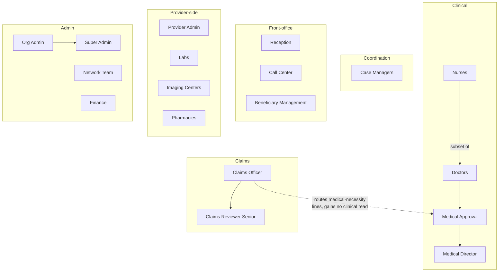

# 10 — Role Matrix (Human-Readable Companion)

[⬅ Back to Index](00-README-INDEX.md) · [Design Foundations](0A-DESIGN-FOUNDATIONS.md)

**Siblings:** [11-permission-matrix.md](11-permission-matrix.md) · [18-security-model.md](18-security-model.md) · [19-audit-strategy.md](19-audit-strategy.md) · [20-compliance-checklist.md](20-compliance-checklist.md)

> **Purpose of this document.** This is the *human-readable* definition of every role on the Mersal Healthcare Benefit Management Platform (HBMP). It explains **who** each role is, **why** it exists, **what portal** it lives in, **what data scope** it may reach, and **how roles relate** to one another. The machine-enforceable, field-level rules live in the companion [Permission Matrix](11-permission-matrix.md); the enforcement mechanics live in the [Security Model](18-security-model.md). Where the two disagree, the Permission Matrix and the policy engine are authoritative — this document is the narrative.

---

## 1. Design principles for roles

Every role definition on HBMP is derived from four hard constraints established in [0A-DESIGN-FOUNDATIONS.md](0A-DESIGN-FOUNDATIONS.md):

1. **Least Privilege** — a role receives only the permissions required to perform its documented job function, nothing more.
2. **Need-to-Know** — even where a role *could* technically read a data class, access is further narrowed by *context* (treating relationship, provider ownership, tenant, assignment). This is the ABAC layer.
3. **Data Minimization** — each screen renders the minimum-necessary fields. A role that needs a patient's identity to book an appointment does not thereby get their diagnoses.
4. **Segregation of Duties (SoD)** — no single human can both *originate* and *approve* the same sensitive transaction (e.g., raise a medical approval and approve it; create a payment and release it).

Roles are **coarse-grained identities**; fine-grained gating is done by **RBAC (role → permission)** combined with **ABAC (attributes → conditions)**. See [Section 8](#8-rbac--abac-how-a-role-becomes-a-decision).

---

## 2. Scope vocabulary

Each role is bound to a **scope** — the horizon of records it may ever touch, before per-field rules apply.

| Scope token | Meaning | Enforced by |
|---|---|---|
| `tenant:own` | Only records belonging to the beneficiary's/organization's own tenant (the Mersal Foundation tenant, or a partitioned sub-tenant). | PostgreSQL Row-Level Security (RLS) + gateway claim |
| `provider:own` | Only records owned by the provider organization the user belongs to (a specific clinic, lab, pharmacy, imaging center). | RLS `provider_id` predicate + ABAC `provider-ownership` |
| `beneficiary:assigned` | Only beneficiaries explicitly assigned/linked to this user (panel, case load, active encounter). | ABAC `treating-relationship` / `assignment` |
| `beneficiary:treating` | Only beneficiaries with an *active clinical encounter* with this user. | ABAC `treating-relationship` + `order-status` |
| `self` | Only the user's own account/profile records. | Identity claim `sub` |
| `global` | Cross-tenant, cross-provider (platform operations). Reserved for Super Admin / platform SRE, break-glass only for data. | Explicit elevated role + step-up MFA + audit |

**Sensitivity tiers** (data classes a role habitually handles; drives logging verbosity, MFA strength, and review cadence):

| Tier | Label | Examples of data | Typical control uplift |
|---|---|---|---|
| **T0** | Public/operational | Provider directory, benefit catalog names | Standard |
| **T1** | Restricted PII | Beneficiary name, contact, appointment slot | RLS + read audit |
| **T2** | Sensitive PII / financial | UNHCR/registration ID, claims, invoices, coverage | Field masking + read audit + SoD |
| **T3** | PHI / clinical | Diagnoses, EMR notes, prescriptions, lab & imaging results | Need-to-know ABAC + read-of-PHI audit + step-up |
| **T4** | Platform-critical | Keys, policies, role bindings, audit config | Break-glass, dual-control, hardware MFA |

---

## 3. Role catalog

Each role below follows the same template: **Purpose · Portal · Typical users · Scope · Key capabilities · Highest sensitivity tier · Notes**.

### 3.1 Beneficiary Management
- **Purpose:** Own the beneficiary lifecycle — intake, registration, identity verification, household linkage, eligibility enrollment, benefit assignment, and record maintenance for refugee beneficiaries.
- **Portal:** Beneficiary Management portal.
- **Typical users:** Mersal enrollment officers, registration desk supervisors, data-quality staff.
- **Scope:** `tenant:own` over all beneficiaries; write to demographic + eligibility + policy-link records.
- **Key capabilities:** Create/update beneficiary demographic records; verify identity documents; link to UNHCR/refugee registration references; assign benefit plans (with Policy service); manage household/dependents; deactivate/merge duplicates; initiate data-subject-request workflows.
- **Highest tier:** **T2** (registration IDs, refugee status). **No routine clinical (T3) access.**
- **Notes:** May *see that* a beneficiary has an active plan and eligibility status, but **not** clinical diagnoses. Merges and deactivations are dual-controlled (SoD with a supervisor).

### 3.2 Reception
- **Purpose:** Front-desk check-in, appointment scheduling, queue management, and identity confirmation at point of service.
- **Portal:** Reception portal.
- **Typical users:** Clinic front-desk staff at Mersal and partner sites.
- **Scope:** `provider:own` + `beneficiary:assigned` (those with an appointment/queue entry at this site today).
- **Key capabilities:** Search a beneficiary by ID/name; confirm identity + eligibility (green/red light only); book/reschedule/cancel appointments; manage waiting-room queue; print visit tickets; capture arrival.
- **Highest tier:** **T1** (name, contact, appointment). Sees an **eligibility verdict**, not the underlying policy math or clinical reason.
- **Notes:** **HARD RULE — Reception CANNOT view the EMR.** No diagnoses, notes, prescriptions, labs, or imaging. This is enforced at gateway, service, row and field level (see [Permission Matrix §3](11-permission-matrix.md)).

### 3.3 Call Center
- **Purpose:** Remote beneficiary support — inbound/outbound calls, appointment help, benefit questions, complaint intake, triage routing.
- **Portal:** Call Center portal (with CTI/soft-phone).
- **Typical users:** Mersal call-center agents and team leads.
- **Scope:** `tenant:own` for identity + eligibility + appointment + case-ticket data.
- **Key capabilities:** Verify caller identity (knowledge-based + registration ref); view/update contact details; book/modify appointments; open and track support tickets/cases; view benefit coverage summary (what's covered, remaining limits); escalate to Case Managers.
- **Highest tier:** **T2** (coverage, financial limits summary). **No clinical detail** beyond appointment specialty.
- **Notes:** Every caller verification and every PII read is audited with a correlation ID tied to the call. Agents see coverage **balances**, not **diagnoses**.

### 3.4 Doctors
- **Purpose:** Deliver clinical care — consult, diagnose, document encounters, order investigations, prescribe, and refer.
- **Portal:** Doctors (clinical) portal.
- **Typical users:** Physicians and specialists at Mersal and contracted providers.
- **Scope:** `beneficiary:treating` — **only patients they are actively treating** (active encounter/assignment).
- **Key capabilities:** Full read of the treated patient's EMR (history, notes, results, prescriptions); create clinical notes + diagnoses; place orders (labs, imaging, procedures); write prescriptions; raise medical approval requests; create referrals; view results returned to their orders.
- **Highest tier:** **T3** (full PHI, scoped).
- **Notes:** **HARD RULE — Doctors view only patients they treat.** The treating-relationship is the ABAC gate; when the encounter closes and the retention window lapses, standing access narrows to continuity-of-care rules. Break-glass exists for emergencies (see [Security Model §11](18-security-model.md)).

### 3.5 Nurses
- **Purpose:** Support clinical delivery — vitals, triage, medication administration, care-plan tasks, and encounter prep.
- **Portal:** Nurses portal (a constrained clinical view).
- **Typical users:** Registered nurses, triage nurses, ward staff.
- **Scope:** `beneficiary:treating` / `beneficiary:assigned` (assigned encounter or ward panel).
- **Key capabilities:** Record vitals and triage; view relevant clinical context for assigned patients (problem list, allergies, active meds, care tasks); administer/record medications; update nursing notes; see orders relevant to care delivery.
- **Highest tier:** **T3** (PHI, scoped and narrower than Doctors — e.g., limited authorship of formal diagnoses).
- **Notes:** Nurses **cannot author formal diagnoses** or issue prescriptions; they document observations and administration. Access is bounded to the assignment window.

### 3.6 Labs
- **Purpose:** Fulfill laboratory investigation orders and return results.
- **Portal:** Labs portal.
- **Typical users:** Lab technicians, pathologists at contracted laboratories.
- **Scope:** `provider:own` + `order-status`: only **lab orders routed to this lab**.
- **Key capabilities:** View the *order* (test requested, specimen, ordering clinician, minimum clinical indication needed to run the test safely); accept/reject/collect specimen; enter and verify results; attach reports; mark order complete.
- **Highest tier:** **T3** (their own investigation results).
- **Notes:** **HARD RULE — Labs CANNOT view prescriptions.** They see the clinical *indication* attached to their order (need-to-know), never the medication list or unrelated EMR history.

### 3.7 Imaging Centers
- **Purpose:** Fulfill radiology/imaging orders and return studies + reports.
- **Portal:** Imaging portal (may integrate PACS).
- **Typical users:** Radiographers, radiologists at contracted imaging centers.
- **Scope:** `provider:own` + `order-status`: only **imaging orders routed here**.
- **Key capabilities:** View imaging order + indication; schedule study; upload images/DICOM references (MinIO with SSE); author radiology report; mark complete.
- **Highest tier:** **T3** (their own imaging studies/reports).
- **Notes:** Same minimization posture as Labs — indication yes, prescriptions/unrelated history no.

### 3.8 Pharmacies
- **Purpose:** Dispense prescribed medications and record dispensation/consumption against benefit.
- **Portal:** Pharmacies portal.
- **Typical users:** Pharmacists, dispensing techs at contracted pharmacies.
- **Scope:** `provider:own` + `order-status`: only **prescriptions routed to this pharmacy**.
- **Key capabilities:** View the prescription (drug, dose, quantity, prescriber, essential safety context — allergies, interactions flags); verify eligibility/coverage for the drug; dispense and record consumption; partial fills; substitutions per policy.
- **Highest tier:** **T3** (prescriptions routed to them).
- **Notes:** **HARD RULE — Pharmacies CANNOT view investigation (lab/imaging) results.** They receive safety-relevant flags (e.g., renal-dose alert) as *derived* attributes, not raw results.

### 3.9 Medical Approval
- **Purpose:** Clinical utilization review — adjudicate prior-authorization / medical-approval requests against clinical evidence and benefit rules.
- **Portal:** Medical Approval portal.
- **Typical users:** Approval clinicians/nurses, utilization-review officers.
- **Scope:** `tenant:own` over **approval cases** and the clinical evidence attached to them.
- **Key capabilities:** Review approval requests; **read EMR, clinical notes, and reports** relevant to the case; request additional info; approve/deny/pend with clinical rationale; apply benefit policy; set validity/limits.
- **Highest tier:** **T3** (broad clinical read — by design).
- **Notes:** **HARD RULE — Approval team CAN view EMR / clinical notes / reports.** This is the *only* non-treating role with broad clinical read, justified by the utilization-review purpose; it is offset by heavy read-of-PHI auditing and purpose binding. **SoD:** an approver cannot adjudicate a request they authored as a treating clinician.

### 3.10 Medical Director
- **Purpose:** Clinical governance — oversight of approvals, escalations, appeals, quality, and clinical policy.
- **Portal:** Medical Director portal (superset of Approval + oversight dashboards).
- **Typical users:** Chief medical officer, senior clinical leads.
- **Scope:** `tenant:own` over approvals, escalations, clinical KPIs; case-level clinical read for escalated/appealed cases.
- **Key capabilities:** Handle escalations and appeals; override/uphold approval decisions (dual-control logged); define clinical review criteria; view aggregate + case-level clinical quality metrics.
- **Highest tier:** **T3**.
- **Notes:** Overrides are always logged as *distinct* events with rationale; the Director cannot also have been the originating clinician (SoD).

### 3.11 Case Managers
- **Purpose:** Coordinate care and benefits for a defined case load of beneficiaries (complex/chronic/vulnerable refugees).
- **Portal:** Case Managers portal.
- **Typical users:** Care coordinators, social workers, complex-case managers.
- **Scope:** `beneficiary:assigned` — their **assigned case load**.
- **Key capabilities:** Holistic view of assigned beneficiaries (eligibility, care plan, key clinical summary needed for coordination, open approvals, appointments); coordinate referrals; open/track cases; liaise with Approval and providers; manage care plans.
- **Highest tier:** **T3** (scoped to case load; summary-level clinical for coordination).
- **Notes:** Access follows assignment; unassignment revokes it. Case Managers see coordination-relevant clinical summaries, not necessarily every raw result unless the care plan requires it.

### 3.12 Finance
- **Purpose:** Claims, invoicing, provider payments, reconciliation, benefit-cost accounting.
- **Portal:** Finance portal.
- **Typical users:** Finance officers, claims processors, accounts-payable staff.
- **Scope:** `tenant:own` over financial + claim + coverage records.
- **Key capabilities:** Process claims; validate against eligibility/coverage; generate invoices; schedule/approve provider payments (SoD split: initiate vs. release); reconcile; produce financial reports.
- **Highest tier:** **T2** (financial + coverage).
- **Notes:** **HARD RULE — Finance CANNOT view diagnoses.** Claims carry *coded, minimized* service/procedure references and amounts, but the **diagnosis field is masked/withheld** from Finance. Where a procedure code implies clinical detail, only the billing code needed for adjudication is exposed. Payment initiation and release are separate permissions held by different people. **As of Phase 10b**, claim *adjudication* is the dedicated **Claims Officer** role (§3.17); Finance consumes the resulting settlement advice and executes payment outside the platform ([36-claims-management.md](36-claims-management.md)).

### 3.13 Provider Admin
- **Purpose:** Administer a single provider organization's users, sites, schedules, and service catalog on the platform.
- **Portal:** Provider Admin portal.
- **Typical users:** Clinic/lab/pharmacy administrators (provider-side).
- **Scope:** `provider:own` — their own provider org only.
- **Key capabilities:** Manage provider-side user accounts and role assignments (within an allowed set); configure sites, rooms, schedules; maintain service/price catalog entries subject to Network approval; view provider-scoped operational reports.
- **Highest tier:** **T2** (provider operational + some financial). **No clinical (T3) read** into beneficiary EMR.
- **Notes:** Strong **provider isolation** — a Provider Admin can never see another provider's users or data. Cannot grant clinical roles beyond the platform-sanctioned catalog; cannot self-elevate.

### 3.14 Network Team
- **Purpose:** Manage the provider network — onboarding, contracting, credentialing, catalog/pricing governance, performance.
- **Portal:** Network Team portal.
- **Typical users:** Mersal network/contracting managers.
- **Scope:** `tenant:own` across **provider organizations** (contract/credential/catalog metadata), **not** beneficiary clinical data.
- **Key capabilities:** Onboard/offboard providers; manage contracts, rates, credentialing; approve provider catalogs/prices; monitor network performance and compliance.
- **Highest tier:** **T2** (provider contracts/financial terms).
- **Notes:** Operates on provider metadata, not beneficiary PHI. Rate/catalog changes are SoD-controlled with Finance/Medical Director where clinical-cost policy is affected.

### 3.15 Org Admin
- **Purpose:** Administer the Mersal (tenant) organization — internal users, role assignments, org-level configuration, and policy within one tenant.
- **Portal:** Org Admin portal.
- **Typical users:** Mersal IT/operations administrators.
- **Scope:** `tenant:own` — administrative metadata (users, roles, org settings). **Not** a data-reader of PHI.
- **Key capabilities:** Manage internal user accounts, group/role assignments (within tenant), MFA/device/IP policy at tenant level, org configuration, service-desk of access requests.
- **Highest tier:** **T4** for *administrative* objects (role bindings, policy) — **but not** clinical/financial *content*.
- **Notes:** Org Admin manages *who can access*, not *the data itself*. Assigning a clinical role does not grant Org Admin clinical read. All admin actions are audited and (for sensitive grants) dual-controlled.

### 3.16 Super Admin
- **Purpose:** Platform-wide technical administration and last-resort operations across all tenants/providers.
- **Portal:** Super Admin / platform console.
- **Typical users:** A very small number of Mersal platform engineers/SRE.
- **Scope:** `global` for **configuration and platform health**; **data access only via break-glass** with dual-control + step-up + full audit.
- **Key capabilities:** Manage tenants and platform config; deploy policy bundles; manage keys lifecycle (with OpenBao/Vault RBAC, not raw key exposure); operate infrastructure; invoke and review break-glass.
- **Highest tier:** **T4**.
- **Notes:** Super Admin is **not** a routine data reader. Any access to beneficiary PHI/financials requires an explicit, time-boxed break-glass grant that is loudly audited and reviewed. Hardware-backed MFA, IP allowlist, and PIM-style just-in-time elevation required. See [Security Model §11](18-security-model.md).

### 3.17 Claims Officer *(new — Phase 10b)*
- **Purpose:** Adjudicate delivered, authorized services into decided and settleable financial records — review claim lines, decide them, assemble and manage batches, record adjustments, and generate settlement advice. The claims counterpart to Medical Approval: same discipline, **money instead of medicine**.
- **Portal:** Claims portal (a distinct workspace alongside Finance; see [36-claims-management.md](36-claims-management.md)).
- **Typical users:** Mersal claims processors/adjudicators, reimbursement assessors.
- **Scope:** `tenant:own` over `claim`, `claim_line`, `claim_batch`, `claim_adjustment`, `reimbursement_request`, `claim_document`, `settlement_advice`. **Explicitly *not* `provider:own`** — a Claims Officer must not be affiliated with any provider whose claims they decide.
- **Key capabilities:** Work the adjudication worklist (system recommendation + coded reasons); record **line-level** decisions — approve / partially approve / deny with mandatory coded reason / adjust / request info / route to clinical review; manually price `NO_TARIFF` lines; create and manage batches (date range, provider branch, provider group, manual selection) and roll line decisions up to batch totals; run reconciliation (billed-not-delivered, delivered-not-billed, price/quantity variance, duplicate); record append-only adjustments; assess beneficiary reimbursement requests including confirming OCR-extracted values; generate and export settlement advice.
- **Highest tier:** **T2** (financial + coded service references + coverage). **No clinical (T3) access.**
- **Notes:** **HARD RULE — Claims Officer CANNOT view diagnoses, EMR notes, or lab/imaging result *values*.** They adjudicate on **service codes, quantities, dates, amounts, authorizations and documents**. Result/report **existence, date and document reference** *are* visible as proof-of-service — the clinical **content** is stripped server-side from every claims projection ([Permission Matrix §3.2/§4](11-permission-matrix.md)). The platform **never executes payment**: settlement advice is a hand-off artifact to Finance/treasury. **SoD:** cannot decide a claim they originated/submitted, and cannot decide a claim belonging to a provider they are affiliated with.

### 3.18 Claims Reviewer (Senior) *(new — Phase 10b)*
- **Purpose:** Dual-control approver and escalation point for claims — the second pair of eyes required before an override above threshold, a high-value adjustment, or an exceptional settlement is committed.
- **Portal:** Claims portal (senior view: dual-control queue, override/adjustment approvals, batch oversight, claims KPIs).
- **Typical users:** Claims team leads, senior adjudicators, claims managers.
- **Scope:** `tenant:own` — same claims object set as the Claims Officer, plus the dual-control approval queue and batch-level exception actions.
- **Key capabilities:** Everything a Claims Officer can do, plus: approve/reject **overrides above the configured value threshold**; approve **high-value adjustments** (large deductions, write-offs, recoveries/clawbacks, a negative net-payable batch); authorise removal of a claim from an `UnderReview` batch; uphold or remand appeals before re-adjudication; monitor claims TAT, denial-reason mix, and provider variance.
- **Highest tier:** **T2**. **Same clinical exclusions as the Claims Officer — seniority grants no clinical read.**
- **Notes:** **SoD is strict:** the Reviewer approving an override or adjustment must **not** be the officer who recorded it, must not be the claim's originator/submitter, and must not be provider-affiliated for that claim. Dual-control approvals are logged as *distinct* events with rationale ([Audit Strategy](19-audit-strategy.md)).

### 3.19 Clinical reviewer hand-off (no new role)

Some claim lines turn on a genuine **medical-necessity** question that cannot be settled from codes and amounts alone. These lines are **routed to `ClinicalReview`** and land with the **existing [Medical Approval](#39-medical-approval) / [Medical Director](#310-medical-director)** roles — not with a new claims-clinical hybrid.

| Aspect | Claims Officer / Reviewer | Clinical Reviewer (Medical Approval / Director) |
|---|---|---|
| Sees clinical context (diagnosis, notes, result values) | **Never** | **Yes**, under `PUR` purpose-binding, for the routed line only |
| Records | The **payment decision** (approve/partial/deny/adjust) | A **clinical opinion** on medical necessity |
| Makes the payment decision | **Yes** | **No** |

The hand-off is one-directional in each phase: the clinical opinion returns as a structured verdict + rationale that the Claims Officer acts on; the officer never gains clinical read by virtue of the routing, and the clinical reviewer never gains claims-decision rights. Both hops are audited.

---

## 4. Role hierarchy & inheritance

HBMP uses **shallow, explicit inheritance** — deep inheritance trees hide privilege. Where inheritance exists it is documented and additive only within the same data domain.

**Reading the diagram:** an arrow `A --> B` means B's *clinical-read* capability is a **superset** of A's within the same domain — it does **not** mean B inherits A's write duties or portal. Inheritance is used only to reason about read scope; every permission is still enumerated explicitly in the [Permission Matrix](11-permission-matrix.md). Non-connected roles are peers with disjoint duties.

| Inheritance edge | What is inherited | What is NOT inherited |
|---|---|---|
| Nurses → Doctors | Clinical *read* context for treated patients | Diagnosis authorship, prescribing |
| Doctors → Medical Approval | Ability to *read* clinical evidence | Treating-write; approval is read+adjudicate only |
| Medical Approval → Medical Director | Case clinical read | Director-only override/appeal powers add on top |
| Org Admin → Super Admin | Tenant admin surface | Cross-tenant + break-glass require explicit elevation |
| Claims Officer → Claims Reviewer (Senior) | Claims/batch read + line-decision surface | **No clinical read is added**; Reviewer-only dual-control approval of overrides/high-value adjustments adds on top |

The dashed edge `Claims Officer ⇢ Medical Approval` is **not** inheritance — it is a **hand-off** (§3.19). Routing a line to clinical review transfers the *question*, never the Claims Officer's field visibility.

---

## 5. Roles × Modules capability overview

Legend: **F** = Full (CRUD within scope) · **W** = Write/contribute · **R** = Read (scoped) · **R°** = Read minimized/verdict-only · **–** = No access · **A** = Approve/adjudicate · **C** = Consume/record fulfillment. All access is **further** constrained by scope + ABAC; this table is the coarse view. Modules map to microservices in [0A](0A-DESIGN-FOUNDATIONS.md).

| Role \ Module | patient | policy/elig. | emr | orders | approvals | provider | finance/claims | reporting | identity/admin | audit |
|---|---|---|---|---|---|---|---|---|---|---|
| Beneficiary Mgmt | F | W | – | – | – | R° | – | R° | R°(self dir.) | – |
| Reception | R° | R°(verdict) | – | R°(appt) | – | R°(own site) | – | – | – | – |
| Call Center | R/W(contact) | R°(coverage) | – | R/W(appt) | R°(status) | R° | R°(balance) | – | – | – |
| Doctors | R(treating) | R°(elig) | F(treating) | F(own) | W(raise) | R° | – | R°(own) | – | – |
| Nurses | R(assigned) | R° | W(assigned) | R(care) | – | R° | – | – | – | – |
| Labs | R°(order) | – | R°(indication) | C(lab) | – | R°(own) | – | R°(own) | – | – |
| Imaging | R°(order) | – | R°(indication) | C(imaging) | – | R°(own) | – | R°(own) | – | – |
| Pharmacies | R°(order) | R°(drug cov.) | R°(rx+safety) | C(rx) | – | R°(own) | R°(dispense claim) | R°(own) | – | – |
| Medical Approval | R | R(policy) | R(clinical) | R | A | R° | – | R° | – | – |
| Medical Director | R | R | R | R | A/override | R° | R°(cost) | R | – | – |
| Case Managers | R(assigned) | R(assigned) | R°(summary) | R(assigned) | R/W(request) | R° | R°(assigned) | R° | – | – |
| Finance | R°(PII) | R(coverage) | **–** | R°(billing code) | R°(status) | R°(rates) | F | R | – | – |
| Claims Officer | R°(PII min) | R°(coverage @ svc date) | **–** | R°(code+fulfilment ref) | R°(auth scope) | R°(tariff/contract) | F(claims, batches, adj.) + A(line decide) | R°(claims KPIs) | – | – |
| Claims Reviewer (Senior) | R°(PII min) | R°(coverage @ svc date) | **–** | R°(code+fulfilment ref) | R°(auth scope) | R°(tariff/contract) | F + A/dual-control(override, high-value adj.) | R(claims KPIs) | – | – |
| Provider Admin | – | – | – | R°(own ops) | – | F(own) | R°(own) | R°(own) | W(own users) | – |
| Network Team | – | R°(contract) | – | – | – | F(metadata) | R°(rates) | R | – | – |
| Org Admin | R°(dir) | R°(config) | – | – | – | R° | – | R°(ops) | F(tenant) | R°(access rev.) |
| Super Admin | R°(BG) | R°(BG) | R°(BG) | R°(BG) | R°(BG) | R°(BG) | R°(BG) | R | F(global) | R°(access) |
| *Audit service* | – | – | – | – | – | – | – | – | – | append-only |

`BG` = break-glass only (time-boxed, dual-control, loudly audited). Note the **hard rules** visible in this table: Reception `emr = –`; Doctors `emr` is treating-scoped; Labs/Imaging `emr = R°(indication)` and no prescription/consume-rx; Pharmacies no lab/imaging results; Finance `emr = –` and no diagnosis; Approval `emr = R(clinical)`; **Claims Officer / Claims Reviewer `emr = –`** — no diagnosis, no notes, no result *values* (result existence + date + document reference only, as proof-of-service).

---

## 6. Data-minimization highlights (traceability to hard rules)

| Hard rule (from Foundations) | Roles affected | How this doc encodes it | Enforced where |
|---|---|---|---|
| Reception cannot view EMR | Reception | §3.2; `emr = –` in §5 | Gateway + service + RLS + field |
| Doctors view only patients they treat | Doctors, Nurses | §3.4/§3.5; `beneficiary:treating` scope | ABAC treating-relationship |
| Labs cannot view prescriptions | Labs (+ Imaging) | §3.6/§3.7 | Field-level deny in [Perm Matrix](11-permission-matrix.md) |
| Pharmacies cannot view investigation results | Pharmacies | §3.8 | Field/object deny; derived safety flags only |
| Finance cannot view diagnoses | Finance | §3.12; `emr = –` | Field-level mask on claim |
| Claims Officer cannot view diagnoses / EMR notes / result **values** | Claims Officer, Claims Reviewer | §3.17/§3.18; `emr = –` in §5 | Field-level deny on the claims projection ([Perm Matrix §4](11-permission-matrix.md)) |
| Result *existence* is proof-of-service, not clinical content | Claims Officer, Claims Reviewer | §3.17 | Projection exposes `exists`/`resulted_at`/`document_ref` only; `value` stripped |
| Medical-necessity questions leave the claims role entirely | Claims Officer → Medical Approval/Director | §3.19 | Route-to-clinical-review; opinion returns, visibility does not |
| Approval CAN view EMR/notes/reports | Medical Approval, Medical Director | §3.9/§3.10 | ABAC purpose = utilization-review |

---

## 7. Role assignment & Segregation of Duties (SoD)

**Assignment model.** Roles are assigned as **group memberships in Keycloak** (see [Security Model §3](18-security-model.md)). Group membership → app role claim in the token → RBAC decision at the gateway/service. Provider-side users are assigned by their **Provider Admin** within a platform-sanctioned catalog; internal users by **Org Admin**; tenant/platform scope by **Super Admin**. Every assignment is audited (actor, subject, role, justification, time) per [Audit Strategy](19-audit-strategy.md).

**Assignment guardrails.**
- **Just-in-time elevation** (PIM-style) for T4/global capabilities and break-glass — no standing high privilege.
- **Access request + approval** workflow for any T3-reading role; approvals recorded.
- **Periodic access review** (quarterly for T3/T4) — reviewers confirm continued need-to-know; stale grants auto-expire.
- **Provider isolation** — a provider user can only be assigned provider-scoped roles for their own org.

**Segregation-of-Duties matrix (incompatible role pairs — must not be held by the same person).**

| Role A | Conflicts with | Why (risk) |
|---|---|---|
| Doctors (originates approval request) | Medical Approval / Medical Director (adjudicates that case) | Self-approval of own clinical request |
| Finance – Payment Initiate | Finance – Payment Release | Fraudulent payment through single actor |
| Beneficiary Mgmt – create/merge | Beneficiary Mgmt – merge approver | Fabricated/duplicated beneficiary |
| Provider Admin (grants roles) | Any clinical role they self-grant | Self-elevation to PHI access |
| Org Admin (grants roles) | Super Admin (approves elevation) | Unilateral privilege escalation |
| Network Team (sets rates) | Finance – Payment Release | Rate manipulation + self-pay |
| Claims – originator/submitter of a claim (provider user, or Mersal staff submitting on their behalf, or the reimbursement requester) | Claims Officer / Claims Reviewer **adjudicating that same claim** | Self-adjudication of a claim one raised |
| Any **provider-affiliated** role (Provider Admin, Labs, Imaging, Pharmacies, provider clinicians) | Claims Officer / Claims Reviewer **for claims of that provider** | A provider deciding its own money; Claims Officer is `tenant:own`, never `provider:own` |
| Claims – adjudication (decide lines / close batch) | Finance – Payment Release (settlement release) | Single actor could both approve and pay |
| Claims Officer who records an override / high-value adjustment | Claims Reviewer (Senior) approving that same override/adjustment | Dual control defeated; unchecked write-off, deduction or clawback |
| Claims – batch `Decided` / settlement advice issuer | Finance – Payment Initiate **and** Payment Release (the existing pair stays split) | Preserves the initiate ≠ release split end-to-end from adjudication to disbursement |

**SoD enforcement.** The policy engine evaluates SoD constraints at *assignment time* (prevent incompatible grant) and at *decision time* (deny an action if the subject is conflicted for the specific record — e.g., adjudicating a case they authored). Violations and overrides are audited as high-severity events.

---

## 8. RBAC + ABAC: how a role becomes a decision

A role by itself never authorizes access to a record. The pipeline is:

1. **Authenticate** (Keycloak, OIDC) → token with `role`, `tenant`, `provider`, `sub` claims + MFA/device state.
2. **RBAC gate** (Kong + service): does this role hold the permission for this resource+action at all? If no → deny.
3. **ABAC gate** (OPA/Cerbos): do the *attributes* satisfy the condition? e.g., `treating-relationship == true`, `provider-ownership match`, `tenant match`, `order-status in {routed,accepted}`, `purpose == utilization-review`, `break-glass active`.
4. **Row-Level Security** (PostgreSQL): predicate filters the result set to scope.
5. **Field-Level filtering** (service/view): masks/removes fields the role must not see (e.g., diagnosis for Finance).
6. **Audit** (always): the decision + PHI-read is recorded.

The concrete conditions and example policy rules are in the [Permission Matrix §5–6](11-permission-matrix.md); the enforcement points are detailed in the [Security Model §4](18-security-model.md).

---

## 9. Cross-references
- Fine-grained, field-level, enforceable rules → **[11-permission-matrix.md](11-permission-matrix.md)**
- Enforcement mechanics, Zero-Trust, break-glass → **[18-security-model.md](18-security-model.md)**
- What/how every access is logged → **[19-audit-strategy.md](19-audit-strategy.md)**
- Regulatory mapping (HIPAA/GDPR/PDPL/UNHCR) → **[20-compliance-checklist.md](20-compliance-checklist.md)**
- Role↔service mapping and portals → **[0A-DESIGN-FOUNDATIONS.md](0A-DESIGN-FOUNDATIONS.md)**
- Claims roles, hand-offs, batching, settlement → **[36-claims-management.md](36-claims-management.md)**

> **Change control:** any change to a role's scope, tier, or SoD conflicts must be reflected simultaneously here and in the Permission Matrix, and reviewed by the DPO + Security Architect before the policy bundle is deployed.
