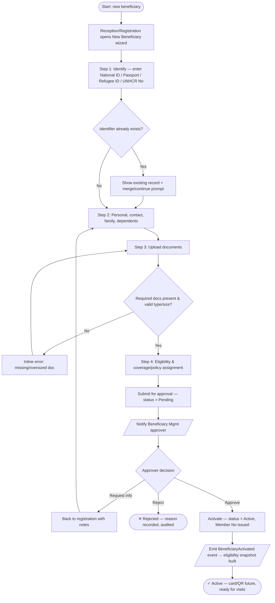
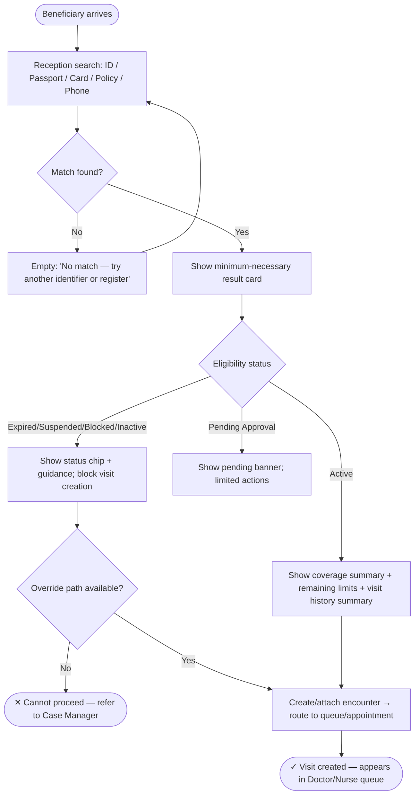
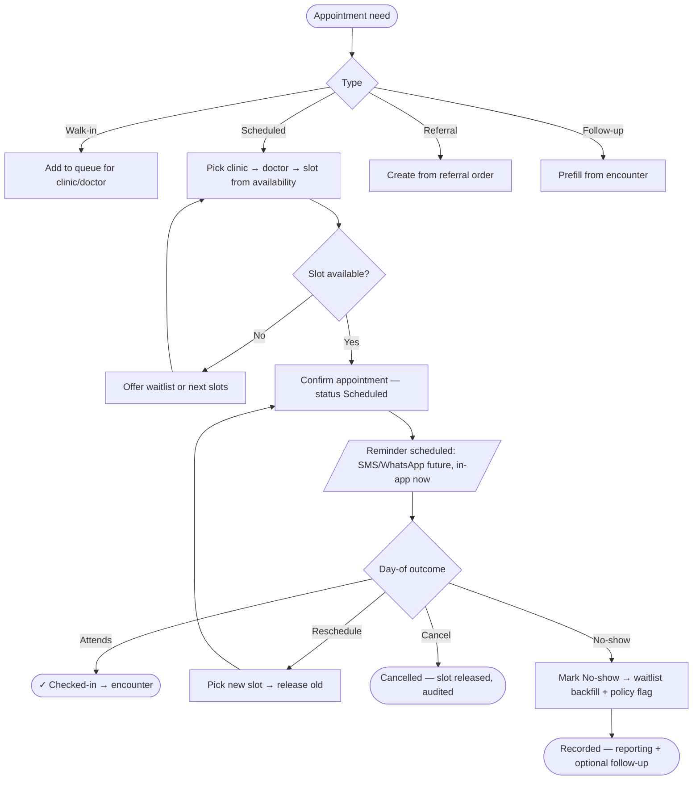
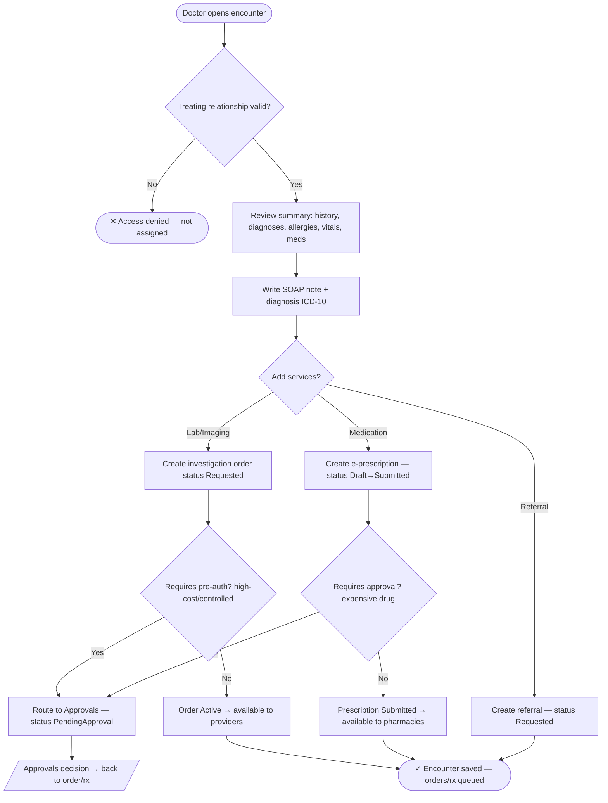
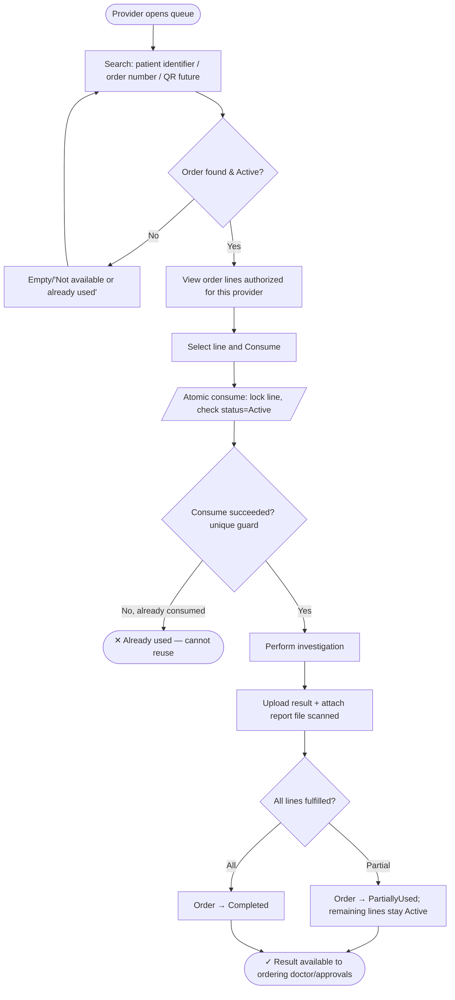
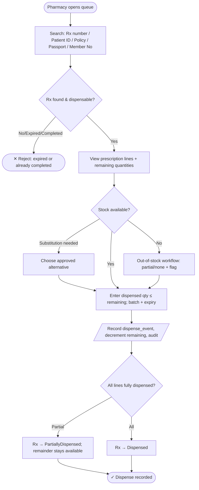
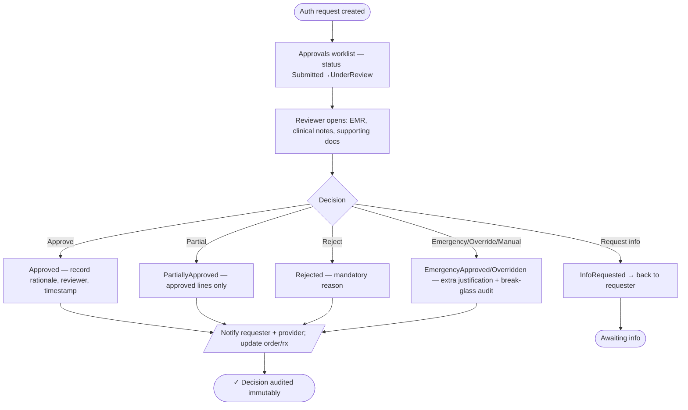
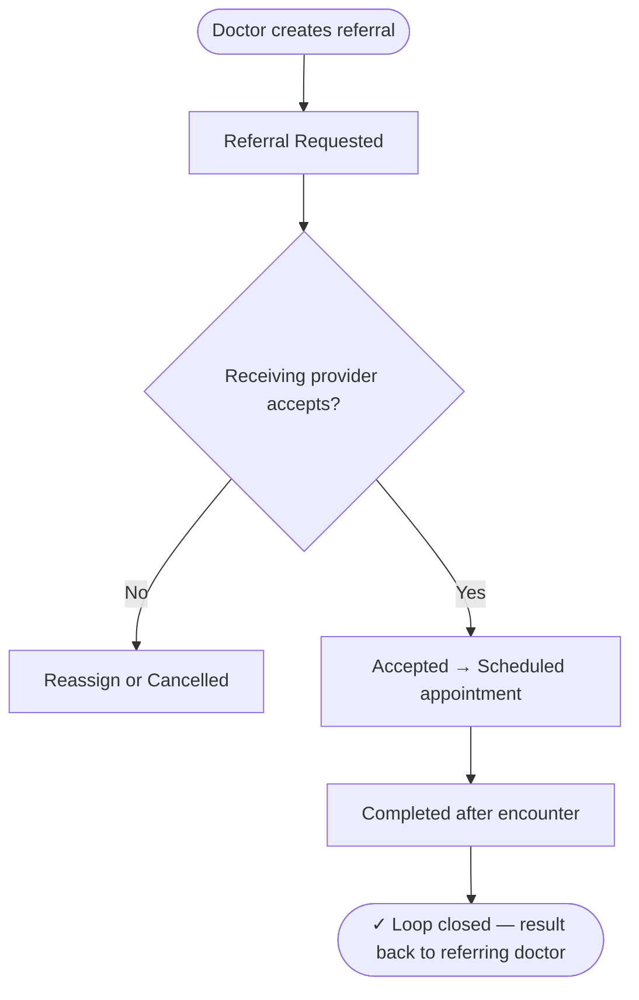

# 13 — UX Flows

> Back to [00-README-INDEX.md](00-README-INDEX.md) · [0A-DESIGN-FOUNDATIONS.md](0A-DESIGN-FOUNDATIONS.md)
> Siblings: [12-ui-wireframes.md](12-ui-wireframes.md) · [14-navigation-structure.md](14-navigation-structure.md) · [05-business-process-maps.md](05-business-process-maps.md) · [23-state-machines.md](23-state-machines.md)

Task-level UX flows for the primary journeys, expressed as Mermaid flowcharts. Each flow shows the **happy path plus error/edge branches and empty states**, and maps to the screens in [12-ui-wireframes.md](12-ui-wireframes.md) and the lifecycles in [23-state-machines.md](23-state-machines.md). Decision diamonds are labelled with the guard; terminal error states are marked `✕`, success `✓`.

Legend: rounded = screen/step · diamond = decision · `[/.../]` = system/async action · `✕` danger terminal · `✓` success terminal.

---

## 1. Register & activate a beneficiary (Phase 1)

Empty state: wizard step with prefilled defaults when returning. All steps keyboard-navigable; errors summarized at top (`role="alert"`) and inline. See [US-001..US-004] in [32-user-stories.md](32-user-stories.md).

---

## 2. Reception eligibility check → visit (Phase 2 → 3)

Reception **cannot see EMR** (min-necessary; [11-permission-matrix.md](11-permission-matrix.md)). Result card exposes only eligibility, coverage, remaining limits, and a visit-history *summary*.

---

## 3. Appointment: book / reschedule / no-show (Phase 3)

---

## 4. Consultation → orders & prescriptions (Phase 4)

Drug-interaction/allergy alerts (future PBM rules) surface at prescription creation. See [23-state-machines.md](23-state-machines.md).

---

## 5. Lab/Imaging: consume order & upload result (Phase 5)

Labs/imaging **cannot see prescriptions**. The consume step is idempotent and duplicate-proof ([0A §7](0A-DESIGN-FOUNDATIONS.md), [24-sequence-diagrams.md](24-sequence-diagrams.md)).

---

## 6. Pharmacy: partial dispense & substitution (Phase 6)

Pharmacy **cannot see investigation results**. Batch/expiry captured; expired-drug or completed-Rx dispensing rejected.

---

## 7. Medical approval: request → decision (Phase 7)

Manual authorization allows the approval team to search a member directly and create an authorization without a provider submission. Every decision records reviewer, timestamp, decision, rationale, and rejection reason ([19-audit-strategy.md](19-audit-strategy.md)).

---

## 8. Referral (cross-phase)

---

### Cross-references
- Screens: [12-ui-wireframes.md](12-ui-wireframes.md) · Navigation: [14-navigation-structure.md](14-navigation-structure.md)
- Process detail: [05-business-process-maps.md](05-business-process-maps.md) · [06-bpmn-diagrams.md](06-bpmn-diagrams.md)
- Lifecycles: [23-state-machines.md](23-state-machines.md) · Interactions: [24-sequence-diagrams.md](24-sequence-diagrams.md)
- Stories: [32-user-stories.md](32-user-stories.md)
