# 14 — Navigation Structure

> Back to [00-README-INDEX.md](00-README-INDEX.md) · [0A-DESIGN-FOUNDATIONS.md](0A-DESIGN-FOUNDATIONS.md)
> Siblings: [09-information-architecture.md](09-information-architecture.md) · [12-ui-wireframes.md](12-ui-wireframes.md) · [13-ux-flows.md](13-ux-flows.md) · [10-role-matrix.md](10-role-matrix.md)

Navigation model for the multi-portal platform. Each role gets a **distinct portal** with a role-aware menu; navigation is generated from the user's effective permissions ([11-permission-matrix.md](11-permission-matrix.md)) so a user never sees a route they cannot use. All navigation is keyboard-operable and mirrors for Arabic RTL.

---

## 1. Global navigation shell (all portals)

```
┌───────────────────────────────────────────────────────────────┐
│ [≡] Mersal HBMP  ▸ breadcrumb  🏢 Maadi ▾       🔎 search  🔔  ⚙ ▾ │  ← top bar
├──────────┬────────────────────────────────────────────────────┤
│ PRIMARY  │  CONTENT AREA                                       │
│ NAV      │  (page header + contextual action bar)              │
│ (role-   │                                                     │
│  aware)  │                                                     │
└──────────┴────────────────────────────────────────────────────┘
```

Shared shell elements: skip-to-content link, global search (scoped to what the role may find), **branch switcher / branch-context indicator**, notifications bell, user menu (profile, language EN/AR toggle, theme, sign-out), environment badge (non-prod). Primary nav collapses to a hamburger drawer on tablet/mobile. **⟵RTL:** the entire shell mirrors — primary nav moves to the right, breadcrumb reverses.

### 1.1 Branch switcher (app bar) — [37-branch-scoping-and-clinical-sensitivity.md](37-branch-scoping-and-clinical-sensitivity.md)

Mersal operates **six branches** (Aswan, Alexandria, 6th of October, Maadi, Dokki, Nasr City). The app bar always answers the question *"which site am I working in?"* — how it does so depends on the role's **scope mode** ([10 §2](10-role-matrix.md)).

- **BranchScoped roles** (Reception, Appointment Coordinator, Nurse, Doctor, Branch/Clinic Manager) get a **switcher**: a labelled control showing the **active branch** by name, opening a menu of **only the branches the user is permitted to work in** (Home ∪ Additional). The **Home branch is visually marked** (badge + text "Home", never colour alone) and is the default on sign-in.
  - **Keyboard-operable** as a standard menu button: `Enter`/`Space` opens, arrow keys move, `Esc` closes and returns focus to the trigger; the trigger is in the normal tab order and carries `aria-haspopup="menu"` + `aria-expanded`.
  - Switching **announces the new context via `aria-live="polite"`** ("Active branch: Maadi") so the change is not silent for screen-reader users, and re-fetches the current view rather than leaving stale rows on screen.
  - The switch is **audited** (`ActiveBranchSwitched`: actor, from, to, correlation id). The picker is a **hint only** — the server re-validates the active branch on every request; an unpermitted branch yields a `403` page, never a silently empty list.
  - **⟵RTL:** the control mirrors to the opposite end of the app bar with the menu aligned accordingly; branch names render in the active language (AR/EN).
- **MemberScoped roles** (Medical Approval, Medical Director, Case Manager, Finance, Claims, Network Team, Org/Super Admin, managers/reporting, and the **Call Centre** — a central hotline, §2.13) see an **"All branches" indicator** in the same slot, with an **optional branch filter** in the page toolbar. This is a **convenience, never a restriction** — clearing it always returns the full, cross-branch view, and no member-centred worklist is ever branch-gated.
- **ProviderScoped roles** (external labs, imaging centres, pharmacies, Provider Admin) see **no branch control at all** — the Mersal branch dimension does not apply to a contracted provider's queue.
- **Every appointment, queue/day-list, encounter and order screen displays the active branch** in its page header (and on printed/exported day-lists), so a user can never mistake which site the list belongs to. Branch appears as an explicit labelled field, not merely as a colour or an icon.

**Navigation principles**
- Max 7±2 primary items per portal; overflow into a "More" group.
- 3-level depth maximum (Portal → Section → Page); deeper content uses tabs within a page, not new nav levels.
- Contextual actions (Consume, Dispense, Approve) live in the page action bar, never in global nav.
- Every page reachable by keyboard within a predictable tab order; landmark roles (`banner`, `navigation`, `main`, `contentinfo`).

---

## 2. Portal navigation trees

### 2.1 Reception portal
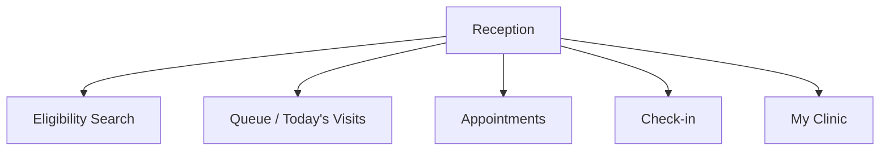
No EMR, no diagnoses, no financials in nav (min-necessary). **BranchScoped:** every list here is the **active branch only** — the branch name is shown in the page header of the Queue, Appointments and Check-in screens, and the switcher in the app bar is limited to the user's permitted branches.

### 2.2 Doctor / Nurse portal
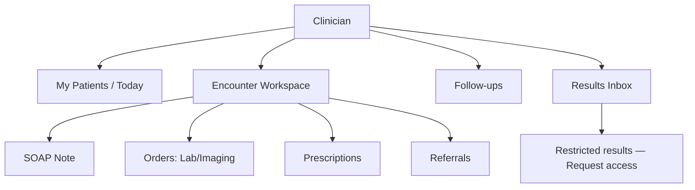
Nurse variant hides prescribing; adds Vitals & Triage. **BranchScoped for operational lists** — "My Patients / Today" and the branch order lists follow the active branch (a doctor may only be scheduled at a branch they are assigned to); the patient's clinical record itself is not branch-partitioned once the treating relationship holds.

**Restricted results.** A result classified `Sensitive`/`HighlySensitive` renders in the Results Inbox and the encounter timeline in a **locked state** — category + date + a `RESTRICTED` chip using four cues (neutral hue + lock icon + ghost pill + text), never colour alone — with a **"Request access"** action that opens the justification form (**purpose code + free-text justification, both mandatory**). The **authoring/ordering doctor** sees the content directly and has **no** such affordance; instead their inbox carries a **"Release requests"** item for requests awaiting their decision (Approve with a TTL picker · Deny with a mandatory reason · Request info). Outcomes are announced via `aria-live`, and access granted under a request is time-boxed, single-result and separately audited on every read.

### 2.3 Laboratory / Imaging portal
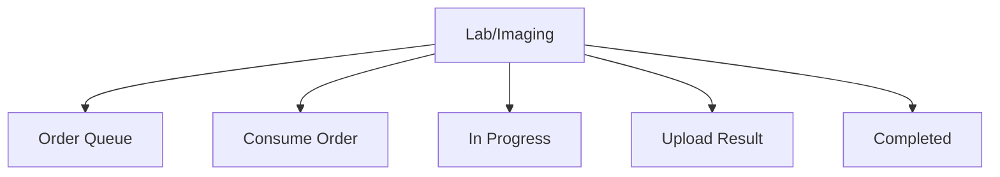
No prescription routes exposed.

### 2.4 Pharmacy portal
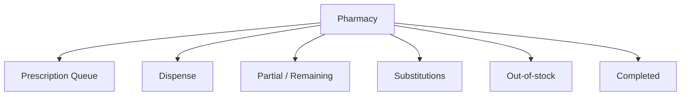
No investigation-result routes exposed.

### 2.5 Medical Approval portal
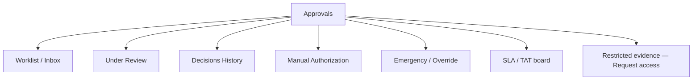
**MemberScoped:** the worklist spans **all branches** by default; branch is a filter chip, never a restriction. Where a case's clinical evidence includes a **sensitive** result, the evidence panel shows **existence metadata only** (category, date, status, ordering branch, `RESTRICTED` chip) — this deliberately overrides the approval team's standing EMR read — with a **"Request access"** action that opens the same mandatory purpose + justification form. The request routes to the **authoring doctor** and may also be decided by the **Medical Director**; a granted read is time-boxed, single-result and separately audited. Adjudication is expected to proceed on existence + the requesting doctor's clinical justification wherever possible.

### 2.6 Beneficiary Management / Registration portal
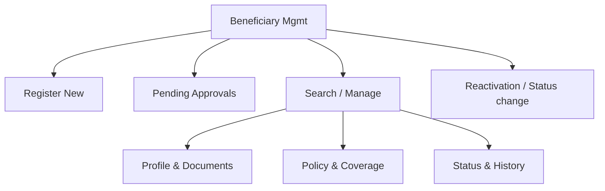

### 2.7 Case Manager portal
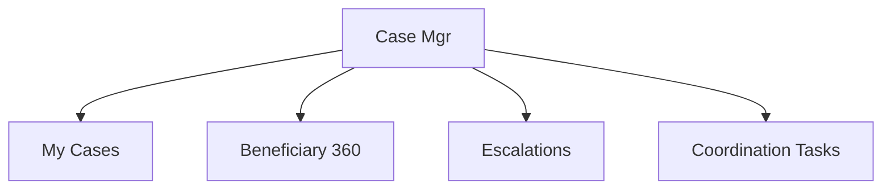
**MemberScoped** — a case load follows people across branches, so no branch gate applies; branch is a filter only. Sensitive results appear on the Beneficiary 360 as **existence-only** with the same **"Request access"** affordance.

### 2.8 Finance portal
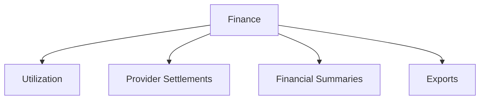
Nav exposes no diagnosis/clinical routes (Finance cannot view diagnoses).

### 2.9 Network / Provider Admin portal
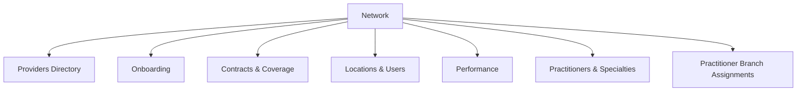
**MemberScoped.** The Network Team maintains the **practitioner** register (licence + expiry), the **specialty** reference list (one primary per practitioner) and **practitioner↔branch assignments**. Mersal **branches** are internal facilities administered here and by Org Admin — they are a separate list from the contracted *Providers Directory* / *Locations*, and no provider-side user sees them.

### 2.10 Org Admin / Super Admin portal
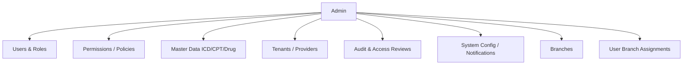
**MemberScoped.** *User Branch Assignments* manages each user's **one Home + optional Additional** branches with validity windows. The UI **blocks a user from assigning a branch to themselves** (the action is disabled with an explanatory message, and denied server-side); every change is audited and revocation takes effect immediately. Master Data also hosts **Examination Types** with their `sensitivity_level` / `sensitive_category` classification, editable only under clinical governance (Medical Director + DPO ratified).

### 2.11 Medical Director portal
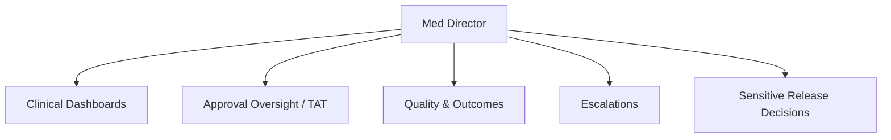
**MemberScoped.** *Sensitive Release Decisions* is the Director's queue of `report_access_request`s awaiting a decision — used when the **authoring doctor is unavailable**. Each row shows requester, role, purpose code, justification and requested duration, with **Approve (TTL picker) · Deny (reason mandatory) · Request info**. A Director decision is flagged `MedicalDirector` and **extra-audited**; the Director is also notified on every break-glass read of a sensitive result and can **revoke** any grant. Deciding release is **not** a standing read — absent a grant the Director sees the same existence-only metadata as the approval team.

### 2.12 Branch / Clinic Manager portal
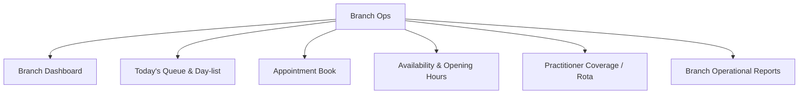
**BranchScoped** — every screen shows the **active branch only**, chosen from the manager's assigned branches via the app-bar switcher; a request for an unassigned branch returns the 403 page, never an empty list. **No EMR, no diagnoses, no result values** in nav (min-necessary, as for Reception), and **no ability to grant branch assignments** — coverage changes are *requested* from Org Admin / Network Team.

### 2.13 Call Centre portal
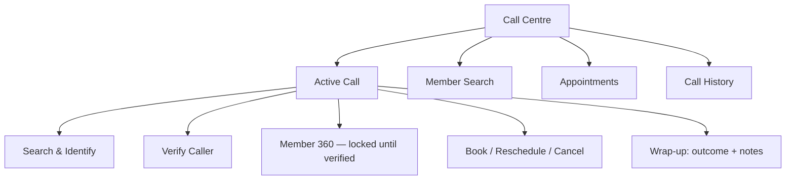
**Persistent call bar.** The workspace is *call-shaped*: a call bar is pinned above the content area for the whole session with **Start call / Close call**, an **elapsed timer**, and a **reason-code** select (Book · Reschedule · Cancel · Appointment enquiry · Eligibility enquiry · Update contact · Complaint · Other). It is a landmark region in the tab order, announces the call state via `aria-live="polite"` ("Call started", "Call closed"), and stays visible while the agent moves between Search, the 360 and Appointments — every action taken is stamped with the interaction's `call_ref`. Closing the call clears the member context and **expires the verification**.

**Locked / unverified state.** Everything member-specific starts **locked**. Pre-verification the agent sees only *match / no match*, the display name, and **which identifier types to challenge on**; the 360, contacts, coverage and appointment routes render a **"Not yet verified"** locked state using four cues (neutral hue + lock icon + ghost pill + text — never colour alone), and the underlying data is **absent from the payload**, not merely CSS-hidden. Verification is a checklist of identifier **types** the agent confirms verbally — **≥2 required**, explicit Pass/Fail — and the UI **never displays a stored identifier value** for the agent to read out: the caller states it, the agent confirms it. A Pass unlocks the 360 and is announced via `aria-live`; a Fail shows guidance, keeps everything locked, and is recorded.

**MemberScoped — a central hotline.** The app bar shows the **"All branches" indicator**, *not* a branch switcher: the agent searches, views and books across all six branches. Branch and specialty are **selectors** in the slot picker (with next-available and the existing waitlist option), never restrictions, and each appointment row carries its branch name explicitly. Cancelling from a call requires a **reason code**; booking is never optimistic — the server's no-double-book result is authoritative and a "slot just taken" `409` renders as a clear, recoverable state.

**Min-necessary nav.** No EMR, no diagnoses, no results, no prescriptions and no examination detail anywhere in this portal's routes — appointment **type, time, branch, doctor name and specialty** only. *Call History* is the agent's own calls; a **Call Centre Supervisor** additionally sees the team's history and a KPI board (aggregate, PHI-free).

---

## 3. Breadcrumbs & deep links
- Breadcrumb pattern: `Portal ▸ Section ▸ Record` (e.g., `Approvals ▸ Worklist ▸ AUTH-2026-4F7K`).
- Every record has a stable deep link (`/approvals/authorizations/{id}`); opening a deep link the role cannot access returns a 403 page with a "request access / contact admin" affordance — never a blank screen.
- Contextual "back to list" preserves filters/scroll (state retained in URL query params).
- **Branch-scoped deep links** carry the record's branch: opening one for a branch outside the user's permitted set returns the **403 page** (with "request access / contact admin"), and opening one for a *permitted but not active* branch prompts to **switch the active branch** rather than silently showing an empty record.
- A deep link to a **restricted result** resolves to its existence-only view with the **"Request access"** affordance — never a blank screen, never the content.

---

## 4. Keyboard navigation map

| Key | Action |
|-----|--------|
| `Tab` / `Shift+Tab` | Move through interactive elements in logical order |
| `/` | Focus global search |
| `g` then `q` | Go to primary queue/worklist (per portal) |
| `g` then `h` | Go to home/dashboard |
| `g` then `b` | Open the **branch switcher** (BranchScoped roles); arrows move, `Enter` switches, `Esc` cancels |
| `Enter` | Activate focused row/primary action |
| `Esc` | Close dialog/menu, return focus to trigger |
| `Alt+←` | Back (respects breadcrumb) |
| Arrow keys | Move within lists, calendars, menus |

Focus is trapped inside modals and returned to the invoking control on close (WCAG 2.4.3). Roving tabindex for grids/queues.

---

## 5. Mobile / tablet navigation
- Primary nav → bottom tab bar (≤5 items) on mobile; hamburger drawer for overflow and secondary sections.
- Action bar collapses into a sticky bottom action button for the page's primary action (Consume / Dispense / Approve).
- Search becomes a full-screen overlay. Tables become stacked cards. Targets remain ≥44px.
- The **branch switcher** collapses to a compact chip in the mobile app bar (branch code + chevron, ≥44px) opening a full-screen sheet of permitted branches with the Home branch marked; the active branch stays visible in every queue/appointment page header.
- **⟵RTL:** tab order and drawer side mirror.

---

### Cross-references
- Portals & zoning: [09-information-architecture.md](09-information-architecture.md) · Screens: [12-ui-wireframes.md](12-ui-wireframes.md)
- Permission-driven menu generation: [11-permission-matrix.md](11-permission-matrix.md) · Roles: [10-role-matrix.md](10-role-matrix.md)
- Accessibility of navigation: [21-accessibility-checklist.md](21-accessibility-checklist.md)
- Branch switcher, scope modes, restricted-result locked state & release workflow: [37-branch-scoping-and-clinical-sensitivity.md](37-branch-scoping-and-clinical-sensitivity.md)

---

## Phase 19 portals

### Policy administration (`/policy/*`) — Policy Administrator
`payers · plans & versions · policies · members · groups · utilization · analytics · bulk & imports · network tiers (read-only)`

**No clinical route exists in this portal at all** — the absence is the control, not a hidden nav item. The
plan-version editor is a **two-level grid**: one row per benefit category, each expanding into a cost-share
matrix with a column per Active tier. An Active version renders read-only with an explicit
"immutable — amend to change" affordance driven by the server's `editable` flag.

### Beneficiary Management (`/beneficiaries/*`) — additions
`+ members · groups · utilization · analytics · bulk & imports`

The membership half of the same screens the Policy Administrator sees — **the same components**, so a second
implementation cannot become a second answer to "may this officer see the money". This portal has **no**
`payers` or `plans` section: the person enrolling a member does not decide what the plan pays for.

### Network Team (`/network/*`) — addition
`+ network tiers` (**write**). The same screen policy administration reads. Write affordances are **absent**
for a policy administrator rather than present-and-refused (ADR-0019).

### Finance (`/finance/*`) — addition
`+ analytics`. The financial and network views are the money questions this role exists to answer; the server
gates those two views on the financial reporting zone, so the section is visible and the views a caller may
not read are refused by the service rather than hidden by a nav rule the service does not know about.
