# 14 — Navigation Structure

> Back to [00-README-INDEX.md](00-README-INDEX.md) · [0A-DESIGN-FOUNDATIONS.md](0A-DESIGN-FOUNDATIONS.md)
> Siblings: [09-information-architecture.md](09-information-architecture.md) · [12-ui-wireframes.md](12-ui-wireframes.md) · [13-ux-flows.md](13-ux-flows.md) · [10-role-matrix.md](10-role-matrix.md)

Navigation model for the multi-portal platform. Each role gets a **distinct portal** with a role-aware menu; navigation is generated from the user's effective permissions ([11-permission-matrix.md](11-permission-matrix.md)) so a user never sees a route they cannot use. All navigation is keyboard-operable and mirrors for Arabic RTL.

---

## 1. Global navigation shell (all portals)

```
┌───────────────────────────────────────────────────────────────┐
│ [≡] Mersal HBMP   ▸ breadcrumb           🔎 global search  🔔  ⚙ ▾ │  ← top bar
├──────────┬────────────────────────────────────────────────────┤
│ PRIMARY  │  CONTENT AREA                                       │
│ NAV      │  (page header + contextual action bar)              │
│ (role-   │                                                     │
│  aware)  │                                                     │
└──────────┴────────────────────────────────────────────────────┘
```

Shared shell elements: skip-to-content link, global search (scoped to what the role may find), notifications bell, user menu (profile, language EN/AR toggle, theme, sign-out), environment badge (non-prod). Primary nav collapses to a hamburger drawer on tablet/mobile. **⟵RTL:** the entire shell mirrors — primary nav moves to the right, breadcrumb reverses.

**Navigation principles**
- Max 7±2 primary items per portal; overflow into a "More" group.
- 3-level depth maximum (Portal → Section → Page); deeper content uses tabs within a page, not new nav levels.
- Contextual actions (Consume, Dispense, Approve) live in the page action bar, never in global nav.
- Every page reachable by keyboard within a predictable tab order; landmark roles (`banner`, `navigation`, `main`, `contentinfo`).

---

## 2. Portal navigation trees

### 2.1 Reception portal
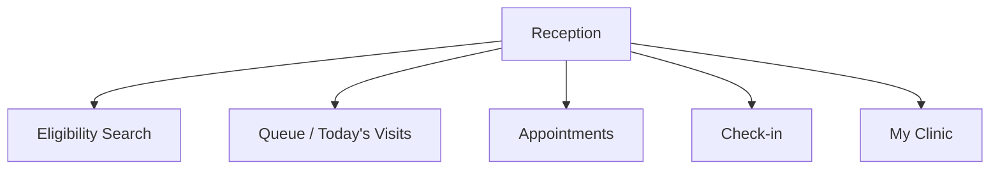
No EMR, no diagnoses, no financials in nav (min-necessary).

### 2.2 Doctor / Nurse portal
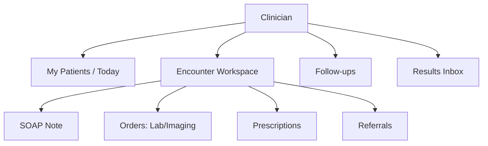
Nurse variant hides prescribing; adds Vitals & Triage.

### 2.3 Laboratory / Imaging portal
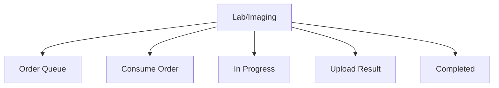
No prescription routes exposed.

### 2.4 Pharmacy portal
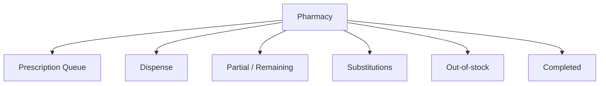
No investigation-result routes exposed.

### 2.5 Medical Approval portal
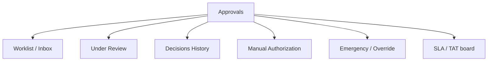

### 2.6 Beneficiary Management / Registration portal
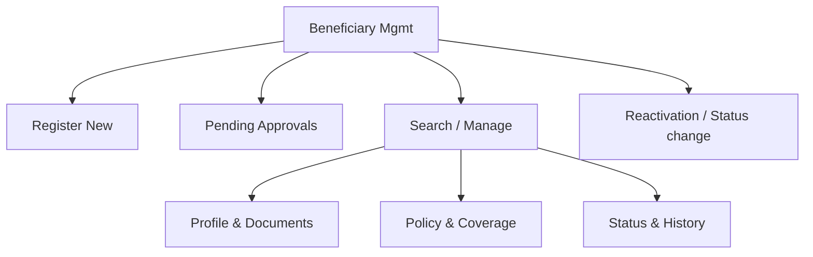

### 2.7 Case Manager portal
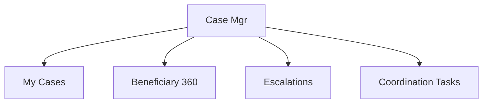

### 2.8 Finance portal
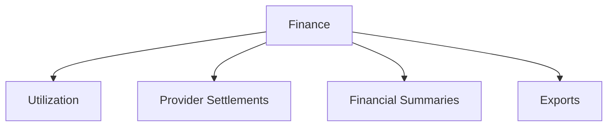
Nav exposes no diagnosis/clinical routes (Finance cannot view diagnoses).

### 2.9 Network / Provider Admin portal
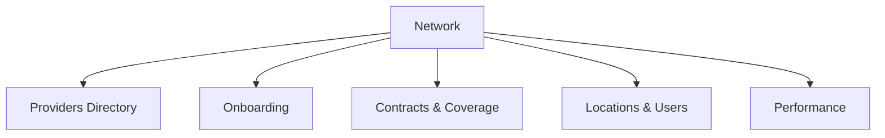

### 2.10 Org Admin / Super Admin portal
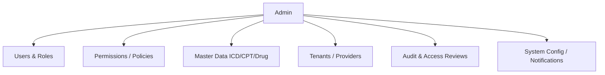

### 2.11 Medical Director portal
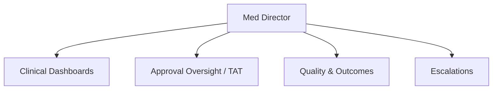

---

## 3. Breadcrumbs & deep links
- Breadcrumb pattern: `Portal ▸ Section ▸ Record` (e.g., `Approvals ▸ Worklist ▸ AUTH-2026-4F7K`).
- Every record has a stable deep link (`/approvals/authorizations/{id}`); opening a deep link the role cannot access returns a 403 page with a "request access / contact admin" affordance — never a blank screen.
- Contextual "back to list" preserves filters/scroll (state retained in URL query params).

---

## 4. Keyboard navigation map

| Key | Action |
|-----|--------|
| `Tab` / `Shift+Tab` | Move through interactive elements in logical order |
| `/` | Focus global search |
| `g` then `q` | Go to primary queue/worklist (per portal) |
| `g` then `h` | Go to home/dashboard |
| `Enter` | Activate focused row/primary action |
| `Esc` | Close dialog/menu, return focus to trigger |
| `Alt+←` | Back (respects breadcrumb) |
| Arrow keys | Move within lists, calendars, menus |

Focus is trapped inside modals and returned to the invoking control on close (WCAG 2.4.3). Roving tabindex for grids/queues.

---

## 5. Mobile / tablet navigation
- Primary nav → bottom tab bar (≤5 items) on mobile; hamburger drawer for overflow and secondary sections.
- Action bar collapses into a sticky bottom action button for the page's primary action (Consume / Dispense / Approve).
- Search becomes a full-screen overlay. Tables become stacked cards. Targets remain ≥44px.
- **⟵RTL:** tab order and drawer side mirror.

---

### Cross-references
- Portals & zoning: [09-information-architecture.md](09-information-architecture.md) · Screens: [12-ui-wireframes.md](12-ui-wireframes.md)
- Permission-driven menu generation: [11-permission-matrix.md](11-permission-matrix.md) · Roles: [10-role-matrix.md](10-role-matrix.md)
- Accessibility of navigation: [21-accessibility-checklist.md](21-accessibility-checklist.md)
