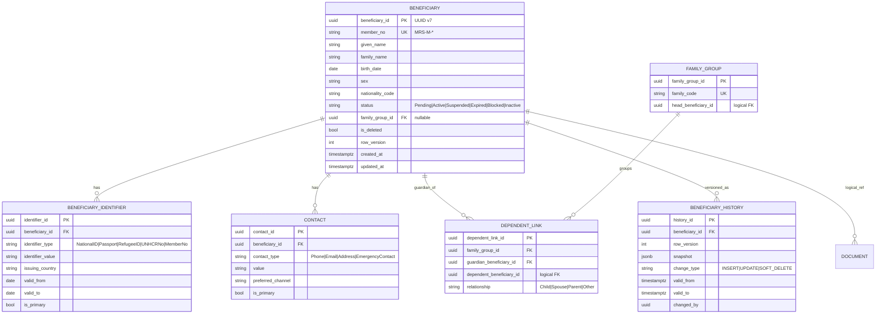
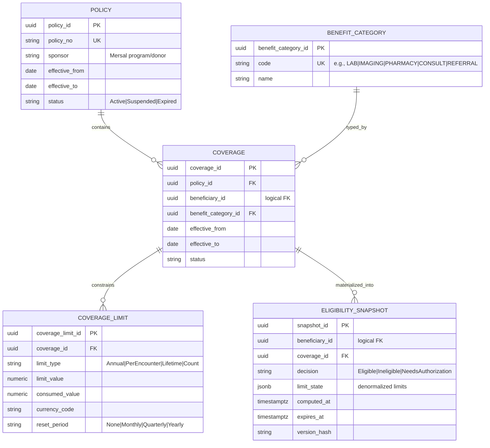
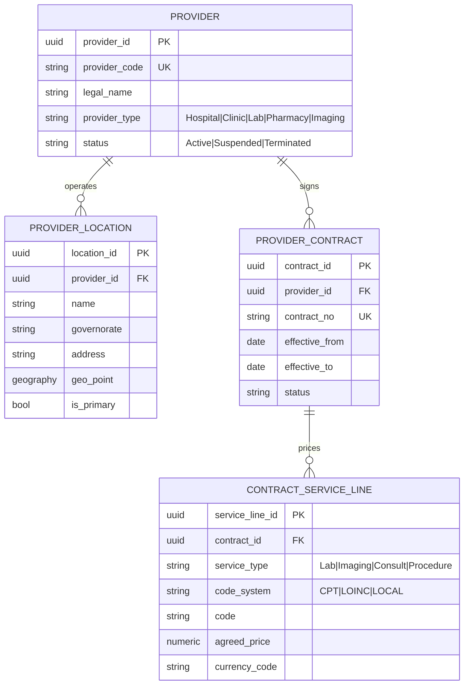
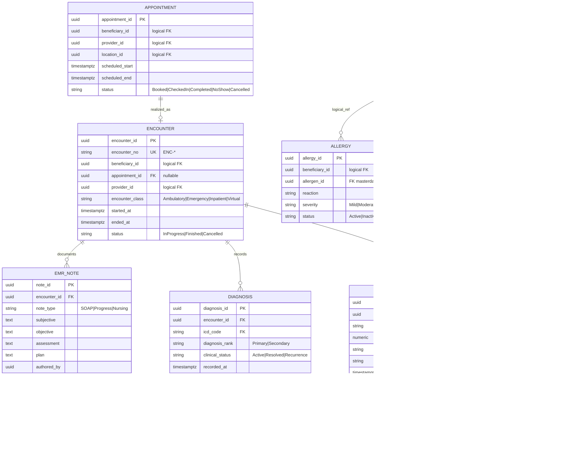
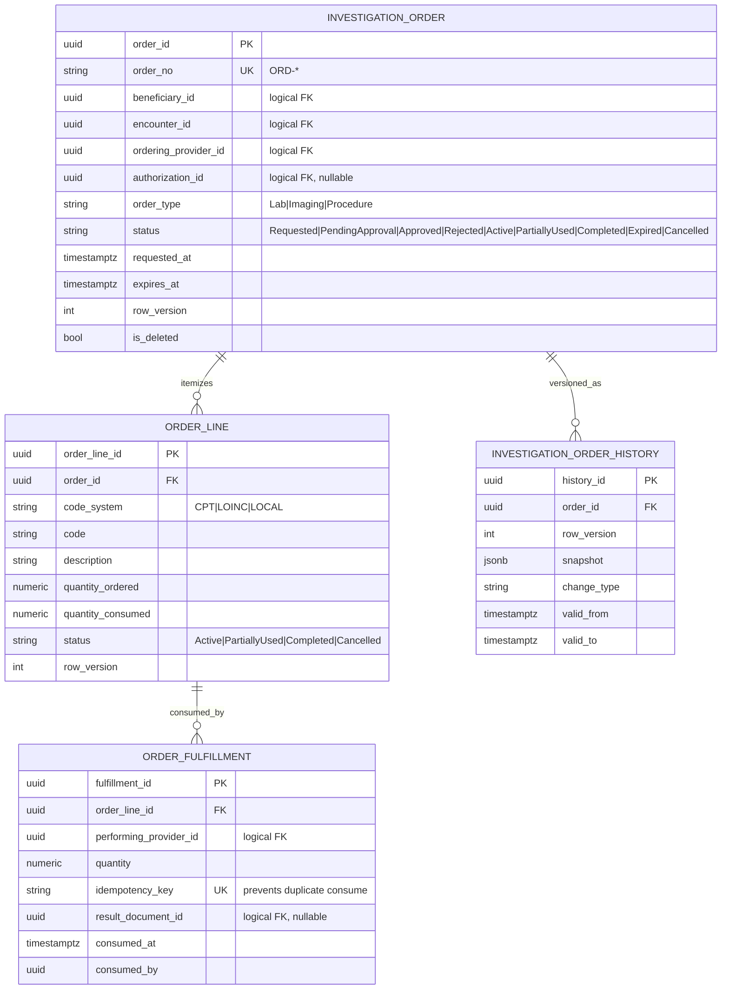
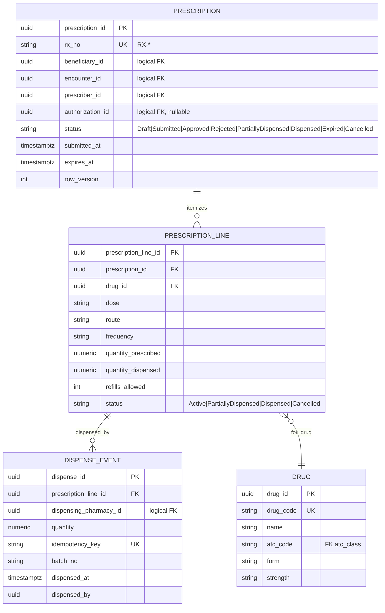
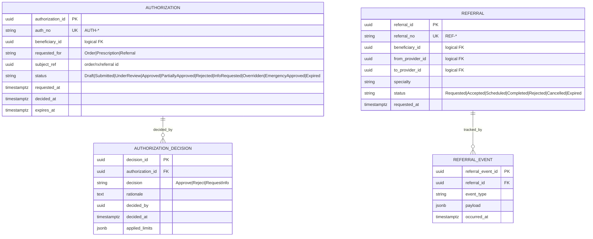
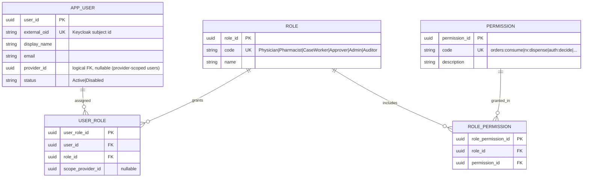
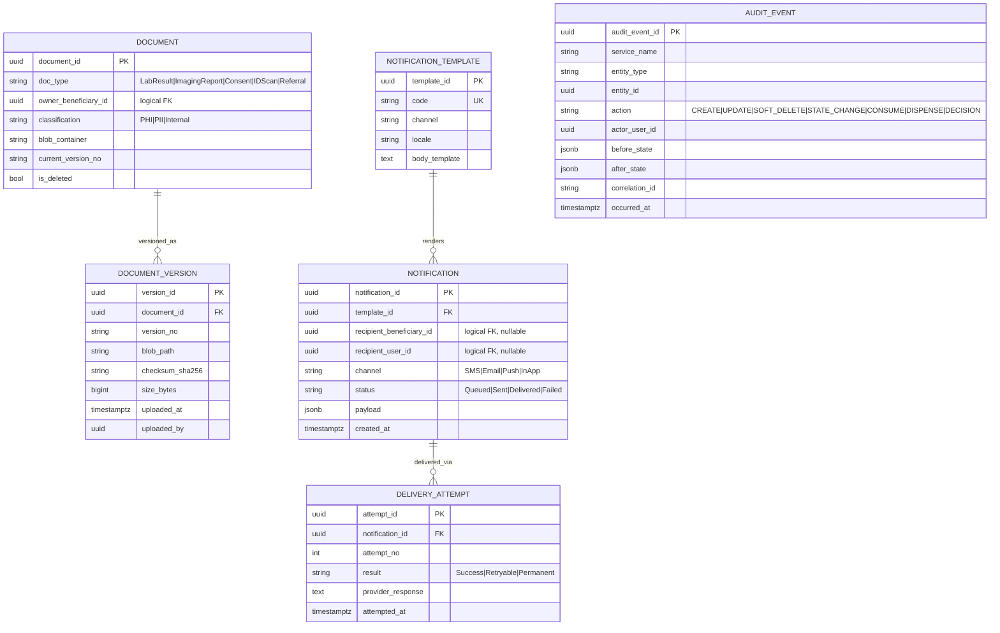
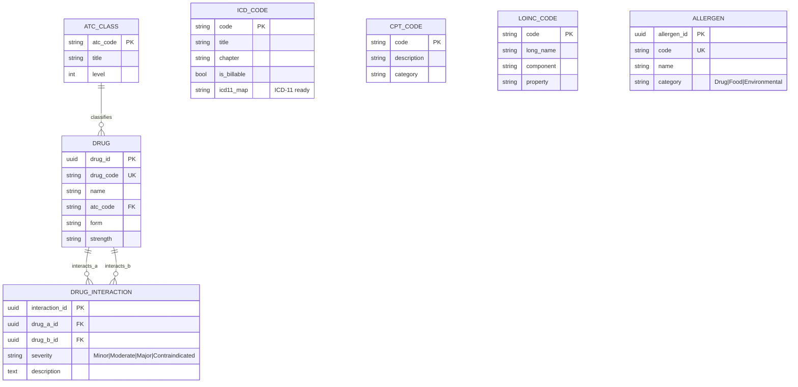

# 15 — Database ERD (Logical Data Model)

> Part of the **Mersal Healthcare Benefit Management Platform (HBMP)** design workspace.
> Up: [00-README-INDEX.md](00-README-INDEX.md) · Foundations: [0A-DESIGN-FOUNDATIONS.md](0A-DESIGN-FOUNDATIONS.md)
> Siblings: [16-service-architecture.md](16-service-architecture.md) · [17-api-specifications.md](17-api-specifications.md) · [22-data-dictionary.md](22-data-dictionary.md) · [23-state-machines.md](23-state-machines.md) · [18-security-model.md](18-security-model.md)

---

## 1. Purpose & Scope

This document defines the **full logical data model** for HBMP. It is the authoritative reference for:

- Entities, attributes (conceptual), keys, and relationships/cardinalities.
- Normalization decisions (target **3NF**, with pragmatic denormalization for read models).
- Indexing strategy for the hot paths (eligibility check, order-consume, dispense).
- **Soft-delete + history** strategy for auditability.
- Mapping of tables to **service-owned PostgreSQL schemas** (schema/DB-per-service).

The physical column-level detail (types, nullability, validation, PII/PHI classification) lives in [22-data-dictionary.md](22-data-dictionary.md). State transitions live in [23-state-machines.md](23-state-machines.md). This file focuses on **structure and relationships**.

> **Modeling principle.** Each microservice **owns its schema**. Cross-service references are stored as *identifiers/values* (e.g., `beneficiary_id UUID`), **not** as enforced foreign keys across service boundaries. FK constraints shown in the diagrams are enforced **only within a single service schema**. Cross-schema links are drawn as dashed/logical relationships and are maintained via events + eventual consistency (see [16-service-architecture.md](16-service-architecture.md)).

---

## 2. Schema Ownership Map

| Schema (DB/service) | Owning service | Core entities |
|---|---|---|
| `identity` | identity/auth | `app_user`, `role`, `permission`, `role_permission`, `user_role` |
| `patient` | patient-service | `beneficiary`, `beneficiary_identifier`, `contact`, `family_group`, `dependent_link`, `beneficiary_history` |
| `policy` | policy-service | `policy`, `coverage`, `coverage_limit`, `benefit_category` |
| `eligibility` | eligibility-service | `eligibility_snapshot`, `eligibility_rule` (read-optimized) |
| `provider` | provider-service | `provider`, `provider_location`, `provider_contract`, `contract_service_line` |
| `emr` | emr-service | `appointment`, `encounter`, `emr_note`, `diagnosis`, `vital`, `allergy`, `medication_history` |
| `orders` | orders-service | `investigation_order`, `order_line`, `order_fulfillment` |
| `pharmacy` | pharmacy-service | `prescription`, `prescription_line`, `dispense_event` |
| `approvals` | approvals-service | `authorization`, `authorization_decision`, `referral`, `referral_event` |
| `notification` | notification-service | `notification`, `notification_template`, `delivery_attempt` |
| `masterdata` | reference (shared read) | `icd_code`, `cpt_code`, `loinc_code`, `drug`, `atc_class`, `drug_interaction`, `allergen` |
| `audit` | audit-service | `audit_event` (append-only, per-service partitions) |
| `document` | document-service | `document`, `document_version` (metadata; blobs in Object Storage) |

> **History tables** live in the same schema as their base table, suffixed `_history` (e.g., `patient.beneficiary_history`). They are written by triggers/outbox, never by application logic directly.

---

## 3. Conventions Used in the ERDs

- **PK** is a surrogate `*_id` (UUID **v7** for time-orderable clustering) unless the entity is pure reference data keyed by a natural code (`icd_code.code`).
- **Business keys** are stored as unique, human-facing identifiers: `MRS-M-*` (member), `ENC-*`, `ORD-*`, `RX-*`, `AUTH-*`, `REF-*`.
- Every mutable transactional table carries the standard audit columns: `created_at`, `created_by`, `updated_at`, `updated_by`, `row_version` (optimistic concurrency), `is_deleted` (soft delete), `deleted_at`, `deleted_by`.
- Money is `NUMERIC(14,2)` + ISO `currency_code`; quantities `NUMERIC(14,3)`.
- Enumerations are modeled as constrained `TEXT`/`VARCHAR` with `CHECK` + a companion lookup table where operationally useful.

---

## 4. Domain ERD — Patient / Beneficiary

**Notes**

- `BENEFICIARY_IDENTIFIER` is a separate table (not columns on `beneficiary`) to satisfy **3NF** — a beneficiary may hold multiple identifier types over time, each with its own issuing authority and validity window. Uniqueness enforced by `UNIQUE (identifier_type, identifier_value)` (partial, `WHERE is_deleted = false`).
- `CONTACT` is normalized 1:N; `preferred_channel` drives notification routing.
- Guardianship/dependents are modeled via `DEPENDENT_LINK` to support many-to-many family relationships without duplicating beneficiary rows (a person can be both a dependent in one link and a guardian in another).
- **PII/PHI**: nearly every column here is PII; see field-level classification in [22-data-dictionary.md](22-data-dictionary.md). RLS restricts row access by tenant/case-worker assignment.

---

## 5. Domain ERD — Policy / Coverage / Eligibility

**Notes**

- `COVERAGE_LIMIT.consumed_value` is the **authoritative accumulator** for benefit consumption; updates are transactional and serialized (see order-consume saga in [16-service-architecture.md](16-service-architecture.md)).
- `ELIGIBILITY_SNAPSHOT` is a **read-optimized denormalization** of policy + coverage + limits, cached in Valkey and invalidated by policy/consumption events. It intentionally violates strict 3NF for read performance; it is a *derived* materialization, not a source of truth. `version_hash` + `expires_at` guard staleness.

---

## 6. Domain ERD — Provider

**Notes**

- Provider isolation (multi-tenant): all provider-scoped reads are filtered by `provider_id` via RLS using the caller's provider claim (see [18-security-model.md](18-security-model.md)).
- `CONTRACT_SERVICE_LINE` links priced services to standard code systems, enabling automated adjudication.

---

## 7. Domain ERD — EMR / Clinical

**Notes**

- `EMR_NOTE` implements the **SOAP** structure as first-class columns for structured querying and FHIR `Composition`/`ClinicalImpression` alignment.
- `DIAGNOSIS.icd_code` is an intra-schema FK **only if** master data is replicated into the EMR schema; in the canonical model `masterdata` is a separate read-shared schema, so this is a validated logical reference (validated at write via master-data lookup/cache).
- `VITAL.loinc_code` is nullable now, populated as LOINC coding is rolled out ("LOINC-ready").

---

## 8. Domain ERD — Investigation Orders (Core Invariant Domain)

**Invariants enforced structurally + transactionally** (see [23-state-machines.md](23-state-machines.md)):

1. **Atomic + idempotent consume.** Each consume writes exactly one `ORDER_FULFILLMENT` row inside a serializable transaction that also increments `ORDER_LINE.quantity_consumed`. The unique `idempotency_key` guarantees replays are no-ops.
2. **No over-consumption.** `CHECK (quantity_consumed <= quantity_ordered)` on `ORDER_LINE` plus a guarded `UPDATE ... WHERE quantity_consumed + :q <= quantity_ordered` makes duplicate/over usage impossible.
3. **No reuse.** Fulfillment rows are append-only; there is no update path that "returns" quantity.
4. **Partial fulfillment.** `PartiallyUsed` derived when `0 < quantity_consumed < quantity_ordered`.
5. **Full audit.** Every state change emits an `audit_event` and a `_history` row.

**Indexes:** `idx_order_beneficiary (beneficiary_id, status)`, `idx_orderline_order (order_id)`, `uq_fulfillment_idem (idempotency_key)`, `idx_order_expiry (expires_at) WHERE status IN ('Active','PartiallyUsed')` for expiry sweeps.

---

## 9. Domain ERD — Pharmacy / Prescription

**Notes**

- `DISPENSE_EVENT` mirrors `ORDER_FULFILLMENT` exactly: append-only, idempotency-keyed, guarded quantity update, so the **same consume invariants** apply to dispensing.
- Drug interaction / allergy checks run at prescribe time against `masterdata.drug_interaction` and `emr.allergy`.

---

## 10. Domain ERD — Authorizations & Referrals

**Notes**

- `AUTHORIZATION.subject_ref` is a polymorphic logical reference typed by `requested_for`; integrity is maintained by the approvals-service and validated via events, not cross-schema FK.
- `AUTHORIZATION_DECISION` is append-only; the current decision is the latest by `decided_at`. This preserves the full decision trail for audit/appeals.

---

## 11. Domain ERD — Identity / RBAC

**Notes**

- Authentication delegates to **Keycloak**; `app_user.external_oid` links the local record to the IdP subject. Local RBAC tables drive fine-grained permissions/scopes mapped to OAuth2 scopes in [17-api-specifications.md](17-api-specifications.md).

---

## 12. Cross-Cutting — Documents, Notifications, Audit

**Notes**

- **Blobs never live in the RDBMS.** `DOCUMENT`/`DOCUMENT_VERSION` hold metadata + checksum + object path; content is in MinIO (S3-compatible, SSE). `checksum_sha256` supports integrity verification.
- `AUDIT_EVENT` is **append-only**, range-partitioned by month, one logical stream fed by every service's outbox. `correlation_id` ties a business flow (e.g., order → approval → consume) across services.

---

## 13. Master Data ERD

**Notes**

- Master data is **versioned and read-mostly**; distributed to services via cache + OpenSearch index. `icd_code.icd11_map` future-proofs the ICD-10 → ICD-11 migration.

---

## 14. Normalization Rationale (to 3NF)

| Decision | Normal form driver |
|---|---|
| Identifiers split into `beneficiary_identifier` | Removes repeating groups (multiple ID types) → **1NF/2NF**. |
| Contacts, allergies, vitals as child tables | Each depends on the full PK of its parent, not partial → **2NF**. |
| `benefit_category` extracted from `coverage` | Category name/attributes depend on category, not coverage → **3NF** (no transitive dependency). |
| `atc_class` extracted from `drug` | ATC title depends on `atc_code`, not `drug_id` → **3NF**. |
| Decisions/fulfillments/dispense as append-only child tables | Preserves history without update anomalies. |
| `eligibility_snapshot`, `coverage_limit.consumed_value` | **Deliberate denormalization** for read/consume hot paths — documented as derived/accumulator, not source duplication. |

---

## 15. Soft-Delete & History Strategy

- **Soft delete:** transactional tables carry `is_deleted`, `deleted_at`, `deleted_by`. All read paths filter `is_deleted = false`; enforced via **RLS predicates** and default views. Unique indexes are **partial** (`WHERE is_deleted = false`) so a deleted row's business key can be reused if policy allows.
- **History:** each mutable base table has a `_history` twin populated by an **AFTER INSERT/UPDATE/DELETE trigger** (or the transactional outbox writer). History rows are immutable and hold a `jsonb snapshot` plus `valid_from`/`valid_to` (system-time temporal). This yields point-in-time reconstruction without SQL:2011 temporal-table dependence.
- **Audit vs history:** `_history` = per-entity temporal record (what the row looked like); `audit_event` = per-action security/compliance log (who did what, correlation across services). Both are required; they serve different auditors.

---

## 16. Key Indexing Summary (Hot Paths)

| Path | Table(s) | Index |
|---|---|---|
| Eligibility check | `eligibility_snapshot` | `(beneficiary_id, coverage_id) INCLUDE (decision, expires_at)` |
| Order consume | `order_line`, `order_fulfillment` | guarded update on `(order_line_id)`, `UNIQUE(idempotency_key)` |
| Dispense | `dispense_event` | `UNIQUE(idempotency_key)`, `(prescription_line_id)` |
| Beneficiary lookup | `beneficiary_identifier` | `(identifier_type, identifier_value) WHERE is_deleted=false` |
| Encounter timeline | `encounter` | `(beneficiary_id, started_at DESC)` |
| Expiry sweeps | `investigation_order`, `prescription` | partial index on `expires_at WHERE status active-ish` |
| Audit query | `audit_event` | `(entity_type, entity_id, occurred_at)`, monthly partitions |

---

## 17. Cross-References

- Transitions & guards for every `status` column: [23-state-machines.md](23-state-machines.md)
- Event choreography for cross-schema consistency: [16-service-architecture.md](16-service-architecture.md)
- Field-level types/PII/validation: [22-data-dictionary.md](22-data-dictionary.md)
- RLS, LUKS + pgcrypto at rest, OpenBao-managed keys, data minimization: [18-security-model.md](18-security-model.md)
