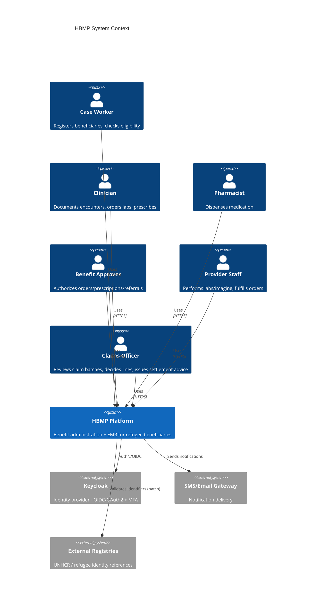
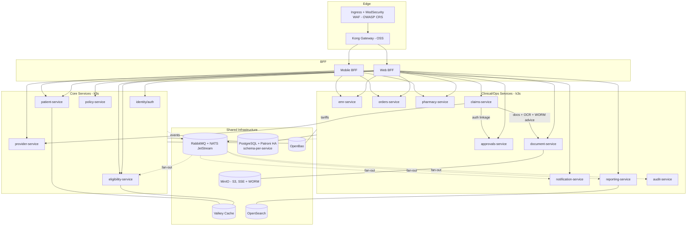
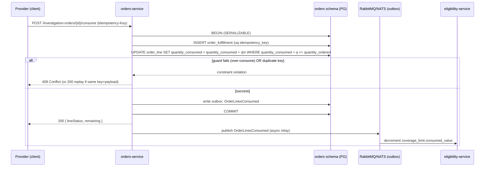
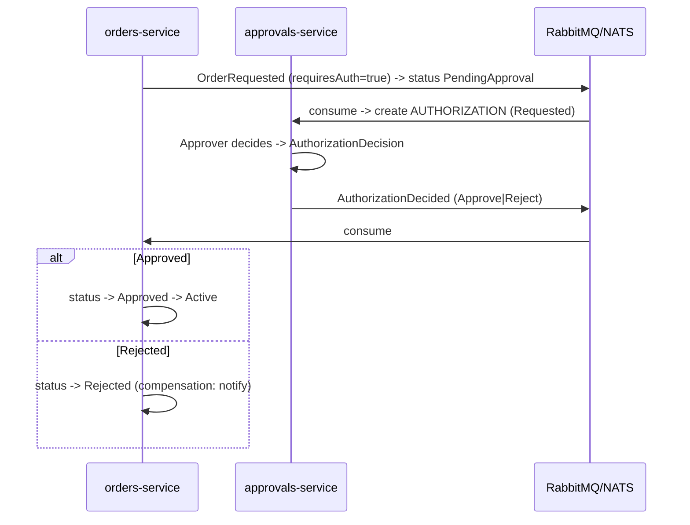

# 16 — Service Architecture (Microservices)

> Part of the **Mersal Healthcare Benefit Management Platform (HBMP)** design workspace.
> Up: [00-README-INDEX.md](00-README-INDEX.md) · Foundations: [0A-DESIGN-FOUNDATIONS.md](0A-DESIGN-FOUNDATIONS.md)
> Siblings: [15-database-erd.md](15-database-erd.md) · [17-api-specifications.md](17-api-specifications.md) · [23-state-machines.md](23-state-machines.md) · [18-security-model.md](18-security-model.md) · [25-deployment-architecture.md](25-deployment-architecture.md)
> **Infrastructure note:** the infra names below (gateway, event bus, storage, search, cache, secrets, identity, observability, orchestration) follow the open-source stack in [0C-OPEN-SOURCE-STACK.md](0C-OPEN-SOURCE-STACK.md), which is authoritative. **Service boundaries, the event catalog, sagas, and invariants are unchanged.**

---

## 1. Architectural Goals

HBMP is a **microservices** platform of reusable core services (identity, patient, policy, eligibility) plus EMR/clinical and operational services. Design goals:

- **Domain isolation** — schema/DB per service; no shared tables across service boundaries.
- **Strong invariants where it matters** — order-line consume and dispense are atomic, idempotent, and impossible to double-count (see [23-state-machines.md](23-state-machines.md)).
- **Loose coupling elsewhere** — event-driven choreography for cross-domain workflows, with sagas for multi-step consistency.
- **Auditability & compliance** — every mutation produces an audit event; PHI/PII handled per [18-security-model.md](18-security-model.md).
- **Open-source, on-prem-first operations** — k3s (Docker Compose at Tier 1), Kong Gateway, RabbitMQ + NATS JetStream, self-hosted PostgreSQL (Patroni HA), Valkey, OpenSearch, MinIO, OpenBao ([0C-OPEN-SOURCE-STACK.md](0C-OPEN-SOURCE-STACK.md)).

---

## 2. Service Catalog

| Service | Responsibility | Owned data (schema) | Key APIs | Publishes | Consumes |
|---|---|---|---|---|---|
| **api-gateway** | Edge routing, authN validation, rate limit, request aggregation entry | none (config) | all `/api/v1/*` proxied | — | — |
| **identity/auth** | Keycloak (OIDC) integration, RBAC, token/scope issuance, **user↔branch assignment + active-branch context** *(Phase 14)* | `identity` | `/users`, `/roles`, token introspection, `/users/{id}/branch-assignments`, `/me/branches`, `/me/active-branch` | `UserProvisioned`, `RoleAssigned`, `UserBranchAssigned`, `UserBranchRevoked`, `ActiveBranchSwitched`, `BranchScopeDenied` | `ProviderOnboarded`, `BranchCreated`, `BranchStatusChanged` |
| **patient-service** | Beneficiary master, identifiers, contacts, family | `patient` | `/beneficiaries`, `/beneficiaries/{id}/identifiers` | `BeneficiaryRegistered`, `BeneficiaryStatusChanged` | `DocumentAttached` |
| **policy-service** | Policies, coverage, limits, benefit categories | `policy` | `/policies`, `/coverages` | `CoverageActivated`, `CoverageLimitChanged` | `BeneficiaryStatusChanged` |
| **eligibility-service** | Compute + cache eligibility snapshots | `eligibility` | `/eligibility/check` | `EligibilityRecomputed` | `CoverageActivated`, `CoverageLimitChanged`, `OrderLinesConsumed`, `RxLinesDispensed` |
| **emr-service** | Appointments, encounters, SOAP notes, diagnoses, vitals, allergies, med history | `emr` | `/appointments`, `/encounters`, `/encounters/{id}/notes` | `EncounterCreated`, `EncounterFinished`, `DiagnosisRecorded` | `BeneficiaryRegistered` |
| **orders-service** | Investigation orders, lines, fulfillment (consume), **sensitive-result gating + report access requests/grants** *(Phase 14)* | `orders` | `/investigation-orders`, `.../consume`, `/report-access-requests`, `/report-access-requests/{id}/decision`, `/report-access-grants` | `OrderRequested`, `OrderApproved`, `OrderLinesConsumed`, `OrderCompleted`, `SensitiveResultRestricted`, `ReportAccessRequested`, `ReportAccessInfoRequested`, `ReportAccessApproved`, `ReportAccessDenied`, `ReportAccessGrantExpired`, `ReportAccessGrantRevoked`, `SensitiveResultReadUnderGrant` | `AuthorizationDecided`, `EncounterCreated`, `ExaminationTypeChanged` |
| **inventory-service** *(Phase 25)* | Clinic stock: catalogue, per-branch reorder policy, batches, and the **append-only movement ledger**. On-hand is `SUM(quantity)` — there is no stored balance anywhere. **Carries no beneficiary identifier and has no patient-dispensing path**: prescribed items go through pharmacy-service against an `Rx`, with the eligibility, coverage, formulary and dispense-audit controls that entails | `inventory` | `/inventory/items`, `/inventory/stock`, `/inventory/movements`, `/inventory/transfers`, `/inventory/alerts` | `StockLow`, `StockExpiring`, `StockQuarantined` | *(none — stock is branch-local)* |
| **approvals-service** | Authorizations & decisions, referrals | `approvals` | `/authorizations`, `.../decision`, `/referrals` | `AuthorizationRequested`, `AuthorizationDecided`, `ReferralCreated` | `OrderRequested`, `PrescriptionSubmitted` |
| **pharmacy-service** | Prescriptions, lines, dispense events | `pharmacy` | `/prescriptions`, `.../dispense` | `PrescriptionSubmitted`, `PrescriptionApproved`, `RxLinesDispensed` | `AuthorizationDecided` |
| **provider-service** *(remit widened, Phase 14: **network & facilities**)* | Contracted providers, locations, contracts, service lines **plus internal Mersal branches and practitioners/specialties** — kept as separate tables ([37](37-branch-scoping-and-clinical-sensitivity.md)) | `provider` | `/providers`, `/providers/{id}/contracts`, `/branches`, `/practitioners`, `/practitioners/{id}/specialties`, `/practitioners/{id}/branch-assignments`, `/specialties` | `ProviderOnboarded`, `ContractActivated`, `BranchCreated`, `BranchUpdated`, `BranchStatusChanged`, `PractitionerCreated`, `PractitionerSpecialtyChanged`, `PractitionerBranchAssigned`, `PractitionerBranchRevoked` | — |
| **claims-service** *(Phase 10b)* | Claim origination (auto-derived, provider-submitted, beneficiary reimbursement), batching, pre-adjudication, line-level decisions, adjustments, settlement advice ([36-claims-management.md](36-claims-management.md)) | `claims` | `/claims`, `/claims/{id}/lines/{lineId}/decision`, `/claim-batches`, `/claim-batches/{id}/settlement-advice`, `/reimbursement-requests` | `ClaimCreated`, `ClaimSubmitted`, `ClaimAdjudicated`, `ClaimLineDecided`, `ClaimApproved`, `ClaimPartiallyApproved`, `ClaimDenied`, `ClaimAdjusted`, `ClaimVoided`, `ClaimAppealed`, `ReimbursementSubmitted`, `ReimbursementMatched`, `ReimbursementRequiresManualAssessment`, `BatchCreated`, `BatchUnderReview`, `BatchDecided`, `SettlementAdviceIssued` | `OrderLinesConsumed`, `RxLinesDispensed`, `AuthorizationDecided`, `CoverageChanged` |
| **notification-service** | Templated multi-channel notifications | `notification` | `/notifications` (internal) | `NotificationSent` | *(most domain events)* |
| **reporting-service** | Read models, dashboards, exports | read replicas + OpenSearch | `/reports/*` | — | *(all domain events)* |
| **audit-service** | Central append-only audit log | `audit` | `/audit/events` (query) | — | *(audit stream from all)* |
| **document-service** | Document metadata + MinIO object-storage orchestration | `document` | `/documents`, `/documents/{id}/content` | `DocumentAttached` | — |
| **profile-service** *(Phase 20)* | The unified patient profile ([39](39-patient-profile.md)) — **composition only; owns NO data and has no schema**. The platform's ONLY beneficiary aggregation path: case-service's 360 and the call-centre's member 360 both delegate here (20.2). Fans out to ~8 services under the CALLER'S own token and projects the result to the design-39 §4 role × section matrix | **none** | `/patients/{id}/profile`, `/patients/{id}/profile/summary`, `/patients/{id}/photo` | `ProfileViewed`, `ProfileSummaryExported`, `IdentityPhotoViewed` *(audit stream)* | — |
| **callcentre-service** *(Phase 15; call history added Phase 20.3b)* | Contact-centre interactions, caller verification, member 360, call actions — plus the member's **call history** projected Full / Operational / Meta with a server-generated clipboard block | `callcentre` | `/call-interactions`, `/call-centre/*`, `/beneficiaries/{id}/call-interactions`, `.../copy` | `CallInteractionOpened`, `CallerVerificationRecorded`, `CallInteractionClosed`, `CallSummaryCopied` *(audit stream)* | — |

Supporting infra: **Event Bus** (NATS JetStream domain events), **Object Storage** (MinIO, S3-compatible, WORM), **Relational DB** (self-hosted PostgreSQL, Patroni HA), **Search Engine** (OpenSearch), **Caching** (Valkey), **Message Queue** (RabbitMQ durable/quorum queues for commands/outbox). Secrets/keys in **OpenBao**; orchestration on **k3s** (Docker Compose at Tier 1).

### 2.0b profile-service: the one service that owns nothing (Phase 20)

`profile-service` is the platform's only pure **composition** service, and the absence of a schema is the
design rather than a stage it has not reached yet.

- **It owns no data.** A local copy of clinical data here would be a second source of truth for the record a
  clinician makes decisions from, and it would arrive innocently — as a cache. Design 39 §7.4 makes this an
  invariant; an architecture test in its own test project fails the build on a `DbContext` or a `.sql` file.
- **It has no database, so it binds no tenant GUC.** It is on the RLS exemption register in `libs/architecture`
  with that reason recorded. Its isolation is the owning services' own RLS, reached under the caller's token.
- **It cannot authenticate as itself.** There is no client-credentials path, and the composer refuses at runtime
  when the caller's bearer is absent rather than falling back to anything. A privileged aggregator returns a
  *complete* profile to someone entitled to a third of it, which looks healthier than the correct one — see
  [ADR-0026](../docs/adr/0026-patient-profile-server-side-projection.md).
- **It weakens no gate.** Treating relationship, provider ownership, branch scope, payer scope, call-centre
  verification and sensitive-result grants all still bind: the profile is strictly an intersection of the rules
  that already exist, never a union.

Consequently it is stateless, horizontally scalable, and needs no migration in any environment.

### 2.0c The profile seams, and why the owning services kept their narrow rules (Phase 20.2)

Five services gained one beneficiary-scoped read each, for the profile to compose from:

| Service | Seam | Serves sections |
|---|---|---|
| emr | `GET /api/v1/beneficiaries/{id}/profile-context` | pastMedicalHistory, encounters |
| orders | `GET /api/v1/investigation-orders/for-beneficiary/{id}` | investigations |
| pharmacy | `GET /api/v1/prescriptions/for-beneficiary/{id}` · `GET /api/v1/referrals/for-beneficiary/{id}` | prescriptions, referrals |
| approvals | `GET /api/v1/authorizations/for-beneficiary/{id}` | authorizations |
| case | `GET /api/v1/cases/for-beneficiary/{id}` | caseManagement (+ the assignment fact) |

**They do not reuse their service's ordinary read rule, and they do not get a laxer one.** `orders:read` is
doctor + treating relationship; `rx:read` likewise; emr splits treating from medical-approval oversight. Those
are correct and untouched — widening any of them so reception could read encounter *logistics* would have
widened every clinical read in that service.

Instead each seam consults the **same design-39 §4 matrix** through `ProfileSeam`, because the question has a
different ABAC condition per role (a doctor needs treating, a case manager needs an assignment, reception needs
neither because it only ever receives the meta variant) and a single `PolicyRule` carries one condition set.
Crucially, **each owning service resolves its own facts**: emr the treating relationship, case the assignment,
orders the sensitivity level and the release grant. profile-service cannot read emr's treating table and emr
cannot see the composed payload, so the two layers still cannot stand in for each other — what they share is
the answer to "which roles may see this section", which should have exactly one definition.

The seams are scoped `profile:read` rather than the owning service's scope, because the roles that legitimately
reach them (reception, finance, beneficiary management) hold no clinical scope at all.

### 2.1 claims-service boundaries & invariants (Phase 10b)

`claims-service` is a **financial-adjudication** bounded context added on top of the completed core (authorizations, fulfillment, contracts/tariffs) — see [36-claims-management.md](36-claims-management.md) for the authoritative design.

- **Owned data (`claims` schema):** `claim`, `claim_line`, `claim_decision`, `claim_adjustment`, `claim_batch`, `reimbursement_request`, `claim_document`, `ocr_extraction`. Decisions and adjustments are **append-only**; corrections are compensating adjustments or Void + re-claim, never edits or hard deletes.
- **Synchronous dependencies (in-mesh, never via the public gateway):** provider-service (contract tariffs + network/contract effectivity), policy-service/eligibility-service (coverage validity on the service date), approvals-service (authorization linkage and scope caps), document-service (invoices/receipts/results, OCR, WORM-stored settlement advice), masterdata (CPT/LOINC/LOCAL/drug code validation).
- **Never reads emr-service.** Claims adjudicate on codes and amounts. Diagnoses, notes and lab/imaging **result values** are outside this service's blast radius; result *existence* (date + document reference) is the only evidence surfaced. Lines needing medical-necessity judgement are routed to a clinical reviewer in approvals-service, who owns that view.
- **Never executes payments.** The terminal artifact is an immutable settlement advice handed to Finance/treasury; money moves outside the platform. An optional external payment reference may be recorded back against the batch.
- **Never re-decrements coverage.** `order_fulfillment`/`dispense_event` rows remain the authoritative usage record; claims reconcile against them and never maintain a parallel accumulator.
- **Cross-service references are values, not FKs** — `beneficiary_id`, `provider_id`, `authorization_id`, `order_fulfillment_id`, `dispense_event_id` are stored as identifiers with denormalized display fields, consistent with schema-per-service isolation (§1).
- **Outbox + idempotency** as everywhere else: every claims event is written in the same transaction as the state change and relayed; consumers dedupe on `event.id`; claim submission, decision, adjustment and batch settlement require an `Idempotency-Key` ([17-api-specifications.md](17-api-specifications.md)). `UNIQUE` on the fulfillment/dispense reference enforces one payable line per delivered item (`DUPLICATE_CLAIM`), and a partial unique index keeps a claim in at most one open batch.

> **Naming note:** `OrderLinesConsumed` and `RxLinesDispensed` are the names the **implemented** orders/pharmacy services actually emit (phases 5 & 6) — this catalog and [36](36-claims-management.md) match the shipped code. `CoverageChanged` in [36](36-claims-management.md) corresponds to this catalog's `CoverageActivated` + `CoverageLimitChanged` pair.

### 2.2 provider-service widens to "network & facilities"; branch & sensitivity ownership (Phase 14)

Phase 14 adds **multi-branch awareness**, **practitioner specialty** and **sensitivity-gated results** ([37-branch-scoping-and-clinical-sensitivity.md](37-branch-scoping-and-clinical-sensitivity.md) is the authoritative design). **No new service is introduced.** Ownership is distributed across four existing contexts:

| Owning service | New tables (Phase 14) | Responsibility |
|---|---|---|
| **provider-service** *(remit widened)* | `branch`, `practitioner`, `specialty`, `practitioner_specialty`, `practitioner_branch_assignment` | The **facilities & clinical-workforce registry**. `branch` is Mersal-operated **internal** reference data (six seeded rows: `ASW`, `ALX`, `OCT`, `MAA`, `DOK`, `NSR`); `provider`/`provider_location` remain the **contracted third-party** network. **They are separate tables and must stay separate** — only branches are subject to staff branch-scoping, and no provider-side principal may enumerate them. |
| **identity-service** | `user_branch_assignment` | Who may work where. `assignment_type` ∈ {`Home`,`Additional`}, validity window, status; **exactly one active `Home` per user** enforced by a partial unique index. Computes the **permitted branch set** and validates the **`X-Active-Branch`** header on every request (absent ⇒ Home; outside the set ⇒ `403` + `BranchScopeDenied`). Assignments are administered by Org Admin / Network Team — **never self-granted**. |
| **masterdata-service** | `examination_type` | The orderable catalogue and its **`sensitivity_level`** (`Standard` / `Sensitive` / `HighlySensitive`) + `sensitive_category`. Classification is **configuration ratified by the Medical Director + DPO**, not code. |
| **orders-service** | `report_access_request`, `report_access_grant` | Owns and **enforces the sensitive gate**. Order lines and results carry a **denormalized `sensitivity_level` pinned at order creation**, so gating never depends on a cross-service join at read time. Runs the release-request workflow and issues **time-boxed, single-result, non-transferable** grants. |

- **The gate is a projection, not a filter.** For a result where `sensitivity_level != 'Standard'`, orders-service projects **existence metadata only** (category, date, status, ordering branch, `RESTRICTED` marker) to every principal except the **authoring/ordering doctor** — **including approvals-service's reviewers and case managers**. Content is released only under an **active, unexpired, unrevoked grant**, and **every read under a grant emits `SensitiveResultReadUnderGrant`**, separately from ordinary PHI-read audit. Break-glass still works and is *loud*: author + Medical Director + DPO notified, retrospective review mandatory.
- **Branch scoping is a shared authorization concern, not a service.** `libs/authz` gains the **`BranchScope`** ABAC condition and `RowScope.BranchIds` / `BranchUnrestricted`, mirroring the existing provider-scoping shape; each policy bundle declares its scope mode (EMR appointment/queue reads require `BranchScope`; approvals/finance/claims set `BranchUnrestricted`). Optional PostgreSQL **RLS on `branch_id`** (session GUC) is defence in depth on branch-scoped tables, mirroring the proven `provider_id` pattern.
- **Cross-service references are values, not FKs** — `branch_id`, `practitioner_id`, `examination_type_id` are carried as identifiers with denormalized display fields (`branch_code`, `branch_name_en/ar`, specialty name, `sensitivity_level`), consistent with schema-per-service isolation (§1).
- **Alternative considered and deferred: a dedicated `org-service`.** A separate bounded context for facilities/workforce is architecturally cleaner and remains viable, but standing up, deploying, monitoring and backing up an extra service for **~6 slow-changing branch rows** is not defensible on an NGO budget. The decision is recorded as a **deferral, not a rejection**: the tables are kept in their own migration set with no FK coupling to `provider`/`provider_location`, so extraction later is a move, not a rewrite. Flag it if operational reality diverges ([37 §1](37-branch-scoping-and-clinical-sensitivity.md)).

---

## 3. C4 — System Context



---

## 4. C4 — Container Diagram



---

## 5. API Gateway & BFF Pattern

- **Kong Gateway (OSS)** is the single ingress (behind Traefik/NGINX Ingress + ModSecurity WAF). It validates JWTs from Keycloak, enforces **rate limits/quotas per consumer (provider/tenant)**, injects correlation IDs, and applies request/response policies (header stripping, PHI redaction on error paths).
- **BFF layer** — two backends-for-frontends (Web BFF for the staff portal, Mobile BFF for field case workers). BFFs **aggregate** cross-service reads (e.g., a beneficiary "360" view combining patient + coverage + eligibility + recent encounters) so clients make one call. BFFs never own domain data; they orchestrate and shape responses.
- Downstream service-to-service calls stay **inside the cluster mesh** (Linkerd mTLS), never via the public gateway.

---

## 6. Sync vs Async Boundaries

| Interaction | Style | Rationale |
|---|---|---|
| Client → service reads/commands | **Sync REST** via Kong/BFF | Immediate UX feedback |
| Eligibility check | **Sync** (cache-first) | Blocking decision at point of care |
| Order consume / dispense | **Sync** transactional command | Must return authoritative success/failure |
| Approval routing, notifications, reporting, audit, cache invalidation | **Async events** | Decoupled, resilient, non-blocking |
| Cross-service data propagation (e.g., beneficiary → EMR) | **Async events** (eventual consistency) | Avoid distributed FK/temporal coupling |

**Rule of thumb:** synchronous only when the caller *cannot proceed* without the result and the operation is fast + owned by one service. Everything else is an event.

---

## 7. Event Bus & Event Catalog

Transport: **NATS JetStream** (durable streams, at-least-once, ordered subjects where ordering matters) for domain events; **RabbitMQ** (durable/quorum queues, DLQ) for commands and outbox relay. Every publisher uses the **transactional outbox** pattern. (Redpanda/Kafka-API is a drop-in for higher-volume streaming.)

### 7.1 Event envelope (CloudEvents 1.0)

```json
{
  "specversion": "1.0",
  "type": "hbmp.orders.OrderLinesConsumed.v1",
  "source": "orders-service",
  "id": "01J...", 
  "time": "2026-07-21T10:15:00Z",
  "subject": "ORD-2026-000123",
  "correlationid": "corr-abc",
  "datacontenttype": "application/json",
  "data": { "orderId": "...", "orderLineId": "...", "quantity": 1, "beneficiaryId": "..." }
}
```

### 7.2 Event catalog (selected)

| Event `type` | Producer | Key consumers | Purpose |
|---|---|---|---|
| `hbmp.patient.BeneficiaryRegistered.v1` | patient | emr, policy, reporting | Seed downstream read refs |
| `hbmp.patient.BeneficiaryStatusChanged.v1` | patient | policy, eligibility | Suspend/expire cascades |
| `hbmp.policy.CoverageActivated.v1` | policy | eligibility | Recompute snapshot |
| `hbmp.policy.CoverageLimitChanged.v1` | policy | eligibility | Invalidate cache |
| `hbmp.orders.OrderRequested.v1` | orders | approvals | Trigger authorization if required |
| `hbmp.approvals.AuthorizationDecided.v1` | approvals | orders, pharmacy | Advance order/rx state |
| `hbmp.orders.OrderLinesConsumed.v1` | orders | eligibility, reporting, audit | Decrement limits, analytics |
| `hbmp.pharmacy.RxLinesDispensed.v1` | pharmacy | eligibility, reporting, audit | Decrement pharmacy limits |
| `hbmp.document.DocumentAttached.v1` | document | orders, emr | Link results to orders/encounters |
| `hbmp.claims.ClaimLineDecided.v1` | claims | reporting, notification, audit | Roll decisions up to batch totals, notify payee |
| `hbmp.claims.BatchDecided.v1` | claims | claims (settlement), reporting | Freeze rollups, trigger settlement advice |
| `hbmp.claims.SettlementAdviceIssued.v1` | claims | notification, reporting, audit | Hand-off artifact to Finance/provider (no payment execution) |
| `hbmp.provider.BranchCreated.v1` | provider | identity, emr, reporting, audit | Seed a new Mersal facility into scoping and reporting dimensions |
| `hbmp.provider.BranchUpdated.v1` | provider | identity, emr, reporting | Propagate name/hours/contact changes to display projections |
| `hbmp.provider.BranchStatusChanged.v1` | provider | identity, emr, reporting, audit | `Suspended`/`Closed` — stop new bookings, keep history readable |
| `hbmp.provider.PractitionerBranchAssigned.v1` | provider | emr (availability/booking), reporting, audit | A doctor may be scheduled at this branch (booking validates against it) |
| `hbmp.identity.ActiveBranchSwitched.v1` | identity | audit, reporting | Working context changed — actor, from, to, correlation id |
| `hbmp.identity.BranchScopeDenied.v1` | identity | audit, security monitoring | Cross-branch or out-of-permitted-set attempt (**deny, not empty result**) |
| `hbmp.orders.SensitiveResultRestricted.v1` | orders | reporting, notification, audit | A non-`Standard` result exists — project the **restricted form only** |
| `hbmp.orders.ReportAccessRequested.v1` | orders | notification, audit | Route the justified release request to the authoring doctor |
| `hbmp.orders.ReportAccessApproved.v1` | orders | notification, audit | Time-boxed, single-result, non-transferable grant issued |
| `hbmp.orders.ReportAccessDenied.v1` | orders | notification, audit | Refusal with mandatory reason, notified to the requester |
| `hbmp.orders.ReportAccessGrantExpired.v1` / `…GrantRevoked.v1` | orders | notification, audit | Access decays by default and is withdrawable on demand |
| `hbmp.orders.SensitiveResultReadUnderGrant.v1` | orders | audit *(high severity)* | **Every** read under a grant — `grant_id`, `purpose_code`, actor — audited separately from ordinary PHI-read |
| `hbmp.*.` (all) | all | audit, reporting | Audit + read-model projection |

Versioning: event `type` carries `.vN`; new fields are additive; breaking changes bump the version and run **dual-publish** during migration.

---

## 8. Consistency & Sagas

### 8.1 Order-consume — the critical invariant

Consume is a **local ACID transaction** in orders-service (no distributed transaction needed for the write itself):



- **Atomicity**: fulfillment insert + line update + outbox insert in one transaction.
- **Idempotency**: `UNIQUE(idempotency_key)`; a replay with the same key returns the original result (stored response), never a second consume.
- **No over/duplicate use**: guarded conditional `UPDATE` + `CHECK (quantity_consumed <= quantity_ordered)`.
- Limit decrement in eligibility is **eventually consistent** via `OrderLinesConsumed`; the *authoritative* usage record is the fulfillment row, so a lagging eligibility cache can never cause double-spend of the order itself.

### 8.2 Approval saga (order requires authorization)



This is a **choreographed saga** (no central orchestrator). Compensation on rejection = state rollback + notification; no partial data to undo because consume can't happen before `Active`. The same pattern governs prescription approval.

### 8.3 Consistency summary

| Concern | Mechanism |
|---|---|
| Single-service invariant (consume/dispense) | Local serializable transaction + guards + idempotency key |
| Cross-service workflow (approve → activate) | Choreographed saga via events |
| Read-model freshness (eligibility, reporting) | Eventual consistency + cache invalidation events |
| Exactly-once effect | Outbox (dedupe on publish) + idempotent consumers (dedupe on `event.id`) |

---

## 9. Caching Strategy

- **Eligibility snapshots** cached in **Valkey** keyed `elig:{beneficiaryId}:{coverageId}` with TTL + `version_hash`. Reads are cache-first; miss → recompute from policy/coverage → store. Invalidation is event-driven (`CoverageLimitChanged`, `OrderLinesConsumed`, `RxLinesDispensed`, `BeneficiaryStatusChanged`).
- **Master data** (ICD/CPT/LOINC/drug) cached read-through with long TTL; invalidated on catalog publish.
- **Beneficiary lookups** (by identifier) cached short TTL for the registration/point-of-care hot path.
- Cache is **never** the source of truth for consumption; it accelerates the *decision*, while the fulfillment/dispense tables enforce correctness.

---

## 10. Search Indexing

- **OpenSearch** powers beneficiary search (name/identifier fuzzy), provider directory, and master-data typeahead (drug/ICD); Meilisearch/Typesense are lighter alternatives at Tier 1.
- Indexes are **projections** fed by domain events into an indexer pipeline; PHI fields are **excluded or tokenized** per data-minimization rules ([18-security-model.md](18-security-model.md)).
- Reporting-service maintains denormalized read models (star-ish) refreshed by the event stream, queried for dashboards.

---

## 11. Idempotency & Concurrency

- **Idempotency-Key** header required on all unsafe, retriable POSTs (consume, dispense, decision, notification send). Stored with the response for replay (see [17-api-specifications.md](17-api-specifications.md)).
- **Optimistic concurrency** via `row_version` + `If-Match`/ETag on updates; conflicting writes get `412 Precondition Failed`.
- **Serializable isolation** only where invariants demand it (consume/dispense); everything else uses read-committed for throughput.
- **Message dedup**: consumers track processed `event.id` (Valkey set / dedup table) to make projections idempotent.

---

## 12. Multi-Tenant & Provider Isolation

- **Tenant model**: single logical tenant (Mersal) with **provider-scoped isolation** as the primary boundary — provider staff see only their own contracts, fulfillments, and dispensing.
- Enforced in three layers:
  1. **Keycloak** claims carry `provider_id` for provider users.
  2. **Kong** validates scope and injects the tenant/provider context header.
  3. **PostgreSQL RLS** policies filter rows by `provider_id`/case-worker assignment (see [18-security-model.md](18-security-model.md)).
- Beneficiary clinical data is **not** provider-partitioned (a refugee may be seen by many providers); access is governed by role + care-relationship, audited on every read.
- **Branch scoping (Phase 14)** adds a *third*, orthogonal narrowing for internal staff: `BranchScoped` roles are filtered to their **active branch** (validated server-side from `X-Active-Branch`), `MemberScoped` roles span all branches, `ProviderScoped` roles are unaffected. It is enforced in the same three layers — token/identity claim (permitted set + active branch), gateway/service (`BranchScope` ABAC), PostgreSQL RLS on `branch_id` where enabled — and it **narrows only**: it never substitutes for provider-ownership, treating-relationship or the field-level minimum-necessary rules ([11](11-permission-matrix.md), [37 §3](37-branch-scoping-and-clinical-sensitivity.md)).

---

## 13. Resilience Patterns

| Pattern | Where | Implementation |
|---|---|---|
| **Transactional outbox** | every publisher | events written in the same tx as state, relayed by a dispatcher (dedupe) |
| **Retry with backoff + jitter** | all consumers & downstream calls | RabbitMQ/NATS native retry + Polly policies |
| **Dead-letter queue** | RabbitMQ / NATS JetStream | poison messages parked, alerted, replayable |
| **Circuit breaker** | service-to-service sync calls | open on repeated failures, fail fast, half-open probes |
| **Bulkhead / concurrency limits** | k3s pods + connection pools | isolate noisy-neighbor load |
| **Timeouts everywhere** | HTTP + DB | prevent thread/connection exhaustion |
| **Idempotent consumers** | projections, cache invalidation | dedupe on `event.id` |
| **Health/readiness probes** | k3s | liveness, readiness, startup probes |
| **Graceful degradation** | eligibility | if cache + policy down, fall back to conservative "NeedsAuthorization" |

---

## 14. Deployment & Runtime Notes

- Each service is an independently deployable container on **k3s** (Docker Compose at Tier 1), horizontally scaled (HPA on CPU + KEDA on queue depth).
- **Self-hosted PostgreSQL** (Patroni HA) hosts schema/DB-per-service; connection is cluster-internal only with **OpenBao**-managed credentials.
- Full environment topology, networking, HA/DR in [25-deployment-architecture.md](25-deployment-architecture.md).

---

## 15. Cross-References

- Entity/relationship detail: [15-database-erd.md](15-database-erd.md)
- Endpoint contracts & idempotency headers: [17-api-specifications.md](17-api-specifications.md)
- Status transition rules referenced by sagas: [23-state-machines.md](23-state-machines.md)
- RLS/tenant/PHI enforcement: [18-security-model.md](18-security-model.md)
- claims-service design (origination, batching, adjudication, settlement): [36-claims-management.md](36-claims-management.md)
- Branch model, scope modes, practitioner specialty, sensitivity gating & release workflow (phase 14, §2.2): [37-branch-scoping-and-clinical-sensitivity.md](37-branch-scoping-and-clinical-sensitivity.md)
- Open-source infra realization: [25-deployment-architecture.md](25-deployment-architecture.md)
- Authoritative stack: [0C-OPEN-SOURCE-STACK.md](0C-OPEN-SOURCE-STACK.md)

---

## Phase 19 — policy-service's remit, and what provider-service gained

**policy-service is the Policy Administration System (PAS).** Before phase 19 it owned coverage and limits;
it now owns the whole benefit spine that produces them:

- `payer` — who the contract is with. Replaces the free-text `sponsor`.
- `plan` → `plan_version` → `benefit_rule` (+ `benefit_rule_tier`) — the effective-dated, immutable statement
  of what is covered and what the member pays, per network tier (ADR-0017, ADR-0019).
- `policy` → `policy_plan` — the contract, and the plans offered under it (ADR-0020).
- `member_group`, `enrollment` — the membership book; coverage is GENERATED from a version at enrolment and
  records its provenance.
- `note` (append-only, class-projected — ADR-0018), document **linkage** (bytes stay in document-service,
  ADR-0021), and the entity **timeline** (a replayable projection over the audit stream, ADR-0022).
- Query surfaces: policy query, member query, utilization, the administrative 360, and the bulk/extract engine.

**policy-service still writes no clinical data and reads none.** It holds no diagnosis column anywhere, and
the note/document projections withhold `Clinical`/`Restricted` content by class from every caller not
entitled to it — including its own administrators.

**provider-service gained network tiers** (`network_tier`, `provider_network_assignment`) and the service-date
resolver they exist for. The tier structure is the Network Team's; policy-service consumes the resolver
through `libs/benefit-pricing` and never writes to it.

**reporting-service gained the analytical read model** (`fact_enrolment`, `fact_utilization`, `fact_cost`,
`dim_label`) projected from policy, benefit and claims events. The 19.6b dashboard reads only these facts —
it never queries the transactional benefit spine, which is the same tables a reception desk is checking
eligibility against.
