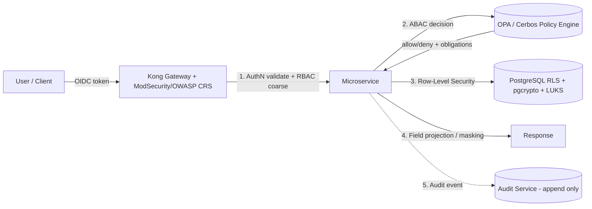
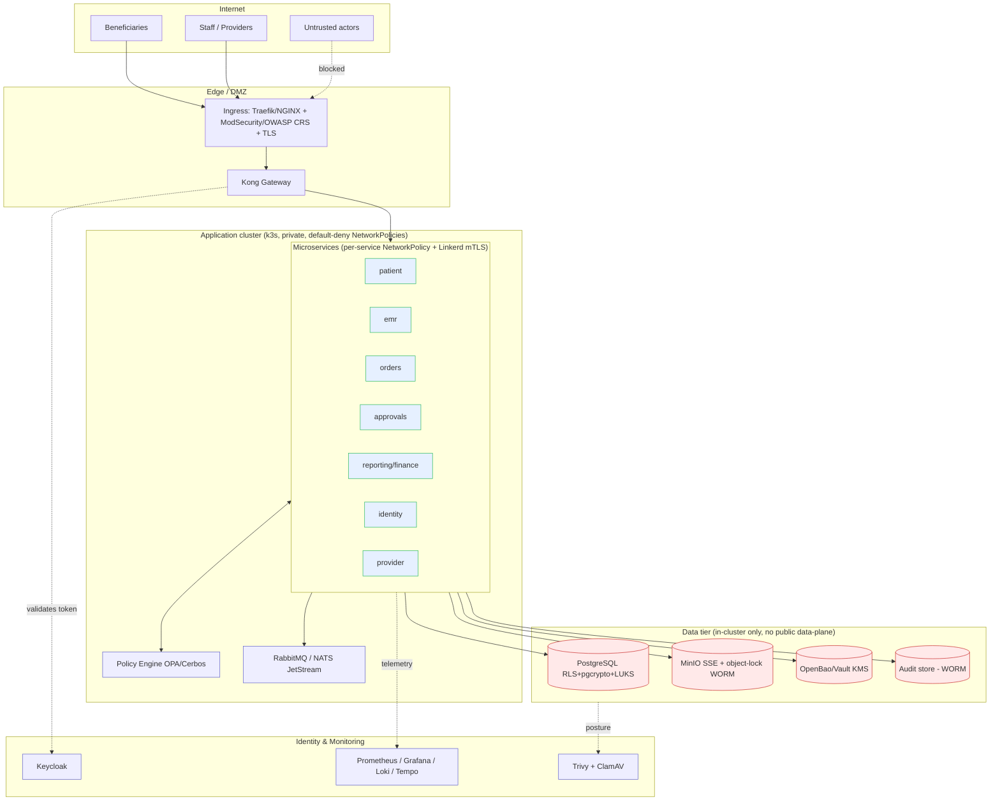

# 18 — Security Model & Architecture

[⬅ Back to Index](00-README-INDEX.md) · [Design Foundations](0A-DESIGN-FOUNDATIONS.md)

**Siblings:** [10-role-matrix.md](10-role-matrix.md) · [11-permission-matrix.md](11-permission-matrix.md) · [19-audit-strategy.md](19-audit-strategy.md) · [20-compliance-checklist.md](20-compliance-checklist.md)

> **Stack note.** Per [0C-OPEN-SOURCE-STACK.md](0C-OPEN-SOURCE-STACK.md) (authoritative), HBMP runs on a **free, open-source, on-prem-first, cloud-ready** substrate. This document expresses every control on that stack (Keycloak, Kong, ModSecurity/OWASP CRS, Linkerd, OpenBao/Vault, LUKS/pgcrypto, MinIO, k3s NetworkPolicies). The **security bar is unchanged** — only product names differ from the earlier Azure-first draft.

> **Scope.** This document defines the end-to-end security architecture for HBMP: the Zero-Trust model, identity & access, the RBAC+ABAC enforcement pipeline, encryption and key management, secrets, network segmentation and trust boundaries, provider/tenant isolation, session and password policy, API security, break-glass, the STRIDE threat model, and SDLC-security practices. It is design guidance for an **on-prem-first, cloud-ready** deployment (see [0C](0C-OPEN-SOURCE-STACK.md)); the authorization rules it enforces are defined in the [Permission Matrix](11-permission-matrix.md).

---

## 1. Security objectives & principles

HBMP protects the personal and health data of **refugee beneficiaries** — a special-category, vulnerable population. The security model is built on:

- **Zero Trust** — never trust, always verify; no implicit trust from network location.
- **Least Privilege & Need-to-Know** — minimal, context-bound access (enforced via [11](11-permission-matrix.md)).
- **Defense in Depth** — independent controls at identity, gateway, service, data-row, and data-field layers.
- **Secure by Design / by Default** — deny-by-default, minimization baked into schemas and projections.
- **Assume Breach** — segmentation, short-lived credentials, immutable audit, rapid detection.
- **Data Protection by Design (GDPR Art. 25)** — privacy engineered in, not bolted on.

CIA targets: **Confidentiality** (minimization, encryption, isolation), **Integrity** (immutable audit, input validation, signed pipelines), **Availability** (HA on k3s with PostgreSQL replication, rate limiting at the gateway, edge/WAF protection).

---

## 2. Zero-Trust model

Every request is authenticated, authorized, and encrypted regardless of origin. Five pillars:

| Pillar | Implementation on HBMP |
|---|---|
| **Verify identity explicitly** | Keycloak OIDC/OAuth2; MFA; policy-based access; device + risk signals per request. |
| **Verify device** | Device posture/compliance required for admin, Finance, clinical write; managed-device claim in token (via MDM/posture check). |
| **Least-privilege access** | RBAC+ABAC on every call; JIT elevation for high tiers; no standing global data access. |
| **Micro-segmentation** | Per-service k3s NetworkPolicies (default-deny), services in-cluster only, Linkerd mTLS between services, gateway as the only ingress. |
| **Assume breach / continuous verification** | Short-lived tokens, re-evaluation on sensitive actions (step-up), Prometheus/Grafana/Loki analytics + alerting, immutable audit. |

**No network is trusted.** Even inside the cluster, service-to-service calls require Linkerd mTLS + a valid workload identity (Kubernetes ServiceAccount); the datastore enforces RLS independent of the calling service.

---

## 3. Identity & Access Management

### 3.1 Identity provider
- **Keycloak** is the sole IdP. Beneficiary-facing and staff/provider identities are managed as separate realms/user flows with strict separation.
- **Protocols:** OpenID Connect (authN) + OAuth2 (authZ). Tokens are short-lived JWTs signed by Keycloak; APIs validate issuer, audience, signature, expiry, and required claims.
- **Claims in token:** `sub`, `role`(app role/group), `tenant_id`, `provider_id`, `acr`(auth context/step-up), `amr`(MFA method), `device_compliant`, `ip`. These feed the RBAC+ABAC pipeline.

### 3.2 OAuth2 / OIDC flows
| Client | Flow | Notes |
|---|---|---|
| Web portals (staff/provider) | Authorization Code + PKCE | No tokens in browser storage beyond memory; refresh via secure httpOnly path / SPA BFF. |
| Beneficiary mobile/web | Authorization Code + PKCE | Simplified user flow, MFA where feasible; account recovery hardened. |
| Service-to-service | Client Credentials / Workload identity | Kubernetes ServiceAccounts; no shared secrets in code. |
| Backend jobs | Kubernetes ServiceAccount + OpenBao | OpenBao/Vault-backed short-lived creds; no static credentials. |

### 3.3 MFA
- **Required** for all staff/provider roles; **step-up MFA** (re-auth, higher `acr`) for T3/T4 actions, Export, approvals, admin grants, and break-glass.
- Phishing-resistant methods (FIDO2/passkeys, Authenticator number-matching) preferred; SMS discouraged. Hardware-backed MFA for Super Admin.

### 3.4 Conditional / policy-based access
Access policies (Keycloak authentication flows + conditional/step-up policies, with Kong at the edge) evaluated per sign-in and per sensitive action:
- Require compliant/managed device for admin, Finance, clinical-write.
- Require MFA always for staff; block legacy auth.
- IP allowlists (Keycloak IP rules + Kong) for Finance, Org/Super Admin, break-glass approval.
- Sign-in risk & user risk (brute-force/anomaly signals) → block or force step-up.
- Session controls (lifetime, re-auth) by role tier.

### 3.5 Device management & IP restrictions
- **Device management:** MDM/posture compliance; jailbreak/root detection; disk encryption required; only compliant devices receive `device_compliant=true`.
- **IP allowlists:** enforced at Kong Gateway + Keycloak IP rules for administrative, financial, and break-glass paths; provider portals may be pinned to registered egress ranges where contractually agreed.

---

## 4. RBAC + ABAC enforcement points

Authorization is layered — a failure at any layer denies. This is the operational realization of [Permission Matrix §7](11-permission-matrix.md).

| Layer | Enforcement | What it stops |
|---|---|---|
| **1. Gateway (Kong)** | Token validation, coarse RBAC (role→route), rate limiting, IP allowlist, schema validation; ModSecurity/OWASP CRS at ingress | Unauthenticated/malformed/over-privileged calls at the edge |
| **2. Service** | Calls policy engine (ABAC) with subject+resource+action+env attributes | Context violations (wrong tenant/provider/no treating relationship) |
| **3. Row-Level Security** | PostgreSQL RLS predicates on `tenant_id`, `provider_id`, care-team | Cross-tenant/cross-provider row leakage even if service is buggy |
| **4. Field-level** | Response projection strips/masks `denied` fields per role | Sensitive-field leakage (Finance→diagnosis, Labs→prescription, Pharmacy→results) |
| **5. Audit** | Every decision + PHI read/write logged | Undetected access; supports detection & DSAR |

**Policy engine (OPA/Cerbos):** policies are versioned bundles deployed via the audited CI pipeline (see [11 §6](11-permission-matrix.md)). Decisions are cached briefly with correct invalidation; obligations (e.g., "emit break_glass audit", "mask field set X") are returned with the decision.

---

## 5. Encryption

### 5.1 In transit
- **TLS 1.2+ (prefer 1.3)** for all external traffic (Let's Encrypt / internal CA at ingress); HSTS; modern cipher suites only; no TLS ≤1.1.
- **mTLS** for service-to-service inside the cluster via **Linkerd** (automatic, workload-identity-based).
- Certificate lifecycle via cert-manager + OpenBao/Vault; automated rotation; OCSP/short-lived certs where possible.

### 5.2 At rest
- **AES-256** everywhere at rest.
- **PostgreSQL:** **LUKS** full-disk encryption + **pgcrypto** column-level protection for PHI/PII; data-encryption keys wrapped by **OpenBao/Vault transit engine (KMS)**.
- **Object storage (MinIO)** (documents, DICOM refs, reports): **MinIO SSE** (SSE-KMS via OpenBao/Vault); in-cluster access only.
- **Backups & snapshots:** encrypted; offsite/second-site copies honoring data-residency constraints — on-prem in Egypt keeps regulated data in-country (see [20](20-compliance-checklist.md)).

### 5.3 Key management
- **OpenBao (or HashiCorp Vault)** holds AES-256 keys (transit engine = KMS), TLS certs, and secrets.
- **Key hierarchy:** OpenBao transit key → wraps data-encryption keys (envelope encryption).
- **Rotation:** automated periodic rotation (e.g., annual for master keys, shorter for secrets); rotation events audited.
- **Access:** OpenBao policies + Kubernetes ServiceAccount auth; only workload identities of specific services; **no human raw-key export**; audit device enabled on OpenBao.
- **Separation:** key admins ≠ data admins (SoD); Super Admin manages *lifecycle* via OpenBao policies, never sees raw key material.

---

## 6. Secrets management
- All secrets (DB creds, API keys, connection strings) in **OpenBao/Vault**; referenced via Kubernetes ServiceAccount at runtime — **never** in code, config files, or images. GitOps secrets encrypted with **SOPS**.
- Static credentials eliminated in favor of workload identities (ServiceAccounts) and short-lived, dynamically-issued tokens.
- Secret access is least-privilege, in-cluster-only, and audited (OpenBao audit device).
- CI/CD uses short-lived workload identity to OpenBao; no long-lived secrets in pipeline variables.
- Secret scanning in the pipeline (see §14) blocks committed credentials.

---

## 7. Network segmentation & trust boundaries

**Trust boundaries (crossings require explicit controls):**

| Boundary | Control at crossing |
|---|---|
| Internet → Edge | Ingress (Traefik/NGINX) + WAF (ModSecurity/OWASP CRS) + edge rate limiting; TLS termination (Let's Encrypt/internal CA) |
| Edge → App cluster | Only Kong may ingress; token validation, RBAC, rate limit, schema validation |
| Service ↔ Service | Linkerd mTLS + workload identity (ServiceAccount) + ABAC per call; RabbitMQ/NATS for async, no direct DB sharing across bounded contexts |
| App → Data tier | In-cluster only, no public data-plane; RLS + field projection |
| Any → OpenBao/Vault | Kubernetes ServiceAccount auth + OpenBao policies + in-cluster only |
| App → Audit | Append-only, write-only from services; separate isolation (see [19](19-audit-strategy.md)) |

Network defaults: **default-deny k3s NetworkPolicies**, per-service least-privilege rules, no public IPs on data tier, in-cluster DNS, egress filtering.

---

## 8. Provider & tenant isolation

- **Tenant separation:** Mersal Foundation is the tenant of record; all data carries `tenant_id`; **PostgreSQL RLS** enforces `tenant_id` on every row; cross-tenant access is impossible without global break-glass. Sub-tenants (if used for programs/partners) partition further.
- **Provider isolation:** provider-side data (Labs, Imaging, Pharmacies, Provider Admin) carries `provider_id`; RLS + ABAC `PO` guarantee a provider can never see another provider's users, orders, or operational data.
- **Order routing minimization:** when an order/prescription is routed to a provider, only the **minimum payload** (per [11 §4](11-permission-matrix.md)) crosses the boundary — e.g., labs get indication, not prescriptions; pharmacies get derived safety flags, not raw results.
- **Isolation testing:** the permission-regression suite includes cross-tenant and cross-provider negative tests.

---

## 9. Session & timeout policy

| Control | Setting (baseline) |
|---|---|
| Access token lifetime | Short (e.g., 15–60 min) |
| Refresh/session lifetime | Role-tiered; shorter for T3/T4/admin |
| Idle timeout | ~15 min for clinical/admin portals; auto-lock |
| Absolute session cap | Re-auth required (e.g., 8–12h) |
| Concurrent sessions | Limited/monitored for high-privilege roles |
| Step-up re-auth | On T3/T4 actions, Export, approvals, break-glass |
| Sign-out | Full token revocation + Keycloak session end (back-channel logout) |

Sessions bound to device + IP context; anomalies trigger re-auth or block via Keycloak policies (brute-force/anomaly detection + IP rules).

---

## 10. Password & credential policy

- Enforced via Keycloak password policy: length ≥ 12, banned-password/blacklist lists, no forced arbitrary rotation (NIST-aligned) but rotation on compromise.
- MFA mandatory for staff/provider; passwordless (WebAuthn/FIDO2/passkeys) encouraged.
- Account lockout / brute-force detection on Keycloak; leaked-credential detection (e.g., HaveIBeenPwned password blacklist).
- Beneficiary self-service recovery hardened against social engineering; identity re-verification for high-risk changes.
- No shared accounts; every actor is individually attributable (required for audit — see [19](19-audit-strategy.md)).

---

## 11. Break-glass / emergency access

For clinical emergencies (a treating relationship not yet recorded) or critical platform incidents:

1. **Request** — user invokes break-glass with a mandatory reason code + free-text justification.
2. **Dual control** — a second authorized approver (≠ requester) must approve; SoD enforced.
3. **Time-boxed & scoped** — grant is limited to specific resource(s) and a short window (auto-expires).
4. **Step-up + hardware MFA** — required to activate.
5. **Loud audit** — every access under break-glass emits a high-severity `break_glass.*` audit event; near-real-time alert to Security + DPO; mandatory post-hoc review.
6. **No SoD bypass** — break-glass never enables self-approval or disables field-level denies beyond its explicit scope (see [11 §7](11-permission-matrix.md)).

Break-glass grants and reviews are reported in the periodic access review ([19 §7](19-audit-strategy.md)).

---

## 12. API security

- **Gateway:** Kong Gateway (OSS) as single ingress; per-role/per-client **rate limiting & quotas**; request/response **schema validation**; JWT validation; IP filtering. RFC 7807 problem+json errors.
- **Input validation:** strict server-side validation, allow-lists, canonicalization; reject on schema violation; output encoding to prevent injection/XSS.
- **Transport:** TLS 1.2+; Linkerd mTLS internal.
- **OWASP API Security Top 10 mapping:**

| OWASP API risk | Mitigation on HBMP |
|---|---|
| API1 Broken Object-Level AuthZ (BOLA) | ABAC `PO`/`TR`/`ASG` + RLS check ownership on every object |
| API2 Broken Authentication | Keycloak OIDC, short tokens, MFA, no legacy auth |
| API3 Broken Object Property-Level AuthZ | Field-level projection/masking ([11 §4](11-permission-matrix.md)) |
| API4 Unrestricted Resource Consumption | Kong rate limits, quotas, pagination caps, payload size limits |
| API5 Broken Function-Level AuthZ | Coarse RBAC at gateway + fine RBAC at service; deny-by-default |
| API6 Unrestricted Access to Sensitive Business Flows | Step-up + SoD on approvals/payments/export |
| API7 SSRF | Egress filtering, no user-supplied URLs to internal calls, allow-lists |
| API8 Security Misconfiguration | IaC baselines, Trivy config/posture scans, no defaults, ModSecurity WAF |
| API9 Improper Inventory Management | API catalog in Kong, versioning, deprecate/retire policy |
| API10 Unsafe Consumption of 3rd-party APIs | Validate/isolate provider & external integrations, mTLS, timeouts |

- **WAF** (ModSecurity + OWASP Core Rule Set) at ingress for portal traffic; edge rate limiting.

---

## 13. Threat model (STRIDE summary)

| STRIDE | Example threat | Primary mitigations |
|---|---|---|
| **Spoofing** | Attacker impersonates a clinician to read EMR | Keycloak OIDC, MFA/step-up, device compliance, no shared accounts |
| **Tampering** | Altering a diagnosis, claim, or audit record | Input validation, RLS, immutable/hash-chained audit, signed pipelines, integrity checks |
| **Repudiation** | User denies performing an action | Per-actor attribution, immutable audit with correlation IDs ([19](19-audit-strategy.md)) |
| **Information Disclosure** | Finance sees diagnoses; provider sees another provider's data; cross-tenant leak | Field masking, ABAC, RLS, tenant/provider isolation, encryption at rest/in transit |
| **Denial of Service** | Flooding portals/APIs | ModSecurity WAF, edge + Kong rate limiting/quotas, autoscale, resource caps |
| **Elevation of Privilege** | Provider Admin self-grants clinical role; policy bypass | SoD constraints, JIT elevation, deny-by-default, policy-as-code review, least-privilege workload identities |

Threat modeling is repeated per major feature (data-flow diagrams, STRIDE per boundary) as part of the SDLC (§14).

---

## 14. Secure SDLC, vulnerability management & pen-testing

- **Secure SDLC:** threat modeling at design; security requirements traced to [11](11-permission-matrix.md); privacy-by-design review with DPO; security acceptance criteria per story.
- **Pipeline security:** SAST, dependency/SCA scanning, secret scanning, container image scanning (**Trivy**), IaC scanning (all blocking on high severity); **ClamAV** malware scan on uploads; signed artifacts; provenance; least-privilege deploy identities.
- **Policy-as-code testing:** permission-regression suite (incl. the six hard rules from [11 §8](11-permission-matrix.md)) runs in CI; policy bundles peer-reviewed by Security + DPO.
- **Runtime:** Trivy (image/config posture) + runtime workload protection, Prometheus/Grafana/Loki/Tempo (telemetry, anomaly detection), alerting to Security/DPO.
- **Vulnerability management:** continuous scanning, risk-based patch SLAs, tracked to closure.
- **Penetration testing:** independent pen-test before go-live and periodically/after major change; findings tracked and remediated; scope includes authZ bypass, tenant/provider isolation, field-leakage, and break-glass abuse.
- **Incident response:** documented IR plan, on-call, forensics from immutable audit, breach-notification workflow (links to [20](20-compliance-checklist.md)).

---

## 15. Cross-references
- Roles, scopes, SoD → **[10-role-matrix.md](10-role-matrix.md)**
- Exact resource/field/action rules + policy code this model enforces → **[11-permission-matrix.md](11-permission-matrix.md)**
- Audit design that records every decision & PHI access → **[19-audit-strategy.md](19-audit-strategy.md)**
- HIPAA/GDPR/PDPL/UNHCR control mapping → **[20-compliance-checklist.md](20-compliance-checklist.md)**
- Platform stack & service topology → **[0A-DESIGN-FOUNDATIONS.md](0A-DESIGN-FOUNDATIONS.md)**

> This is architectural design guidance, not a certification. Control implementations must be validated by security engineering and independent assessment before handling production PHI.
