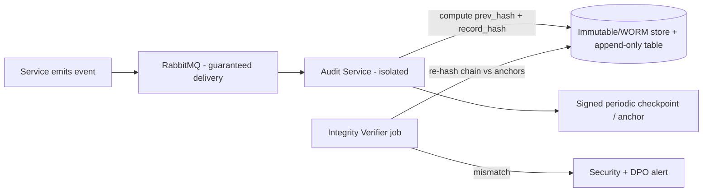

# 19 — Audit Strategy (Immutable Audit Trail)

[⬅ Back to Index](00-README-INDEX.md) · [Design Foundations](0A-DESIGN-FOUNDATIONS.md)

**Siblings:** [10-role-matrix.md](10-role-matrix.md) · [11-permission-matrix.md](11-permission-matrix.md) · [18-security-model.md](18-security-model.md) · [20-compliance-checklist.md](20-compliance-checklist.md)

> **Scope.** This document defines HBMP's immutable audit trail: which events are captured, the event schema, how tamper-evidence is achieved (append-only + hash-chaining + WORM), correlation/tracing, retention and legal hold, audit support for data-subject requests, who may read audit (and that audit reads are themselves audited), reporting/access reviews, and the isolation of the audit service. Audit is a first-class HIPAA/GDPR control (accountability, integrity) and underpins the access model in [11](11-permission-matrix.md).

---

## 1. Purpose & principles

The audit trail exists to guarantee **accountability**, **tamper-evidence**, **detection**, and **evidentiary support** for regulatory obligations (HIPAA §164.312(b) audit controls; GDPR Art. 5(2) accountability, Art. 30 records of processing, Art. 32 integrity). Principles:

- **Everything sensitive is attributable** — every action ties to an authenticated individual (no shared accounts, per [18 §10](18-security-model.md)).
- **Log the read, not just the write** — reads of PHI are audited, because *access* is the risk for refugee health data.
- **Append-only & immutable** — audit records are never updated or deleted within retention; tamper is detectable.
- **Separation of duties** — the audit service is isolated; those who generate events cannot alter the log; audit access is itself audited.
- **Minimize inside the log** — audit records reference resources and capture *what field-class* was accessed, avoiding copying raw PHI content into the audit store where possible.

---

## 2. What is audited

| Category | Examples |
|---|---|
| **Authentication & session** | Login success/failure, MFA challenge/result, step-up, token issue/refresh/revoke, logout, lockout, risky sign-in |
| **Authorization decisions** | Policy allow/deny (esp. denies), ABAC condition outcomes, SoD blocks |
| **PHI/PII read access** | Every read of clinical/financial/PII objects and sensitive fields (who, which beneficiary, which field-class, purpose) |
| **All writes** | Create/update/delete of beneficiary, EMR, notes, diagnoses, orders, prescriptions, results, claims |
| **Approvals & clinical decisions** | Approval request/approve/deny/override, medical-director appeals |
| **Consumption/fulfillment** | Specimen collection, result entry, dispense/consume against benefit |
| **Exports** | Any data export/download/bulk API (high severity) |
| **Admin actions** | User create/disable, role grant/revoke, policy bundle deploy, config change, IP/device policy change, key lifecycle events |
| **Break-glass** | Request, approval, activation, every access under grant, expiry, review |
| **Data-subject & compliance** | DSAR intake, access/rectification/erasure/portability actions, consent changes, legal hold set/release |
| **Security events** | Rate-limit trips, WAF blocks, anomaly alerts, integrity-check results |

**Read-of-PHI is mandatory.** Per [18 §4](18-security-model.md), the service layer emits an audit event on every allowed read of a T2/T3 object/field, capturing the *field-class* accessed (e.g., `diagnosis`, `lab_result`) — not necessarily the value.

---

## 3. Event schema

Canonical, versioned JSON schema. Emitted by services to the audit service (async via RabbitMQ, with guaranteed delivery). PHI values are avoided; references + field-class are used.

```json
{
  "event_id": "uuid-v7",
  "schema_version": "1.0",
  "timestamp": "2026-07-21T10:15:03.221Z",     // UTC, trusted time source
  "correlation_id": "trace-...",                 // W3C trace context
  "actor": {
    "sub": "keycloak-subject-id",
    "role": "doctor",
    "tenant_id": "mersal",
    "provider_id": "prov-123|null",
    "session_id": "...",
    "auth": { "mfa": true, "acr": "step-up", "amr": ["fido2"] },
    "device_compliant": true,
    "src_ip": "x.x.x.x"
  },
  "action": "read",                              // create|read|update|delete|approve|consume|export|login|grant...
  "resource": {
    "type": "emr_record",
    "id": "res-...",
    "beneficiary_ref": "ben-...",                // pseudonymous reference
    "field_classes": ["diagnosis","emr_note"],   // WHAT class accessed, not value
    "order_status": "open|null"
  },
  "decision": {
    "outcome": "allow",                          // allow|deny
    "policy_id": "hbmp.emr:default",
    "conditions": ["TEN","TR","MFA"],            // ABAC codes satisfied
    "reason_code": "treating_relationship"
  },
  "purpose": "treatment",                        // treatment|utilization_review|payment|admin|dsar...
  "break_glass": { "active": false, "grant_id": null },
  "severity": "info",                            // info|notice|high|critical
  "source_service": "emr",
  "prev_hash": "sha256:....",                    // hash-chain link
  "record_hash": "sha256:...."                   // hash of this record (excl. record_hash)
}
```

Notes: `beneficiary_ref` is a pseudonymous token; re-identification requires a separately-controlled mapping (data minimization inside audit). `field_classes` supports "what category of data was seen" reporting without duplicating PHI.

---

## 4. Immutability, hash-chaining & WORM

Defense-in-depth for tamper-evidence:

1. **Append-only store** — audit persisted to a write-once/append-only medium: **MinIO object-lock (WORM) with legal-hold/retention policies** and/or an append-only table with no UPDATE/DELETE grants. Service identities have **write-only** (insert) permission; no principal has update/delete within retention.
2. **Hash-chaining** — each record includes `prev_hash` (hash of the previous record in its partition) and `record_hash` (hash of its own canonicalized content). Any alteration breaks the chain and is detectable.
3. **Periodic anchoring** — chain head hashes are periodically signed and anchored (e.g., signed checkpoint written to a separate, restricted store / notarized), so even wholesale rewrites are detectable.
4. **Independent verifier** — a scheduled integrity job re-computes the chain and compares to anchors; mismatches raise **critical** alerts to Security + DPO.
5. **Encryption** — audit at rest AES-256 with keys in OpenBao/Vault ([18 §5](18-security-model.md)); in transit TLS/mTLS.
6. **No PHI-in-clear duplication** — minimizes blast radius if audit is exfiltrated.



---

## 5. Correlation, tracing & completeness

- **Correlation IDs:** W3C Trace Context (`traceparent`) propagated from gateway through services; every audit event carries `correlation_id`, enabling reconstruction of a full request across microservices.
- **End-to-end tie-in:** OpenTelemetry (Tempo/Jaeger) distributed tracing shares the correlation ID, linking operational telemetry to audit without mixing the two stores.
- **Guaranteed delivery:** events flow via RabbitMQ with at-least-least-once delivery + idempotent writes (dedup by `event_id`); dead-letter handling + alerting ensures no silent audit loss. A missing-heartbeat monitor detects a service that stops emitting.
- **Time integrity:** trusted UTC time source; clock-skew monitoring.

---

## 6. Retention, legal hold & minimization

| Data | Baseline retention | Notes |
|---|---|---|
| Security/auth audit | Long (e.g., ≥ 6 years, aligned to HIPAA-style expectations) | Validate against Egyptian law + Mersal policy with counsel ([20](20-compliance-checklist.md)) |
| PHI access audit | Retained per health-record retention policy | Support DSAR + investigations |
| Break-glass & admin | Extended retention | High-scrutiny events |
| Audit-of-audit (reads of the log) | Same as underlying audit | Immutable |

- **Legal hold:** holds can be *set* (extending retention, preventing expiry) but never used to delete; hold set/release is itself audited. WORM time-based + legal-hold policies on the immutable store.
- **Storage limitation (GDPR Art. 5(1)(e)):** beyond retention, records are securely disposed via controlled, audited processes; audit minimization (references not raw PHI) limits stored sensitive content.
- **Retention schedule** is documented in [20 §Data-Retention](20-compliance-checklist.md) and owned by the DPO.

---

## 7. Who can read audit, and audit-of-audit

- **Restricted readers:** only designated **Security/Compliance/DPO** roles and (scoped) **Org/Super Admin for access-review views**. No clinical, finance, provider, or reception role can read the audit trail. Beneficiaries receive audit-derived information only through the formal DSAR process, not direct access.
- **Read-only:** even authorized readers have **no write/delete** on audit.
- **Audit is itself audited:** every read/query/export of the audit store emits its own audit event (`audit.read`, `audit.export`) — captured in the same immutable chain. This closes the "who watched the watchers" gap.
- **Separation of duties:** the audit reader role is incompatible with the audit-service operator role and with roles that generate high-risk events (e.g., a Super Admin doing break-glass cannot also be the sole reviewer of their own break-glass — dual review, per [18 §11](18-security-model.md)).

---

## 8. Reporting & access reviews

- **Access reviews:** periodic (quarterly for T3/T4) reviews driven by audit data — who accessed which beneficiaries, break-glass usage, dormant high-privilege accounts, SoD exceptions. Reviewers attest; findings tracked.
- **Anomaly detection:** patterns like a clinician reading many non-treated beneficiaries, off-hours bulk reads, repeated denies, or unusual export volume raise alerts (Prometheus/Grafana/Loki + custom rules).
- **Standard reports:** PHI-access-by-beneficiary, break-glass register, admin-change log, export register, failed-auth trends, policy-deny hotspots.
- **DSAR support:** ability to produce, for a given beneficiary, the record of who accessed their data and processing activities (see §9).

---

## 9. Audit for data-subject / rights requests

Supports GDPR (Arts. 15–22) / PDPL / UNHCR-aligned rights, coordinated with [20](20-compliance-checklist.md):

| Request | How audit supports it |
|---|---|
| **Access (Art. 15)** | Produce processing record + access log for the beneficiary (via `beneficiary_ref` mapping under controlled access). |
| **Rectification (Art. 16)** | Corrections are new write events; history preserved (append-only), showing before/after via event chain. |
| **Erasure (Art. 17)** | Erasure of underlying PHI is executed and *the erasure action itself is audited*; audit references (pseudonymous) are retained where legally required for accountability, balancing erasure vs. retention obligations (legal review required). |
| **Restriction (Art. 18)** | Restriction flags and their enforcement are audited. |
| **Portability (Art. 20)** | Export actions audited as `data.export` with scope. |
| **Objection / consent (Art. 7/21)** | Consent changes and objections logged with timestamp + actor. |

All DSAR actions are logged with `purpose = "dsar"` and reviewed.

---

## 10. Audit-service isolation

- **Separate bounded service (`audit`)** with its own datastore, private endpoints, and dedicated workload identity (Kubernetes ServiceAccount) ([18 §7](18-security-model.md)).
- **Write-only ingress** from other services (via RabbitMQ); **no** service can update/delete audit records.
- **Distinct blast radius:** compromise of a business service does not grant audit tampering (different identities, WORM, hash-chain, anchors).
- **Independent operations:** audit-service operators (infra) are separated from audit-readers (compliance) — operators keep it running but cannot read PHI-linked content beyond what their role permits; readers query but cannot operate/alter storage.
- **Backups:** immutable, encrypted, tested restore.

---

## 11. Audit event catalog (representative)

| Event code | Category | Severity | Key fields | Emitted by |
|---|---|---|---|---|
| `auth.login.success` | Auth | info | actor, amr, src_ip | identity |
| `auth.login.failure` | Auth | notice | actor(attempted), reason | identity |
| `auth.mfa.stepup` | Auth | info | actor, acr | identity |
| `authz.deny` | AuthZ | notice | actor, resource, conditions, reason | any service |
| `phi.read` | PHI access | notice | actor, beneficiary_ref, field_classes, purpose | emr/orders |
| `phi.write` | PHI write | notice | actor, resource, action, field_classes | emr/orders |
| `diagnosis.create` | Clinical write | notice | actor(doctor), beneficiary_ref | emr |
| `order.route` | Orders | info | order_id, routed_to, field_classes(minimized) | orders |
| `result.enter` | Consumption | notice | actor(lab/imaging), order_id | orders |
| `prescription.dispense` | Consumption | notice | actor(pharmacy), rx_id | orders |
| `approval.decision` | Approvals | high | actor, case_id, outcome, SoD_clear | approvals |
| `approval.override` | Approvals | high | actor(director), case_id, rationale | approvals |
| `claim.process` | Finance | notice | actor(finance), claim_id (no diagnosis) | reporting |
| `payment.release` | Finance | high | actor, payment_id, SoD_clear | reporting |
| `data.export` | Export | high | actor, scope, masked | any |
| `admin.role.grant` | Admin | high | actor, subject, role, justification | identity |
| `admin.policy.deploy` | Admin | high | actor, bundle_version | identity |
| `key.rotate` | Admin | high | actor, key_id | identity/OpenBao |
| `breakglass.request` | Break-glass | high | actor, reason, target | identity |
| `breakglass.activate` | Break-glass | critical | actor, grant_id, approver | identity |
| `breakglass.read` | Break-glass | critical | actor, beneficiary_ref, field_classes | emr |
| `audit.read` | Audit-of-audit | high | actor(compliance), query | audit |
| `audit.export` | Audit-of-audit | critical | actor, scope | audit |
| `integrity.mismatch` | Security | critical | partition, expected/actual hash | audit verifier |
| `dsar.action` | Compliance | high | actor, beneficiary_ref, request_type | patient/document |
| `legalhold.set` | Compliance | high | actor, scope | audit |
| `ProfileViewed` | PHI access | notice | actor, beneficiary_ref, **sections served + sections withheld**, purpose | profile |
| `ProfileSummaryExported` | Export | high | actor, beneficiary_ref, sections served | profile |
| `IdentityPhotoViewed` | PHI access | notice | actor, beneficiary_ref, link_id | profile/policy |
| `CallSummaryCopied` | Export | high | actor, beneficiary_ref, call_refs[], level | callcentre |


### Phase 20 — three events that are not "reads"

**`ProfileViewed` names the sections WITHHELD as well as the ones served.** An event recording only what was
returned cannot distinguish "did not look" from "was not allowed to look", and an access review asks the second
question far more often than the first.

**`CallSummaryCopied` and `ProfileSummaryExported` are logged as EXPORTS, not reads**, at high severity.
Putting a patient's record on the clipboard or on paper is the moment it leaves the platform's control — it is
the last event the platform will ever record about that data, and it is categorically different from looking at
a screen. A copy triggered client-side from an already-served row still emits it: "the data was already on
screen" is exactly the reasoning that would make the export trail incomplete.

**`IdentityPhotoViewed` exists because a face is not an ordinary field.** Every retrieval is a disclosure of a
person's likeness to a named user at a named time — precisely what a data-subject access request asks about,
and for a refugee population precisely what a protection concern turns on.

---

## 12. Cross-references
- Actions/fields that trigger audit → **[11-permission-matrix.md](11-permission-matrix.md)**
- Enforcement points that emit events, break-glass, isolation → **[18-security-model.md](18-security-model.md)**
- Roles allowed to read audit / SoD → **[10-role-matrix.md](10-role-matrix.md)**
- Retention/DSAR/breach regulatory mapping → **[20-compliance-checklist.md](20-compliance-checklist.md)**

> Audit design supports compliance but does not by itself constitute legal compliance. Retention periods and DSAR handling must be validated with legal counsel and the DPO.
