# 23 — State Machines (Lifecycles)

> Part of the **Mersal Healthcare Benefit Management Platform (HBMP)** design workspace.
> Back to: [00-README-INDEX.md](00-README-INDEX.md) · [0A-DESIGN-FOUNDATIONS.md](0A-DESIGN-FOUNDATIONS.md)
> Siblings: [05-business-process-maps.md](05-business-process-maps.md) · [06-bpmn-diagrams.md](06-bpmn-diagrams.md) · [24-sequence-diagrams.md](24-sequence-diagrams.md)

Formal `stateDiagram-v2` models plus transition tables for every core HBMP lifecycle. Each table lists **from-state · event · guard/condition · to-state · side-effects/emitted event · actor/role · audit note**. The **atomic-consume guard** and **no-reuse invariant** are emphasized in the Investigation Order and Prescription sections.

**Global invariants (apply to all lifecycles):**
- Every transition writes an append-only record to `audit-service` (actor, timestamp, from/to, correlationId, justification where required).
- Consume/dispense transitions are **atomic** and **idempotent**; replays with the same `consumeToken` return the prior outcome without state change.
- Illegal transitions are rejected and audited as `TransitionDenied`.

---

## 1. Beneficiary / Member Lifecycle

Canonical: `Pending → Active → (Suspended | Expired | Blocked | Inactive)`.

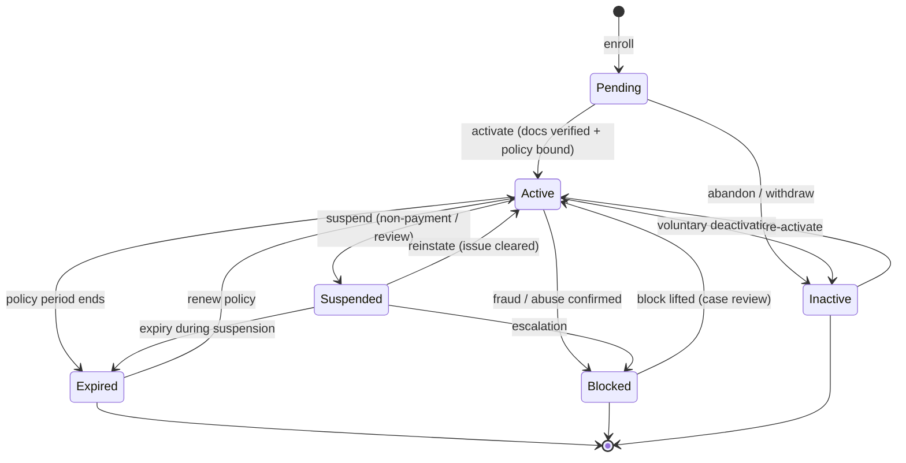

| From | Event | Guard / Condition | To | Side-effects / Emitted Event | Actor / Role | Audit note |
|---|---|---|---|---|---|---|
| — | enroll | valid intake | Pending | `MemberCreated` | Registration | Dedup check recorded |
| Pending | activate | documents verified AND policy bound | Active | `MemberActivated`; issue card | Registration | Verification evidence linked |
| Pending | abandon | no docs within window | Inactive | `MemberAbandoned` | System (timer) | Auto-timeout audited |
| Active | suspend | non-payment / compliance hold | Suspended | `MemberSuspended` | Case Manager / Finance | Reason mandatory |
| Active | expire | policy end date reached | Expired | `MemberExpired` | System (timer) | — |
| Active | block | fraud/abuse confirmed | Blocked | `MemberBlocked` | Super Admin / Director | Justification mandatory |
| Active | deactivate | beneficiary request | Inactive | `MemberDeactivated` | Registration | — |
| Suspended | reinstate | issue cleared | Active | `MemberReinstated` | Case Manager | — |
| Expired | renew | new policy period bound | Active | `MemberRenewed` | Registration / policy-service | — |
| Blocked | unblock | case review clears | Active | `MemberUnblocked` | Director | Review decision linked |
| Inactive | reactivate | eligibility re-confirmed | Active | `MemberReactivated` | Registration | — |

---

## 2. Investigation Order Lifecycle

Canonical: `Requested → PendingApproval → (Approved | Rejected) → Active → PartiallyUsed → Completed`; plus `Expired`, `Cancelled`.

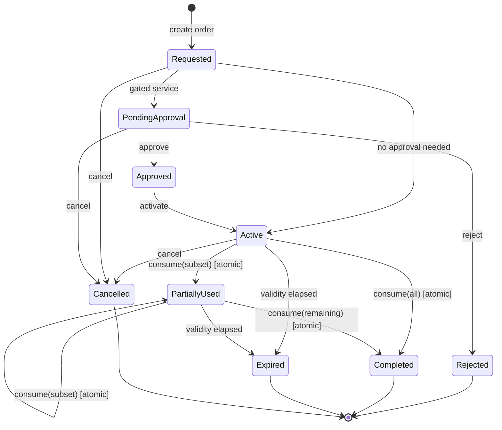

| From | Event | Guard / Condition | To | Side-effects / Emitted Event | Actor / Role | Audit note |
|---|---|---|---|---|---|---|
| — | create | valid encounter | Requested | `OrderCreated` | Doctor | Linked to encounter |
| Requested | route-approval | service is gated | PendingApproval | `OrderPendingApproval` | orders-service | — |
| Requested | auto-activate | not gated | Active | `OrderActivated` | orders-service | — |
| PendingApproval | approve | policy + clinical OK | Approved | `OrderApproved` | Approval Team | Decision linked |
| PendingApproval | reject | out of policy | Rejected | `OrderRejected` | Approval Team | Reason mandatory |
| Approved | activate | — | Active | `OrderActivated` | orders-service | — |
| Active / PartiallyUsed | **consume(subset)** | **line unused AND token unseen (atomic, idempotent)** | PartiallyUsed | `OrderLinesConsumed`; unused lines stay available | Lab / Imaging | `(orderId,lineId,consumeToken)` recorded; **no-reuse** enforced |
| Active / PartiallyUsed | **consume(all/remaining)** | **all remaining lines unused (atomic)** | Completed | `OrderCompleted` | Lab / Imaging | Duplicate consume impossible |
| Active / PartiallyUsed | expire | validity window elapsed | Expired | `OrderExpired` | System (timer) | Unused lines voided |
| Requested / PendingApproval / Active | cancel | not yet fully consumed | Cancelled | `OrderCancelled` | Doctor / Case Manager | Reason recorded |

### Atomic-consume guard (invariant detail)
- **Precondition:** target line state ∈ {available} AND `consumeToken` not previously applied.
- **Effect:** selected lines → used, in a single atomic transaction; order recomputes to `PartiallyUsed` or `Completed`.
- **Idempotency:** replaying the same `consumeToken` returns the prior result; no double-consume, no billing twice.
- **No-reuse:** a `used` line can never return to `available`; only `Cancelled`/`Expired` void *unused* lines.

---

## 3. Prescription Lifecycle

Canonical: `Draft → Submitted → (Approved | Rejected) → PartiallyDispensed → Dispensed`; plus `Expired`, `Cancelled`.

> **Validation states are NOT prescription states (26.3).** A line carries a check status — `Ok`, `Warning`,
> `Blocked`, `NotChecked`, `Unavailable` — which describes what the engine could determine, not where the
> prescription is in its lifecycle. They are orthogonal on purpose: a prescription in `Draft` may carry any
> of the five, and validation never moves the prescription between states. What the check status governs is
> whether **submit** is permitted at all — see the `Draft → Submitted` guard below.
>
> `NotChecked` and `Unavailable` are not answers and never render as `Ok`; only a **benefit** rule can
> produce `Blocked` (doc 43 §8 invariants 1–2, ADR-0032).
>
> **Severity gates the submit, not the state (28.4, doc 44 §2, ADR-0037).** Every clinical finding used to
> require a typed acknowledgement before `Draft → Submitted`, so a contraindicated combination and a trivial
> one demanded the same click — the documented route to override rates above 90%, where clinicians learn to
> dismiss both. Only **Contraindicated** and **Major** now gate the transition; **Moderate** renders beside
> the line and **Minor** collapses, and neither stands between the prescriber and submit. A finding with NO
> severity still gates: a manufacturer label states an effect rather than a rank, and treating "ungraded" as
> "not serious" would be the engine inventing a judgement it has no source for.
>
> This changes **interruption**, never blocking. `ClinicalState` still has no `Blocked` member, so a clinical
> check remains structurally incapable of refusing a prescription.

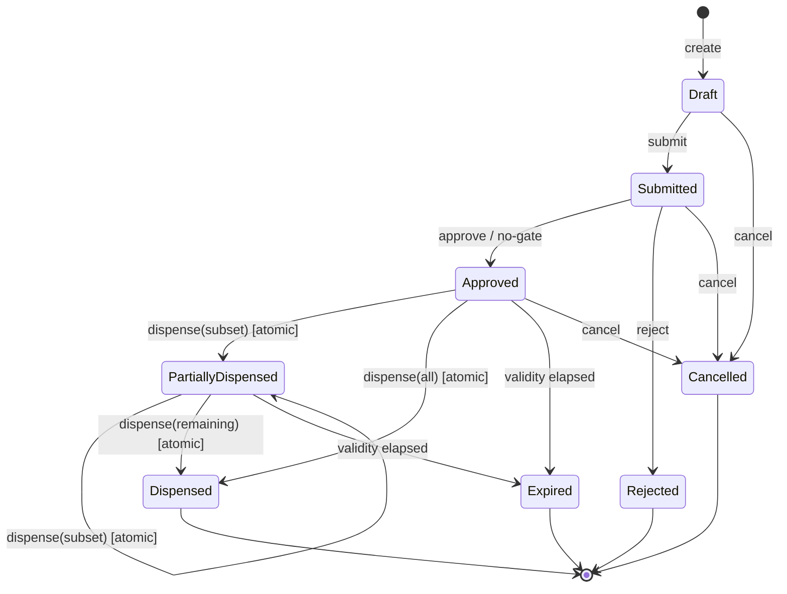

| From | Event | Guard / Condition | To | Side-effects / Emitted Event | Actor / Role | Audit note |
|---|---|---|---|---|---|---|
| — | create | valid encounter | Draft | `RxCreated` | Doctor | — |
| Draft | **validate** (26.4) | ≥1 line with a real `drug_id` | Draft (unchanged) | `prescription_validation` row, `step='Step1'` | Doctor | **Advisory.** Persists no draft prescription; its verdict is display state and is never an input to submit |
| Draft | submit | complete lines **AND every Warning acknowledged with a reason AND no Blocked finding** | Submitted | `RxSubmitted`; `prescription_validation` `step='Step2'`; `prescription_line_override` per acknowledgement | Doctor | **The server re-validates from scratch and ignores any client-supplied verdict** (doc 43 §5). 422 `unacknowledged-warning` or `blocked-by-benefit-rule` otherwise |
| Submitted | approve | within policy OR not gated | Approved | `RxApproved` | Approval Team / auto | — |
| Submitted | reject | out of policy | Rejected | `RxRejected` | Approval Team | Reason mandatory |
| Approved / PartiallyDispensed | **dispense(subset)** | **line unused AND token unseen (atomic); substitution only from approved list** | PartiallyDispensed | `RxLinesDispensed`; remaining lines available | Pharmacy | Substitution + OOS captured |
| Approved / PartiallyDispensed | **dispense(all/remaining)** | **all remaining lines unused (atomic)** | Dispensed | `RxDispensed` | Pharmacy | Duplicate dispense impossible |
| Approved / PartiallyDispensed | expire | validity window elapsed | Expired | `RxExpired` | System (timer) | Pharmacy must reject if presented |
| Draft / Submitted / Approved | cancel | not fully dispensed | Cancelled | `RxCancelled` | Doctor / Case Manager | Reason recorded |
| Expired / Completed(Dispensed) | present-at-pharmacy | — | (no transition) | `RxRejectedPresentation` | Pharmacy | **Reject expired/completed** |

### Pharmacy-specific guards
- **Partial dispensing:** allowed; unfilled lines remain `available` for a later visit.
- **Substitution:** only with a policy-approved alternative (policy-service); otherwise route to approvals.
- **Out-of-stock:** triggers backorder/partial without consuming the unfilled line.
- **Reject rule:** any presentation of an `Expired`, `Cancelled`, `Rejected`, or fully `Dispensed` prescription is rejected and audited.

---

## 4. Referral Lifecycle

Canonical: `Requested → Accepted → Scheduled → Completed`; plus `Cancelled`, `Expired`.

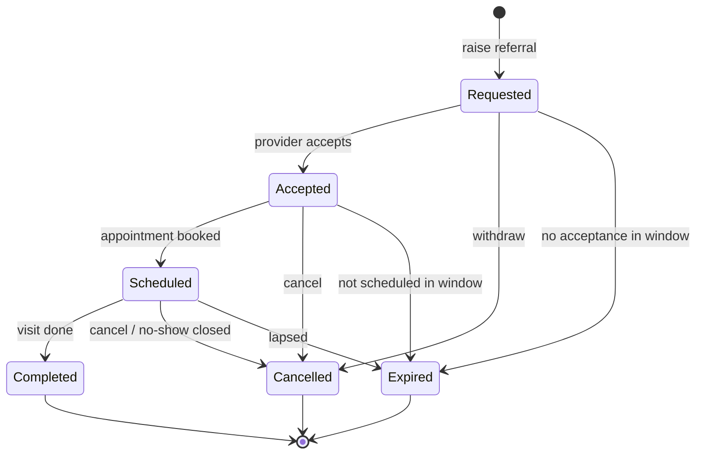

| From | Event | Guard / Condition | To | Side-effects / Emitted Event | Actor / Role | Audit note |
|---|---|---|---|---|---|---|
| — | raise | clinical need | Requested | `ReferralRequested` | Doctor | Target specialty set |
| Requested | accept | receiving provider available | Accepted | `ReferralAccepted` | Network provider / Appointment | — |
| Requested | expire | no acceptance in window | Expired | `ReferralExpired` | System (timer) | — |
| Accepted | schedule | slot booked | Scheduled | `ReferralScheduled` | Appointment Team | Links appointment |
| Scheduled | complete | consultation performed | Completed | `ReferralCompleted` | Doctor | Encounter linked |
| Scheduled | no-show-close | no-show threshold | Cancelled | `ReferralCancelled` | Appointment Team | Ref X3 no-show handling |
| Any active | cancel | — | Cancelled | `ReferralCancelled` | Doctor / Case Manager | Reason recorded |

---

## 5. Authorization Lifecycle

Canonical: `Draft → Submitted → UnderReview → (Approved | PartiallyApproved | Rejected | InfoRequested)`; plus `Overridden`, `EmergencyApproved`, `Expired`.

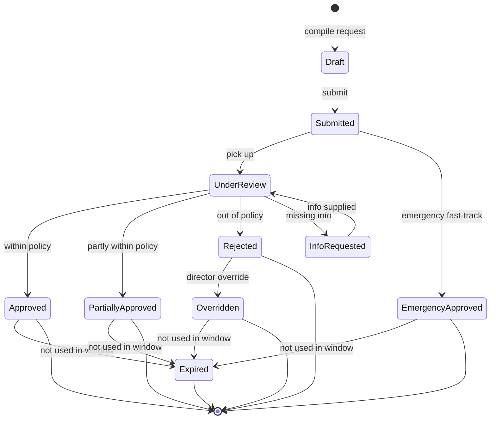

| From | Event | Guard / Condition | To | Side-effects / Emitted Event | Actor / Role | Audit note |
|---|---|---|---|---|---|---|
| — | compile | gated service | Draft | `AuthDrafted` | Doctor / Case Manager | — |
| Draft | submit | justification present | Submitted | `AuthSubmitted` | Requester | — |
| Submitted | fast-track | emergency flag | EmergencyApproved | `AuthEmergencyApproved` | Director | **Retrospective review required** |
| Submitted | pick-up | reviewer assigned | UnderReview | `AuthUnderReview` | Approval Team | SLA timer starts |
| UnderReview | approve | fully within policy | Approved | `AuthApproved` | Approval Team | — |
| UnderReview | partial-approve | partly within policy | PartiallyApproved | `AuthPartiallyApproved` | Approval Team | Approved scope itemized |
| UnderReview | reject | out of policy | Rejected | `AuthRejected` | Approval Team | Reason mandatory |
| UnderReview | request-info | missing evidence | InfoRequested | `AuthInfoRequested` | Approval Team | — |
| InfoRequested | resupply | info provided | UnderReview | `AuthInfoSupplied` | Requester | — |
| Rejected | override | director authority | Overridden | `AuthOverridden` | Medical Director | **Justification mandatory** |
| Approved / PartiallyApproved / Overridden / EmergencyApproved | expire | not consumed in window | Expired | `AuthExpired` | System (timer) | — |
| — | dispense / consume | a counter handed something over | **Issued** | `FulfilmentRecorded` → the authorization register | System (fulfilment consumer) | `kind='Fulfilment'`; see below |

### 5.1 `Issued` — the fulfilment authorization (ADR-0034)

Dispensing a prescription line, or consuming an investigation-order line, **issues an authorization**
recording what was actually delivered, separate from the clinical instruction it was delivered against.

**`Issued` is outside the machine above, deliberately.** No transition targets it and none leaves it: there
is nothing for a reviewer to approve, because the medicine is already in the patient's hand. Allowing one to
be assigned would put settled work in the review queue and start an SLA clock on a question nobody asked, so
`AuthorizationWorkflow` admits no edge in either direction and a DB CHECK pins `kind = 'Fulfilment'` ⇔
`status = 'Issued'`.

One authorization per prescription (per order), accumulating one `authorization_item` per fulfilment — a
member collecting a fortnight's medication over two visits has one authorization with two items, not two
that whoever reads them has to add up. A **substitution lands on the item and nowhere else**: `ordered_code`
and `fulfilled_code` are separate columns ([22 §9.2b](22-data-dictionary.md)), and the fulfilment path never
writes to `prescription_line`.

---

## 6. Appointment / Encounter Lifecycle

Supporting lifecycle for scheduling and the clinical visit (aligns with P3/P4 and X3).

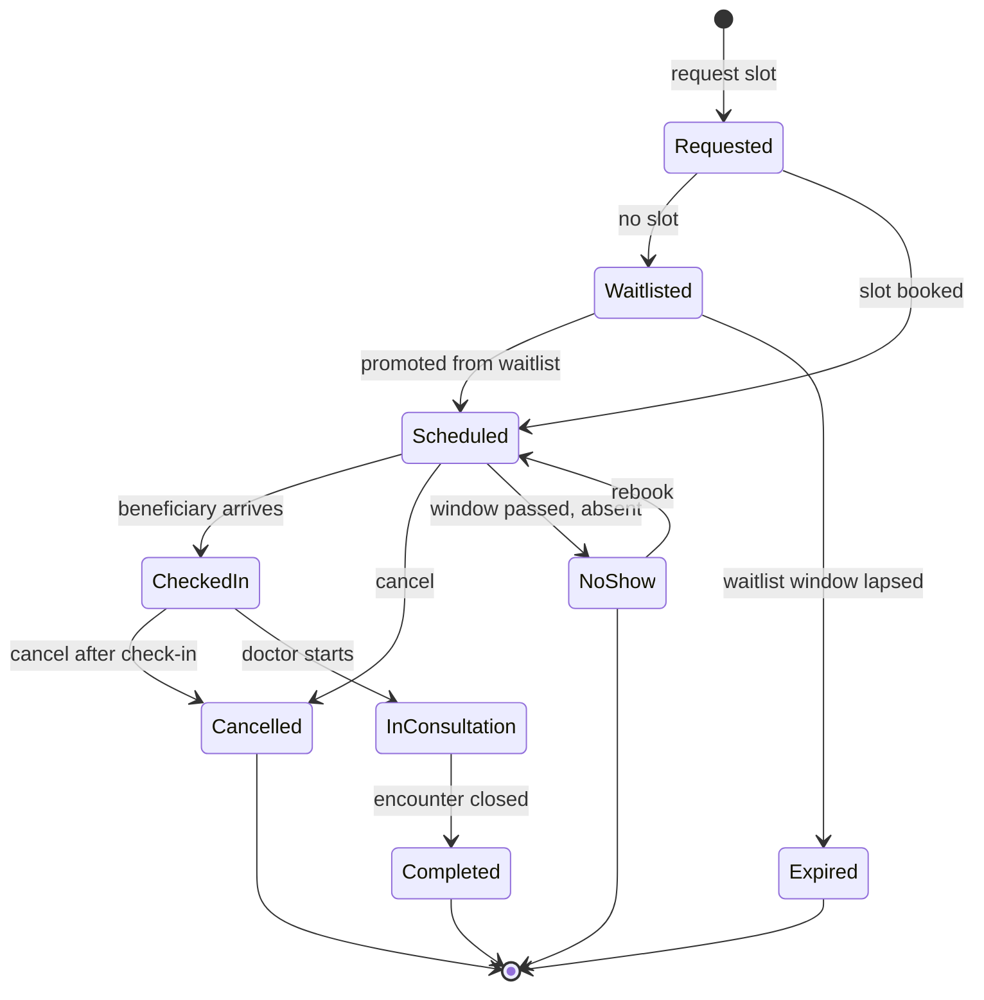

| From | Event | Guard / Condition | To | Side-effects / Emitted Event | Actor / Role | Audit note |
|---|---|---|---|---|---|---|
| — | request | eligible (ref P2) | Requested | `ApptRequested` | Call Center / Appointment | — |
| Requested | waitlist | no slot available | Waitlisted | `ApptWaitlisted` | provider-service | Priority score stored |
| Requested / Waitlisted | book / promote | slot available (by priority) | Scheduled | `ApptScheduled`; send reminders | Appointment Team | Promotion order audited |
| Waitlisted | expire | window lapsed | Expired | `ApptWaitlistExpired` | System (timer) | — |
| Scheduled | check-in | beneficiary arrives | CheckedIn | `ApptCheckedIn` | Reception / Nurse | — |
| Scheduled | no-show | grace passed, absent | NoShow | `ApptNoShow`; free slot; promote waitlist | Appointment Team | Ref X3 |
| NoShow | rebook | within re-booking policy | Scheduled | `ApptRebooked` | Call Center | Repeat no-shows → Case Manager |
| CheckedIn | start | doctor available | InConsultation | `EncounterStarted` | Doctor / Nurse | — |
| InConsultation | close | documentation complete | Completed | `EncounterCompleted`; emit orders/rx/referral | Doctor | AND-join on emitted artifacts (ref 06) |
| Scheduled / CheckedIn | cancel | — | Cancelled | `ApptCancelled`; free slot | Any | Reason recorded |

---

### 6b. The licence and roster gates on booking *(Phase 25 — see [42 §3/§4](42-branch-management.md))*

Two conditions now stand between an availability rule and a bookable slot, and both are evaluated **as at the
slot date**, not as at today.

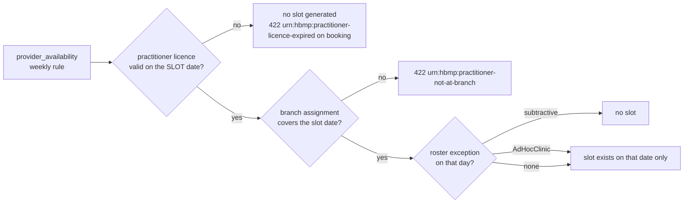

**Availability is computed in exactly ONE function** (`SlotGeneration.Generate`) — the doctor picker,
`/booking/doctor-availability`, `/appointment-days`, slot materialization and the booking validator all
resolve through it. A second implementation is the bug: the way that failure presents is a patient given an
appointment with a doctor who is on leave.

**Effect on an appointment already booked — it does NOT change state.** A lapsed licence or a newly recorded
closure sets `appointment.reassignment_needed_at` and leaves `status` exactly as it was. `Booked` stays
`Booked`; nothing transitions to `Cancelled`. **No automated process cancels a beneficiary's appointment** —
it lands on someone who may have no reliable phone number and has lost a day's pay to travel, and who cannot
tell a cancellation from being dropped. A person decides who covers the clinic; the flag is how they find out
they need to.

**The licence boundary is INCLUSIVE.** A licence expiring 30 September is valid *through* 30 September — a
doctor is not unlicensed on the last day printed on their own certificate — and the rule, the slot generator
and the flagging consumer are asserted to agree on both boundary days.

---

## 7. Claim Lifecycle

Canonical: `Draft → Submitted → UnderAdjudication → (Approved | PartiallyApproved | Denied) → Settled`; plus `PendingInfo`, `ClinicalReview`, `Appealed`, `Void`. Module design: [36-claims-management.md](36-claims-management.md).

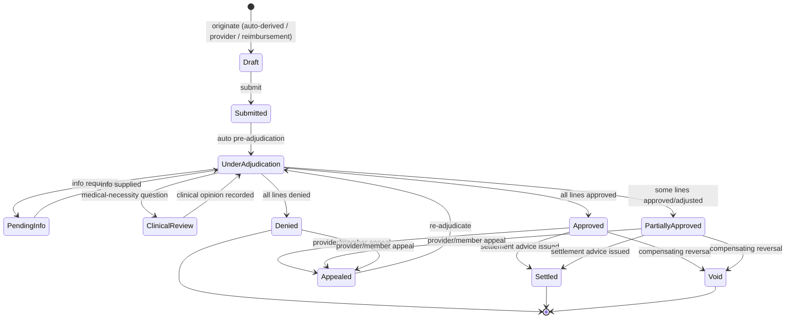

| From | Event | Guard / Condition | To | Side-effects / Emitted Event | Actor / Role | Audit note |
|---|---|---|---|---|---|---|
| — | originate | fulfillment/dispense record exists (or matched reimbursement) | Draft | `ClaimCreated` | claims-service / Provider / Reception | Origin channel recorded |
| Draft | submit | ≥ 1 line; beneficiary + service dates present | Submitted | `ClaimSubmitted` | Provider / claims-service | Submitted claims are immutable thereafter |
| Submitted | pre-adjudicate | rules run per line, **all** reasons collected | UnderAdjudication | `ClaimAdjudicated`; per-line `system_recommendation` | claims-service (rules engine) | `rule_version` stored on every line |
| UnderAdjudication | request-info | missing document/evidence | PendingInfo | `ClaimInfoRequested` | Claims Officer | Reason mandatory; SLA clock paused |
| PendingInfo | supply-info | document uploaded + scanned | UnderAdjudication | `ClaimInfoSupplied` | Provider / Beneficiary / Case Manager | Document link audited |
| UnderAdjudication | route-to-clinical | medical necessity in question | ClinicalReview | `ClaimRoutedToClinicalReview` | Claims Officer | **Officer never sees clinical content** |
| ClinicalReview | return-opinion | clinical opinion recorded (opinion ≠ payment decision) | UnderAdjudication | `ClaimClinicalOpinionRecorded` | Medical Approval / Director | Opinion stored in `approvals`, not `claims` |
| UnderAdjudication | decide | **every** line decided AND all approved | Approved | `ClaimApproved` | Claims Officer | Append-only `claim_decision` per line |
| UnderAdjudication | decide | **every** line decided AND mixed outcomes | PartiallyApproved | `ClaimPartiallyApproved` | Claims Officer | Reason code mandatory on each non-approve |
| UnderAdjudication | decide | **every** line decided AND all denied | Denied | `ClaimDenied` | Claims Officer | Coded reason + rationale mandatory |
| Approved / PartiallyApproved | settle | owning batch reached `SettlementIssued` | Settled | `ClaimSettled` | claims-service | Amounts frozen; **no money moves in-platform** |
| Approved / PartiallyApproved / Denied | appeal | appeal within window + new evidence | Appealed | `ClaimAppealed` | Provider / Beneficiary / Case Manager | Appeal reason recorded |
| Appealed | re-adjudicate | appeal accepted for review | UnderAdjudication | `ClaimAdjudicated` | Claims Officer (SoD: ≠ original decider) | Prior decisions preserved, never edited |
| Approved / PartiallyApproved | void | compensating reversal (error/fraud/duplicate) | Void | `ClaimVoided`; reversing `claim_adjustment` | Claims Reviewer (dual control) | **Justification mandatory**; original rows untouched |

### Claim guards (invariant detail)
- **Authorization gate:** a gated service is payable only against a valid, non-expired authorization in `Approved | PartiallyApproved | EmergencyApproved | Overridden`; a `PartiallyApproved` scope **caps** the payable lines (`NO_PRIOR_AUTH`, `AUTH_EXPIRED`, `EXCEEDS_AUTH_SCOPE`).
- **Fulfillment gate:** **no payable line without a fulfillment reference** (`order_fulfillment` / `dispense_event`); otherwise `NO_FULFILLMENT_RECORD` → manual assessment, never auto-approval.
- **Append-only decisions:** claims and decisions are never edited or deleted; corrections are `claim_adjustment` rows or a compensating `Void` + re-claim.
- **No re-decrement:** claims reconcile against `coverage_limit.consumed_value`; they never move it.
- **SoD:** the deciding officer is never the originator/submitter and is never affiliated with the claiming provider.

---

## 8. Claim Line Lifecycle

Canonical: `Pending → (Approved | PartiallyApproved | Denied | Adjusted)`; plus `Void`. Line decisions roll up to the claim (§7) and to the batch (§9).

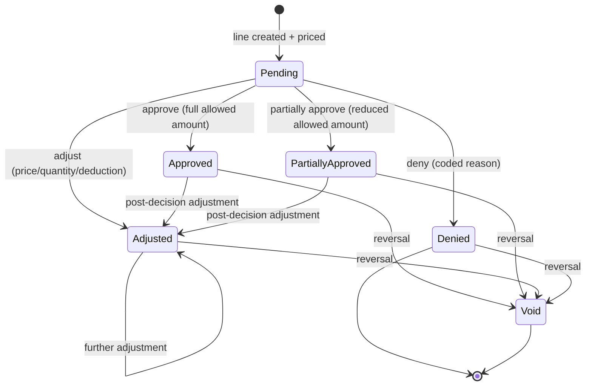

| From | Event | Guard / Condition | To | Side-effects / Emitted Event | Actor / Role | Audit note |
|---|---|---|---|---|---|---|
| — | create | **`UNIQUE(fulfillment_ref) WHERE status <> 'Void'`** holds; tariff resolved or `NO_TARIFF` flagged | Pending | `ClaimLineCreated` | claims-service | **No double-billing**; duplicates denied `DUPLICATE_CLAIM` |
| Pending | approve | recommendation clean; within auth scope + limits | Approved | `ClaimLineDecided`; `allowed_amount` set | Claims Officer | Append-only `claim_decision` (rule_version, correlation id) |
| Pending | partially-approve | allowed < billed (scope/limit/tariff cap) | PartiallyApproved | `ClaimLineDecided` | Claims Officer | **Reason code + rationale mandatory** |
| Pending | deny | any blocking reason code applies | Denied | `ClaimLineDecided` | Claims Officer | **Reason code + rationale mandatory** |
| Pending / Approved / PartiallyApproved / Adjusted | adjust | signed `amount_delta` ≠ 0; recovery references the original line | Adjusted | `ClaimAdjusted`; batch rollup recomputed | Claims Officer / Reviewer | Append-only `claim_adjustment`; before/after amounts audited |
| Any decided | void | compensating reversal only (never an edit) | Void | `ClaimLineVoided` | Claims Reviewer (dual control) | Frees the `fulfillment_ref` for a corrected re-claim |
| Denied | (re-decide) | via claim `Appealed` → re-adjudication only | Pending | `ClaimAdjudicated` | Claims Officer (≠ original decider) | New decision row; prior rows preserved |

### Claim-line guards (invariant detail)
- **Unique fulfillment reference:** at most one live (non-`Void`) payable line per `order_fulfillment`/`dispense_event` — the no-double-billing invariant, enforced by a partial unique index ([22 §10A.2](22-data-dictionary.md)).
- **Deny/adjust require evidence:** a coded reason **and** free-text rationale; overrides above the configured value threshold need a second approver (dual control).
- **No guessed prices:** missing tariff ⇒ `NO_TARIFF` → manual pricing, never an inferred amount.
- **Clinical firewall:** `NOT_MEDICALLY_NECESSARY` can only originate from a `ClinicalReview` opinion, never from the Claims Officer.

---

## 9. Claim Batch Lifecycle

Canonical: `Open → UnderReview → Decided → SettlementIssued → Closed`; plus `Cancelled`. A batch is the unit of review and settlement for one payee.

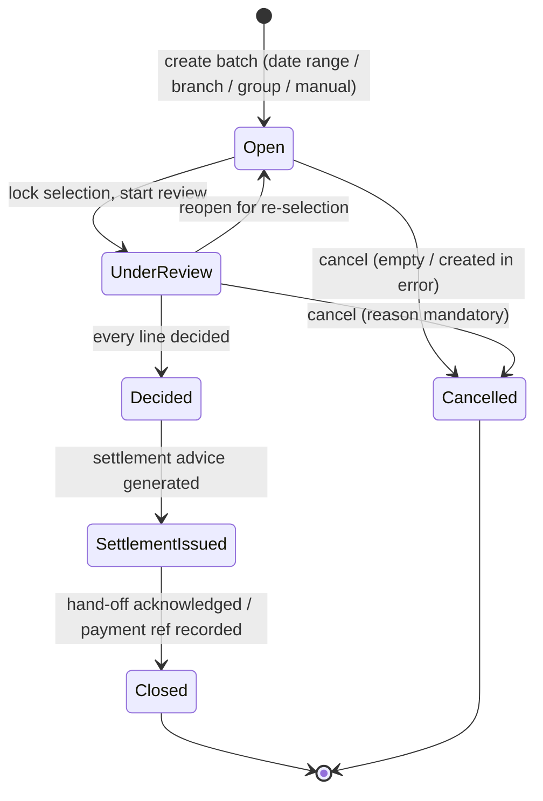

| From | Event | Guard / Condition | To | Side-effects / Emitted Event | Actor / Role | Audit note |
|---|---|---|---|---|---|---|
| — | create | payee homogeneous; **each claim in at most one open batch** | Open | `BatchCreated` | Claims Officer | Selection mode + selector recorded |
| Open | add / remove claim | claim not in another open batch; not already settled | Open | `BatchClaimAdded` / `BatchClaimRemoved` | Claims Officer | Removal audited |
| Open | start-review | ≥ 1 claim in batch | UnderReview | `BatchUnderReview` | Claims Officer | Selection locked; SLA timer starts |
| UnderReview | remove claim | **exception path** — reason mandatory | UnderReview | `BatchClaimRemoved` | Claims Reviewer | Audited as an exception |
| UnderReview | reopen | no decisions issued yet | Open | `BatchReopened` | Claims Reviewer | Reason recorded |
| UnderReview | decide | **every line of every claim has a recorded decision** | Decided | `BatchDecided`; rollup totals recomputed | Claims Reviewer | Totals snapshot audited |
| Decided | issue-settlement | totals reconciled; SoD: releaser ≠ batch creator | SettlementIssued | `SettlementAdviceIssued`; immutable doc to WORM bucket | Claims Reviewer / Finance | **Totals frozen**; export audited, no clinical fields |
| SettlementIssued | close | hand-off acknowledged; optional external payment reference recorded | Closed | `BatchClosed` | Finance | **Platform never executes payment** |
| Open / UnderReview | cancel | no settlement issued | Cancelled | `BatchCancelled`; claims released back to the pool | Claims Reviewer | Reason mandatory |

### Batch guards (invariant detail)
- **Decided requires completeness:** the batch cannot reach `Decided` while any line is still `Pending`.
- **One open batch per claim:** enforced by a partial unique index, so a claim can never be settled twice.
- **Frozen totals:** `total_claimed/priced/approved/adjusted/denied` and `net_payable` are recomputed on every decision/adjustment and **immutable from `SettlementIssued`**; later corrections go into a *new* batch as `Recovery`/`Clawback`.
- **Net payable ≥ 0** for a batch unless an explicit, dual-controlled approval is recorded.

---

## 10. Reimbursement Lifecycle (beneficiary out-of-pocket)

Canonical: `Submitted → OcrProcessing → (AutoMatched | ManualAssessment) → Adjudicating → (Approved | PartiallyApproved | Denied) → Paid (recorded)`; plus `Void`.

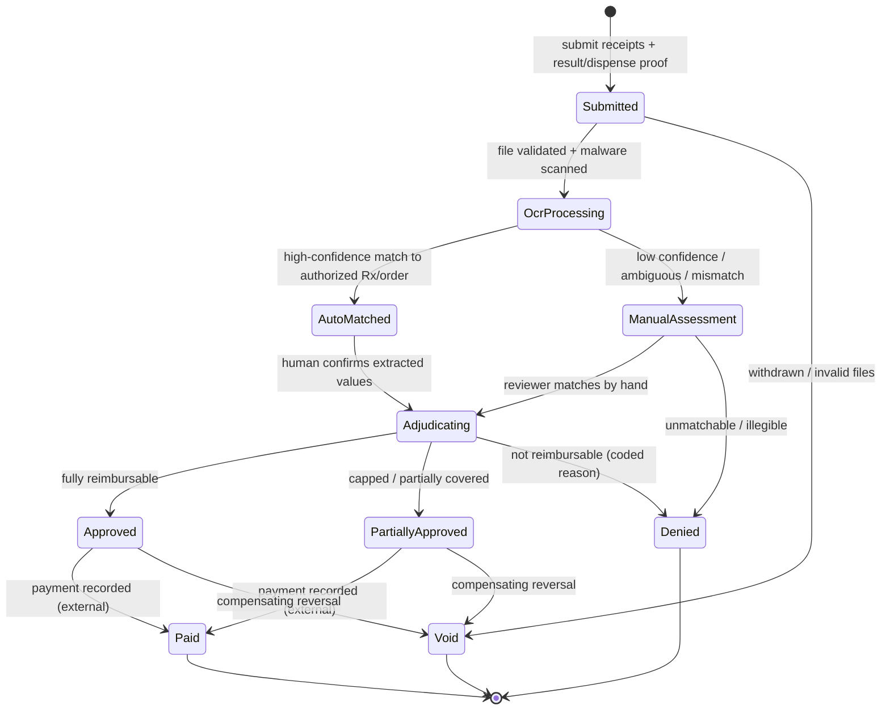

| From | Event | Guard / Condition | To | Side-effects / Emitted Event | Actor / Role | Audit note |
|---|---|---|---|---|---|---|
| — | submit | receipts + result/dispense proof attached | Submitted | `ReimbursementSubmitted` | Beneficiary / Reception / Case Manager | Documents stored encrypted in document-service |
| Submitted | scan-and-queue | file type/size valid AND malware scan clean | OcrProcessing | `ReimbursementOcrQueued` | document-service / claims-service | Rejected uploads audited |
| Submitted | withdraw / reject-files | withdrawn or unusable files | Void | `ReimbursementVoided` | Beneficiary / Claims Officer | Reason recorded |
| OcrProcessing | auto-match | confidence ≥ threshold AND match to an **authorized** order/prescription | AutoMatched | `ReimbursementMatched`; pre-fill claim lines | claims-service (`IDocumentOcrProvider`) | `match_confidence` + `match_method=AutoOcr` stored |
| OcrProcessing | route-manual | **low confidence OR any mismatch** | ManualAssessment | `ReimbursementRequiresManualAssessment` | claims-service | OCR is assistive — never auto-final |
| AutoMatched | confirm | **human accepts** each extracted value (`accepted_by`/`accepted_at`) | Adjudicating | `ClaimCreated` (origin `Reimbursement`) | Claims Officer | No OCR value affects money before confirmation |
| ManualAssessment | match-manually | reviewer links the authorized order/prescription | Adjudicating | `ReimbursementMatched` (`match_method=Manual`) | Claims Officer | Manual match justified |
| ManualAssessment | deny | unmatchable / illegible receipt | Denied | `ClaimDenied` | Claims Officer | `ILLEGIBLE_DOCUMENT` / `RECEIPT_MISMATCH` / `NO_FULFILLMENT_RECORD` |
| Adjudicating | approve | evidence complete; amount within cap | Approved | `ClaimApproved` | Claims Officer | Cap rule applied and audited |
| Adjudicating | partially-approve | receipt above cap or partially covered | PartiallyApproved | `ClaimPartiallyApproved` | Claims Officer | **Reason code + rationale mandatory** |
| Adjudicating | deny | no authorization / not covered / not rendered | Denied | `ClaimDenied` | Claims Officer | Coded reason mandatory |
| Approved / PartiallyApproved | record-payment | reimbursement batch settled externally | Paid (recorded) | `ReimbursementPaymentRecorded` | Finance | **Record only — platform moves no money**; no bank details stored |
| Approved / PartiallyApproved | void | compensating reversal | Void | `ClaimVoided` | Claims Reviewer (dual control) | Justification mandatory |

### Reimbursement guards (invariant detail)
- **OCR is assistive, never authoritative:** every extracted value carries a confidence score and source region; low confidence, ambiguity, or any mismatch **must** route to `ManualAssessment`, and a human confirms before anything affects money.
- **Payable cap:** reimbursement = **min(contract tariff, receipt amount)** unless the officer records an explicit, audited override with justification.
- **Evidence required:** an authorized underlying order/prescription (or an explicitly allowed non-gated category), a legible receipt, and proof the service was rendered — *existence* of a result/dispense record only, never its clinical content.

---

## 11. Report Access Request Lifecycle (sensitive result release)

Canonical: `Requested → UnderReview → (InfoRequested ⇄ UnderReview) → (Approved | Denied)`; an `Approved` request yields a time-boxed grant that ends `Expired` or `Revoked`. Module design: [37-branch-scoping-and-clinical-sensitivity.md](37-branch-scoping-and-clinical-sensitivity.md).

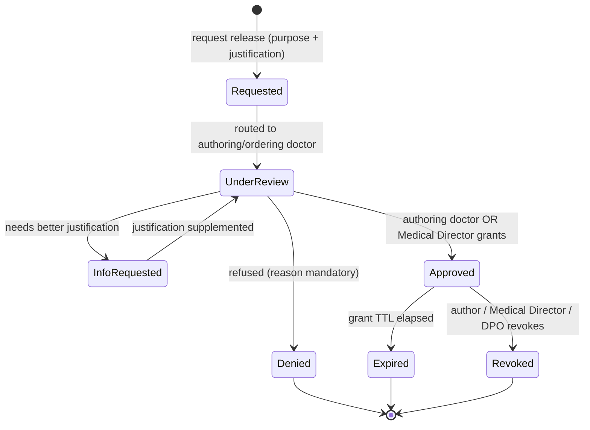

| From | Event | Guard / Condition | To | Side-effects / Emitted Event | Actor / Role | Audit note |
|---|---|---|---|---|---|---|
| — | request-release | **`purpose_code` AND `justification` both present** (absent ⇒ rejected at validation, never persisted); target is a single non-`Standard` result | Requested | `ReportAccessRequested`; notify authoring doctor | Requesting clinician / Approval Team / Case Manager | Requester, role, purpose, justification, `result_ref` recorded |
| Requested | route / pick-up | routed to the **authoring/ordering doctor**; Medical Director may pick up in parallel | UnderReview | (no new event; SLA timer starts) | orders-service / Authoring Doctor / Medical Director | Decider identity recorded |
| UnderReview | request-info | justification insufficient | InfoRequested | `ReportAccessInfoRequested`; notify requester | Authoring Doctor / Medical Director | Information gap recorded |
| InfoRequested | supply-info | supplemented justification provided | UnderReview | (no new event) | Requester | Supplement appended, original preserved |
| UnderReview | approve | decider is the **authoring/ordering doctor OR a Medical Director**; TTL ≤ policy max | Approved | `ReportAccessApproved`; create `report_access_grant` (single result, non-transferable) | Authoring Doctor / **Medical Director** | `decided_by_role`; **Medical Director decisions flagged + extra-audited** |
| UnderReview | deny | **reason mandatory** | Denied | `ReportAccessDenied`; notify requester | Authoring Doctor / Medical Director | Reason mandatory and stored |
| Approved | (read under grant) | grant live: `now < expires_at` AND `revoked_at IS NULL` AND actor = `grantee_user_id` AND result = `result_ref` | Approved (no transition) | `SensitiveResultReadUnderGrant` | Grantee | **Every read audited separately** with `grant_id`, purpose, actor |
| Approved | expire | TTL elapsed — default **72h** `Sensitive`, **24h** `HighlySensitive` (configurable) | Expired | `ReportAccessGrantExpired`; notify requester | System (timer) | Auto-expiry audited; **grants are never extended — a longer need is a new request** |
| Approved | revoke | early withdrawal of access | Revoked | `ReportAccessGrantRevoked`; notify requester | Authoring Doctor / Medical Director / DPO | `revoked_by` + reason recorded |

### Release guards (invariant detail)
- **Purpose + justification are mandatory:** a request missing either is rejected at validation with `422` and audited — it never enters `Requested`.
- **Decider authority:** only the **authoring/ordering doctor** or a **Medical Director** may decide (so care is not blocked when the author is unavailable). Any other actor's decision attempt is rejected and audited as `TransitionDenied`.
- **Grant shape:** **time-boxed** (default 72h `Sensitive` / 24h `HighlySensitive`), **scoped to exactly one result**, and **non-transferable** — the grant binds `grantee_user_id` + `result_ref` and cannot be delegated or widened.
- **Read auditing:** every read under a grant emits `SensitiveResultReadUnderGrant`, separately from ordinary PHI-read audit; reads after expiry/revocation are denied and audited.
- **Default state is restricted:** without a live grant, non-authoring roles — including the **medical approval team**, case managers, and reporting — see **existence metadata only** (category, date, status, ordering branch, `RESTRICTED` marker), never values or the report document ([37 §6.1](37-branch-scoping-and-clinical-sensitivity.md)).
- **Break-glass** remains available for genuine emergencies but is loud: extra justification, immediate notification to the authoring doctor **and** Medical Director **and** DPO, plus mandatory retrospective review ([18-security-model.md](18-security-model.md)).
- The **beneficiary's own** access to their data is unaffected (data-subject rights, [20-compliance-checklist.md](20-compliance-checklist.md)).

### 11.1 Branch context — audited transitions, not a state machine

Active-branch context is **per-request**, not a persisted lifecycle, so it has no state diagram — but its two transitions are audited exactly like state changes:

| Event | Guard / Condition | Side-effects / Emitted Event | Actor / Role | Audit note |
|---|---|---|---|---|
| `ActiveBranchSwitched` | new branch ∈ the user's permitted set (Home ∪ Additional, `Active`, in validity window) | Active-branch context changes; UI announces via `aria-live` | Branch-scoped staff user | Actor, from-branch, to-branch, correlation id |
| `BranchScopeDenied` | `X-Active-Branch` **outside** the permitted set, or a cross-branch resource requested | `403` — request rejected, **not** silently emptied | Any | Attempted branch + resource recorded; **the header is never trusted** |

> Branch scoping is an **additional narrowing filter**, never a replacement for existing controls — `TreatingRelationship`, `ProviderOwnership`, and minimum-necessary field rules still apply unchanged ([37 §3](37-branch-scoping-and-clinical-sensitivity.md), [11-permission-matrix.md](11-permission-matrix.md)).

**Consistency note (per the global invariants above):** every transition here — request, info request, decision, grant creation, expiry, revocation, each read under a grant, and each branch switch or denial — writes an **immutable, hash-chained** `audit_event` (actor, from/to, purpose, justification, correlation id); nothing is mutated or hard-deleted, and **illegal transitions are rejected and audited as `TransitionDenied`**.

---

## Consistency Notes
- Order & Prescription share the **atomic-consume / no-reuse** pattern — the only difference is domain (tests vs meds) and pharmacy-specific substitution/OOS guards.
- Authorization decisions feed the gates in Order/Prescription (`route-approval`/`approve`).
- Appointment `NoShow` and `Cancelled` free slots that drive **waitlist promotion** (see [05](05-business-process-maps.md) X3 and [06](06-bpmn-diagrams.md) BPMN-3).
- Claim / Claim Line / Batch / Reimbursement (§7–§10) are **strictly downstream** of the atomic-consume and dispense invariants: the `order_fulfillment` / `dispense_event` rows are the authoritative usage record, and the unique `fulfillment_ref` guard is the money-side mirror of the **no-reuse** invariant. Claims never touch `coverage_limit.consumed_value`.
- Report Access Request (§11) is **orthogonal** to the Investigation Order lifecycle: it gates *disclosure* of a result's content and never changes the order's own state. Sensitivity is pinned on the order at creation ([22 §10B.9](22-data-dictionary.md)), so a later reclassification cannot retroactively unlock restricted data.
- **Audit (applies to all claims transitions, per the global invariants above):** every transition, decision, adjustment, and export writes an **immutable, hash-chained** `audit_event` (actor, from/to, before/after minimized amounts, correlation id, justification where required); nothing is mutated or hard-deleted — corrections are append-only adjustments or a compensating `Void`. **Illegal transitions are rejected and audited as `TransitionDenied`.**

## Cross-References
- Process maps: [05-business-process-maps.md](05-business-process-maps.md)
- BPMN swimlanes with explicit gateways: [06-bpmn-diagrams.md](06-bpmn-diagrams.md)
- Sequence diagrams (atomic consume, partial dispense, approvals): [24-sequence-diagrams.md](24-sequence-diagrams.md)
- Claims module design (origination, batching, adjudication, settlement): [36-claims-management.md](36-claims-management.md)
- Claims schema, enums & reason codes: [22-data-dictionary.md](22-data-dictionary.md) §10A / §11.5
- Branch scoping, practitioner specialty & sensitivity gating (§11 above): [37-branch-scoping-and-clinical-sensitivity.md](37-branch-scoping-and-clinical-sensitivity.md); schema & enums: [22-data-dictionary.md](22-data-dictionary.md) §10B / §11.6
- Foundations & glossary: [0A-DESIGN-FOUNDATIONS.md](0A-DESIGN-FOUNDATIONS.md)

---

## Phase 19 lifecycles

### Plan version lifecycle (ADR-0017)

```
Draft ──activate──▶ Active ──(a later version activates)──▶ Superseded
  │                    │
  └──delete────▶ ✗     └──amend──▶ (a NEW Draft, cloned)
```

- **Draft** is the only writable state; a trigger refuses rule writes under any other.
- **activate** runs the validation pass and refuses an incoherent version. It sets `activated_at`, closes the
  previous version's `effective_to`, and sets its `superseded_by_version_id`.
- There is **no Active → Draft edge.** Changing a live plan is amend, which creates a new Draft.
- A Superseded version is never deleted: coverage generated from it still points at it.

### Enrollment lifecycle

```
            ┌──────────────── reinstate ────────────────┐
            ▼                                           │
(none) ──enrol──▶ Active ──suspend──▶ Suspended ──terminate──▶ Terminated
                    │                                        ▲
                    ├──terminate (mandatory reason) ──────────┘
                    └──cancel (created in error) ──▶ Cancelled
```

- **terminate** requires a reason; a **back-dated** termination additionally requires `policy:supervise`.
- **cancel** is the rollback verb for a membership that never should have existed (a mis-uploaded bulk row).
  It is refused **per row** where benefit was already consumed — 497 clean reversals plus 3 needing a human
  beats refusing all 500. A termination would leave the member covered for the gap; a cancellation does not.
- Every transition appends to `enrollment_event`; nothing is updated in place.

### Plan change (ADR-0020)

```
Active on plan A ──change-plan (mandatory reason)──▶ Active on plan B
        │                                                   │
        │  coverage from A closed at effective_date − 1 day  │
        └───────── consumption carried per setting ──────────┘
```

- A server-side **dry run** (`/change-plan/preview`) runs the SAME resolution and arithmetic as the change,
  and reports both ceilings, the resulting balances, and **the benefits the new plan does not cover at all**.
- Whether consumption carries is a **setting**, not a constant: ADR-0020 is unsigned, and reversing it later
  must not require migrating every member's accumulator.
- Phase 18 remains the only writer of `consumed_value`. A plan change moves the LIMIT, never the accumulator.

### Note lifecycle (ADR-0018)

```
(none) ──add──▶ Active ──cancel (mandatory reason, `policy:supervise` for another user's)──▶ Cancelled
                   │
                   └──superseded by a NEW note (supersedes_note_id)
```

**There is no edit and no delete edge, for any role.** A Cancelled note remains fully visible, struck through,
with its canceller, timestamp and reason.


---

## Refill-window state machine (29.5, design 45 §5)

One window of a chronic prescription. **`Open` is never written** — dispensability is computed from
`opens_at`/`closes_at` at read time, so a stalled sweeper delays a forfeiture but can never refuse a patient
at the counter. See `docs/superpowers/specs/2026-08-07-chronic-refill-windows-design.md`.

```
                    ┌──────────────────────────────► Missed        (sweeper, after closes_at, nothing collected)
                    │                                  ▲
   Pending ─────────┼──► PartiallyDispensed ───────────┘           (a partial is NOT swept — the patient attended)
      │             │            │
      │             │            └──► Dispensed                    (allocation fully handed over)
      │             │
      │             └──► Dispensed                                 (collected in one visit)
      │
      └──► Blocked ──► Pending                                     (eligibility failed / restored)
```

| Transition | Trigger | Written by | Notes |
|---|---|---|---|
| Pending → Dispensed / PartiallyDispensed | collection | the counter | Limits consumed PER DISPENSE, as collected |
| Pending → Blocked | eligibility fails at the counter | the counter | Carries a reason. Does **not** cancel the script |
| Blocked → Pending | eligibility restored | the counter | The DATES still decide: unblocking after `closes_at` resurrects nothing |
| Pending → Missed | `closes_at` passed, nothing collected | the sweeper | Records a forfeiture with a timestamp. Idempotent |

**`Blocked` ≠ `Missed`.** One is the system stopping the patient, the other is the patient not coming. Only
the second is the patient's doing, and only the first should reach a case worker's queue.

**Enforcement is by the dates, not by the status.** A window past `closes_at` is refused by the counter
whether or not the sweeper has caught up; the sweeper only records what already happened.
