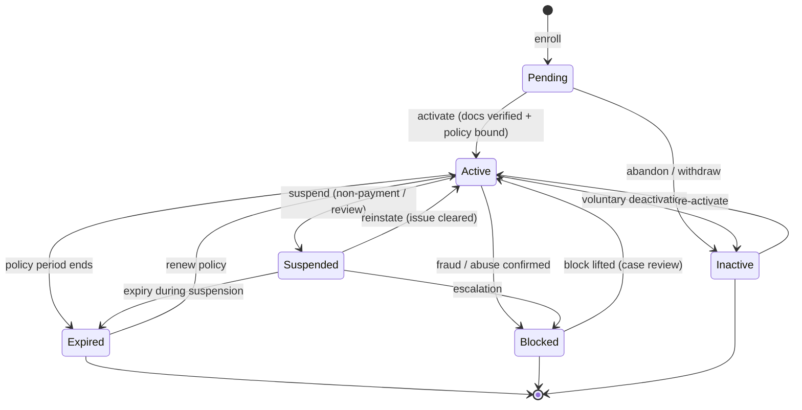
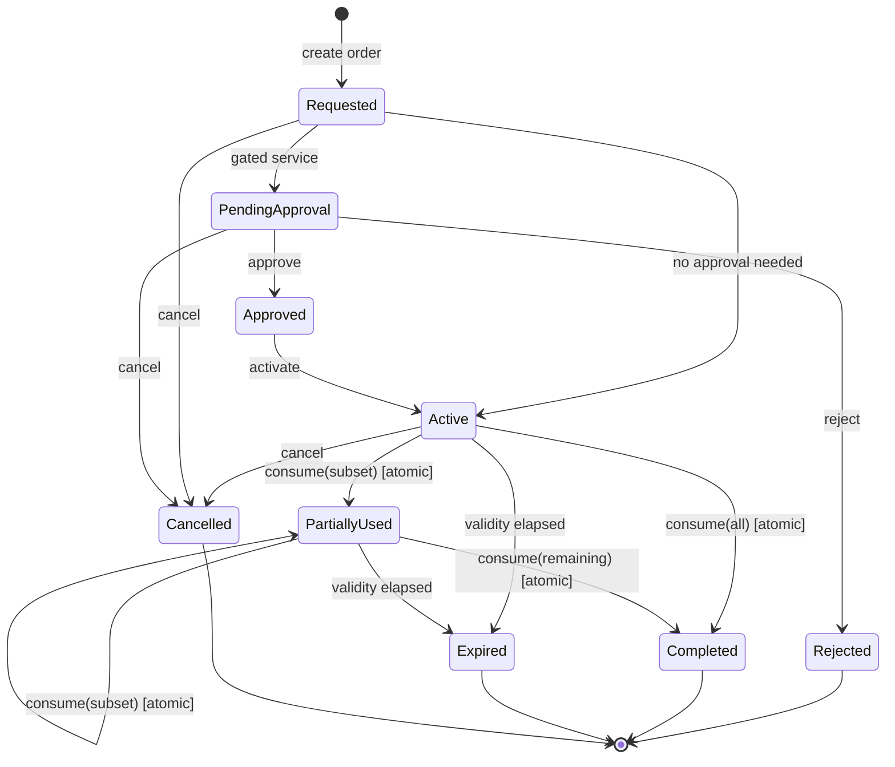
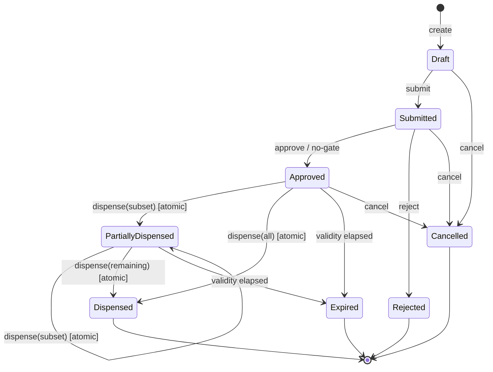
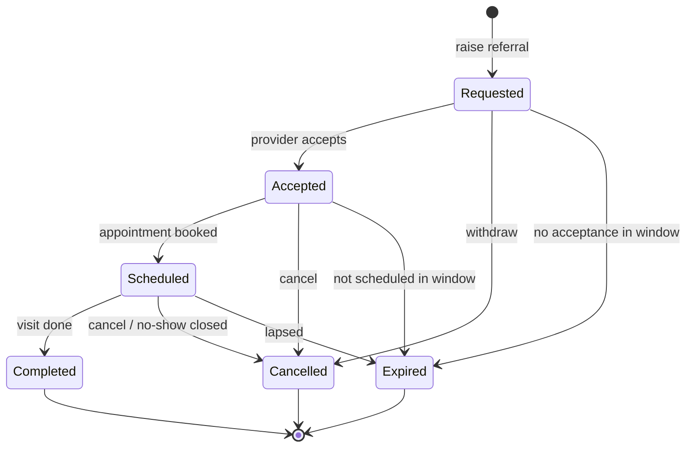
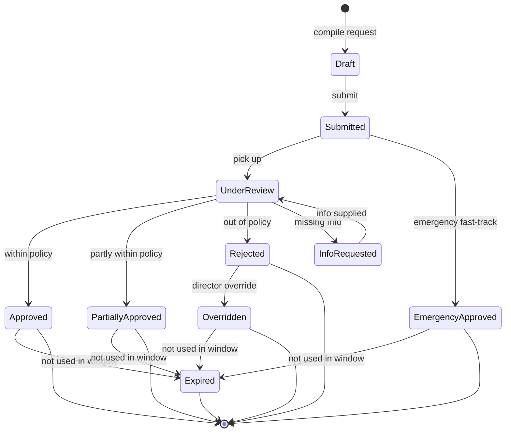
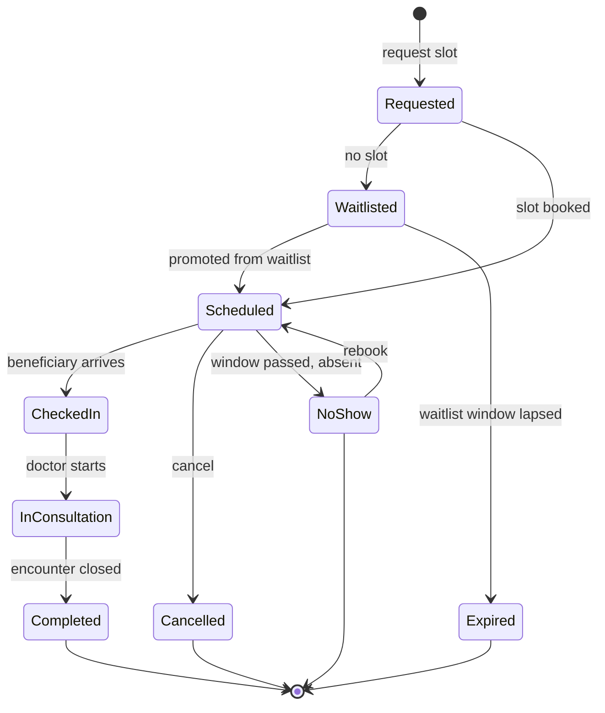

# 23 — State Machines (Lifecycles)

> Part of the **Mersal Healthcare Benefit Management Platform (HBMP)** design workspace.
> Back to: [00-README-INDEX.md](00-README-INDEX.md) · [0A-DESIGN-FOUNDATIONS.md](0A-DESIGN-FOUNDATIONS.md)
> Siblings: [05-business-process-maps.md](05-business-process-maps.md) · [06-bpmn-diagrams.md](06-bpmn-diagrams.md) · [24-sequence-diagrams.md](24-sequence-diagrams.md)

Formal `stateDiagram-v2` models plus transition tables for every core HBMP lifecycle. Each table lists **from-state · event · guard/condition · to-state · side-effects/emitted event · actor/role · audit note**. The **atomic-consume guard** and **no-reuse invariant** are emphasized in the Investigation Order and Prescription sections.

**Global invariants (apply to all lifecycles):**
- Every transition writes an append-only record to `audit-service` (actor, timestamp, from/to, correlationId, justification where required).
- Consume/dispense transitions are **atomic** and **idempotent**; replays with the same `consumeToken` return the prior outcome without state change.
- Illegal transitions are rejected and audited as `TransitionDenied`.

---

## 1. Beneficiary / Member Lifecycle

Canonical: `Pending → Active → (Suspended | Expired | Blocked | Inactive)`.

| From | Event | Guard / Condition | To | Side-effects / Emitted Event | Actor / Role | Audit note |
|---|---|---|---|---|---|---|
| — | enroll | valid intake | Pending | `MemberCreated` | Registration | Dedup check recorded |
| Pending | activate | documents verified AND policy bound | Active | `MemberActivated`; issue card | Registration | Verification evidence linked |
| Pending | abandon | no docs within window | Inactive | `MemberAbandoned` | System (timer) | Auto-timeout audited |
| Active | suspend | non-payment / compliance hold | Suspended | `MemberSuspended` | Case Manager / Finance | Reason mandatory |
| Active | expire | policy end date reached | Expired | `MemberExpired` | System (timer) | — |
| Active | block | fraud/abuse confirmed | Blocked | `MemberBlocked` | Super Admin / Director | Justification mandatory |
| Active | deactivate | beneficiary request | Inactive | `MemberDeactivated` | Registration | — |
| Suspended | reinstate | issue cleared | Active | `MemberReinstated` | Case Manager | — |
| Expired | renew | new policy period bound | Active | `MemberRenewed` | Registration / policy-service | — |
| Blocked | unblock | case review clears | Active | `MemberUnblocked` | Director | Review decision linked |
| Inactive | reactivate | eligibility re-confirmed | Active | `MemberReactivated` | Registration | — |

---

## 2. Investigation Order Lifecycle

Canonical: `Requested → PendingApproval → (Approved | Rejected) → Active → PartiallyUsed → Completed`; plus `Expired`, `Cancelled`.

| From | Event | Guard / Condition | To | Side-effects / Emitted Event | Actor / Role | Audit note |
|---|---|---|---|---|---|---|
| — | create | valid encounter | Requested | `OrderCreated` | Doctor | Linked to encounter |
| Requested | route-approval | service is gated | PendingApproval | `OrderPendingApproval` | orders-service | — |
| Requested | auto-activate | not gated | Active | `OrderActivated` | orders-service | — |
| PendingApproval | approve | policy + clinical OK | Approved | `OrderApproved` | Approval Team | Decision linked |
| PendingApproval | reject | out of policy | Rejected | `OrderRejected` | Approval Team | Reason mandatory |
| Approved | activate | — | Active | `OrderActivated` | orders-service | — |
| Active / PartiallyUsed | **consume(subset)** | **line unused AND token unseen (atomic, idempotent)** | PartiallyUsed | `OrderLinesConsumed`; unused lines stay available | Lab / Imaging | `(orderId,lineId,consumeToken)` recorded; **no-reuse** enforced |
| Active / PartiallyUsed | **consume(all/remaining)** | **all remaining lines unused (atomic)** | Completed | `OrderCompleted` | Lab / Imaging | Duplicate consume impossible |
| Active / PartiallyUsed | expire | validity window elapsed | Expired | `OrderExpired` | System (timer) | Unused lines voided |
| Requested / PendingApproval / Active | cancel | not yet fully consumed | Cancelled | `OrderCancelled` | Doctor / Case Manager | Reason recorded |

### Atomic-consume guard (invariant detail)
- **Precondition:** target line state ∈ {available} AND `consumeToken` not previously applied.
- **Effect:** selected lines → used, in a single atomic transaction; order recomputes to `PartiallyUsed` or `Completed`.
- **Idempotency:** replaying the same `consumeToken` returns the prior result; no double-consume, no billing twice.
- **No-reuse:** a `used` line can never return to `available`; only `Cancelled`/`Expired` void *unused* lines.

---

## 3. Prescription Lifecycle

Canonical: `Draft → Submitted → (Approved | Rejected) → PartiallyDispensed → Dispensed`; plus `Expired`, `Cancelled`.

| From | Event | Guard / Condition | To | Side-effects / Emitted Event | Actor / Role | Audit note |
|---|---|---|---|---|---|---|
| — | create | valid encounter | Draft | `RxCreated` | Doctor | — |
| Draft | submit | complete lines | Submitted | `RxSubmitted` | Doctor | — |
| Submitted | approve | within policy OR not gated | Approved | `RxApproved` | Approval Team / auto | — |
| Submitted | reject | out of policy | Rejected | `RxRejected` | Approval Team | Reason mandatory |
| Approved / PartiallyDispensed | **dispense(subset)** | **line unused AND token unseen (atomic); substitution only from approved list** | PartiallyDispensed | `RxLinesDispensed`; remaining lines available | Pharmacy | Substitution + OOS captured |
| Approved / PartiallyDispensed | **dispense(all/remaining)** | **all remaining lines unused (atomic)** | Dispensed | `RxDispensed` | Pharmacy | Duplicate dispense impossible |
| Approved / PartiallyDispensed | expire | validity window elapsed | Expired | `RxExpired` | System (timer) | Pharmacy must reject if presented |
| Draft / Submitted / Approved | cancel | not fully dispensed | Cancelled | `RxCancelled` | Doctor / Case Manager | Reason recorded |
| Expired / Completed(Dispensed) | present-at-pharmacy | — | (no transition) | `RxRejectedPresentation` | Pharmacy | **Reject expired/completed** |

### Pharmacy-specific guards
- **Partial dispensing:** allowed; unfilled lines remain `available` for a later visit.
- **Substitution:** only with a policy-approved alternative (policy-service); otherwise route to approvals.
- **Out-of-stock:** triggers backorder/partial without consuming the unfilled line.
- **Reject rule:** any presentation of an `Expired`, `Cancelled`, `Rejected`, or fully `Dispensed` prescription is rejected and audited.

---

## 4. Referral Lifecycle

Canonical: `Requested → Accepted → Scheduled → Completed`; plus `Cancelled`, `Expired`.

| From | Event | Guard / Condition | To | Side-effects / Emitted Event | Actor / Role | Audit note |
|---|---|---|---|---|---|---|
| — | raise | clinical need | Requested | `ReferralRequested` | Doctor | Target specialty set |
| Requested | accept | receiving provider available | Accepted | `ReferralAccepted` | Network provider / Appointment | — |
| Requested | expire | no acceptance in window | Expired | `ReferralExpired` | System (timer) | — |
| Accepted | schedule | slot booked | Scheduled | `ReferralScheduled` | Appointment Team | Links appointment |
| Scheduled | complete | consultation performed | Completed | `ReferralCompleted` | Doctor | Encounter linked |
| Scheduled | no-show-close | no-show threshold | Cancelled | `ReferralCancelled` | Appointment Team | Ref X3 no-show handling |
| Any active | cancel | — | Cancelled | `ReferralCancelled` | Doctor / Case Manager | Reason recorded |

---

## 5. Authorization Lifecycle

Canonical: `Draft → Submitted → UnderReview → (Approved | PartiallyApproved | Rejected | InfoRequested)`; plus `Overridden`, `EmergencyApproved`, `Expired`.

| From | Event | Guard / Condition | To | Side-effects / Emitted Event | Actor / Role | Audit note |
|---|---|---|---|---|---|---|
| — | compile | gated service | Draft | `AuthDrafted` | Doctor / Case Manager | — |
| Draft | submit | justification present | Submitted | `AuthSubmitted` | Requester | — |
| Submitted | fast-track | emergency flag | EmergencyApproved | `AuthEmergencyApproved` | Director | **Retrospective review required** |
| Submitted | pick-up | reviewer assigned | UnderReview | `AuthUnderReview` | Approval Team | SLA timer starts |
| UnderReview | approve | fully within policy | Approved | `AuthApproved` | Approval Team | — |
| UnderReview | partial-approve | partly within policy | PartiallyApproved | `AuthPartiallyApproved` | Approval Team | Approved scope itemized |
| UnderReview | reject | out of policy | Rejected | `AuthRejected` | Approval Team | Reason mandatory |
| UnderReview | request-info | missing evidence | InfoRequested | `AuthInfoRequested` | Approval Team | — |
| InfoRequested | resupply | info provided | UnderReview | `AuthInfoSupplied` | Requester | — |
| Rejected | override | director authority | Overridden | `AuthOverridden` | Medical Director | **Justification mandatory** |
| Approved / PartiallyApproved / Overridden / EmergencyApproved | expire | not consumed in window | Expired | `AuthExpired` | System (timer) | — |

---

## 6. Appointment / Encounter Lifecycle

Supporting lifecycle for scheduling and the clinical visit (aligns with P3/P4 and X3).

| From | Event | Guard / Condition | To | Side-effects / Emitted Event | Actor / Role | Audit note |
|---|---|---|---|---|---|---|
| — | request | eligible (ref P2) | Requested | `ApptRequested` | Call Center / Appointment | — |
| Requested | waitlist | no slot available | Waitlisted | `ApptWaitlisted` | provider-service | Priority score stored |
| Requested / Waitlisted | book / promote | slot available (by priority) | Scheduled | `ApptScheduled`; send reminders | Appointment Team | Promotion order audited |
| Waitlisted | expire | window lapsed | Expired | `ApptWaitlistExpired` | System (timer) | — |
| Scheduled | check-in | beneficiary arrives | CheckedIn | `ApptCheckedIn` | Reception / Nurse | — |
| Scheduled | no-show | grace passed, absent | NoShow | `ApptNoShow`; free slot; promote waitlist | Appointment Team | Ref X3 |
| NoShow | rebook | within re-booking policy | Scheduled | `ApptRebooked` | Call Center | Repeat no-shows → Case Manager |
| CheckedIn | start | doctor available | InConsultation | `EncounterStarted` | Doctor / Nurse | — |
| InConsultation | close | documentation complete | Completed | `EncounterCompleted`; emit orders/rx/referral | Doctor | AND-join on emitted artifacts (ref 06) |
| Scheduled / CheckedIn | cancel | — | Cancelled | `ApptCancelled`; free slot | Any | Reason recorded |

---

## Consistency Notes
- Order & Prescription share the **atomic-consume / no-reuse** pattern — the only difference is domain (tests vs meds) and pharmacy-specific substitution/OOS guards.
- Authorization decisions feed the gates in Order/Prescription (`route-approval`/`approve`).
- Appointment `NoShow` and `Cancelled` free slots that drive **waitlist promotion** (see [05](05-business-process-maps.md) X3 and [06](06-bpmn-diagrams.md) BPMN-3).

## Cross-References
- Process maps: [05-business-process-maps.md](05-business-process-maps.md)
- BPMN swimlanes with explicit gateways: [06-bpmn-diagrams.md](06-bpmn-diagrams.md)
- Sequence diagrams (atomic consume, partial dispense, approvals): [24-sequence-diagrams.md](24-sequence-diagrams.md)
- Foundations & glossary: [0A-DESIGN-FOUNDATIONS.md](0A-DESIGN-FOUNDATIONS.md)
