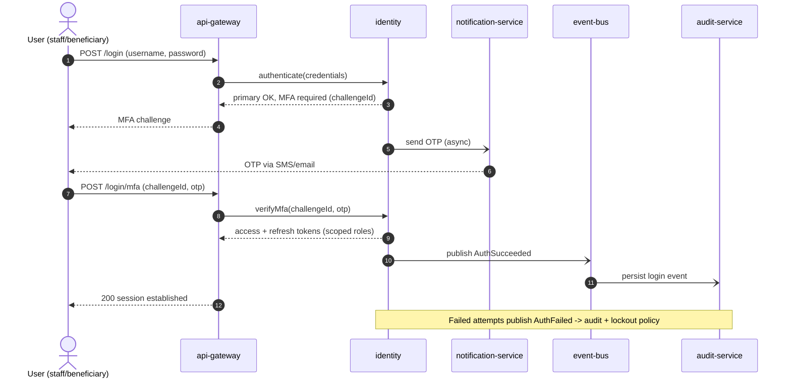
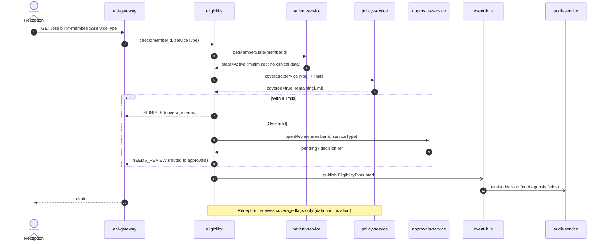
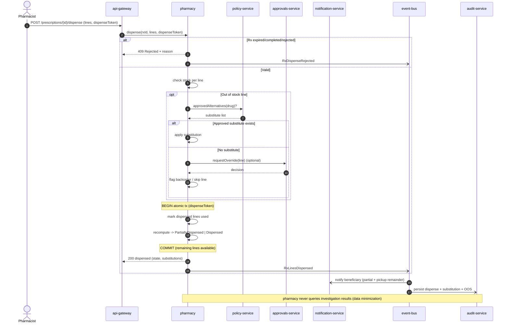
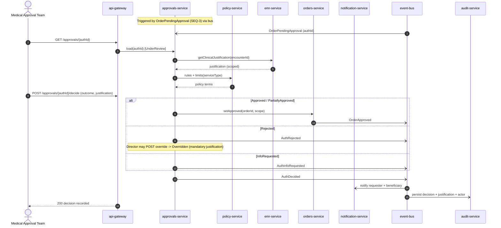
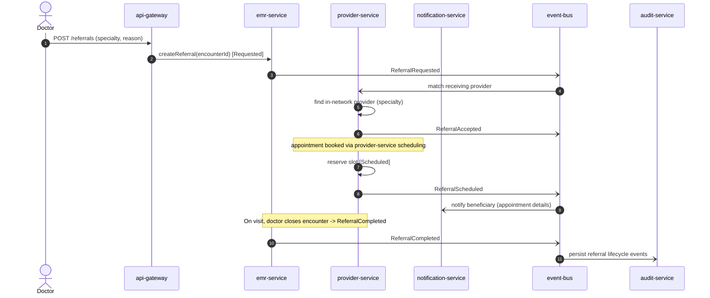

# 24 — Sequence Diagrams (Microservice Interactions)

> Part of the **Mersal Healthcare Benefit Management Platform (HBMP)** design workspace.
> Back to: [00-README-INDEX.md](00-README-INDEX.md) · [0A-DESIGN-FOUNDATIONS.md](0A-DESIGN-FOUNDATIONS.md)
> Siblings: [05-business-process-maps.md](05-business-process-maps.md) · [06-bpmn-diagrams.md](06-bpmn-diagrams.md) · [23-state-machines.md](23-state-machines.md)

`sequenceDiagram` models for the critical cross-service interactions. Conventions:
- **Solid arrow `->>`** = synchronous request; **dashed `-->>`** = response.
- **`-)`** = asynchronous publish onto the **event bus** (fire-and-forget).
- Every state-changing interaction includes an **audit-service** write.
- Data-minimization boundaries are noted where a service is deliberately *not* called or receives a reduced projection.

**Services:** `api-gateway`, `identity`, `patient-service`, `policy-service`, `eligibility`, `emr-service`, `orders-service`, `approvals-service`, `provider-service`, `pharmacy`, `notification-service`, `audit-service`, plus the async **event bus**.

---

## SEQ-1 — Login + MFA



---

## SEQ-2 — Eligibility Check



---

## SEQ-3 — Create Consultation + Investigation Order + Prescription

```mermaid
sequenceDiagram
    autonumber
    actor D as Doctor
    participant GW as api-gateway
    participant EMR as emr-service
    participant ORD as orders-service
    participant RX as pharmacy
    participant APR as approvals-service
    participant POL as policy-service
    participant BUS as event-bus
    participant AUD as audit-service

    D->>GW: POST /encounters (diagnosis, notes)
    GW->>EMR: createEncounter(...)
    EMR-)BUS: EncounterStarted
    EMR-->>GW: encounterId

    D->>GW: POST /orders (investigation lines)
    GW->>ORD: createOrder(encounterId, lines)
    ORD->>POL: isGated(services)?
    POL-->>ORD: gated=true
    ORD->>APR: submit(orderId) [PendingApproval]
    APR-->>ORD: accepted
    ORD-)BUS: OrderPendingApproval
    ORD-->>GW: orderId (PendingApproval)

    D->>GW: POST /prescriptions (rx lines)
    GW->>RX: createPrescription(encounterId, lines) [Draft->Submitted]
    RX->>POL: isGated(meds)?
    POL-->>RX: gated=false
    RX-->>GW: prescriptionId (Approved)
    RX-)BUS: RxApproved

    BUS-)AUD: persist encounter/order/rx events
    Note over EMR,RX: emr links order & rx to encounter; labs/pharmacy see only their own artifact (minimization)
```

---

## SEQ-4 — Lab Consuming an Order (Atomic, Idempotent)

```mermaid
sequenceDiagram
    autonumber
    actor L as Lab Tech
    participant GW as api-gateway
    participant ORD as orders-service
    participant EMR as emr-service
    participant NOT as notification-service
    participant BUS as event-bus
    participant AUD as audit-service

    L->>GW: POST /orders/{id}/consume (lineIds, consumeToken)
    GW->>ORD: consume(orderId, lineIds, consumeToken)
    alt Order not Active/PartiallyUsed
        ORD-->>GW: 409 Rejected (expired/completed/cancelled)
        ORD-)BUS: OrderConsumeRejected
    else Valid + token unseen
        Note over ORD: BEGIN atomic tx
        ORD->>ORD: verify lines available AND token unused
        ORD->>ORD: mark selected lines used
        ORD->>ORD: recompute -> PartiallyUsed | Completed
        Note over ORD: COMMIT (unused lines stay available)
        ORD-->>GW: 200 consumed (new state)
        ORD-)BUS: OrderLinesConsumed
    else Token replay (idempotent)
        ORD-->>GW: 200 prior result (no state change)
    end
    L->>GW: POST /orders/{id}/results
    GW->>EMR: attachResults(orderId, results)
    EMR-)BUS: ResultsReady
    BUS-)NOT: notify beneficiary + doctor
    BUS-)AUD: persist consume + result (no-reuse enforced)
    Note over ORD,AUD: consumeToken makes duplicate usage impossible; used lines never reusable
```

---

## SEQ-5 — Pharmacy Partial Dispense (with Substitution / Out-of-Stock)



---

## SEQ-6 — Approval Request → Decision → Notification



### Emergency fast-track variant
```mermaid
sequenceDiagram
    autonumber
    actor DIR as Medical Director
    participant GW as api-gateway
    participant APR as approvals-service
    participant BUS as event-bus
    participant AUD as audit-service

    DIR->>GW: POST /approvals/{authId}/emergency (justification)
    GW->>APR: fastTrack(authId)
    APR->>APR: state -> EmergencyApproved
    APR-)BUS: AuthEmergencyApproved
    BUS-)AUD: persist emergency decision (retrospective review flag)
    APR-->>GW: 200 (service may proceed immediately)
    Note over APR,AUD: Retrospective review scheduled; justification mandatory
```

---

## SEQ-7 — Referral (Request → Accept → Schedule → Complete)



---

## Event Bus Summary

| Event | Publisher | Key Subscribers | Purpose |
|---|---|---|---|
| `AuthSucceeded` / `AuthFailed` | identity | audit-service | Login audit + lockout |
| `EligibilityEvaluated` | eligibility | audit-service | Decision trail |
| `EncounterStarted` / `EncounterCompleted` | emr-service | orders, pharmacy, audit | Clinical lifecycle |
| `OrderPendingApproval` / `OrderApproved` / `OrderRejected` | orders / approvals | approvals, notification, audit | Order gating |
| `OrderLinesConsumed` / `OrderCompleted` | orders-service | emr, notification, audit | Atomic consume trail |
| `RxApproved` / `RxLinesDispensed` / `RxDispensed` | pharmacy | notification, audit | Dispensing trail |
| `AuthDecided` / `AuthEmergencyApproved` / `AuthOverridden` | approvals-service | notification, audit | Authorization outcomes |
| `Referral*` | emr / provider | provider, notification, audit | Referral lifecycle |

**Reliability notes:**
- All async publishes use at-least-once delivery; consumers are **idempotent** (dedupe by eventId).
- `audit-service` subscribes to every domain event — audit is never in the synchronous critical path but is guaranteed by durable bus delivery.
- Consume/dispense tokens carry across bus retries so replays never double-apply.

---

## Cross-References
- Narrative process maps: [05-business-process-maps.md](05-business-process-maps.md)
- BPMN swimlanes: [06-bpmn-diagrams.md](06-bpmn-diagrams.md)
- State machines + transition tables: [23-state-machines.md](23-state-machines.md)
- Foundations & glossary: [0A-DESIGN-FOUNDATIONS.md](0A-DESIGN-FOUNDATIONS.md)
