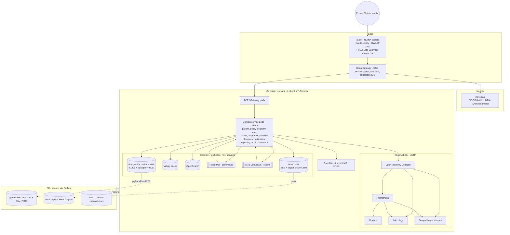
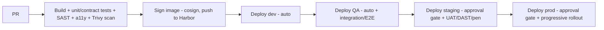
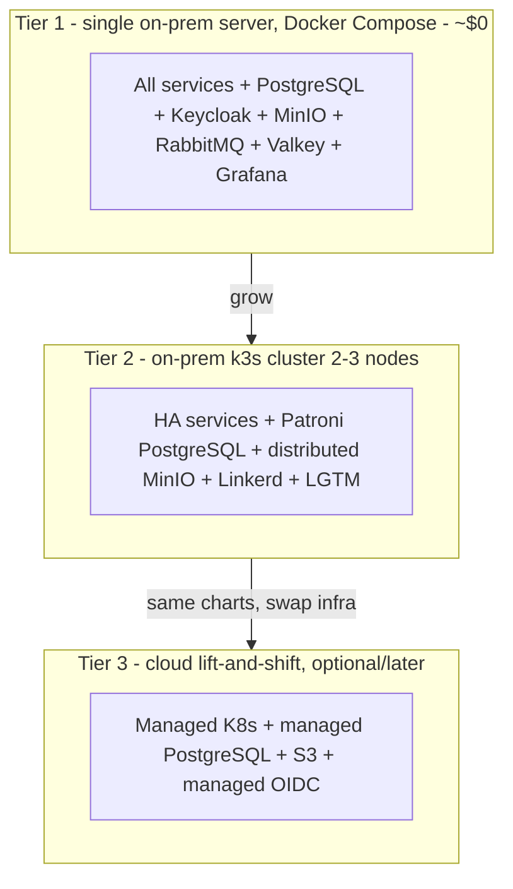

# 25 — Deployment Architecture (Open-Source, On-Prem-First, Cloud-Ready)

> Back to [00-README-INDEX.md](00-README-INDEX.md) · [0A-DESIGN-FOUNDATIONS.md](0A-DESIGN-FOUNDATIONS.md)
> **Authoritative stack:** [0C-OPEN-SOURCE-STACK.md](0C-OPEN-SOURCE-STACK.md) — this document realizes that decision. Where any detail here conflicts with 0C, 0C wins.
> Siblings: [16-service-architecture.md](16-service-architecture.md) · [18-security-model.md](18-security-model.md) · [26-testing-strategy.md](26-testing-strategy.md)

Open-source, **on-prem-first, cloud-ready** deployment topology for the HBMP. Mersal is a charity running at ~$0 software-licensing budget, so every managed Azure dependency is replaced with a free, self-hostable equivalent per [0C-OPEN-SOURCE-STACK.md](0C-OPEN-SOURCE-STACK.md). The design still delivers isolation between environments, defence-in-depth networking, high availability, and disaster recovery — and stays portable so Mersal can lift-and-shift to any managed Kubernetes later **without changing application code**. Everything is provisioned via Infrastructure-as-Code (**OpenTofu + Ansible + Helm**) and deployed via GitOps. **The .NET 8 application layer, service boundaries, events, sagas, and invariants are unchanged — only the infrastructure substrate changed.**

---

## 1. Environment topology

Four isolated environments, each in its own namespace/host boundary with separate secrets stores (**OpenBao**), databases and identities (**Keycloak** realms). **Production data never flows downstream unmasked.**

| Env | Purpose | Data | Scale |
|-----|---------|------|-------|
| `dev` | Feature work | Synthetic only | Minimal (Docker Compose) |
| `test/QA` | Automated + manual test | Synthetic/masked | Minimal (Compose or k3s) |
| `staging` | Prod-like validation, UAT | Masked prod-like | Prod-like (reduced k3s) |
| `production` | Live | Real (regulated) | HA k3s (Patroni, distributed MinIO) |

Isolation is by **k3s namespace + NetworkPolicy** (and by separate host/VLAN for production where hardware allows), each with its own OpenBao path and Keycloak realm. Lower environments can never read production keys or data.

Location: primary deployment runs **on-prem in Egypt**, which keeps regulated refugee data in-country and *simplifies* Egypt PDPL (Law 151/2020) compliance ([20-compliance-checklist.md](20-compliance-checklist.md)). DR is a second on-prem site or a cheap offsite target (see §9).

---

## 2. Deployment diagram

---

## 3. Compute — k3s (and Docker Compose at the smallest tier)

- **k3s** (certified, lightweight Kubernetes) with system + workload workloads scheduled by namespace; workloads autoscaled (**HPA** on CPU/memory; **KEDA** on RabbitMQ queue depth for order/approval spikes). At the smallest footprint, the identical containers run under **Docker Compose** on a single server (Tier 1, below).
- Namespaces per bounded context; **k3s NetworkPolicies** restrict east-west traffic (default-deny; only declared service-to-service calls allowed) supporting Zero Trust ([18-security-model.md](18-security-model.md)).
- **mTLS** between services via **Linkerd** (lightweight automatic mesh).
- Pod identity via **Kubernetes ServiceAccounts** → OpenBao/DB without stored secrets (Vault Agent / CSI injection).
- Lightweight edges (notification dispatch, scheduled jobs) run as ordinary k3s `Deployment`/`CronJob` workloads.
- Image supply chain: images built in CI, **signed (cosign)**, pushed to a private **Harbor** registry, scanned with **Trivy**; admission control admits only signed/scanned images; no `latest` tags.

---

## 4. Networking & edge

| Layer | Control |
|-------|---------|
| Ingress | **Traefik / NGINX Ingress** + **ModSecurity (OWASP Core Rule Set)** as WAF; TLS termination via **Let's Encrypt** (public) or **internal CA** (air-gapped), re-encryption to services |
| API | **Kong Gateway (OSS)** — versioning (`/api/v1`), JWT validation (against Keycloak), rate limiting/throttling, quotas, IP allowlists for provider/admin, OpenAPI-driven |
| Cluster network | Private k3s cluster; **NetworkPolicies** segment edge / workload / data; data services (PostgreSQL, MinIO, OpenBao, OpenSearch, RabbitMQ, NATS) are **cluster-internal only** — no public data-plane exposure |
| Egress | Controlled at the host firewall / NAT; allowlist only required destinations |
| Service mesh | **Linkerd** provides automatic mTLS + identity for all east-west traffic |
| Provider isolation | Per-provider scoping enforced at gateway + service + row level ([11-permission-matrix.md](11-permission-matrix.md)) |

---

## 5. Data tier

- **PostgreSQL** (self-hosted), HA via **Patroni** (leader + replicas, automatic failover); schema-per-service (DB-per-service at scale); at-rest encryption via **LUKS** full-disk + **pgcrypto** column-level for PHI/PII; **Row-Level Security** for tenant/provider/treating-relationship isolation.
- **Valkey** (BSD Redis fork) for eligibility snapshots, sessions, rate limits.
- **OpenSearch** for beneficiary/order lookup (typo-tolerant), indexed via events — **only minimum-necessary fields indexed** (Meilisearch/Typesense are lighter alternatives at Tier 1).
- **MinIO** (S3-compatible) for documents & lab/imaging reports: private, **server-side encryption (SSE)** with keys from **OpenBao** transit engine, **object-lock = WORM** for audit-relevant artifacts, **ClamAV** malware scan on ingest.
- **RabbitMQ** (durable/quorum queues, DLQ) for commands, and **NATS JetStream** for domain-event fan-out (Redpanda/Kafka-API is an alternative at higher volume) — both with the **transactional outbox** pattern for reliability. CloudEvents envelopes unchanged.

---

## 6. Secrets, keys & config
- **OpenBao** (or HashiCorp Vault) holds AES-256 keys (transit engine = KMS), TLS certs, connection secrets; automatic rotation; access via Kubernetes ServiceAccount identity only.
- GitOps secrets encrypted with **SOPS**; no secrets in images or repos.
- App config via ConfigMaps + OpenBao references; separate OpenBao path per environment; production keys never accessible from lower envs.

---

## 7. Observability
- **OpenTelemetry** instrumentation (identical to the original — OTel is vendor-neutral); traces → **Tempo/Jaeger**; correlation IDs propagate through gateway → services → audit.
- Metrics → **Prometheus**; logs → **Loki**; unified dashboards in **Grafana** for latency/error/saturation (the four golden signals) and business KPIs feed ([reporting-service]).
- Alerting (Alertmanager) on SLO burn, RabbitMQ/NATS queue depth, failed consumes, auth anomalies (ties to [19-audit-strategy.md](19-audit-strategy.md)).

---

## 8. CI/CD

- CI/CD on **GitLab CE** (repo + CI + registry + scanning) or **Gitea + Woodpecker CI**; images to **Harbor**; **Trivy** image/dependency scanning gated in the pipeline.
- IaC (**OpenTofu + Ansible + Helm**) reviewed & applied via pipeline; environments reproducible; the **same Helm charts** deploy on-prem and (later) to any managed Kubernetes.
- Progressive delivery: blue/green or canary with automated rollback on SLO breach.
- DB migrations versioned (expand/contract, backward-compatible) and gated.
- Compliance gates: DPIA/security sign-off required before staging→prod ([35-implementation-plan.md](35-implementation-plan.md)).

---

## 9. HA & DR

| Aspect | Target | Mechanism |
|--------|--------|-----------|
| Availability SLO | 99.9% (MVP) → 99.95% | **Patroni** PostgreSQL HA + multi-replica k3s services + distributed **MinIO** |
| **RPO** | ≤ 15 min | **pgBackRest** full + continuous WAL PITR; **restic** frequent object sync |
| **RTO** | ≤ 2 hours | **OpenTofu/Ansible/Helm** redeploy + **Velero** cluster/volume restore + Patroni failover + DNS/Ingress repoint |
| Backups | Daily full + continuous WAL (PITR); tested restores quarterly | **pgBackRest** (DB), **Velero** (cluster state/PVs), **restic** (MinIO/files) with offsite/second-site copies |
| Audit durability | Immutable/WORM, offsite copy | **MinIO object-lock (WORM)** + hash-chained `audit_event` + restic offsite |

DR runbook and quarterly failover drills documented in [34-technical-documentation.md](34-technical-documentation.md).

---

## 10. Deployment tiers — grows with Mersal, cloud-ready throughout

- **Tier 1 (start here, ~$0):** one reasonably specced server (or VPS). Everything runs via **Docker Compose** — enough for the pilot clinic. Full-disk **LUKS**; nightly **pgBackRest** + **restic** offsite copy. Right-sized: don't over-build.
- **Tier 2 (scale on-prem):** move to **k3s** (2–3 nodes) with Helm; PostgreSQL HA via **Patroni**; MinIO distributed; **Linkerd** mTLS; Prometheus/Grafana/Loki/Tempo. Same containers, more resilience.
- **Tier 3 (cloud, only if/when funded):** deploy the **same Helm charts** to managed Kubernetes (EKS/GKE/AKS); point at managed PostgreSQL, S3, and a managed OIDC — application code untouched.

---

## 11. Cloud-ready — lift-and-shift guarantee

The platform is **portable by construction**: the app is packaged as OCI containers and deployed with Helm, and it depends only on **open standards** — SQL (PostgreSQL), S3-compatible object storage, OIDC/OAuth2, OpenTelemetry, CloudEvents — never on a proprietary API. Moving to a cloud is therefore a **configuration change, not a rewrite**:

| On-prem (now) | Cloud drop-in (later) | Application change |
|---|---|---|
| k3s | EKS / GKE / AKS (same Helm charts) | none |
| PostgreSQL + Patroni | Managed PostgreSQL | connection string only |
| MinIO (S3 API) | AWS S3 / GCS / Azure Blob (S3 gateway) | endpoint/creds only |
| Keycloak (OIDC) | Managed OIDC (Cognito/Entra/Auth0) | issuer/client config only |
| Valkey / OpenSearch / RabbitMQ / NATS | Managed equivalents | endpoint/creds only |

Because the code never knows where it runs, Mersal keeps a $0 on-prem posture today and retains a clean, low-risk path to managed cloud if it is ever funded — **swap infra, not code**.

---

## 12. Scaling & cost notes
- **Software licensing: $0** — all components are OSS. Mersal pays only for a server (or VPS), power/hosting, a domain + free TLS, and staff/volunteer operating time.
- Start at **Tier 1** (single server, Compose); move to k3s/Patroni only when load or availability needs justify it.
- **KEDA** scales workers on RabbitMQ queue depth (approval/order bursts) so steady-state resource use stays low.
- The main trade-off vs managed cloud is **operational effort** (patching, backups, monitoring) — mitigated by the runbooks in [34-technical-documentation.md](34-technical-documentation.md).
- Search/AI and premium features are additive later (PBM, AI CDS) without re-platforming ([16-service-architecture.md](16-service-architecture.md)).

---

### Cross-references
- Authoritative stack decision: [0C-OPEN-SOURCE-STACK.md](0C-OPEN-SOURCE-STACK.md)
- Services & events: [16-service-architecture.md](16-service-architecture.md) · Security & Zero Trust: [18-security-model.md](18-security-model.md)
- Data residency/retention: [20-compliance-checklist.md](20-compliance-checklist.md) · Test envs: [26-testing-strategy.md](26-testing-strategy.md)
- Runbooks/DR docs: [34-technical-documentation.md](34-technical-documentation.md)
