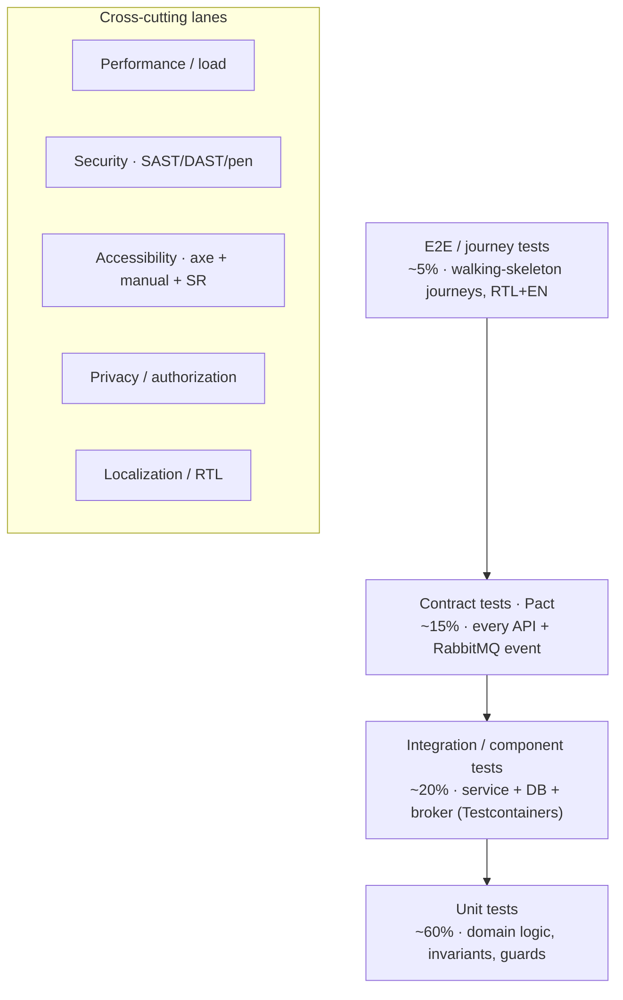
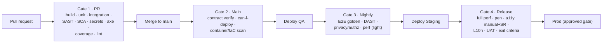

# 26 — Testing Strategy

> Cluster F · Delivery, Quality & Planning
> Up: [00-README-INDEX.md](00-README-INDEX.md) · Foundations: [0A-DESIGN-FOUNDATIONS.md](0A-DESIGN-FOUNDATIONS.md)
> Siblings: [27-risk-assessment.md](27-risk-assessment.md) · [29-delivery-plan.md](29-delivery-plan.md) · [30-technical-backlog.md](30-technical-backlog.md) · [31-product-backlog.md](31-product-backlog.md) · [32-user-stories.md](32-user-stories.md) · [33-sprint-roadmap.md](33-sprint-roadmap.md)
> Related: [07-functional-requirements.md](07-functional-requirements.md) · [08-non-functional-requirements.md](08-non-functional-requirements.md) · [11-permission-matrix.md](11-permission-matrix.md) · [18-security-model.md](18-security-model.md) · [19-audit-strategy.md](19-audit-strategy.md) · [21-accessibility-checklist.md](21-accessibility-checklist.md) · [23-state-machines.md](23-state-machines.md)

---

## 1. Purpose & scope

This document defines **how quality is engineered, verified, and evidenced** across the HBMP program. It is design-only: it specifies the test strategy, the pyramid, the environments, the gates, and the traceability approach that the delivery team will follow once implementation is approved (see the implementation gate in [00-README-INDEX.md](00-README-INDEX.md) and [35-implementation-plan.md](35-implementation-plan.md)). No test code is written here.

Two properties receive **special, non-negotiable emphasis** throughout, because they are the platform's core clinical-safety and privacy invariants (see [0A-DESIGN-FOUNDATIONS.md](0A-DESIGN-FOUNDATIONS.md) §7 and [23-state-machines.md](23-state-machines.md)):

1. **Order/prescription consume atomicity & no-reuse** — an order line or prescription is consumed exactly once, atomically, by exactly one provider; double-dispense and double-fulfilment are *impossible*, not merely unlikely.
2. **Role-based, field-level data minimization** — every role sees only the minimum fields needed for its task; e.g., Finance can see cost/coverage but **not** diagnosis or clinical notes; a Lab sees the ordered test but not the full problem list; a Pharmacy sees the prescription but not the SOAP note.

Every release must produce **executable evidence** that both properties hold. These are treated as P1/Blocker-class quality gates, not feature tests.

### 1.1 Quality objectives

| Objective | What "good" looks like |
|---|---|
| Correctness | All acceptance criteria in [32-user-stories.md](32-user-stories.md) pass; state machines in [23-state-machines.md](23-state-machines.md) honour every legal/illegal transition. |
| Safety | No path exists to double-consume, reuse, or resurrect a terminal order/prescription. |
| Privacy | No role or provider can retrieve a field outside its permission set ([11-permission-matrix.md](11-permission-matrix.md)); minimization is enforced server-side, not only in UI. |
| Reliability | NFR targets in [08-non-functional-requirements.md](08-non-functional-requirements.md) met under load. |
| Accessibility | WCAG 2.2 AA across all portals, Arabic RTL and English. |
| Auditability | Every state-changing action produces an immutable audit event ([19-audit-strategy.md](19-audit-strategy.md)); tests assert the audit trail. |
| Maintainability | Tests are deterministic, isolated, fast where they should be fast, and traceable to requirements. |

---

## 2. Test pyramid & strategy overview

HBMP follows a **classic weighted pyramid** — many fast unit tests, fewer integration/contract tests, a thin layer of end-to-end journeys — augmented by **cross-cutting quality lanes** (performance, security, accessibility, privacy/authorization, localization) that run alongside the pyramid rather than inside it.

**Rationale.** Because the highest-risk logic (order consume, eligibility evaluation, authorization) is *domain* logic, it is pushed as low as possible — proven exhaustively at the unit level with concurrency/property tests, then confirmed at integration and contract levels, and only smoke-checked end-to-end. This keeps the expensive, slow E2E suite small and stable while still guaranteeing the invariants.

| Layer | Owner | Runs where | Speed target | Blocking? |
|---|---|---|---|---|
| Unit | Dev who writes the code | PR pipeline | < 5 min whole suite | Yes (PR gate) |
| Integration | Dev + QA | PR + main pipeline | < 15 min | Yes (main gate) |
| Contract (Pact) | Producer & consumer devs | PR + broker verify | < 10 min | Yes (deploy gate) |
| E2E journey | QA automation | Nightly + pre-release | < 45 min | Yes (release gate) |
| Performance | QA/perf + SRE | Nightly (light), pre-release (full) | n/a | Release gate |
| Security | Security eng + AppSec | PR (SAST/deps), nightly (DAST), per-release (pen) | n/a | Release gate |
| Accessibility | QA + UX | PR (axe), per-feature (manual/SR) | n/a | Release gate |
| Privacy/authz | QA + Security | PR + nightly | < 15 min | Yes (release gate, Blocker on fail) |
| Localization/RTL | QA + UX | Per-feature + pre-release | n/a | Release gate |
| UAT | Mersal staff + BA | Per-release in Staging | n/a | Go/no-go gate |

---

## 3. Layer-by-layer detail

### 3.1 Unit tests (~60%)

- **Scope:** pure domain logic in the .NET 8 services — eligibility rule evaluation, coverage/policy resolution, order & prescription state machines, authorization guard functions (RBAC+ABAC decisions), FHIR mapping, value objects, validators.
- **Style:** fast, in-memory, no I/O, no broker, no DB. One assert-focus per test; Arrange/Act/Assert.
- **Property-based tests** for the invariants: generate random sequences of lifecycle events and assert that no sequence can drive an order to `Consumed` twice or resurrect a terminal state.
- **Concurrency unit tests** for the consume path: simulate N parallel consume attempts on the same order line and assert exactly one succeeds (see §5).
- **Frontend unit tests (React/TS):** component rendering, reducers/hooks, form validation, i18n key resolution, RTL class application, permission-driven conditional rendering.
- **Coverage target:** ≥ 85% line / ≥ 80% branch on domain assemblies; 100% branch on the consume/eligibility/authorization guard functions (mandatory).

### 3.2 Integration / component tests (~20%)

- **Scope:** a single service wired to its real dependencies via **Testcontainers** — PostgreSQL, RabbitMQ broker, MinIO (S3-compatible), OpenBao stub. Verifies persistence, transactions, row-level filters, outbox publishing, migrations.
- Confirms **DB-level enforcement**: unique constraints, row-level security policies, the atomic `UPDATE ... WHERE status = 'Available'` consume guard, and audit-row insertion in the same transaction.
- Migration tests: apply all migrations from empty, assert schema; apply on a seeded snapshot, assert no data loss.

### 3.3 Contract tests — Pact (~15%)

Every synchronous API and every asynchronous event carries a **consumer-driven contract**. This is essential in a microservices estate where portals and services evolve independently.

- **HTTP APIs (via Kong Gateway):** consumer (e.g., Reception portal) publishes expectations; provider (e.g., Eligibility service) verifies against them in its pipeline. Pact broker is the source of truth; `can-i-deploy` gates deployment.
- **Events (RabbitMQ / NATS JetStream):** message contracts for `OrderCreated`, `OrderConsumed`, `PrescriptionDispensed`, `AuthorizationDecided`, etc. Producer verifies it emits the agreed schema; each consumer verifies it can process it. Schema/versioning follows OpenAPI 3.1 + CloudEvents conventions in [17-api-specifications.md](17-api-specifications.md).
- **Gate:** no service deploys to an environment unless `can-i-deploy` is green for all its consumers and providers in that environment.

### 3.4 End-to-end / journey tests (~5%)

- **Scope:** the MVP walking-skeleton journey end-to-end — registration → eligibility → appointment → consultation (SOAP + order/prescription) → provider fulfilment (lab consume / pharmacy dispense) → approval — driven through the real portals against a full deployed stack in Staging.
- **Tooling:** Playwright (cross-browser, supports RTL and locale switching, screen-reader-tree snapshots).
- **Golden journeys** (must always pass before release):
  1. Happy path full journey (EN and AR-RTL).
  2. Eligibility denied → journey stops correctly.
  3. Order consumed by lab; second consume attempt blocked.
  4. Prescription partial dispense across two visits; balance tracked; over-dispense blocked.
  5. High-cost order routed to Medical Approval → approved → fulfilment unlocked; and → rejected → fulfilment stays locked.
  6. No-show handling and re-book.
- E2E is deliberately thin: deep edge cases live at unit/integration level.

---

## 4. Cross-cutting test lanes

### 4.1 Performance & load

- **Targets** derived from [08-non-functional-requirements.md](08-non-functional-requirements.md): eligibility check p95 ≤ 1.5 s; portal page interactive p95 ≤ 2.5 s; order consume p95 ≤ 800 ms under contention; system sustains the target concurrent-user profile per portal.
- **Test types:** load (expected peak), stress (find breaking point), soak (memory/connection leaks over 4–8 h), spike (registration surge after an intake event), and **contention tests** on the consume endpoint (many providers, same order pool).
- **Tooling:** k6; correlate with observability (Grafana / Prometheus / Tempo + OpenTelemetry) dashboards.
- **Environment:** dedicated Performance environment sized proportionally to production; results extrapolated with documented assumptions.

### 4.2 Security testing

| Sub-type | Tooling / method | Frequency | Gate |
|---|---|---|---|
| SAST (static) | CodeQL / SonarQube on every PR | Per PR | Block on new High/Critical |
| Dependency / SCA | Dependabot + `dotnet`/npm audit, container scan (Trivy) | Per PR + nightly | Block on Critical CVE with fix |
| Secrets scanning | gitleaks pre-commit + pipeline | Per PR | Block on any finding |
| DAST (dynamic) | OWASP ZAP against Staging | Nightly | Triage; block release on High |
| IaC scanning | Checkov/tfsec on OpenTofu/Helm | Per PR | Block on High |
| Penetration test | External firm, focused on authz, data-minimization, tenant/provider isolation | Per major release + annually | Findings tracked to closure before go-live |
| Threat-model regression | Re-validate STRIDE items from [18-security-model.md](18-security-model.md) | Per release | Review gate |

Security tests must specifically attempt: privilege escalation, IDOR on beneficiary/order IDs, cross-provider data access, JWT/scope tampering, and audit-log tampering (must be immutable).

### 4.3 Accessibility testing (WCAG 2.2 AA)

- **Automated:** `axe-core` integrated into component and E2E tests; zero critical/serious violations to merge. Lighthouse a11y budget in CI.
- **Manual:** keyboard-only traversal of every workflow; focus order and visible focus indicators; target size (2.2 new SC), dragging alternatives, consistent help, accessible authentication; colour-contrast against the palette in [0A-DESIGN-FOUNDATIONS.md](0A-DESIGN-FOUNDATIONS.md).
- **Screen readers:** NVDA + Firefox and JAWS + Chrome (English); NVDA and VoiceOver with Arabic RTL to confirm reading order, announcements, and bidi handling.
- **Coverage:** every screen in [12-ui-wireframes.md](12-ui-wireframes.md) has an a11y sign-off row in the traceability sheet; cross-references [21-accessibility-checklist.md](21-accessibility-checklist.md).

### 4.4 Data-privacy & authorization testing (emphasis)

This lane **proves data minimization** — that the platform enforces least-privilege at row and field level on the server, independently of the UI.

- **Matrix-driven tests:** for every (role × resource × field) cell in [11-permission-matrix.md](11-permission-matrix.md), a test asserts allow/deny. The suite is generated from the matrix so it cannot drift.
- **Canonical negative assertions** (must be present and green in every release):
  - Finance role querying an order/consultation receives cost & coverage fields but the diagnosis/ICD, SOAP note, and problem-list fields are **absent from the payload** (not merely hidden client-side).
  - Lab role retrieves the ordered test + minimal demographics only; no full clinical history.
  - Pharmacy role retrieves the prescription + dispensing data; no consultation note.
  - Provider A cannot read Provider B's orders/results (tenant/provider isolation).
  - Call Center role cannot read clinical notes; can read appointment/eligibility status.
- **ABAC scenarios:** same role, different attributes (assigned provider, case ownership, active coverage) flips access as designed.
- **Audit assertion:** each access attempt (allowed and denied) is verified to emit the expected audit event ([19-audit-strategy.md](19-audit-strategy.md)).

### 4.5 Localization & RTL testing

- Both languages tested per feature: **Arabic (RTL)** and **English (LTR)**.
- Checks: full string externalization (no hardcoded text), mirrored layout/icons/navigation, correct bidi for mixed Arabic/Latin/numeric strings, Hijri/Gregorian date display where applicable, Arabic-Indic vs Western numerals per locale rules, pluralization, and truncation/overflow in Arabic (typically longer).
- Pseudo-localization run to catch un-externalized strings early.

### 4.6 User Acceptance Testing (UAT) with Mersal staff

- **Who:** representative users per role/portal (Reception, Call Center, Doctors, Nurses, Labs, Imaging, Pharmacies, Medical Approval, Case Managers, Finance, Provider Admin, Org Admin).
- **Where:** Staging with **masked, realistic data** (§6).
- **How:** scripted scenarios drawn from [32-user-stories.md](32-user-stories.md) plus exploratory sessions; bilingual facilitation (Arabic-first).
- **Exit:** all P1/P2 UAT scenarios accepted; no open Blocker/Critical defects; sign-off recorded per role.

---

## 5. Proving the core invariants (worked approach)

### 5.1 Order/prescription consume atomicity & no-reuse

Layered, defence-in-depth verification:

1. **Unit (domain):** the aggregate rejects a `Consume` command unless status is `Available`; property test over random command sequences proves `Consumed`/terminal is absorbing (no legal path out).
2. **Unit (concurrency):** N threads issue `Consume` on one aggregate; exactly one returns success, others get a domain conflict — no exceptions leak, no double-success.
3. **Integration (DB):** the persistence guard is a single atomic conditional update (`UPDATE order_line SET status='Consumed', consumed_by=@p WHERE id=@id AND status='Available'`); test fires concurrent transactions and asserts affected-rows = 1 exactly once; the losing transactions observe the conflict. Unique/partial-unique constraint prevents a second consume row.
4. **Contract/event:** exactly one `OrderConsumed` event is emitted (idempotent outbox); duplicate delivery is de-duplicated by consumers.
5. **E2E:** golden journey #3/#4 — second consume attempt from the Lab/Pharmacy portal is rejected with the correct message; partial-dispense balance never goes negative and over-dispense is blocked.
6. **Audit:** every consume (success and rejected duplicate) is present and immutable.

**Acceptance:** across all layers, no observed sequence produces two successful consumes; balance invariants hold; audit is complete. This is a **Blocker gate** for any release touching orders/prescriptions/fulfilment.

### 5.2 Role-based field-level access

- Generated matrix tests (§4.4) execute at integration level against the real service + DB row/field filters.
- Contract tests assert that provider APIs never advertise or return out-of-scope fields.
- E2E confirms the UI reflects the same restriction (no client-side-only hiding).
- **Acceptance:** the canonical negative assertions (finance-can't-see-diagnosis, etc.) are green; any failure is a **Blocker**.

---

## 6. Test environments & test data

### 6.1 Environments

| Env | Purpose | Data | Refresh | Access |
|---|---|---|---|---|
| Local / Dev | Developer inner loop | Synthetic seed | On demand | Devs |
| CI (ephemeral) | PR pipeline (unit/integration/contract) | Testcontainers, generated | Per run | Pipeline |
| Integration/QA | System + contract verification, automation | Synthetic + masked | Nightly | QA, devs |
| Performance | Load/stress/soak | Volume-scaled synthetic | Per test cycle | Perf/SRE |
| Staging (pre-prod) | E2E, UAT, DAST, pen, release rehearsal | **Masked** production-like | Per release | QA, UAT users, security |
| Production | Live | Real | — | Least-privilege, audited |

All non-prod environments follow the same k3s / Docker Compose topology as [25-deployment-architecture.md](25-deployment-architecture.md), scaled down. No real beneficiary PII/PHI ever leaves Production unmasked.

### 6.2 Test data strategy & masking

- **Synthetic-first:** generators produce realistic beneficiaries (multiple identifier types — National ID, Passport, Refugee ID, UNHCR, Member no.), coverage/policies, providers, orders, prescriptions, and clinical content, including edge cases (missing docs, duplicate-candidate matches, expired coverage).
- **Masking for production-derived data:** irreversible pseudonymization/anonymization of names, identifiers, contact, and free-text clinical notes; referential integrity preserved; dates shifted consistently; small cohorts suppressed to prevent re-identification. Masking runs inside the Production boundary before export.
- **Data minimization in test data:** test datasets themselves respect minimization — role-scoped fixtures contain only the fields that role would see.
- **Governance:** aligns with data-protection controls in [18-security-model.md](18-security-model.md) and Egypt PDPL obligations in [20-compliance-checklist.md](20-compliance-checklist.md); masking process is itself reviewed and audited.

---

## 7. Entry & exit criteria

### 7.1 Entry criteria (a feature/story may enter test)

- Acceptance criteria defined (Gherkin) in [32-user-stories.md](32-user-stories.md) and traced.
- Code merged behind a feature flag where applicable; builds deploy cleanly to QA.
- Unit + integration tests authored and passing; contracts published.
- Test data available; environment healthy.

### 7.2 Exit criteria (a release may ship to the next gate)

- 100% of P1 and ≥ 95% of P2 planned tests executed; **P1 pass rate 100%**.
- **Zero open Blocker or Critical defects**; agreed cap on Major (e.g., ≤ 3 with owner + workaround).
- Invariant gates (§5) green.
- Privacy/authorization negative assertions (§4.4) green.
- Accessibility: zero critical/serious axe violations; manual + SR sign-off for changed screens.
- Localization: EN + AR-RTL sign-off for changed screens.
- Performance: NFR targets met or documented, accepted deviation.
- Security: no unresolved High/Critical from SAST/DAST/SCA; pen findings triaged.
- UAT sign-off recorded; audit-trail assertions pass.
- Requirements→tests traceability complete for the release scope (§10).

---

## 8. Defect management & severity

| Severity | Definition | Example | Target resolution |
|---|---|---|---|
| S1 · Blocker | Safety/privacy invariant breach, data loss, or full outage; no workaround | Double-consume possible; Finance can read diagnosis | Immediate; blocks release |
| S2 · Critical | Core journey broken or major security gap | Eligibility check fails; approval cannot be decided | Within release; blocks |
| S3 · Major | Important function impaired, workaround exists | No-show cannot be auto-flagged; RTL layout broken on one screen | Prioritized; capped for release |
| S4 · Minor | Cosmetic/edge, low impact | Tooltip wording; non-critical spacing | Backlog |
| S5 · Trivial | Negligible | Typo in help text | Backlog |

Any defect touching the two emphasis areas (consume atomicity / field-level access) is **minimum S1** regardless of perceived exploitability. Defects are triaged daily during a release; each carries a severity, owner, root-cause tag, and a linked failing test that must go green to close.

---

## 9. CI/CD quality gates

Aligned to the pipeline in [30-technical-backlog.md](30-technical-backlog.md) (TECH — CI/CD) and [25-deployment-architecture.md](25-deployment-architecture.md).

- Gate 1 blocks merge; Gate 2 blocks environment deploy; Gate 3 blocks promotion to Staging; Gate 4 is the human go/no-go for Production.
- No manual override of invariant/privacy gates; overrides on lower-severity gates require Delivery Lead + QA Lead sign-off and are logged.

---

## 10. Requirements → tests traceability

A living **Requirements Traceability Matrix (RTM)** links every requirement and story to its verifying tests and evidence.

| Column | Source |
|---|---|
| Req/Story ID | [07-functional-requirements.md](07-functional-requirements.md), [32-user-stories.md](32-user-stories.md) |
| NFR ID | [08-non-functional-requirements.md](08-non-functional-requirements.md) |
| Invariant ref | [0A-DESIGN-FOUNDATIONS.md](0A-DESIGN-FOUNDATIONS.md) §7, [23-state-machines.md](23-state-machines.md) |
| Permission cell | [11-permission-matrix.md](11-permission-matrix.md) |
| Test IDs (unit/int/contract/E2E/lane) | Test suites |
| Test type | Pyramid layer / lane |
| Status | Pass / Fail / N-A |
| Evidence | Pipeline run, report link |

**Sample RTM rows**

| Req/Story | Test type | Test ID(s) | Invariant/Perm | Status |
|---|---|---|---|---|
| US-021 Lab consumes order | Unit, Int, E2E | UT-ORD-consume-*, IT-ORD-atomic, E2E-J3 | Consume atomicity | Pass |
| US-027 Pharmacy partial dispense | Unit, Int, E2E | UT-RX-balance, IT-RX-partial, E2E-J4 | No over-dispense | Pass |
| FR-Eligibility real-time | Unit, Int, Perf | UT-ELG-*, IT-ELG, PERF-ELG-p95 | — | Pass |
| Perm: Finance ≠ diagnosis | Int, E2E | IT-AUTHZ-fin-diag, E2E-authz | Field minimization | Pass |
| Perm: Provider isolation | Int | IT-AUTHZ-tenant | Provider isolation | Pass |
| A11y: consultation screen | Auto+Manual+SR | AX-CONS, MAN-CONS, SR-CONS-ar | WCAG 2.2 AA | Pass |

Coverage rule: **no requirement ships without at least one linked, passing test**; the RTM is a release exit artifact and is reviewed at Gate 4.

---

## 11. Roles, cadence & tooling summary

| Concern | Primary tools (illustrative) |
|---|---|
| Unit (.NET) | xUnit, FluentAssertions, FsCheck (property), Moq |
| Unit (React/TS) | Vitest/Jest, React Testing Library |
| Integration | Testcontainers, MinIO, Respawn |
| Contract | Pact + Pact Broker, `can-i-deploy` |
| E2E | Playwright (RTL + locale) |
| Performance | k6 |
| Security | CodeQL/SonarQube, OWASP ZAP, Trivy, gitleaks, Checkov |
| Accessibility | axe-core, Lighthouse, NVDA/JAWS/VoiceOver |
| Observability in test | OpenTelemetry, Grafana/Tempo |

**Ownership:** QA Lead owns strategy and the RTM; developers own unit/integration/contract for their code; a small automation guild owns E2E and lane harnesses; Security Engineering owns the security lane; UX owns manual a11y and localization sign-off; the BA/Product owns UAT scripting with Mersal.

---

## 12. Open items & assumptions

- Concurrent-user profiles per portal to be finalized with Mersal ops for performance targets.
- Penetration-test vendor and scope to be procured before R1 go-live.
- Screen-reader support matrix (JAWS licensing) to be confirmed.
- Masking rules for free-text Arabic clinical notes require a data-protection review sign-off (see [20-compliance-checklist.md](20-compliance-checklist.md)).
- All gates and targets are **provisional until the design is approved** (see program gate in [00-README-INDEX.md](00-README-INDEX.md)).

---

> Back to [00-README-INDEX.md](00-README-INDEX.md) · Foundations [0A-DESIGN-FOUNDATIONS.md](0A-DESIGN-FOUNDATIONS.md)
