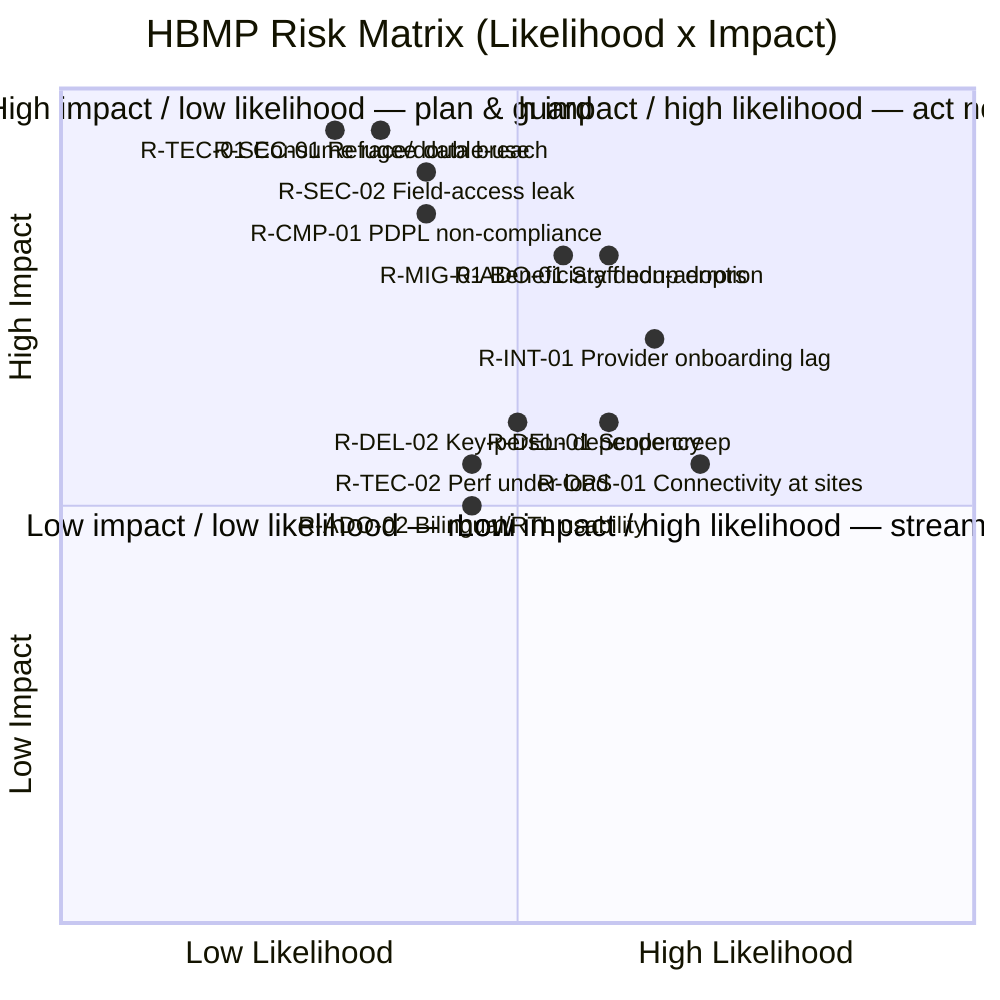

# 27 — Risk Assessment

> Cluster F · Delivery, Quality & Planning
> Up: [00-README-INDEX.md](00-README-INDEX.md) · Foundations: [0A-DESIGN-FOUNDATIONS.md](0A-DESIGN-FOUNDATIONS.md)
> Siblings: [26-testing-strategy.md](26-testing-strategy.md) · [29-delivery-plan.md](29-delivery-plan.md) · [30-technical-backlog.md](30-technical-backlog.md) · [33-sprint-roadmap.md](33-sprint-roadmap.md) · [35-implementation-plan.md](35-implementation-plan.md)
> Related: [08-non-functional-requirements.md](08-non-functional-requirements.md) · [18-security-model.md](18-security-model.md) · [19-audit-strategy.md](19-audit-strategy.md) · [20-compliance-checklist.md](20-compliance-checklist.md) · [28-mvp-definition.md](28-mvp-definition.md)

---

## 1. Purpose & method

This document maintains the HBMP **risk register**: the structured identification, scoring, mitigation, and ownership of risks across delivery, technical, security/privacy, compliance/legal, operational, adoption/change-management, provider-integration, and data-migration dimensions. It is a design artifact and a **living register** — it is reviewed at every release gate ([29-delivery-plan.md](29-delivery-plan.md)) and sprint review ([33-sprint-roadmap.md](33-sprint-roadmap.md)).

### 1.1 Scoring model

Each risk is scored **Likelihood (L) × Impact (I)** on a 1–5 scale; **Score = L × I** (1–25).

| Scale | Likelihood | Impact |
|---|---|---|
| 1 | Rare | Negligible |
| 2 | Unlikely | Minor |
| 3 | Possible | Moderate |
| 4 | Likely | Major |
| 5 | Almost certain | Severe / critical |

**Rating bands:** Low 1–6 · Medium 8–12 · High 15–19 · Critical 20–25.

**Response types:** Mitigate (reduce L or I), Avoid (change approach), Transfer (insurance/vendor/contract), Accept (with owner sign-off). Special-emphasis risks touching **beneficiary safety** (order double-use) or **data privacy** (field-level minimization, refugee data) are never "Accepted" without Medical Director + DPO sign-off.

### 1.2 Categories

`DEL` Delivery/program · `TEC` Technical/architecture · `SEC` Security/privacy · `CMP` Compliance/legal · `OPS` Operational · `ADO` Adoption/change-mgmt · `INT` Provider-integration · `MIG` Data-migration.

---

## 2. Risk heatmap

Placement is by residual concentration; the register (§3) holds exact scores.

**Heatmap key (Score = L × I):**

| | I=1 | I=2 | I=3 | I=4 | I=5 |
|---|---|---|---|---|---|
| **L=5** | 5 🟢 | 10 🟡 | 15 🟠 | 20 🔴 | 25 🔴 |
| **L=4** | 4 🟢 | 8 🟡 | 12 🟡 | 16 🟠 | 20 🔴 |
| **L=3** | 3 🟢 | 6 🟢 | 9 🟡 | 12 🟡 | 15 🟠 |
| **L=2** | 2 🟢 | 4 🟢 | 6 🟢 | 8 🟡 | 10 🟡 |
| **L=1** | 1 🟢 | 2 🟢 | 3 🟢 | 4 🟢 | 5 🟢 |

🟢 Low · 🟡 Medium · 🟠 High · 🔴 Critical

---

## 3. Risk register

### 3.1 Delivery & program (DEL)

| ID | Description | L | I | Score | Rating | Mitigation | Owner |
|---|---|---|---|---|---|---|---|
| DEL-01 | Scope creep — TPA ambitions (claims, PBM, telemedicine) pulled into MVP, diluting the walking skeleton | 3 | 4 | 12 | Med | Enforce MVP boundary ([28-mvp-definition.md](28-mvp-definition.md)); MoSCoW backlog ([31-product-backlog.md](31-product-backlog.md)); change-control board; deferred list is explicit | Product Owner |
| DEL-02 | Key-person dependency (few people hold domain/tech knowledge) | 3 | 4 | 12 | Med | Pair/mob on critical modules; ADRs & runbooks ([34-technical-documentation.md](34-technical-documentation.md)); knowledge-share cadence | Delivery Lead |
| DEL-03 | Optimistic estimates → schedule slippage across 7 phases | 3 | 3 | 9 | Med | Velocity-based planning; buffer sprints ([33-sprint-roadmap.md](33-sprint-roadmap.md)); track at gates | Delivery Lead |
| DEL-04 | Stakeholder-approval gate delays start (design not signed off) | 3 | 3 | 9 | Med | Structured review path in [00-README-INDEX.md](00-README-INDEX.md); scheduled decision meetings; clear exit criteria | Program Sponsor |
| DEL-05 | Funding/donor constraints reduce runway | 2 | 4 | 8 | Med | Release-based value delivery; each release independently valuable; MVP first | Program Sponsor |

### 3.2 Technical & architecture (TEC)

| ID | Description | L | I | Score | Rating | Mitigation | Owner |
|---|---|---|---|---|---|---|---|
| TEC-01 | **Order/prescription consume race → double-use** (safety invariant breach) | 3 | 5 | 15 | High | Atomic conditional-update guard + DB constraints; property/concurrency tests ([26 §5](26-testing-strategy.md)); idempotent events; **S1 gate** | Lead Architect |
| TEC-02 | Performance under peak load misses NFR targets | 3 | 3 | 9 | Med | Load/soak/spike testing; autoscaling on k3s (HPA); caching eligibility; observability budgets ([08-non-functional-requirements.md](08-non-functional-requirements.md)) | Lead Architect |
| TEC-03 | Microservice complexity / distributed-transaction bugs (sagas, outbox) | 3 | 4 | 12 | Med | Outbox + idempotency; contract tests (Pact); limit service count to MVP need; sequence diagrams ([24-sequence-diagrams.md](24-sequence-diagrams.md)) | Lead Architect |
| TEC-04 | Self-host operational burden underestimated (patching, backup/restore ownership, capacity, log volume) | 3 | 3 | 9 | Med | Runbooks; right-size; log-sampling; capacity plan; start at Tier 1 (Compose) and scale only when justified | SRE Lead |
| TEC-05 | Vendor/cloud lock-in limits future portability | 2 | 3 | 6 | Low | Standards (OpenAPI 3.1, FHIR, containers); abstraction at edges; documented ADRs | Lead Architect |
| TEC-06 | Audit trail incomplete/mutable — undermines accountability | 2 | 5 | 10 | Med | Append-only audit store, integrity hashing, write-in-transaction; audit assertions in tests ([19-audit-strategy.md](19-audit-strategy.md)) | Lead Architect |

### 3.3 Security & privacy (SEC)

| ID | Description | L | I | Score | Rating | Mitigation | Owner |
|---|---|---|---|---|---|---|---|
| SEC-01 | **Breach/exposure of refugee health data** — severe harm to vulnerable people | 2 | 5 | 10 | Med (Critical-if-realized) | Defence-in-depth ([18-security-model.md](18-security-model.md)); encryption at rest/in transit; OpenBao/Vault; least-privilege; pen tests; IR plan; never "Accept" without DPO | DPO / Security Lead |
| SEC-02 | **Field-level access leak** — role sees data outside minimization (e.g., Finance sees diagnosis) | 3 | 5 | 15 | High | Server-side ABAC enforcement; matrix-generated authz tests ([26 §4.4](26-testing-strategy.md)); default-deny; **S1 gate** | Security Lead |
| SEC-03 | Cross-provider data leakage (Provider A sees B's data) | 2 | 5 | 10 | Med | Tenant/provider isolation; row-level security; IDOR tests; isolation pen test | Security Lead |
| SEC-04 | Privilege escalation / broken auth (Keycloak, scopes, JWT) | 2 | 4 | 8 | Med | Keycloak, scoped tokens, short TTL, Kong policies, SAST/DAST | Security Lead |
| SEC-05 | Insider misuse of legitimate access | 3 | 4 | 12 | Med | Minimization, immutable audit, anomaly alerts, periodic access reviews, break-glass with review | DPO |
| SEC-06 | Secrets leakage in code/pipeline | 2 | 4 | 8 | Med | gitleaks pre-commit + CI; OpenBao/Vault + SOPS; no secrets in config; rotation | Security Lead |

### 3.4 Compliance & legal (CMP)

| ID | Description | L | I | Score | Rating | Mitigation | Owner |
|---|---|---|---|---|---|---|---|
| CMP-01 | **Egypt PDPL non-compliance** (consent, lawful basis, data-subject rights, cross-border, sensitive data) | 3 | 4 | 12 | Med | Compliance checklist ([20-compliance-checklist.md](20-compliance-checklist.md)); DPIA; lawful-basis mapping; retention & rights workflows; legal review | DPO / Legal |
| CMP-02 | Special-category (health + refugee status) processing without adequate safeguards | 2 | 5 | 10 | Med | DPIA, minimization, purpose limitation, access controls, audit; DPO sign-off gate | DPO |
| CMP-03 | Data residency / cross-border transfer constraints (hosting region) | 2 | 4 | 8 | Med | Deploy in-region where required; document transfer basis; residency in [25-deployment-architecture.md](25-deployment-architecture.md) | Lead Architect / Legal |
| CMP-04 | Future partner (UNHCR/gov) data-sharing obligations misaligned | 2 | 3 | 6 | Low | Deferred by MVP; interoperability designed FHIR-aligned; revisit at integration phase | Product Owner |
| CMP-05 | Records-retention & medico-legal record obligations not met | 2 | 4 | 8 | Med | Retention schedule; immutable clinical record; legal-hold capability | DPO / Medical Director |

### 3.5 Operational (OPS)

| ID | Description | L | I | Score | Rating | Mitigation | Owner |
|---|---|---|---|---|---|---|---|
| OPS-01 | Unreliable connectivity/power at clinics & partner sites | 4 | 3 | 12 | Med | Resilient UI (retry, save-drafts); graceful degradation; document offline as deferred; site-readiness checks | Ops Lead |
| OPS-02 | Insufficient support/monitoring at go-live (no NOC maturity) | 3 | 4 | 12 | Med | Observability + on-call ([25-deployment-architecture.md](25-deployment-architecture.md)); hypercare plan ([35-implementation-plan.md](35-implementation-plan.md)); runbooks | SRE Lead |
| OPS-03 | Master data (formulary, providers, coverage) stale/incorrect | 3 | 4 | 12 | Med | Master-data loading epic ([30-technical-backlog.md](30-technical-backlog.md)); stewardship process; validation on load | Data Steward |
| OPS-04 | Disaster/data-loss without tested recovery | 2 | 5 | 10 | Med | Backups, PITR, geo-redundancy; DR runbook + restore drills; RPO/RTO in NFRs | SRE Lead |
| OPS-05 | Capacity mismatch during intake surges | 3 | 3 | 9 | Med | Autoscaling; spike load tests; queue-based smoothing | SRE Lead |

### 3.6 Adoption & change management (ADO)

| ID | Description | L | I | Score | Rating | Mitigation | Owner |
|---|---|---|---|---|---|---|---|
| ADO-01 | Staff/providers resist leaving paper/WhatsApp; low adoption | 4 | 4 | 16 | High | Change-mgmt program; champions per site; role-based training; phased rollout; measure adoption; leadership mandate ([35-implementation-plan.md](35-implementation-plan.md)) | Change Manager |
| ADO-02 | Bilingual/RTL or literacy barriers hurt usability | 3 | 3 | 9 | Med | Arabic-first UX, WCAG 2.2 AA, usability testing with real staff, in-context help ([21-accessibility-checklist.md](21-accessibility-checklist.md)) | UX Lead |
| ADO-03 | Workflow mismatch — system doesn't fit real clinic flow | 3 | 4 | 12 | Med | Journey/process validation ([04-patient-journey-maps.md](04-patient-journey-maps.md), [05-business-process-maps.md](05-business-process-maps.md)); UAT; feedback loops | BA / Product |
| ADO-04 | Training decay / high staff turnover | 3 | 3 | 9 | Med | Reusable training, quick-reference cards, embedded help, onboarding runbook | Change Manager |

### 3.7 Provider integration (INT)

| ID | Description | L | I | Score | Rating | Mitigation | Owner |
|---|---|---|---|---|---|---|---|
| INT-01 | Slow provider (lab/imaging/pharmacy) onboarding delays fulfilment value | 4 | 3 | 12 | Med | Self-service provider portal + admin onboarding ([30/31]); onboarding runbook; phased provider cohorts | Network Team Lead |
| INT-02 | Providers lack devices/skills to use portals | 3 | 3 | 9 | Med | Low-friction web portals; training; minimal-hardware design; support desk | Network Team Lead |
| INT-03 | Inconsistent provider data quality (results, dispensing records) | 3 | 3 | 9 | Med | Structured inputs, validation, required fields, upload standards; audit | Network Team Lead |
| INT-04 | Deferred external integrations (HL7/UNHCR/gov) create manual gaps | 3 | 2 | 6 | Low | Explicitly deferred; manual interim workflow documented; FHIR-ready design | Product Owner |

### 3.8 Data migration (MIG)

| ID | Description | L | I | Score | Rating | Mitigation | Owner |
|---|---|---|---|---|---|---|---|
| MIG-01 | **Beneficiary deduplication errors** — merge wrong people or fail to link (safety + continuity risk) | 3 | 4 | 12 | Med | Deterministic + probabilistic matching with human review of candidates; multi-identifier model; reversible merges; migration reconciliation reports | Data Migration Lead |
| MIG-02 | Poor source-data quality (paper, Excel, WhatsApp) → dirty import | 4 | 3 | 12 | Med | Profiling, cleansing rules, staged migration, exception queues, do-not-block-go-live fallback (manual re-registration) | Data Migration Lead |
| MIG-03 | Migration causes downtime or data loss on cutover | 2 | 4 | 8 | Med | Rehearsed cutover, dry runs on masked data, rollback plan, reconciliation counts | Data Migration Lead |
| MIG-04 | Incomplete historical clinical records reduce continuity value | 3 | 2 | 6 | Low | Prioritize identity + active coverage + active meds/allergies first; backfill later | Data Migration Lead |

---

## 4. Top risks & focused mitigation plans

The following are the register's **High/Critical-priority** risks (or Medium risks with catastrophic realized impact). Each has an explicit, owned plan tracked at every gate.

### T1 · SEC-02 Field-level access leak (Score 15, High)
- **Why it tops the list:** violates the platform's core privacy promise (data minimization) directly.
- **Plan:** ABAC enforced server-side; permission matrix ([11-permission-matrix.md](11-permission-matrix.md)) is the single source of truth; **matrix-generated authorization tests** run every build; canonical negative assertions (finance-can't-see-diagnosis, provider isolation) are S1/Blocker gates ([26 §4.4/§5.2](26-testing-strategy.md)); pen test targets authz explicitly. **Trigger/KPI:** any authz test failure halts release.

### T2 · TEC-01 Consume race → double-use (Score 15, High)
- **Why:** breaks the safety invariant (order consumed exactly once).
- **Plan:** atomic conditional update + DB unique constraint; property + concurrency + contention load tests; idempotent event handling; S1 gate ([26 §5.1](26-testing-strategy.md)). **KPI:** zero observed double-successes across all layers, every release.

### T3 · ADO-01 Staff/provider non-adoption (Score 16, High)
- **Why:** the best platform fails if paper persists; adoption is existential to value.
- **Plan:** structured change management ([35-implementation-plan.md](35-implementation-plan.md)) — executive mandate, per-site champions, role-based bilingual training, phased rollout, embedded help, and measured adoption (active users, paper-fallback rate, task completion). **KPI:** ≥ target active-usage per role per site by end of hypercare.

### T4 · SEC-01 Refugee data breach (Score 10, Critical-if-realized)
- **Plan:** defence-in-depth ([18-security-model.md](18-security-model.md)); encryption everywhere; least-privilege + immutable audit ([19-audit-strategy.md](19-audit-strategy.md)); DPIA; incident-response plan with breach-notification workflow; regular pen tests; DPO sign-off gate. **KPI:** zero unresolved High/Critical security findings at go-live.

### T5 · CMP-01 Egypt PDPL non-compliance (Score 12, Med)
- **Plan:** compliance checklist ([20-compliance-checklist.md](20-compliance-checklist.md)) mapped to PDPL; DPIA for special-category data; lawful-basis & consent handling; data-subject-rights and retention workflows; legal review before go-live. **KPI:** compliance checklist 100% closed at Gate 4.

### T6 · MIG-01 Beneficiary dedup errors (Score 12, Med)
- **Plan:** multi-identifier matching with human-in-the-loop review of merge candidates; reversible merges; reconciliation reports; conservative auto-merge threshold. **KPI:** false-merge rate below agreed threshold in migration dry runs before cutover.

### T7 · INT-01 Provider onboarding lag (Score 12, Med)
- **Plan:** provider self-service + admin-assisted onboarding, onboarding runbook, phased provider cohorts aligned to release scope ([29-delivery-plan.md](29-delivery-plan.md)). **KPI:** target provider count live per release milestone.

---

## 5. Governance & review cadence

- **Register ownership:** Delivery Lead maintains the register; each risk has a named owner accountable for its mitigation.
- **Cadence:** reviewed at every sprint review ([33-sprint-roadmap.md](33-sprint-roadmap.md)) and formally re-scored at every release gate ([29-delivery-plan.md](29-delivery-plan.md)); new risks logged continuously.
- **Escalation:** any risk crossing into High (≥15) or any safety/privacy risk is escalated to the Program Sponsor + DPO within the sprint.
- **Closure:** risks are closed only with evidence (test green, control live, sign-off) and the closure is recorded.
- **Link to gates:** the implementation-approval gate in [00-README-INDEX.md](00-README-INDEX.md) and [35-implementation-plan.md](35-implementation-plan.md) requires the top-risk plans (§4) to be accepted before build begins.

---

## 6. Assumptions & dependencies

- Scores are **provisional estimates** pending Mersal stakeholder review and will be recalibrated with operational data.
- Assumes design is approved before implementation (program gate).
- Assumes legal counsel available for PDPL interpretation and DPO appointed.
- Depends on master-data availability (formulary, provider network, coverage rules) and source-data access for migration.

---

> Back to [00-README-INDEX.md](00-README-INDEX.md) · Foundations [0A-DESIGN-FOUNDATIONS.md](0A-DESIGN-FOUNDATIONS.md)
