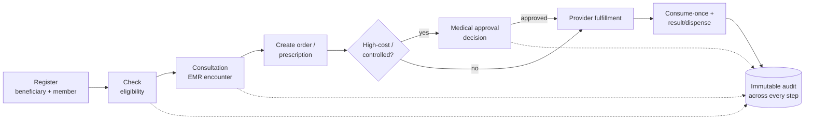

# 28 — MVP Definition

> Cluster A · Product & Discovery
> Up: [00-README-INDEX.md](00-README-INDEX.md) · Foundations: [0A-DESIGN-FOUNDATIONS.md](0A-DESIGN-FOUNDATIONS.md)
> Siblings: [01-product-vision.md](01-product-vision.md) · [04-patient-journey-maps.md](04-patient-journey-maps.md) · Delivery: [29-delivery-plan.md](29-delivery-plan.md)

---

## 1. Purpose & MVP thesis

This document draws the **launch line** through the vision ([01-product-vision.md](01-product-vision.md)) and the journey ([04-patient-journey-maps.md](04-patient-journey-maps.md)): what is in v1, what is deferred, and why.

**MVP thesis:** prove the **reusable HBMP core** by making one continuous, benefit-aware, auditable journey work end-to-end for real beneficiaries — a **walking skeleton** that touches every core service once — rather than building any single phase to full depth. If a beneficiary can be registered, found eligible, seen, ordered/prescribed for, fulfilled by an isolated provider, and (when needed) approved — all on one identity, all audited — the platform's foundational bet is validated and everything else (claims, PBM, inventory, integrations) is incremental.

> The MVP is deliberately **thin but complete across the spine**, not thick in any one place. Depth comes in v1.x+ (see [29-delivery-plan.md](29-delivery-plan.md) and [33-sprint-roadmap.md](33-sprint-roadmap.md)).

---

## 2. The walking skeleton

The minimum path that exercises all core domains ([0A §1](0A-DESIGN-FOUNDATIONS.md)) exactly once:

Every arrow above must work in v1. The audit spine (I) and least-privilege authorization are **non-negotiable and cut across all steps** — they are part of the skeleton, not a later hardening pass.

**Skeleton acceptance:** a single test beneficiary can traverse `Register → Eligibility → Consultation → Order+Prescription → (Approval when high-cost) → Provider fulfillment (consume-once) → Result/Dispense`, on one `beneficiary_id`, with every step producing an immutable audit event and every actor seeing only minimum-necessary data.

---

## 3. In scope vs. out of scope for v1

### 3.1 In scope (v1)

**Core benefit spine**
- **Beneficiaries & identity:** register from any identifier type; immutable `beneficiary_id` (UUID v7); document-flexible identity; de-duplication matching; member issuance (`MRS-M-…`); status lifecycle `Pending→Active→(Suspended|Expired|Blocked|Inactive)`.
- **Eligibility & Coverage/Policy:** real-time eligibility decision at point of service; basic policy/coverage model with limits and validity window.
- **Provider Network:** provider directory (clinics, labs, imaging, pharmacies); provider-isolated portal access; basic contract/coverage terms.
- **Orders:** clinician-created investigation orders; lifecycle `Requested→(PendingApproval)→(Approved|Rejected)→Active→PartiallyUsed→Completed`; **consume-once atomicity** ([0A §7](0A-DESIGN-FOUNDATIONS.md)).
- **Prescriptions:** clinician-created; lifecycle `Draft→Submitted→(Approved|Rejected)→PartiallyDispensed→Dispensed`; **partial dispensing as first-class**.
- **Authorizations/Approvals:** high-cost/controlled routing; queue with attached evidence; decision `Approved|PartiallyApproved|Rejected|InfoRequested`; TAT capture; override/escalation for Medical Directors.

**Clinical & operational (thin)**
- **EMR/Clinical:** structured encounter (SOAP), diagnoses, vitals, allergies, active medications, longitudinal view scoped to care.
- **Appointments:** basic scheduling with eligibility gating and reschedule/cancel; walk-in registration.
- **Lab & Imaging fulfillment:** provider-isolated order queue; consume-once; result/document upload.
- **Pharmacy fulfillment:** provider-isolated prescription queue; coverage check; full & partial dispense.
- **Documents:** upload with virus scan; result/report storage.
- **Notifications:** **in-app + email only**.
- **Reporting:** essential operational + approval/utilization reports for Finance and Medical Directors (not a full BI suite).
- **Audit:** immutable, append-only, hash-chained audit across all steps; no clinical/benefit hard-deletes.

**Cross-cutting (non-negotiable in v1)**
- **AuthN/AuthZ:** Keycloak/OIDC; RBAC + ABAC; default-deny; provider & tenant isolation.
- **Accessibility & i18n:** WCAG 2.2 AA; full Arabic RTL + English LTR.
- **Internal role portals** for: Registration, Call Center, Appointments, Doctor, Nurse, Medical Approval, Medical Director, Case Manager, Finance (basic), Network/Provider Admin, Super Admin.
- **External provider portal** (isolated) for: Lab, Imaging, Pharmacy operators.

### 3.2 Out of scope (v1) — deferred to roadmap

- **Claims adjudication, capitation, full PBM/formulary engine** (basic coverage rules only in v1).
- **Inventory & stock management** (pharmacy dispenses against coverage, not tracked stock).
- **Telemedicine / video consultation.**
- **Beneficiary-facing mobile app / self-service portal.**
- **SMS / WhatsApp notifications; QR-based beneficiary/order handoff** (in-app/email only in v1).
- **External integrations:** UNHCR, government bodies, insurers, **FHIR/HL7 exchange** (interoperability *readiness* in the data model only — see [0A §4](0A-DESIGN-FOUNDATIONS.md), [15-database-erd.md](15-database-erd.md)).
- **AI clinical decision support** (advisory CDS).
- **Advanced analytics / BI dashboards** beyond essential operational reports.
- **Native mobile provider apps** (responsive web only in v1).
- **Multi-tenant onboarding of external organizations** (Mersal is tenant 0; multi-tenant *architecture* present, additional-tenant onboarding deferred).

---

## 4. MoSCoW prioritization

Legend: **M**ust (MVP-defining, ships or we don't launch) · **S**hould (high value, target for v1 if capacity allows) · **C**ould (nice-to-have, opportunistic) · **W**on't (explicitly not now — roadmap).

| Capability | Domain | Priority | Notes |
|------------|--------|:--:|-------|
| Beneficiary registration from any identifier + immutable ID | Beneficiaries | **M** | Foundational identity |
| De-duplication / identity matching | Beneficiaries | **M** | Prevents duplicate records (KR1.3) |
| Member issuance & status lifecycle | Coverage | **M** | — |
| Document capture + virus scan | Documents | **M** | Needed at registration & results |
| Real-time eligibility decision at POS | Eligibility | **M** | Benefit-awareness core |
| Basic coverage/policy model (limits, validity) | Coverage | **M** | — |
| Provider directory + provider isolation | Provider Network | **M** | Isolation is a security invariant |
| Structured EMR encounter (SOAP, vitals, allergies, meds) | EMR | **M** | Continuity + safety |
| Longitudinal record (scoped to care) | EMR | **M** | Chronic-care value |
| Investigation orders + consume-once atomicity | Orders | **M** | Duplicate-use impossible ([0A §7](0A-DESIGN-FOUNDATIONS.md)) |
| Prescriptions + partial dispensing | Prescriptions | **M** | Partial is first-class |
| High-cost approval routing + evidence + decision + TAT | Authorizations | **M** | 100% routed (KR3.1) |
| Provider fulfillment portals (lab/imaging/pharmacy) | Multiple | **M** | Isolated queues |
| Immutable, hash-chained audit; no clinical hard-delete | Audit | **M** | KR4.1 |
| RBAC + ABAC, default-deny, least privilege | Security | **M** | KR4.2/4.3 |
| WCAG 2.2 AA + Arabic RTL / English LTR | Cross-cutting | **M** | Acceptance criterion, not enhancement |
| In-app + email notifications | Notifications | **M** | Baseline channel |
| Basic appointment scheduling + eligibility gating | Appointments | **M** | Prevents wasted trips |
| Essential approval/utilization/operational reports | Reporting | **S** | For Finance & Medical Directors |
| Case Manager longitudinal timeline view | EMR/Case Mgmt | **S** | Chronic-care coordination |
| Override / emergency approval for Medical Directors | Authorizations | **S** | Governance need |
| Prior-result flagging to avoid duplicate orders | Orders/EMR | **S** | KR2.3 |
| Basic formulary/drug rules (allergy/interaction flags) | Prescriptions | **S** | Safety; not full PBM |
| Richer scheduling (multi-provider, no-show handling) | Appointments | **C** | v1.x |
| Configurable reporting/exports | Reporting | **C** | v1.x |
| SMS / WhatsApp notifications | Notifications | **W** | Roadmap |
| QR beneficiary/order handoff | Cross-cutting | **W** | Roadmap |
| Beneficiary mobile app / self-service | New | **W** | Roadmap |
| Claims / capitation / full PBM | New | **W** | Roadmap |
| Inventory / stock | New | **W** | Roadmap |
| Telemedicine | New | **W** | Roadmap |
| UNHCR / government / FHIR-HL7 integration | Integration | **W** | Readiness only in v1 |
| AI clinical decision support | New | **W** | Roadmap (advisory) |

---

## 5. MVP success criteria

The MVP is "done" when it demonstrably delivers the walking skeleton **and** satisfies the launch-relevant subset of the OKRs in [01 §6](01-product-vision.md).

**Functional acceptance**
1. A beneficiary can be registered from any identifier, de-duplicated, and issued membership — on one immutable identity.
2. Eligibility returns a correct real-time decision at every point of service used in v1.
3. A clinician can create a structured encounter and generate orders and prescriptions against a real coverage check.
4. A high-cost order is *automatically* routed to approval, decided with attached evidence, and cannot be fulfilled until approved.
5. An external provider (lab/imaging/pharmacy) sees **only** their isolated queue and can consume/dispense **exactly once**, including partial dispensing.
6. Every step produces an immutable audit event; no clinical/benefit data can be hard-deleted.

**Non-functional acceptance** (see [08-non-functional-requirements.md](08-non-functional-requirements.md))
7. Least-privilege enforced: no role/persona sees data outside its [11-permission-matrix.md](11-permission-matrix.md) boundary (verified by access-review).
8. Provider isolation verified: zero cross-provider data exposure in testing (KR4.2).
9. WCAG 2.2 AA and Arabic RTL / English LTR verified on target (modest) devices.
10. Consume-once/atomicity holds under concurrency testing — duplicate use impossible.

**Outcome signals (early)**
11. Pilot shows measurable reduction in registration time and duplicate rate (toward KR1.1–1.3).
12. 100% of high-cost services in the pilot routed through approval (KR3.1); TAT captured.
13. Positive bilingual usability results from pilot internal & provider users (toward KR5.3).

---

## 6. Assumptions

| # | Assumption | If false → impact | Owner to confirm |
|---|-----------|-------------------|------------------|
| A1 | Open-source on-prem stack ([0C-OPEN-SOURCE-STACK.md](0C-OPEN-SOURCE-STACK.md)) is available and approved | Re-platform effort | Mersal IT / Sponsor |
| A2 | At least one pilot clinic, lab, imaging center, and pharmacy will onboard | Can't validate provider isolation/fulfillment | Network Team |
| A3 | Coverage/policy rules can be expressed simply for v1 (limits + validity), full PBM deferred | Eligibility scope grows | Medical Directors / Finance |
| A4 | Approval policy & SLAs can be defined for the high-cost/controlled set | Approval workflow underspecified | Medical Approval Team / Medical Directors |
| A5 | Data-protection/compliance sign-off achievable pre-pilot | Launch blocked | DPO / Compliance |
| A6 | Identity matching can rely on the identifier types in [0A §3](0A-DESIGN-FOUNDATIONS.md) | De-dup weaker | Registration |
| A7 | In-app/email notifications acceptable for pilot (SMS/WhatsApp later) | Adoption friction | Sponsor |
| A8 | Beneficiaries are served via staff in v1 (no self-service) | Scope/UX change | Sponsor |
| A9 | Modest shared devices + imperfect connectivity are the target environment | Perf/offline rework | Mersal IT |
| A10 | Interoperability is *readiness only* in v1 (no live UNHCR/gov integration) | Scope creep | Sponsor / future partners |

---

## 7. Explicitly deferred (and why now-is-not-the-time)

| Deferred item | Why deferred from v1 | When (indicative) | Reference |
|---------------|----------------------|-------------------|-----------|
| Claims adjudication / capitation | Needs stable orders/coverage core first; high complexity | Later horizon | [01 §9](01-product-vision.md) |
| Full PBM / formulary engine | Basic drug rules suffice for safety in v1; full PBM is deep | Later | [0A §2](0A-DESIGN-FOUNDATIONS.md) |
| Inventory / stock | Dispensing works against coverage without stock tracking | Later | — |
| Telemedicine | Requires video, scheduling depth, new compliance surface | Later | — |
| Beneficiary mobile app / self-service | v1 serves beneficiaries via staff; app is additive | Later | [03 §C](03-user-personas.md) |
| SMS / WhatsApp; QR handoff | In-app/email validate the loop; comms channels are additive | v1.x | [04 §7](04-patient-journey-maps.md) |
| UNHCR / government / FHIR-HL7 integration | Needs partner agreements; v1 builds *readiness* into the model | Future | [01 §9](01-product-vision.md) |
| AI clinical decision support | Advisory-only; depends on structured data volume | Future | [01 §3.2](01-product-vision.md) |
| Additional-tenant onboarding | Architecture is multi-tenant; onboarding others is later | Later | [0A §2](0A-DESIGN-FOUNDATIONS.md) |

Deferring these is a **feature of the strategy**, not a gap: the HBMP core is built so each attaches without re-platforming ([01 §7](01-product-vision.md)).

---

## 8. Tie-in to phased delivery

The MVP is **Phase 1 of the delivery plan**. Sequencing, milestones, dependencies, and the pilot→scale rollout are defined in [29-delivery-plan.md](29-delivery-plan.md); sprint-level breakdown in [33-sprint-roadmap.md](33-sprint-roadmap.md); backlog in [31-product-backlog.md](31-product-backlog.md) / [30-technical-backlog.md](30-technical-backlog.md); stories & acceptance criteria in [32-user-stories.md](32-user-stories.md). Risks that could reshape MVP scope are tracked in [27-risk-assessment.md](27-risk-assessment.md).

**Indicative delivery shape (detail in [29](29-delivery-plan.md)):**

| Stage | Focus | Exit |
|-------|-------|------|
| Foundation | Identity, auth, audit spine, tenancy, CI/CD | Skeleton auth + audit proven |
| Core spine | Beneficiaries, Eligibility, Coverage, Orders, Prescriptions, Authorizations | Walking skeleton passes (§2) |
| Clinical & fulfillment | EMR encounter, provider portals, lab/imaging/pharmacy fulfillment | End-to-end journey works |
| Pilot | One clinic + lab + imaging + pharmacy, real beneficiaries | Success criteria §5 met |
| Hardening & scale | Reporting, Case Manager view, accessibility & security review | Ready to widen rollout |

---

## 9. MVP guardrails (how to keep it an MVP)

1. **Every proposed v1 feature must trace to the walking skeleton (§2) or a Must in the MoSCoW table (§4).** If it doesn't, it's v1.x+.
2. **No depth without breadth first.** Complete the spine end-to-end before deepening any single phase.
3. **The cross-cutting Musts (audit, least privilege, provider isolation, accessibility, bilingual) are never traded away** for feature scope.
4. **"Readiness, not integration"** for anything touching external partners in v1.
5. **Scope changes go through the program-governance RACI** ([02 §5](02-stakeholder-analysis.md)); Sponsor is Accountable for MVP scope.

---

*Continue: [29-delivery-plan.md](29-delivery-plan.md) sequences this MVP into phased delivery; [27-risk-assessment.md](27-risk-assessment.md) tracks what could move the line.*
