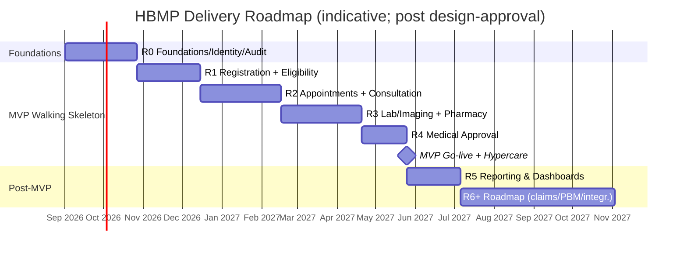

# 29 — Phase-by-Phase Delivery Plan

> Cluster F · Delivery, Quality & Planning
> Up: [00-README-INDEX.md](00-README-INDEX.md) · Foundations: [0A-DESIGN-FOUNDATIONS.md](0A-DESIGN-FOUNDATIONS.md)
> Siblings: [26-testing-strategy.md](26-testing-strategy.md) · [27-risk-assessment.md](27-risk-assessment.md) · [30-technical-backlog.md](30-technical-backlog.md) · [31-product-backlog.md](31-product-backlog.md) · [32-user-stories.md](32-user-stories.md) · [33-sprint-roadmap.md](33-sprint-roadmap.md) · [35-implementation-plan.md](35-implementation-plan.md)
> Related: [16-service-architecture.md](16-service-architecture.md) · [25-deployment-architecture.md](25-deployment-architecture.md) · [28-mvp-definition.md](28-mvp-definition.md)

---

## 1. Purpose

This plan sequences HBMP delivery into **releases** aligned to the 7 patient-journey phases plus the platform foundations that everything depends on. It defines, per release, the **scope, dependencies, exit criteria, and rough duration**, and shows the overall timeline as a Mermaid gantt. It is the bridge between the MVP definition ([28-mvp-definition.md](28-mvp-definition.md)) and the sprint-level roadmap ([33-sprint-roadmap.md](33-sprint-roadmap.md)). All durations are **indicative planning estimates** and are contingent on the design-approval gate ([00-README-INDEX.md](00-README-INDEX.md)).

### 1.1 Delivery principles

- **Foundations first, then thin vertical slices.** R0 builds identity, audit, and platform rails; every later release is a working vertical slice of the journey.
- **Walking skeleton before breadth.** R1–R4 complete the MVP end-to-end journey ([28 §MVP](28-mvp-definition.md)): registration → eligibility → consultation → order/prescription → provider fulfilment → approval.
- **Invariants shipped with the features that need them.** Order-consume atomicity and field-level minimization are built and gated within the releases that introduce orders and clinical data (see [26-testing-strategy.md](26-testing-strategy.md)).
- **Each release independently demonstrable and valuable** to Mersal.
- **Deferred scope stays deferred.** Claims, PBM, telemedicine, mobile apps, external integrations (UNHCR/gov/HL7), AI CDS, OCR, and offline clinics are R6+/out-of-MVP.

### 1.2 Release map at a glance

| Release | Theme | Journey phase(s) | MVP? | Rough duration |
|---|---|---|---|---|
| R0 | Foundations · identity · audit | Platform | Enabler | ~6–8 wks |
| R1 | Registration + Eligibility | 1, 2 | Yes | ~6–8 wks |
| R2 | Appointments + Clinical Consultation | 3, 4 | Yes | ~8–10 wks |
| R3 | Lab & Imaging + Pharmacy (fulfilment) | 5, 6 | Yes | ~8–10 wks |
| R4 | Medical Approval | 7 | Yes | ~4–6 wks |
| R5 | Reporting & dashboards | Cross-cutting | Post-MVP | ~4–6 wks |
| R6+ | Roadmap (claims, PBM, integrations, mobile…) | Future | No | Ongoing |

---

## 2. Timeline (Gantt)

> The gantt assumes a single primary delivery train with some overlap absorbed at the sprint level ([33-sprint-roadmap.md](33-sprint-roadmap.md)); hardening/UAT is included within each release's duration.

---

## 3. Release detail

### R0 — Foundations, Identity & Audit  *(Enabler · ~6–8 weeks)*

**Goal:** stand up the platform rails so every subsequent vertical slice is fast and safe.

**Scope**
- Infrastructure-as-code (OpenTofu/Ansible/Helm), k3s cluster, environments (Dev/QA/Staging/Prod) per [25-deployment-architecture.md](25-deployment-architecture.md).
- Identity: Keycloak integration, RBAC+ABAC skeleton, role/portal shell for the roles in [10-role-matrix.md](10-role-matrix.md).
- Kong gateway, RabbitMQ/NATS JetStream, MinIO, OpenBao, PostgreSQL with migrations framework.
- **Immutable audit service** ([19-audit-strategy.md](19-audit-strategy.md)) — available before any clinical/data feature.
- Observability (OpenTelemetry/Prometheus/Grafana/Loki/Tempo), CI/CD pipeline with the Gate-1/2 quality gates ([26 §9](26-testing-strategy.md)).
- Design system + i18n/RTL framework (bilingual shell) and the Beneficiary core data model foundation.
- Corresponds to the technical backlog epics in [30-technical-backlog.md](30-technical-backlog.md).

**Dependencies:** design approval; on-prem server (or VPS) provisioning; Keycloak access; brand palette reconciliation ([0A-DESIGN-FOUNDATIONS.md](0A-DESIGN-FOUNDATIONS.md)).

**Exit criteria**
- CI/CD promotes a hello-world service through all environments with gates enforced.
- Auth works end-to-end (login, role-scoped access) for at least two roles.
- Audit events are written immutably and queryable.
- Bilingual (AR-RTL/EN) shell renders and passes baseline axe checks.
- Contract-test broker + `can-i-deploy` operational.

### R1 — Registration + Eligibility  *(MVP · Phases 1–2 · ~6–8 weeks)*

**Goal:** register a beneficiary with a single durable identity and answer "is this person eligible for this service now?"

**Scope**
- Beneficiary registration & activation with **multi-identifier matching/deduplication** (National ID, Passport, Refugee ID, UNHCR, Member no.).
- Eligibility & Coverage/Policy evaluation service; real-time eligibility check at reception/call-center.
- Beneficiary Management, Reception, Call Center portals (core screens).
- Field-level minimization enforced for these roles from day one.

**Dependencies:** R0; master data for coverage/policy ([30-technical-backlog.md](30-technical-backlog.md) master-data loading); [07-functional-requirements.md](07-functional-requirements.md), [15-database-erd.md](15-database-erd.md).

**Exit criteria**
- A beneficiary can be registered, matched (no silent duplicates), and activated; audited.
- Eligibility returns a correct, real-time decision meeting the p95 latency NFR.
- Duplicate-candidate review workflow works; merges reversible.
- Authorization tests green for Reception/Call-Center/Beneficiary-Mgmt roles.

### R2 — Appointments + Clinical Consultation  *(MVP · Phases 3–4 · ~8–10 weeks)*

**Goal:** book/manage appointments and conduct a structured consultation that produces orders and prescriptions.

**Scope**
- Appointment booking, scheduling, no-show handling, re-book; Reception/Call-Center + Doctor/Nurse portals.
- Clinical consultation: SOAP note, problem list, allergies/medications, vitals (Nurse), and **creation of orders (lab/imaging) and prescriptions** — the objects governed by the consume invariant.
- Order & Prescription lifecycle state machines ([23-state-machines.md](23-state-machines.md)) with atomic-consume design in place (fulfilment lands in R3).
- Referral creation.

**Dependencies:** R1 (identity, eligibility); [12-ui-wireframes.md](12-ui-wireframes.md), [13-ux-flows.md](13-ux-flows.md), [24-sequence-diagrams.md](24-sequence-diagrams.md).

**Exit criteria**
- Full appointment lifecycle incl. no-show works and is audited.
- A consultation produces valid orders/prescriptions in `Available` state.
- SOAP/clinical data respects field-level minimization (e.g., not exposed to Finance).
- Order/prescription state machine passes legal/illegal-transition tests.

### R3 — Lab & Imaging + Pharmacy (Fulfilment)  *(MVP · Phases 5–6 · ~8–10 weeks)*

**Goal:** providers fulfil orders and prescriptions with the consume invariant fully enforced.

**Scope**
- Labs & Imaging portals: view assigned order, **atomically consume** it, upload results; partial-fulfilment where applicable.
- Pharmacies portal: dispense prescription, **partial dispense**, generic substitution, balance tracking, over-dispense prevention.
- Provider isolation (Provider A ≠ Provider B) and provider onboarding basics ([INT risks](27-risk-assessment.md)).
- The **atomic consume, no-reuse, partial-fulfilment, duplicate-impossible** invariants are fully realized and gated here ([26 §5](26-testing-strategy.md)).

**Dependencies:** R2 (orders/prescriptions exist); provider onboarding; MinIO for result uploads.

**Exit criteria**
- An order can be consumed exactly once; a second attempt is blocked; concurrency/contention tests green (S1 gate).
- Prescription partial dispense tracks balance correctly; over-dispense impossible.
- Provider isolation authz tests green; results upload works and is audited.
- Golden E2E journeys J3/J4 pass.

### R4 — Medical Approval  *(MVP · Phase 7 · ~4–6 weeks)*

**Goal:** route high-cost/controlled services through a consistent, auditable approval with TAT visibility.

**Scope**
- Medical Approval portal: approval request, decision (approve/reject), emergency/manual override, TAT tracking.
- Approval gating: fulfilment of controlled orders unlocked only on approval; rejection keeps it locked.
- Medical Director oversight views.

**Dependencies:** R2 (orders), R3 (fulfilment gating); policy for what requires approval.

**Exit criteria**
- Approve → fulfilment unlocked; Reject → fulfilment stays locked; both audited.
- Emergency/manual override works with justification + audit.
- TAT metrics captured; golden journey J5 passes.
- **MVP walking skeleton complete end-to-end** → MVP go-live + hypercare ([35-implementation-plan.md](35-implementation-plan.md)).

### R5 — Reporting & Dashboards  *(Post-MVP · ~4–6 weeks)*

**Goal:** give Medical Directors, Case Managers, Finance, and Org/Provider Admins operational visibility.

**Scope**
- Role-scoped dashboards: throughput, TAT, eligibility outcomes, fulfilment volumes, approval spend — **all respecting field-level minimization** (Finance sees cost, not diagnosis).
- Operational reports & exports; audit-report views.

**Dependencies:** R1–R4 data; analytics store/read models.

**Exit criteria:** dashboards accurate against source; access-scoped correctly; performance acceptable; a11y sign-off.

### R6+ — Roadmap  *(Future · ongoing)*

Claims, PBM, provider inventory, telemedicine, native mobile apps, UNHCR/government/HL7 interoperability, AI clinical decision support, OCR intake, offline clinics — **explicitly deferred** ([28-mvp-definition.md](28-mvp-definition.md)). The architecture is FHIR-aligned and event-driven so these can be added without re-platforming.

---

## 4. Cross-release workstreams

Some work runs continuously across all releases rather than inside one:

| Workstream | Spans | Notes |
|---|---|---|
| Security & privacy | R0→R5 | Authz/minimization tests, pen tests per major release ([26](26-testing-strategy.md), [18-security-model.md](18-security-model.md)) |
| Accessibility & localization | R0→R5 | AR-RTL/EN + WCAG 2.2 AA per feature ([21-accessibility-checklist.md](21-accessibility-checklist.md)) |
| Master-data stewardship | R1→R5 | Formulary, providers, coverage kept current ([OPS-03](27-risk-assessment.md)) |
| Data migration | R1 (identity) → onward | Beneficiary/provider onboarding, dedup ([MIG risks](27-risk-assessment.md)) |
| Change management & training | R1→go-live→hypercare | Adoption program ([35-implementation-plan.md](35-implementation-plan.md), [ADO risks](27-risk-assessment.md)) |
| Observability & SRE | R0→onward | Dashboards, on-call, DR drills |

---

## 5. Milestones & gates

| Milestone | Marks | Gate owner |
|---|---|---|
| M0 Design approved | Build may begin | Program Sponsor |
| M1 Foundations ready | R0 exit | Lead Architect |
| M2 Eligibility live | R1 exit | Product Owner |
| M3 Consultation produces orders | R2 exit | Medical Director + Product |
| M4 Fulfilment invariants proven | R3 exit (S1 gates) | Lead Architect + QA Lead |
| M5 Approval closes the loop | R4 exit → **MVP** | Program Sponsor |
| M6 Reporting live | R5 exit | Product Owner |

Each gate applies the release exit criteria plus the global exit criteria in [26 §7](26-testing-strategy.md) and a risk re-score ([27-risk-assessment.md](27-risk-assessment.md)).

---

## 6. Dependencies & assumptions

- **External:** on-prem server (or VPS) hosting, Keycloak, legal/DPO availability for PDPL, master-data source access, provider willingness to onboard.
- **Internal:** stable product ownership, availability of Mersal staff for UAT/training, brand-book reconciliation.
- **Assumptions:** one primary delivery train; durations exclude procurement lead times; deferred scope remains deferred; approval gate cleared before M0.
- All estimates are planning-grade and refined into sprints in [33-sprint-roadmap.md](33-sprint-roadmap.md).

---

> Back to [00-README-INDEX.md](00-README-INDEX.md) · Foundations [0A-DESIGN-FOUNDATIONS.md](0A-DESIGN-FOUNDATIONS.md)
