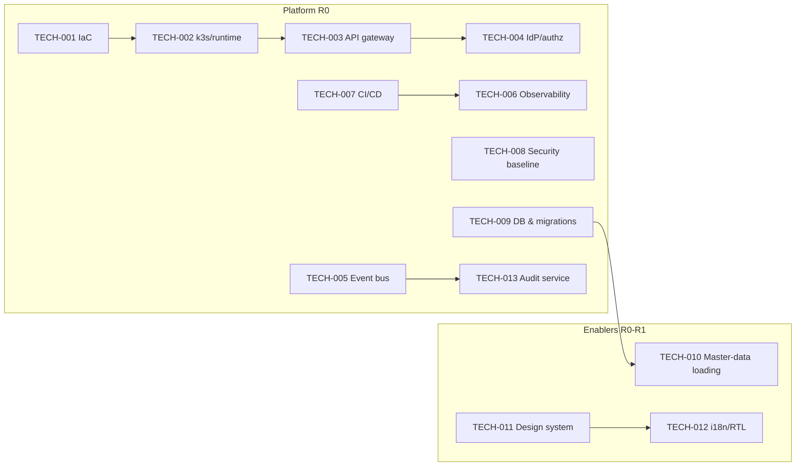

# 30 — Technical Backlog

> Cluster F · Delivery, Quality & Planning
> Up: [00-README-INDEX.md](00-README-INDEX.md) · Foundations: [0A-DESIGN-FOUNDATIONS.md](0A-DESIGN-FOUNDATIONS.md)
> Siblings: [26-testing-strategy.md](26-testing-strategy.md) · [27-risk-assessment.md](27-risk-assessment.md) · [29-delivery-plan.md](29-delivery-plan.md) · [31-product-backlog.md](31-product-backlog.md) · [32-user-stories.md](32-user-stories.md) · [33-sprint-roadmap.md](33-sprint-roadmap.md) · [34-technical-documentation.md](34-technical-documentation.md)
> Related: [16-service-architecture.md](16-service-architecture.md) · [17-api-specifications.md](17-api-specifications.md) · [18-security-model.md](18-security-model.md) · [19-audit-strategy.md](19-audit-strategy.md) · [25-deployment-architecture.md](25-deployment-architecture.md)

---

## 1. Purpose & scope

This is the **technical / enabler backlog** — the platform, infrastructure, and cross-cutting engineering epics that must exist for the product backlog ([31-product-backlog.md](31-product-backlog.md)) to be built safely. These items rarely map 1:1 to a user story but are prerequisites for the walking skeleton and every release in [29-delivery-plan.md](29-delivery-plan.md). Design-only: this defines *what* enablers are needed and *why*, not implementation code.

### 1.1 Conventions

- **ID:** `TECH-nnn`.
- **Priority:** P0 (foundational, blocks MVP) · P1 (needed within MVP) · P2 (post-MVP/hardening).
- **Target release:** from [29-delivery-plan.md](29-delivery-plan.md) (R0–R5).
- Epics decompose into enabler stories during sprint planning ([33-sprint-roadmap.md](33-sprint-roadmap.md)).

### 1.2 Epic overview

---

## 2. Technical backlog

### 2.1 Infrastructure & platform (R0)

> Infra product names below follow the authoritative open-source, on-prem-first stack in [0C-OPEN-SOURCE-STACK.md](0C-OPEN-SOURCE-STACK.md); targets and gates are unchanged.

| ID | Epic | Description | Priority | Dependencies | Acceptance notes |
|---|---|---|---|---|---|
| TECH-001 | Infrastructure-as-Code | OpenTofu + Ansible + Helm for all infrastructure resources; parameterized per environment; state managed & reviewed via PR | P0 | Server/VPS or cluster access | IaC scanned (Checkov/tfsec) in CI; envs reproducible from code; no manual changes |
| TECH-002 | k3s runtime platform | Provision k3s (Docker Compose single-node option); namespaces per domain; ingress, autoscaling (HPA/cluster), pod security, network policies | P0 | TECH-001 | Rolling deploys; autoscale verified; network-policy default-deny between namespaces per [25-deployment-architecture.md](25-deployment-architecture.md) |
| TECH-003 | API gateway | Kong Gateway (OSS) at the edge; OpenAPI 3.1 import; rate limiting, JWT validation, request/response policies, versioning | P0 | TECH-002, TECH-004 | All external calls transit gateway; policies enforce auth scopes; specs published ([17-api-specifications.md](17-api-specifications.md)) |
| TECH-004 | Identity & authorization (IdP) | Keycloak integration; OIDC login; RBAC roles + ABAC attribute model; scope/claim design; token lifetimes; break-glass | P0 | Keycloak access; [10-role-matrix.md](10-role-matrix.md), [11-permission-matrix.md](11-permission-matrix.md) | Default-deny; server-side field-level enforcement; matrix-generated authz tests wired ([26 §4.4](26-testing-strategy.md)) |
| TECH-005 | Event bus & messaging | RabbitMQ queues / NATS JetStream topics; CloudEvents schema; outbox pattern; idempotent consumers; dead-letter handling | P0 | TECH-002 | Contract tests (Pact) on events; at-least-once + idempotency proven; DLQ alerting |
| TECH-006 | Observability | OpenTelemetry tracing, metrics, structured logs → Prometheus/Grafana/Loki/Tempo (LGTM); dashboards; SLO/alert rules; log sampling & PII scrubbing | P0 | TECH-002 | Traces span service hops; alerts fire; **no PII in logs** (scrub verified); dashboards per portal |
| TECH-007 | CI/CD pipelines | Build/test/deploy pipelines (GitLab CE or Gitea+Woodpecker) with the Gate-1/2/3/4 quality gates; environment promotion; `can-i-deploy`; rollback | P0 | TECH-001, TECH-005 | Gates enforced ([26 §9](26-testing-strategy.md)); no gate bypass on invariant/privacy; blue-green or canary supported |
| TECH-008 | Security baseline | OpenBao/Vault for secrets; encryption at rest/in transit; secrets scanning; dependency/container scanning (Trivy); WAF (ModSecurity/OWASP CRS); CSP/security headers | P0 | TECH-001..003 | Secrets never in code; SAST/SCA/secret/IaC scans in CI; baseline mapped to [18-security-model.md](18-security-model.md) |
| TECH-009 | Database & migrations | PostgreSQL topology (per-service or schema-isolated); migration framework; row-level security; backup/PITR; connection pooling | P0 | TECH-001 | Migrations forward-only + tested; RLS enforces provider/row isolation; restore drill passes; ERD honored ([15-database-erd.md](15-database-erd.md)) |
| TECH-013 | Immutable audit service | Append-only audit store; write-in-transaction with state changes; integrity hashing/chaining; queryable audit views; tamper-evidence | P0 | TECH-005, TECH-009 | Every state change audited; append-only proven (no update/delete path); audit assertions in tests ([19-audit-strategy.md](19-audit-strategy.md)) |

### 2.2 Data & master data (R0–R1)

| ID | Epic | Description | Priority | Dependencies | Acceptance notes |
|---|---|---|---|---|---|
| TECH-010 | Master-data loading | Load & steward formulary/drugs, provider network, coverage/policy rules, code sets (ICD/LOINC-aligned); validation on import; versioning | P0 | TECH-009 | Loads validated; bad rows quarantined; stewardship workflow; supports [OPS-03 mitigation](27-risk-assessment.md) |
| TECH-014 | Reference/code-set service | Manage terminologies & value sets (FHIR-aligned); bilingual labels; effective-dating | P1 | TECH-010 | Codes resolvable by services & UI; AR/EN labels; historical lookups |
| TECH-015 | Data-migration tooling | Staged migration pipeline for beneficiaries/providers; profiling, cleansing, dedup matching, exception queues, reconciliation reports | P1 | TECH-009, TECH-010 | Dry runs on masked data; reversible merges; reconciliation counts match; supports [MIG mitigations](27-risk-assessment.md) |
| TECH-016 | Read models / analytics store | CQRS read models & analytics warehouse feeding dashboards; minimization-preserving projections | P2 | TECH-005, TECH-009 | Finance projections exclude clinical fields; freshness SLA; powers R5 reporting |

### 2.3 Frontend & experience platform (R0)

| ID | Epic | Description | Priority | Dependencies | Acceptance notes |
|---|---|---|---|---|---|
| TECH-011 | Design system | React/TS component library on the palette in [0A-DESIGN-FOUNDATIONS.md](0A-DESIGN-FOUNDATIONS.md); accessible primitives; theming; portal shells | P0 | — | WCAG 2.2 AA baseline components; axe-clean; reused across all portals ([12-ui-wireframes.md](12-ui-wireframes.md)) |
| TECH-012 | i18n / RTL framework | Full bilingual framework: string externalization, AR-RTL mirroring, bidi handling, locale/number/date formatting, pseudo-loc | P0 | TECH-011 | No hardcoded strings (lint gate); RTL+LTR verified; L10n tests wired ([26 §4.5](26-testing-strategy.md)) |
| TECH-017 | Frontend app shell & routing | Portal shell, role-aware navigation, session/token handling, error/empty/offline states | P1 | TECH-011, TECH-004 | Role-scoped nav ([14-navigation-structure.md](14-navigation-structure.md)); no client-only security reliance |
| TECH-018 | Notifications platform | Channel-agnostic notification service (in-app/SMS/email adapters); templates bilingual; delivery tracking | P1 | TECH-005 | Templates AR/EN; opt-in/consent respected; audited; deferred channels stubbed |

### 2.4 Service scaffolding & cross-cutting (R0–R2)

| ID | Epic | Description | Priority | Dependencies | Acceptance notes |
|---|---|---|---|---|---|
| TECH-019 | Service template / scaffold | Golden-path .NET 8 service template: logging, tracing, health checks, outbox, authz middleware, migration hook, test harness | P0 | TECH-004..009 | New services start compliant-by-default; consistent structure per [16-service-architecture.md](16-service-architecture.md) |
| TECH-020 | Contract-testing harness | Pact broker + producer/consumer verification wired into CI; `can-i-deploy` gate | P0 | TECH-007 | Broker live; deploy blocked on contract mismatch |
| TECH-021 | Consume-invariant enabling components | Reusable atomic-consume guard (conditional update + unique constraint + idempotent event) shared by Orders/Prescriptions | P0 | TECH-009, TECH-013 | Concurrency/property tests green; single reusable pattern; **S1 gate** ([26 §5.1](26-testing-strategy.md)) |
| TECH-022 | Authorization enforcement library | Shared ABAC policy evaluation + field-level projection/masking used by every service | P0 | TECH-004 | Field minimization enforced server-side; matrix-driven; finance-≠-diagnosis proven |
| TECH-023 | Resilience & rate-limiting | Retries, circuit breakers, timeouts, bulkheads, idempotency keys | P1 | TECH-019 | Chaos/soak-tested; graceful degradation on dependency failure ([OPS-01](27-risk-assessment.md)) |
| TECH-024 | Secrets & config management | Centralized config + OpenBao/Vault refs (SOPS for GitOps secrets); per-env config; rotation | P1 | TECH-008 | No secret in image/repo; rotation runbook |

### 2.5 Operations, DR & compliance enablers (R0–R5)

| ID | Epic | Description | Priority | Dependencies | Acceptance notes |
|---|---|---|---|---|---|
| TECH-025 | Backup & disaster recovery | Automated backups, PITR, geo-redundancy; documented RPO/RTO; restore drills | P1 | TECH-009 | Restore drill meets RPO/RTO; DR runbook ([34-technical-documentation.md](34-technical-documentation.md)) |
| TECH-026 | Environments & test data/masking | Provision Dev/QA/Perf/Staging/Prod; masking pipeline for prod-derived data | P0 | TECH-001 | Masking irreversible; envs isolated; no unmasked PII leaves prod ([26 §6](26-testing-strategy.md)) |
| TECH-027 | Performance & load harness | k6 scenarios incl. consume-contention; perf dashboards | P1 | TECH-006, TECH-026 | NFR targets measured ([08-non-functional-requirements.md](08-non-functional-requirements.md)); contention test green |
| TECH-028 | Security testing automation | SAST/DAST/SCA/secret/IaC scanning integrated; pen-test support env | P0 | TECH-007 | Blocks on High/Critical; DAST nightly; findings tracked |
| TECH-029 | Accessibility automation | axe-core + Lighthouse budgets in CI; SR test guidance | P1 | TECH-011 | Zero critical/serious violations to merge ([21-accessibility-checklist.md](21-accessibility-checklist.md)) |
| TECH-030 | Compliance/retention tooling | Data retention scheduler, legal-hold, data-subject-rights (access/erasure) workflows, consent registry | P1 | TECH-009, TECH-013 | Supports PDPL obligations ([20-compliance-checklist.md](20-compliance-checklist.md), [CMP risks](27-risk-assessment.md)) |
| TECH-031 | Cost management | Budgets, tagging, cost alerts, right-sizing reviews | P2 | TECH-001 | Alerts on overrun ([TEC-04](27-risk-assessment.md)) |
| TECH-032 | Documentation & ADR pipeline | Docs-as-code, ADR log, OpenAPI-generated API docs, service READMEs, runbooks | P1 | TECH-007 | Docs build in CI; ADRs required for significant decisions ([34-technical-documentation.md](34-technical-documentation.md)) |

---

## 3. Sequencing & mapping

| Release | Must-have technical epics |
|---|---|
| R0 | TECH-001..013, 019, 020, 021, 022, 026, 028 (+011/012 shell) |
| R1 | TECH-010, 014, 015, 017, 018, 032 |
| R2 | TECH-021/022 exercised by orders; TECH-023 |
| R3 | TECH-021 fully proven (S1); TECH-027 (contention) |
| R4 | TECH-030 (approval audit/retention touchpoints) |
| R5 | TECH-016, 031; dashboards |
| Cross | TECH-024, 025, 029 continuous |

---

## 4. Definition of Ready / Done for enablers

**Ready:** dependency epics identified; acceptance notes agreed; security/privacy impact considered; test approach named.

**Done:** implemented behind the relevant gates; automated tests present; docs/ADR/runbook updated ([34-technical-documentation.md](34-technical-documentation.md)); observability in place; no open Blocker/Critical; enabler demonstrably unblocks its dependent product features.

---

## 5. Assumptions

- Team has Linux / Kubernetes (k3s) and .NET 8 competency (or ramp-up planned).
- Foundational epics (P0) are funded and sequenced first per [29-delivery-plan.md](29-delivery-plan.md).
- Enabler backlog is refined continuously; IDs are stable references.
- All work is contingent on the design-approval gate ([00-README-INDEX.md](00-README-INDEX.md)).

---

> Back to [00-README-INDEX.md](00-README-INDEX.md) · Foundations [0A-DESIGN-FOUNDATIONS.md](0A-DESIGN-FOUNDATIONS.md)
