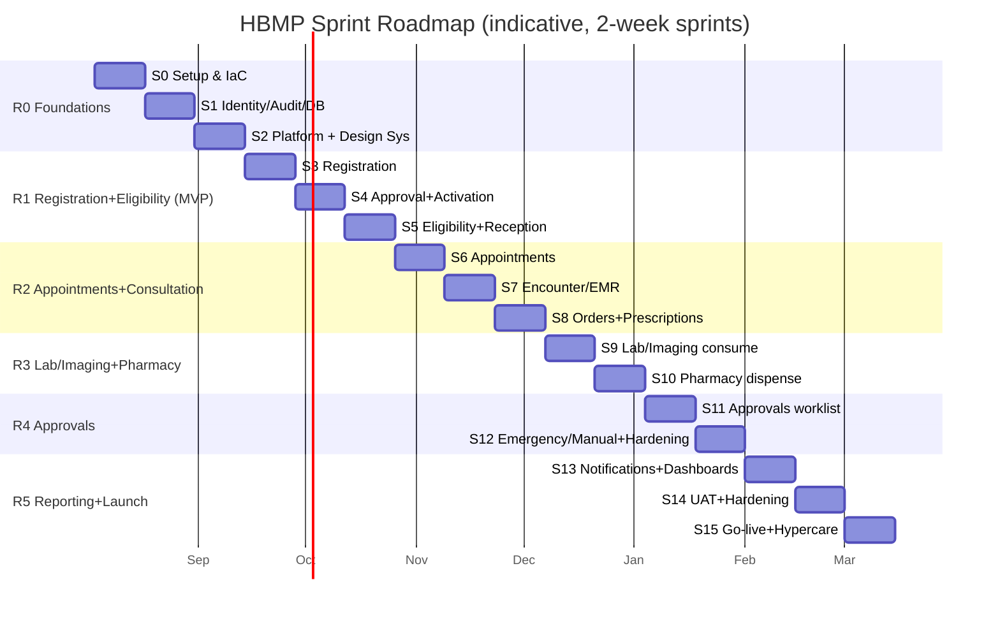

# 33 — Sprint Roadmap

> Back to [00-README-INDEX.md](00-README-INDEX.md) · [0A-DESIGN-FOUNDATIONS.md](0A-DESIGN-FOUNDATIONS.md)
> Siblings: [29-delivery-plan.md](29-delivery-plan.md) · [31-product-backlog.md](31-product-backlog.md) · [32-user-stories.md](32-user-stories.md) · [30-technical-backlog.md](30-technical-backlog.md)

Sprint-by-sprint plan mapping backlog items and enablers into **2-week sprints** across the releases from [29-delivery-plan.md](29-delivery-plan.md). This is an indicative plan for scope sequencing, **not a fixed date commitment**.

**Assumptions:** one cross-functional squad of ~7–9 (2 BE, 2 FE, 1 QA, 1 UX, 1 DevOps/SRE, PO + part-time architect/security). Sprint 0 for setup. Velocity is unknown until 2–3 sprints establish a baseline — re-plan after Sprint 3. Security, accessibility, and audit are built into every sprint's Definition of Done, not a separate phase.

---

## 1. Roadmap overview

---

## 2. Sprint detail

| Sprint | Goal | Key stories / enablers | Dependencies | Demo outcome |
|--------|------|------------------------|--------------|--------------|
| **S0** | Environment & pipeline ready | TECH: IaC (k3s, NetworkPolicies, PostgreSQL, OpenBao), CI/CD skeleton, repo/branching, design tokens seed | — | "Hello service" deploys through pipeline to dev |
| **S1** | Identity, audit, data foundation | FEAT-1101 (SSO+MFA), audit-service core, DB conventions, RBAC+ABAC engine baseline | S0 | Login with MFA; an audited action visible in audit console |
| **S2** | Platform + design system | BFF/gateway, notification-service skeleton, design system + i18n/RTL shell, master-data loader (ICD/CPT/Drug) | S1 | Themed shell in AR/EN; master data queryable |
| **S3** | Register beneficiaries | US-001, US-002, FEAT-0101/0102/0106 | S2 | Register a beneficiary with documents (Pending) |
| **S4** | Approve & activate | US-003, US-004, FEAT-0103/0104/0105/0107 | S3 | Approve → Active + Member No; status changes |
| **S5** | Eligibility & reception | US-010, US-011, FEAT-0201/0202/0203/0204/0205; search index | S4 | Reception searches, sees min-necessary card, gates visit |
| **S6** | Appointments | US-020/021/022, FEAT-0301/0302/0303/0304/0305 | S5 | Book, reschedule, no-show; walk-in queue |
| **S7** | Encounter & EMR | US-030/031, FEAT-0401/0402/0403 (+ ABAC treating-relationship) | S6 | Treating-only SOAP note + diagnosis + vitals |
| **S8** | Orders & prescriptions | US-032/033/034, FEAT-0404/0405/0406 | S7 | Doctor creates order + e-prescription + referral |
| **S9** | Lab/imaging fulfillment | US-040/041/042, FEAT-0501–0505 (atomic consume) | S8 | Provider consumes line atomically, uploads result; partial handled |
| **S10** | Pharmacy dispensing | US-050/051/052, FEAT-0601–0604 | S8 | Partial dispense with batch/expiry; expired/completed rejected |
| **S11** | Approvals worklist | US-060, FEAT-0701/0702/0703 | S8 | Reviewer sees EMR/notes, decides with rationale/TAT |
| **S12** | Emergency/manual + hardening | US-061/062, FEAT-0704/0705; security/perf hardening | S11 | Break-glass + manual auth audited; load test pass |
| **S13** | Notifications & dashboards | US-072/073, FEAT-0901/0902/1001 | S12 | Alerts fire; operational dashboard with data tables |
| **S14** | UAT & hardening | UAT with Mersal staff, a11y audit, pen test fixes, DR drill | S13 | Sign-off checklist green; DPIA/security gate cleared |
| **S15** | Go-live & hypercare | Data migration, provider onboarding, training, launch | S14 | Production live; hypercare support running |

---

## 3. Cross-sprint "always-on" workstreams
- **Security & privacy:** threat-model updates, authz tests, secret hygiene each sprint ([18-security-model.md](18-security-model.md)).
- **Accessibility:** axe in CI + manual gate per story ([21-accessibility-checklist.md](21-accessibility-checklist.md)).
- **Audit & compliance:** every new action wired to audit; DPIA updated per new data flow ([20-compliance-checklist.md](20-compliance-checklist.md)).
- **Docs:** ADRs, API docs, runbooks updated as features land ([34-technical-documentation.md](34-technical-documentation.md)).

## 4. Milestones / gates
- **M1 (end S2):** platform ready — foundations, identity, audit, design system.
- **M2 (end S5):** Registration + Eligibility MVP demonstrable → first stakeholder review gate.
- **M3 (end S10):** full walking skeleton (register→eligibility→consult→order/rx→fulfil) working end-to-end.
- **M4 (end S12):** approvals complete; performance/security hardened.
- **M5 (end S14):** UAT sign-off + compliance gate → go-live approval ([35-implementation-plan.md](35-implementation-plan.md)).
- **M6 (S15):** production launch + hypercare.

R6+ (post-launch) picks up EPIC-12 roadmap items (PBM, claims, telemedicine, mobile, integrations) as separate release trains.

---

### Cross-references
- Releases & exit criteria: [29-delivery-plan.md](29-delivery-plan.md) · Stories: [32-user-stories.md](32-user-stories.md)
- Enablers: [30-technical-backlog.md](30-technical-backlog.md) · Governance gate: [35-implementation-plan.md](35-implementation-plan.md)
