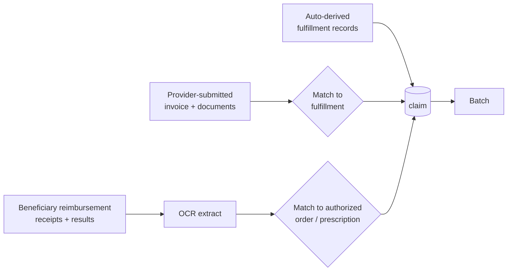
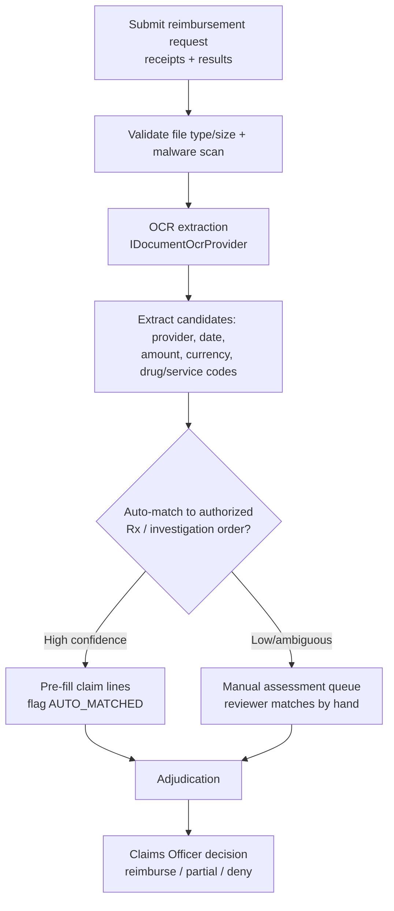
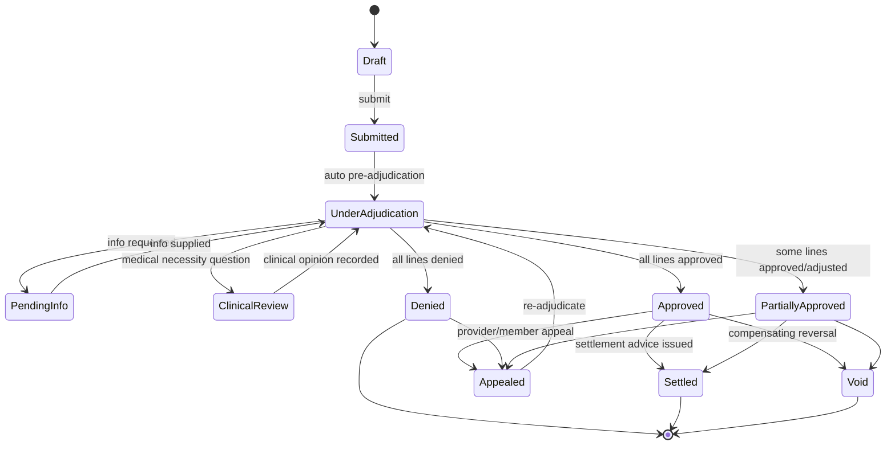

# 36 — Claims Management

> Back to [00-README-INDEX.md](00-README-INDEX.md) · [0A-DESIGN-FOUNDATIONS.md](0A-DESIGN-FOUNDATIONS.md)
> Siblings: [23-state-machines.md](23-state-machines.md) · [22-data-dictionary.md](22-data-dictionary.md) · [11-permission-matrix.md](11-permission-matrix.md) · [16-service-architecture.md](16-service-architecture.md) · [19-audit-strategy.md](19-audit-strategy.md)
> Build prompt: [claude-code-prompts/phase-10b-claims-management.md](claude-code-prompts/phase-10b-claims-management.md) · Skill: `claude-code-skills/medical-claims-engine`

**Status change:** claims were originally deferred to the R6+ roadmap ([35 §10](35-implementation-plan.md)). They are now **in scope as Phase 10b**, built on the completed core (authorizations, fulfillment, contracts/tariffs). This document is the authoritative claims design.

---

## 1. Purpose & scope

Claims Management turns **already-delivered, authorized services** into reviewed, decided, and settled financial records. It answers: *what did the network deliver, was it authorized and covered, what do we owe, and what did we actually agree to pay?*

**In scope (Phase 10b):**
- Three claim origination channels (§3): auto-derived, provider-submitted, **beneficiary reimbursement (OCR-assisted)**
- **Batching** by date range, provider branch/group, or manual selection (§4)
- Rules-based **pre-adjudication** + **line-level Claims Officer decisions** rolled up to batch (§5, §6)
- **Reconciliation and adjustments** against provider statements (§7)
- **Settlement advice / remittance output + exports** (§8) — *no payment execution*

**Out of scope (explicitly):** executing payments or bank transfers (settlement advice is handed to Finance/treasury and money moves outside the platform); capitation; full PBM formulary pricing beyond contract tariffs.

---

## 2. Core principles (non-negotiable)

1. **Claims are downstream of fulfillment.** A payable line exists only where an `order_fulfillment` (consume) or `dispense_event` row exists — those append-only rows are the authoritative usage record ([22 §7.3/§8.3](22-data-dictionary.md)). Reimbursement claims are the one exception and must be *matched* to such a record or to an authorized order/prescription (§3.3).
2. **Adjudicate on codes and amounts — never on diagnosis.** `Finance/Claims → diagnosis = denied` is a hard rule ([11 §3.2/§4](11-permission-matrix.md)). Claims carry service codes (CPT/LOINC/LOCAL/drug) and money. Clinical narrative is stripped server-side from every claims projection. Where medical-necessity judgement is genuinely required, the claim is routed to a **clinical reviewer** (Medical Approval/Director), who sees the clinical context — the Claims Officer never does.
3. **Never re-decrement coverage.** The consume/dispense transaction already moved `consumed_value`. Claims reconcile against that accumulator; they never maintain a parallel one.
4. **No double-billing.** One payable claim line per fulfillment/dispense reference, enforced by a unique constraint. Duplicate submissions are detected and denied `DUPLICATE_CLAIM`.
5. **Append-only decisions, no mutation.** Submitted claims and decisions are never edited or deleted. Corrections are **adjustments** or a compensating **Void + re-claim**, all audited ([19](19-audit-strategy.md)).
6. **Segregation of duties.** Claim originator ≠ adjudicator; adjudication ≠ settlement release. A user cannot decide a claim they created or that belongs to their own provider.
7. **Provider isolation.** A provider sees only its own claims/batches ([18](18-security-model.md)).

---

## 3. Claim origination — three channels

### 3.1 Auto-derived (system-generated)
The claims service consumes `OrderLinesConsumed` / `RxLinesDispensed` events and creates a **claimable item** per fulfillment/dispense row, priced from the performing provider's contract tariff. These are the baseline truth — what the network actually delivered.

### 3.2 Provider-submitted
A provider (or Mersal on their behalf) submits an invoice/claim with supporting documents. Each submitted line is **matched** to an auto-derived claimable item by `(provider, beneficiary, service code, service date, authorization)`.
- **Matched** → the claim line proceeds with the provider's billed amount recorded alongside the contract price (variance is an adjustment candidate, §7).
- **Unmatched** → flagged `NO_FULFILLMENT_RECORD` and routed to manual assessment; never auto-approved.

### 3.3 Beneficiary reimbursement (OCR-assisted) — **new**
For services a beneficiary paid out of pocket. The member (or Reception/Case Manager on their behalf) submits **receipts** plus the **result/dispense evidence**, against an existing authorized prescription or investigation order.

Rules:
- OCR is **assistive, never authoritative**. Every OCR-extracted value carries a **confidence score** and the source document region; a human confirms before it affects money. Low confidence or any mismatch → **manual assessment**.
- Reimbursement requires: an **authorized** underlying order/prescription (or an explicitly allowed non-gated category), a legible receipt, and evidence the service was actually rendered (result/dispense proof).
- Reimbursement is capped at the **contract tariff or the receipt amount, whichever is lower**, unless the officer records an explicit override with justification.
- OCR uses the pluggable `IDocumentOcrProvider` interface from [13-interoperability](claude-code-prompts/phase-13-interoperability-and-roadmap.md) with an Arabic+English-capable engine (e.g. Tesseract `ara+eng`, self-hosted per [0C](0C-OPEN-SOURCE-STACK.md)); documents live in `document-service` (scanned, encrypted).
- Personal/bank payout details for the beneficiary are **not** stored in the claim; settlement advice references the member, and payout happens through Mersal's existing finance process.

---

## 4. Batching

A **batch** is the unit of review and settlement — a named, dated collection of claims for one payee (provider) or for reimbursements.

**Creation modes:**

| Mode | Selector | Use |
|------|----------|-----|
| **Date range** | `serviceDateFrom..serviceDateTo` (optionally `receivedDate`) | Monthly/periodic provider cycles |
| **Provider branch** | a specific `provider_location` | Branch-level settlement |
| **Provider group** | parent provider / group across branches | Consolidated settlement for a chain |
| **Manual** | operator picks individual claims from a filtered worklist | Exceptions, re-work, urgent items |

Rules:
- A claim belongs to **at most one open batch** (unique partial index on `claim_id WHERE batch_status IN (Open, UnderReview)`), so it can't be settled twice.
- Batches are **provider-homogeneous** for settlement (one payee) — reimbursement batches group by period, payee = beneficiary cohort.
- A batch carries running **rollup totals**: claimed, priced, approved, adjusted, denied, net payable.
- Claims can be **removed** from an Open batch (audited); once `UnderReview`, removal requires a reason and is audited as an exception.
- Batch numbering: `BAT-<yyyy>-<base32(8)>` (see [0A §3](0A-DESIGN-FOUNDATIONS.md) key conventions).

---

## 5. Adjudication (automated pre-check)

Runs per line, in fixed order, collecting **all** reasons (so partial approvals are precise) rather than stopping at the first failure:

1. **Beneficiary status & policy validity** on the service date → `NOT_ELIGIBLE`, `POLICY_EXPIRED`
2. **Coverage category** matches the service `benefit_category` → `NOT_COVERED_CATEGORY`
3. **Pre-auth linkage** — gated services need a valid, non-expired authorization in `Approved | PartiallyApproved | EmergencyApproved | Overridden`; a `PartiallyApproved` scope **caps** payable lines → `NO_PRIOR_AUTH`, `AUTH_EXPIRED`, `EXCEEDS_AUTH_SCOPE`
4. **Fulfillment linkage** — a matching `order_fulfillment`/`dispense_event` exists → `NO_FULFILLMENT_RECORD`
5. **Duplicate check** — no existing payable line for that fulfillment reference → `DUPLICATE_CLAIM`
6. **Provider network status** — active provider + in-effect contract on the service date → `PROVIDER_OUT_OF_NETWORK`, `CONTRACT_NOT_EFFECTIVE`
7. **Tariff pricing** — `contract_service_line.agreed_price` for the code + date; **no tariff ⇒ `NO_TARIFF` → manual pricing**, never a guessed price
8. **Coverage limit availability** by `limit_type` → `LIMIT_EXCEEDED`
9. **Co-pay / deductible split** (if configured) → computes member vs payer share

Output per line: `system_recommendation` ∈ {`RecommendApprove`, `RecommendPartial`, `RecommendDeny`, `RequiresManualReview`} + reason codes + computed `allowed_amount`. **The system recommends; the Claims Officer decides.** A recommendation is never auto-final for gated, high-value, reimbursement, or `RequiresManualReview` lines. (Auto-approval of clean low-value lines is configurable per policy but off by default.)

Rules are expressed declaratively per [`healthcare-business-rules-engine`](claude-code-skills/healthcare-business-rules-engine/SKILL.md), versioned, with the rule version recorded on each decision for auditability.

---

## 6. Review & decision (Claims Officer)

**Line-level decisions, rolled up to batch** (per your requirement).

Officer workspace shows, per claim line: service code + description, service date, provider/branch, billed amount, contract price, system recommendation + reason codes, linked authorization, fulfillment reference, and the **supporting documents** (invoice, receipt, result/dispense proof, OCR overlay with confidence).

Per-line decision: **Approve · Partially approve (with allowed amount) · Deny (coded reason, mandatory) · Adjust (§7) · Request info · Route to clinical review**.

**Batch lifecycle:** `Open → UnderReview → Decided → SettlementIssued → Closed`; plus `Cancelled`. A batch reaches `Decided` only when **every** line has a recorded decision; rollup totals are recomputed and frozen at `SettlementIssued`.

Every decision records: decider, timestamp, decision, allowed amount, reason code(s), free-text rationale, rule version, correlation id — append-only in `claim_decision`, with an immutable audit event. **Denials and partials require a reason code; rationale is mandatory for deny/adjust/override.**

**SoD enforced:** the officer deciding a line cannot be the line's originator/submitter, and cannot belong to the claiming provider. Overrides above a configurable value threshold require a second approver (dual control).

---

## 7. Reconciliation & adjustments

**Reconciliation** compares three views of the same period and surfaces differences:
- what Mersal's records say was delivered (auto-derived from fulfillment),
- what the provider billed (submitted claims / statement),
- what was approved for payment.

The reconciliation worklist buckets each discrepancy: **matched**, **billed-not-delivered** (no fulfillment record), **delivered-not-billed** (provider hasn't claimed), **price variance** (billed ≠ contract tariff), **duplicate**, **quantity variance**.

**Adjustment types** (each with a coded reason, an amount delta, and mandatory rationale — always append-only, never an edit):

| Type | Meaning |
|------|---------|
| `PriceCorrection` | Re-price to the contract tariff or an agreed rate |
| `QuantityCorrection` | Billed quantity ≠ delivered quantity |
| `Deduction` | Contractual/penalty deduction (e.g. SLA, quality) |
| `Recovery` / `Clawback` | Recover a previous overpayment (carried into a later batch) |
| `Writeoff` | Mersal absorbs a small residual |
| `Reversal` / `Void` | Compensating reversal of a prior decision |
| `Reallocation` | Move a line to the correct provider/branch/period |

Rules: adjustments carry sign (debit/credit) and always net into the batch rollup; a recovery must reference the original claim line it recovers against; net payable can never go below zero for a batch without an explicit, dual-controlled approval. Every adjustment is audited with before/after amounts.

---

## 8. Settlement advice & exports

On batch `Decided` → generate an immutable **settlement advice / remittance statement** per payee:
- header (payee provider/branch or reimbursement cohort, period, batch no, generated-by, generated-at),
- per-claim/line detail (approved, adjusted, denied with reason codes),
- totals: claimed → priced → approved → adjustments → **net payable**,
- a stable document stored in `document-service` (WORM bucket) and referenced from the batch.

**Exports:** CSV/XLSX for finance and PDF for the provider — all exports are **audited** and carry **no clinical fields**. The settlement advice is the hand-off artifact; **the platform never moves money** — Finance/treasury executes payment externally and (optionally) records the payment reference back against the batch.

---

## 9. Roles & minimum-necessary

| Role | Sees | Never sees |
|------|------|-----------|
| **Claims Officer** (new) | Claims, lines, codes, amounts, authorizations, supporting documents, batches, adjustments, settlement advice | Diagnoses, EMR notes, lab/imaging result *values*, prescription clinical detail |
| **Claims Reviewer / Senior** | Same + dual-control approvals, overrides | Same exclusions |
| **Clinical Reviewer** (Medical Approval/Director) | Clinical context **only** for lines routed to `ClinicalReview` | — (records an opinion, not a payment decision) |
| **Finance** | Batch rollups, settlement advice, exports | Diagnoses/clinical (existing hard rule) |
| **Provider** | Only its own claims/batches/statements | Other providers' data; beneficiary clinical detail |
| **Beneficiary/Case Manager** | Own reimbursement request + status | Other members' claims |

Result/report *existence* may be shown as evidence (that a result exists, its date and document reference) without exposing the clinical **content** — this is how a claims officer verifies "service was rendered" without reading results.

---

## 10. Events (published)

`ClaimCreated`, `ClaimSubmitted`, `ClaimAdjudicated`, `ClaimLineDecided`, `ClaimApproved`, `ClaimPartiallyApproved`, `ClaimDenied`, `ClaimAdjusted`, `ClaimVoided`, `ClaimAppealed`, `ReimbursementSubmitted`, `ReimbursementMatched`, `ReimbursementRequiresManualAssessment`, `BatchCreated`, `BatchUnderReview`, `BatchDecided`, `SettlementAdviceIssued`. All via the transactional outbox, CloudEvents envelope, `.vN` versioned ([16 §7](16-service-architecture.md)).

---

## 11. Reporting & KPIs (feeds [08](08-non-functional-requirements.md) / reporting-service)

Claims TAT (submission→decision), approval/denial rate, top denial reasons, adjustment value by type, provider variance league table, reimbursement OCR auto-match rate and manual-assessment rate, batch cycle time, aged unbilled (delivered-not-billed), recovery outstanding.

---

## 12. Acceptance criteria (definition of done for the module)

- [ ] All three origination channels create claims; reimbursement runs OCR, auto-matches high-confidence, queues the rest for manual assessment.
- [ ] Batches can be created by date range, provider branch, provider group, and manual selection; a claim can be in only one open batch.
- [ ] Pre-adjudication produces per-line recommendations with **all** applicable coded reasons; no guessed prices (`NO_TARIFF` routes to manual pricing).
- [ ] Claims Officer records **line-level** decisions that roll up to batch totals; batch reaches `Decided` only when every line is decided.
- [ ] Reconciliation surfaces billed-not-delivered / delivered-not-billed / variance / duplicate; adjustments are append-only, signed, coded, and audited.
- [ ] Settlement advice is generated, immutable, exportable — and **no payment execution exists in the platform**.
- [ ] **Authorization tests prove** a Claims Officer cannot read diagnosis/EMR/result values, and a provider cannot read another provider's claims.
- [ ] SoD tests prove originator ≠ adjudicator and provider-affiliated users cannot decide their own claims; dual control above the threshold.
- [ ] Every state change/decision/adjustment/export writes an immutable hash-chained audit event; nothing is mutated or hard-deleted.

---

### Cross-references
- Lifecycles: [23-state-machines.md](23-state-machines.md) · Schema/enums: [22-data-dictionary.md](22-data-dictionary.md) · ERD: [15-database-erd.md](15-database-erd.md)
- Permissions/SoD: [11-permission-matrix.md](11-permission-matrix.md) · Roles: [10-role-matrix.md](10-role-matrix.md) · Security: [18-security-model.md](18-security-model.md)
- Services/events: [16-service-architecture.md](16-service-architecture.md) · Audit: [19-audit-strategy.md](19-audit-strategy.md) · Build: [claude-code-prompts/phase-10b-claims-management.md](claude-code-prompts/phase-10b-claims-management.md)
