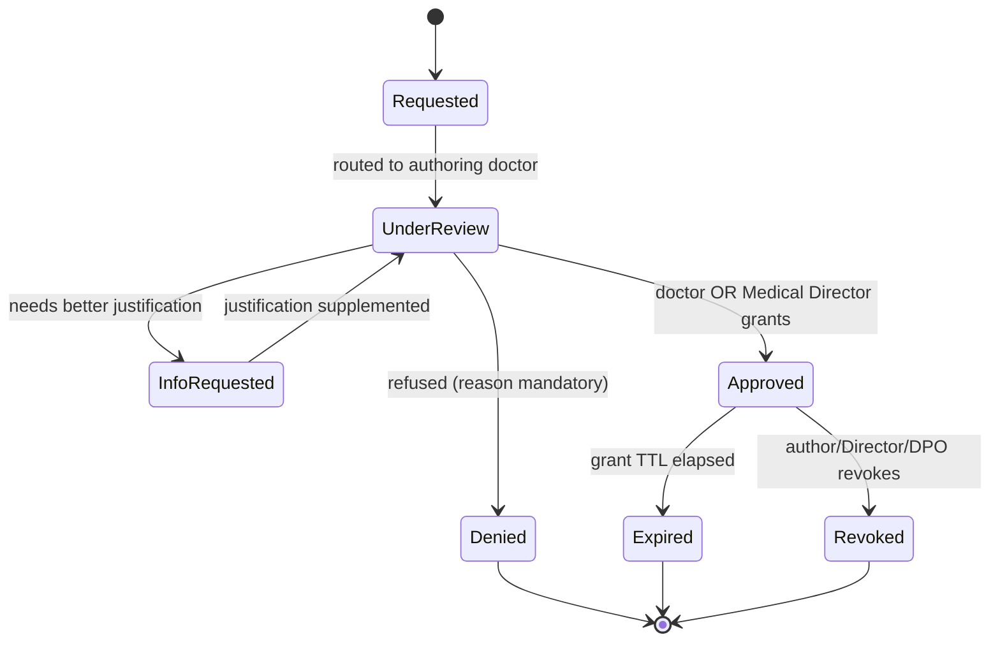

# 37 — Branch Scoping, Practitioner Specialty & Clinical Sensitivity

> Back to [00-README-INDEX.md](00-README-INDEX.md) · [0A-DESIGN-FOUNDATIONS.md](0A-DESIGN-FOUNDATIONS.md)
> Siblings: [10-role-matrix.md](10-role-matrix.md) · [11-permission-matrix.md](11-permission-matrix.md) · [22-data-dictionary.md](22-data-dictionary.md) · [23-state-machines.md](23-state-machines.md) · [18-security-model.md](18-security-model.md)
> Build prompt: [claude-code-prompts/phase-14-branch-scoping-and-sensitivity.md](claude-code-prompts/phase-14-branch-scoping-and-sensitivity.md)

Adds three capabilities to the running platform: **multi-branch (location) awareness**, **practitioner specialty**, and **sensitivity-gated clinical results** with a justified release-request workflow.

---

## 1. Why this document exists (current state)

Phases 0–6 are built. A code audit found:

| Already built | Gap this document closes |
|---|---|
| `appointment`, `appointment_slot`, `provider_availability`, `waitlist_entry` all carry `location_id`, `provider_id`, optional `doctor_id` | Nothing **scopes** those rows to the signed-in user's branch |
| `provider` + `provider_location` (external contracted network) | No **internal Mersal branch** concept |
| `libs/authz` ABAC: `TenantMatch`, `ProviderOwnership`, `TreatingRelationship`, `CaseAssignment`, `BreakGlass`; `RowScope`; per-domain policy bundles | No `BranchScope` condition, no active-branch context |
| Referral carries a free-text `specialty` | No **practitioner** record, no structured specialty, no doctor→branch assignment |
| `investigation_order` + `order_line` with CPT/LOINC codes | No **examination type**, no **sensitivity classification**, no gating of sensitive reports |

**Design decisions taken** (confirmed with the sponsor):
1. Mersal branches are a **new internal `branch` entity**, distinct from contracted `provider`/`provider_location`.
2. Branch context is an **active-branch switcher** defaulting to the user's home branch.
3. Sensitive reports may be released by the **authoring/ordering doctor OR a Medical Director**.

> **Placement assumption (flag if wrong):** `branch` and the practitioner tables live in **provider-service**, whose remit widens from "contracted network" to "network & facilities" (external providers *and* internal branches, kept as separate tables). This avoids standing up a new service for ~6 slow-changing rows on an NGO budget. The alternative — a dedicated `org-service` — is noted and remains viable.

---

## 2. Branch model

### 2.1 The branches
Seeded reference data (`branch`), all `Africa/Cairo`:

| Code | Name (EN) | Name (AR) | City |
|------|-----------|-----------|------|
| `ASW` | Aswan | أسوان | Aswan |
| `ALX` | Alexandria | الإسكندرية | Alexandria |
| `OCT` | 6th of October | السادس من أكتوبر | Giza |
| `MAA` | Maadi | المعادي | Cairo |
| `DOK` | Dokki | الدقي | Giza |
| `NSR` | Nasr City | مدينة نصر | Cairo |

`branch`: `branch_id` (uuid v7), `branch_code` (UK), `name_en`, `name_ar`, `city`, `address`, `timezone`, `phone`, `opening_hours` (jsonb), `status` ∈ {`Active`,`Suspended`,`Closed`}, audit columns. Branch codes are stable and used in business keys/reporting.

**Branch ≠ provider_location.** A `branch` is a Mersal-operated facility (internal org unit). A `provider_location` is a contracted third-party site. Both may host care; only branches are subject to staff branch-scoping.

### 2.2 Staff assignment
`user_branch_assignment`: `user_id`, `branch_id`, `assignment_type` ∈ {`Home`,`Additional`}, `valid_from`, `valid_to`, `status`.

- **Exactly one active `Home`** per user — partial unique index `(user_id) WHERE assignment_type='Home' AND status='Active'`.
- `Additional` rows grant the ability to work at other branches (the "can also work elsewhere" requirement).
- **Permitted set** = Home ∪ Additional, filtered to `Active` and within the validity window.
- Assignment changes are audited; revocation takes effect immediately (next request re-evaluates).

### 2.3 Active-branch context
- Client sends **`X-Active-Branch: <branch_id>`**; when absent the service defaults to the user's **Home** branch.
- The service **validates** the active branch ∈ permitted set → otherwise `403` + audited `BranchScopeDenied`. Never trust the header.
- Switching emits `ActiveBranchSwitched` (audited: actor, from, to, correlation id).
- The active branch is echoed on responses so the UI can display the current context unambiguously.

---

## 3. Scope modes — who is branch-scoped and who is not

This is the core rule.

| Scope mode | Roles | Behaviour |
|---|---|---|
| **BranchScoped** | Reception, Appointment Coordinator, Nurse, Doctor *(operational lists)*, Branch/Clinic Manager | Worklists, queues, appointment lists, and branch-originated orders are **filtered server-side to the active branch**. Other branches are not merely hidden — they are inaccessible. |
| **MemberScoped (all branches)** | Medical Approval team, Medical Director, Case Manager, Finance, Claims Officer/Reviewer, Network Team, Org/Super Admin, Reporting/Managers | Work is **beneficiary/member-centred**, spanning all branches by default. A branch filter is offered as a *convenience*, never as a restriction. |
| **ProviderScoped** | External labs, imaging centres, pharmacies (contracted providers) | Unchanged — scoped by `ProviderOwnership` to their own queue. Mersal's branch dimension does not apply to them. |

**Non-negotiable:** branch scoping is an **additional narrowing filter, never a replacement for existing controls.** A doctor still needs `TreatingRelationship` to open a record; branch scoping only narrows *which* worklist they see. Minimum-necessary field rules ([11](11-permission-matrix.md)) are unchanged.

### 3.1 Implementation shape
- New ABAC condition **`BranchScope`** in `libs/authz`: satisfied when the resource's `branch_id` is in the principal's permitted set **and** (for BranchScoped roles) equals the active branch.
- `RowScope` gains `BranchIds` + `BranchUnrestricted`, mirroring the existing provider-scoping shape.
- Policy bundles declare their mode: e.g. `EmrPolicies` appointment/queue reads require `BranchScope`; `ApprovalsPolicies` and `FinancePolicies` set `BranchUnrestricted`.
- Optional defence in depth: PostgreSQL RLS predicate on branch-scoped tables using a session GUC, matching the `provider` RLS pattern already proven in phase 2b (note the `NOBYPASSRLS` app-role finding in `docs/HANDOFF.md` §2b).

---

## 4. Practitioner & specialty

`practitioner` — the clinical profile behind a user: `practitioner_id`, `user_id` (logical FK to identity), `practitioner_type` ∈ {`Doctor`,`Nurse`}, `full_name_en/ar`, `license_no`, `license_expiry`, `status`.

`specialty` (reference): `specialty_code` (UK), `name_en`, `name_ar`, `parent_code`. Seed set: General Practice, Internal Medicine, Pediatrics, Obstetrics & Gynaecology, Cardiology, Dermatology, **Psychiatry**, **Clinical Psychology**, Neurology, Orthopaedics, ENT, Ophthalmology, Endocrinology, Gastroenterology, Nephrology, Pulmonology, Urology, Oncology, Rheumatology, General Surgery, Emergency Medicine, Radiology, Pathology, Physiotherapy, Nutrition, Dentistry.

`practitioner_specialty` (many-to-many; one flagged `is_primary`).

`practitioner_branch_assignment`: `practitioner_id`, `branch_id`, `valid_from/to`, `status` — a doctor may serve **one or many** branches.

**Rules**
- A doctor may only be scheduled/booked at a branch they are assigned to (validated at availability creation *and* at booking → `422` with a clear reason).
- The doctor picker filters by **active branch + specialty**.
- Specialty is used for referral routing, reporting (utilization by specialty), and to drive default examination-type suggestions.
- Licence expiry feeds the existing credential-reminder sweep from phase 2b.

---

## 5. Examination type & sensitivity classification

`examination_type` (reference, master data): `examination_type_id`, `code` (UK), `name_en`, `name_ar`, `category` ∈ {`Lab`,`Imaging`,`Procedure`,`Consultation`,`Assessment`}, `default_code_system` + `default_code` (CPT/LOINC link), **`sensitivity_level`**, `sensitive_category`, `status`.

**Sensitivity levels**

| Level | Meaning | Default disclosure |
|---|---|---|
| `Standard` | Ordinary clinical examination | Existing min-necessary rules apply unchanged |
| `Sensitive` | Special-category clinical data | **Content restricted**; existence-only to non-authors; release requires a justified request |
| `HighlySensitive` | As above, plus mandatory Medical Director visibility on release + shorter grant TTL | Same gate, stricter defaults |

**`sensitive_category`** ∈ {`MentalHealth`, `HIV_STI`, `Genetic`, `SubstanceUse`, `ReproductiveHealth`, `GBV_Forensic`, `Other`}.

> **Mental health is the confirmed requirement**; the other categories are proposed because they are the standard special-category set for refugee-serving health programmes and carry the same risk profile under Egypt PDPL and UNHCR data-protection norms ([20](20-compliance-checklist.md)). Mersal's Medical Director + DPO should ratify the final list — it is configuration, not code.

The order and its lines carry `examination_type_id` and a **denormalized `sensitivity_level`** so gating never depends on a cross-service join at read time. Results/report documents inherit the classification.

---

## 6. Sensitive result gating & the release-request workflow

### 6.1 Default state
For a result whose `sensitivity_level` ≠ `Standard`:

- **Full content** (result values, report document, clinical narrative) is visible **only** to the **authoring/ordering doctor** (with treating relationship) — and to the beneficiary themselves via a future portal.
- **Everyone else** — including other treating clinicians, the **medical approval team**, case managers, and reporting — sees **existence metadata only**: that an examination of this category occurred, its date, its status, the ordering branch, and a `RESTRICTED` marker. Never the values or the report.
- This deliberately **overrides** the approval team's standing EMR oversight for sensitive results. Authorization decisions on sensitive services proceed on existence + clinical justification supplied by the requesting doctor, or via an approved release request.

### 6.2 Requesting release

`report_access_request`: `request_id`, `result_ref`/`document_id`, `beneficiary_id`, `requested_by`, `requested_for_role`, **`purpose_code`** ∈ {`ContinuityOfCare`,`AuthorizationDecision`,`ClinicalReview`,`Complaint`,`Legal`,`Other`}, **`justification` (mandatory, free text)**, `requested_ttl_hours`, `status`, `decided_by`, `decided_at`, `decision_reason`.

`report_access_grant`: `grant_id`, `request_id`, `grantee_user_id`, `result_ref`, `expires_at`, `purpose_code`, `revoked_at`, `revoked_by`.

**Rules**
- Justification and purpose code are **mandatory** — a request without them is rejected at validation.
- **Deciders:** the authoring/ordering doctor, **or** a **Medical Director** (so care isn't blocked when the author is unavailable). A Medical Director decision is flagged `decided_by_role=MedicalDirector` and **extra-audited**.
- A grant is **time-boxed** (default 72h `Sensitive`, 24h `HighlySensitive`; configurable), **scoped to one result**, and **non-transferable**.
- **Every read under a grant is audited** with the `grant_id`, purpose, and actor — separately from ordinary PHI-read audit.
- Denials require a reason and are notified to the requester.
- Grants auto-expire; expiry and revocation are audited and notified.
- **Break-glass** remains available for genuine emergencies but is loud: extra justification, immediate notification to the authoring doctor **and** Medical Director **and** DPO, plus mandatory retrospective review — reusing the existing `BreakGlass` machinery from phase 0.4.
- The beneficiary's own access to their data is unaffected (data-subject rights, [20](20-compliance-checklist.md)).

### 6.3 Events
`SensitiveResultRestricted`, `ReportAccessRequested`, `ReportAccessInfoRequested`, `ReportAccessApproved`, `ReportAccessDenied`, `ReportAccessGrantExpired`, `ReportAccessGrantRevoked`, `SensitiveResultReadUnderGrant`, `ActiveBranchSwitched`, `BranchScopeDenied`.

---

## 7. UI implications ([0B](0B-DESIGN-SYSTEM-UI.md), [14](14-navigation-structure.md))

- **Branch switcher** in the app bar for branch-scoped roles: shows the active branch, lists permitted branches, keyboard-operable, announces the change via `aria-live`, and is audited. Member-scoped roles see an "All branches" indicator with an optional filter instead.
- Appointment/queue/order screens display the **active branch** prominently so a user can never mistake which site they are working in.
- Sensitive results render in a **locked state**: category + date + `RESTRICTED` chip (four-cue status: neutral hue + lock icon + ghost pill + text) and a **"Request access"** action opening the justification form.
- The decision screen for the doctor/Medical Director shows requester, role, purpose, justification, and requested duration, with Approve (TTL picker) / Deny (reason) / Request info.
- Doctor pickers filter by branch + specialty; specialty appears on the clinician profile.

---

## 8. Acceptance criteria

- [ ] Six branches seeded with EN/AR names; branch is distinct from `provider_location`.
- [ ] A user has exactly one Home branch and optional Additional branches; permitted set is enforced server-side.
- [ ] `X-Active-Branch` outside the permitted set → `403` + audited; absent → defaults to Home.
- [ ] **Reception/coordinator/nurse/doctor worklists and appointment lists return only the active branch**; a cross-branch request is denied, not just empty.
- [ ] **Approvals, Medical Director, managers, Case Managers, Finance/Claims see all branches by default**; external providers remain provider-scoped and unaffected.
- [ ] A doctor can be assigned to one or many branches; booking a doctor at an unassigned branch fails with a clear reason.
- [ ] Doctors carry structured specialty (≥1, one primary); pickers filter by branch + specialty.
- [ ] Orders carry examination type; sensitivity is denormalized onto order/line/result.
- [ ] A **mental-health result is not readable** by a non-authoring clinician, the approvals team, or case managers — existence metadata only.
- [ ] A release request **requires purpose + justification**, routes to the authoring doctor, and can also be decided by a Medical Director (flagged + extra-audited).
- [ ] An approved grant is time-boxed, single-result, non-transferable, auto-expires, and **every read under it is separately audited**.
- [ ] Break-glass on a sensitive result notifies author + Medical Director + DPO and forces retrospective review.
- [ ] Branch-scoping tests prove cross-branch denial; sensitivity tests prove the approvals team cannot read a restricted report without a grant.

---

### Cross-references
Roles/scope modes: [10-role-matrix.md](10-role-matrix.md) · Field rules: [11-permission-matrix.md](11-permission-matrix.md) · Schema: [22-data-dictionary.md](22-data-dictionary.md) · Lifecycles: [23-state-machines.md](23-state-machines.md) · Security/break-glass: [18-security-model.md](18-security-model.md) · Audit: [19-audit-strategy.md](19-audit-strategy.md) · Privacy basis: [20-compliance-checklist.md](20-compliance-checklist.md) · Build: [claude-code-prompts/phase-14-branch-scoping-and-sensitivity.md](claude-code-prompts/phase-14-branch-scoping-and-sensitivity.md)
