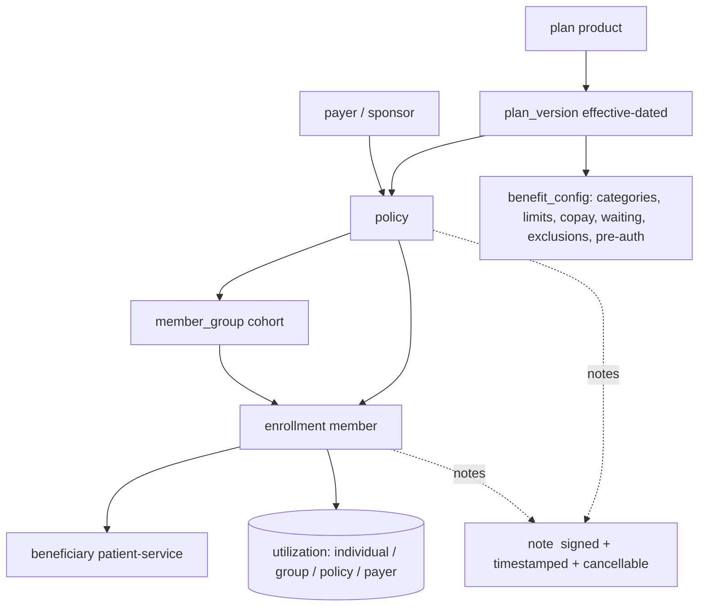

# 38 — Policy & Member Administration (Beneficiary Management, real PAS)

> Back to [00-README-INDEX.md](00-README-INDEX.md) · [0A-DESIGN-FOUNDATIONS.md](0A-DESIGN-FOUNDATIONS.md)
> Siblings: [22-data-dictionary.md](22-data-dictionary.md) · [23-state-machines.md](23-state-machines.md) · [36-claims-management.md](36-claims-management.md) · [37-branch-scoping-and-clinical-sensitivity.md](37-branch-scoping-and-clinical-sensitivity.md) · [11-permission-matrix.md](11-permission-matrix.md)
> Build prompt: [claude-code-prompts/phase-19-policy-member-administration.md](claude-code-prompts/phase-19-policy-member-administration.md)

Turns Beneficiary Management from a coverage-configuration screen into a **Policy Administration System (PAS)**: payers/sponsors → plans (products) with versioned benefit configuration → policies → groups → member enrollment → utilization at every level → policy/member query → **signed, timestamped, cancellable notes**.

---

## 1. Current state (audited)

`services/policy` today owns only `Policy(policy_no, sponsor:string, effective_from/to, status)`, `BenefitCategory`, `Coverage`, `CoverageLimit`. Consequences:

| Gap | Why it matters |
|---|---|
| **No payer/sponsor entity** — `sponsor` is a free-text string | No payer scope, no per-payer reporting, no payer-level rules or settlement grouping |
| **No plan/product layer** — benefits hang directly off a policy instance | Every policy is bespoke; nothing is reusable, comparable or versionable |
| **No plan versioning / effective dating of benefit config** | A claim cannot be adjudicated against *the benefit rules in force on the service date* — the single most important PAS property |
| **No enrollment entity** — coverage is a row, not a membership with its own lifecycle | No enrol/terminate/reinstate, no retro-effective change, no dependent linkage, no waiting periods |
| **No group/cohort** | Cannot administer "Oncology Programme", "UNHCR-referred", "Branch X caseload" as a unit |
| **No utilization views** | Individual/group/policy/payer consumption is not queryable; the utilization the platform *records* is invisible to administrators |
| **No structured query** | No policy query or member query beyond a single-identifier lookup |
| **No notes** | Nothing carries operational context, decisions or exceptions on a policy or a member |

## 2. Market baseline (what a real PAS provides)

Confirmed against the payer/TPA core-administration market ([Gartner: Healthcare Payers' Core Administrative Processing Solutions](https://www.gartner.com/reviews/market/healthcare-payers-core-administrative-processing-solutions), [PLEXIS TPA](https://www.plexishealth.com/solutions/tpa/), [Conduent health plan administration](https://www.conduent.com/healthcare-business-solutions/health-plan-administration/), [HIPAA Journal: TPA role](https://www.hipaajournal.com/tpa-in-healthcare/)):

- **Full policy lifecycle** — quote/setup → issue → endorse/amend → renew → terminate, with effective dating throughout.
- **Configurable benefit plans** — plan as a versioned product; benefit categories, limits, co-pay/co-insurance/deductible, waiting periods, exclusions, pre-auth triggers, network tiers — configured, not coded.
- **Member enrollment & maintenance** — enrol, add dependents, change, terminate, reinstate; retro-effective changes; keep coverage current and compliant.
- **Multiple sponsors/groups without customisation** — a TPA administers many employer groups on one configurable engine.
- **Eligibility as a service**, billing/settlement, provider management, member servicing.
- **Business-rule configurability**, audit, and correspondence/notes on the account.

Mersal's adaptation: the "employer group" is a **programme/cohort** (Oncology, UNHCR-referred, branch caseload, donor-funded campaign) and the "payer" is a **sponsor** (Mersal self-funded, a donor, a government scheme, a partner NGO). Premium/billing is **out of scope** — Mersal does not collect premium; settlement lives in claims ([36](36-claims-management.md)).

## 3. Target model



**Entities (new, `policy` schema unless stated)**

- **`payer`** — `payer_code`, name EN/AR, type `{SelfFunded, Donor, Government, PartnerNGO, Insurer}`, contact, status. *Payer scope* = every query/report can be filtered and secured to a payer.
- **`plan`** — the reusable product: `plan_code`, name EN/AR, description, category (e.g. Primary, Oncology, Emergency), status.
- **`plan_version`** — **the heart of correctness**: `plan_id`, `version_no`, `effective_from/to`, `status {Draft, Active, Superseded, Retired}`, and the whole benefit configuration. A version is **immutable once Active**; changes create a new version. Everything downstream resolves *the version in force on the service date*.
- **`benefit_rule`** (child of plan_version) — per benefit category: covered yes/no, `limit_type` + `limit_value` + `reset_period`, co-pay fixed/percent, deductible, **waiting period days**, **pre-auth required** (+ cost threshold), network tier, exclusions (coded), notes.
- **`policy`** (extended) — `policy_no`, **`payer_id`**, **`plan_version_id`**, effective dates, status, renewal linkage (`previous_policy_id`), max members, notes.
- **`member_group`** — cohort inside a policy: `group_code`, name, type `{Programme, Cohort, BranchCaseload, Campaign}`, effective dates, status.
- **`enrollment`** — the membership record: `beneficiary_id`, `policy_id`, `group_id?`, `member_no`, `relationship {Principal, Spouse, Child, Dependent}`, `principal_enrollment_id?`, `effective_from/to`, `waiting_period_ends_on`, `status {Pending, Active, Suspended, Terminated, Cancelled}`, `termination_reason`.
- **`enrollment_event`** (append-only) — every enrol/change/terminate/reinstate with effective date, reason, actor — this is what makes **retro-effective** changes auditable and reversible.
- **`note`** — see §5.
- **Coverage/coverage_limit** stay as the *derived, per-member instance* of the plan's benefit rules (so the existing eligibility engine and the phase-18 accumulator keep working) — but they are now **generated from `plan_version.benefit_rule` at enrollment**, not hand-entered.

## 4. Capabilities

**4.1 Policy setup & configuration.** Create payer → create plan → author a **draft plan version** with its benefit rules (categories, limits, reset periods, co-pay, waiting periods, pre-auth triggers, exclusions) → validate → **activate** (immutable) → attach to a policy with effective dates. Amend = new version + endorsement record; renew = new policy linked to the previous one, carrying members forward.

**4.2 Member management.** Enrol a beneficiary (individual or bulk/CSV), attach dependents to a principal, assign to a group, set effective dates and waiting period, terminate with reason and effective date, reinstate, transfer between groups/policies. Enrollment **generates** the member's coverage + limits from the plan version.

**4.3 Utilization — individual and group.** A read-model answering: for a member / group / policy / payer over a period — services consumed by category, limit consumed vs remaining vs %, top categories, encounter counts, authorizations raised/approved/denied, claims value (from [36](36-claims-management.md)), and outliers (members > X% of limit). Individual view = the member's consumption ledger; group view = aggregate + per-member table + distribution.

**4.4 Policy query & member query.** Structured, multi-criteria search (not single-identifier lookup): **policy query** by payer, plan, status, effective window, group, member count, utilization band; **member query** by identifier, name, member no, policy, group, relationship, status, branch, enrollment window, waiting-period state, utilization band. Both paginated, sortable, exportable (audited), and **field-projected by role** — Finance sees no clinical anything; Reception sees eligibility-relevant fields only.

**4.5 Full coverage details.** For a member: the plan + version in force, every benefit category with covered/limit/consumed/remaining/reset date, co-pay, waiting-period status, pre-auth requirements, exclusions, and the effective-dated history of changes.

**4.6 Full beneficiary details.** The 360 already exists in patient/case services — this adds the **administrative** half: identifiers, contacts, family/dependents, documents, enrollment history, policy/group membership, notes — composed, min-necessary projected, PHI reads audited.

## 5. Notes (policy + member level) — **required**

A first-class, auditable note on **`policy`** and on **`enrollment` (member)**.

```
note
  note_id            uuid PK
  scope              enum {Policy, Member}          -- what it is attached to
  scope_ref          uuid                            -- policy_id | enrollment_id
  note_type          enum {General, Eligibility, Exception, Approval, Complaint,
                           Financial, Clinical, Administrative}
  body               text NOT NULL
  visibility_class   enum {Administrative, Financial, Clinical, Restricted}
  -- signature (snapshot: survives rename/deprovision)
  authored_by_user_id uuid NOT NULL
  authored_by_username varchar(128) NOT NULL         -- signed with username
  authored_by_display  varchar(200) NOT NULL
  authored_at        timestamptz NOT NULL            -- timestamped (UTC; display Africa/Cairo)
  -- status
  status             enum {Active, Cancelled} NOT NULL DEFAULT 'Active'
  cancelled_by_user_id uuid NULL
  cancelled_by_username varchar(128) NULL
  cancelled_at       timestamptz NULL
  cancellation_reason text NULL                      -- mandatory when cancelling
  pinned             boolean NOT NULL DEFAULT false
  tenant_id, audit columns…
```

**Rules**
1. **Append-only.** A note's `body` is **never edited and never deleted**. A correction is a **new note** (optionally `supersedes_note_id`); a withdrawal is **cancellation**, which keeps the original text visible with a `Cancelled` marker.
2. **Signed.** Author's user id **and username** are captured at write time as a snapshot — the signature must remain readable after the user is renamed or de-provisioned.
3. **Timestamped.** `authored_at` in UTC, displayed in `Africa/Cairo` per [0A §3](0A-DESIGN-FOUNDATIONS.md); the note list is ordered newest-first with pinned notes on top.
4. **Status is validity.** `Active` = still valid; `Cancelled` = no longer valid, with who/when/**mandatory reason**. Cancelled notes are shown struck-through/dimmed with the four-cue status treatment — **never hidden**, so history stays honest.
5. **Only the author, or a supervisor role (Org Admin / Beneficiary-Management supervisor), may cancel** a note; every cancellation is audited.
6. **Minimum-necessary applies to notes.** `visibility_class` is enforced server-side via `FieldProjector` — a Finance or Call Centre user never receives a `Clinical` note's body (they may see that a clinical note exists, its type, date and author). A `Restricted` note follows the [37 §6](37-branch-scoping-and-clinical-sensitivity.md) sensitive pattern.
7. **Audited.** Create, cancel, and **read** of any note whose class is Clinical/Restricted write immutable audit events.
8. Notes are surfaced on the policy screen, the member screen, and (read-only, filtered) in the Call Centre 360 — where only `Administrative` notes are visible.

## 6. Roles & scope

| Role | Capability |
|---|---|
| **Beneficiary Management officer** | Enrol/terminate members, manage groups, author notes, run member/policy queries |
| **Policy Administrator** (new) | Create payers, plans, plan versions, benefit rules, activate/amend/renew policies |
| **Beneficiary-Management supervisor** | The above + cancel others' notes + approve retro-effective changes |
| **Finance / Claims** | Read policy + utilization (amounts), **no clinical notes, no diagnoses** |
| **Reception / Call Centre** | Member query + coverage summary + `Administrative` notes only |
| **Medical Approval / Director** | Read coverage + clinical notes where a treating/oversight basis exists |

Payer scope and branch scope both apply: a payer-scoped user sees only their payer's policies; branch-scoped roles keep the [37 §3](37-branch-scoping-and-clinical-sensitivity.md) behaviour. Policy-administration roles are **member-scoped** (all branches).

## 7. Correctness invariants

1. **Adjudicate against the plan version in force on the service date** — never "current". Eligibility, authorization and claims all resolve `plan_version` by `service_date ∈ [effective_from, effective_to)`.
2. **An Active plan version is immutable.** Changes create a new version; the old one is `Superseded`, never mutated.
3. **Enrollment generates coverage** — a member's `coverage`/`coverage_limit` rows are derived from the plan version at enrolment, with the source `plan_version_id` recorded, so entitlement is explainable.
4. **No overlapping active enrollment** for the same beneficiary + policy (exclusion constraint on the date range).
5. **Waiting periods bind** — a service inside the waiting period is `Ineligible` with a coded reason.
6. **Retro-effective changes are events, not edits** — `enrollment_event` is append-only and replayable; utilization recomputes deterministically.
7. **Consumption is never written here** — the phase-18 accumulator owns `consumed_value`; this module *reads* it. (Prevents re-introducing the X1 class of bug.)
8. **Notes are append-only and signed** (§5).

## 8. Acceptance criteria

- [ ] Payer, plan, effective-dated plan version with benefit rules can be created, validated, activated (immutable), amended and renewed.
- [ ] Policies attach a payer + plan version; a service date resolves the correct version, proven by a test spanning a version boundary.
- [ ] Members enrol (with dependents, groups, waiting periods), terminate, reinstate; coverage + limits are **generated** from the plan version; no overlapping active enrollment.
- [ ] Utilization is queryable for **individual, group, policy and payer**, reconciling exactly to the consumption accumulator.
- [ ] Policy query and member query support the §4.4 criteria with pagination, sort, audited export, and role-based field projection.
- [ ] Full coverage details and the administrative beneficiary 360 render with min-necessary projection and audited PHI reads.
- [ ] **Notes** exist on policy and member, are timestamped, **signed with the username**, cancellable with a mandatory reason, never edited or deleted, class-projected by role, and audited.
- [ ] Authorization tests prove: Finance/Call Centre never receive clinical note bodies; a payer-scoped user cannot read another payer's policies.

---

### Cross-references
Schema/enums: [22-data-dictionary.md](22-data-dictionary.md) · Lifecycles: [23-state-machines.md](23-state-machines.md) · Permissions: [11-permission-matrix.md](11-permission-matrix.md) · Claims linkage: [36-claims-management.md](36-claims-management.md) · Sensitivity/branch: [37-branch-scoping-and-clinical-sensitivity.md](37-branch-scoping-and-clinical-sensitivity.md) · Build: [claude-code-prompts/phase-19-policy-member-administration.md](claude-code-prompts/phase-19-policy-member-administration.md)
