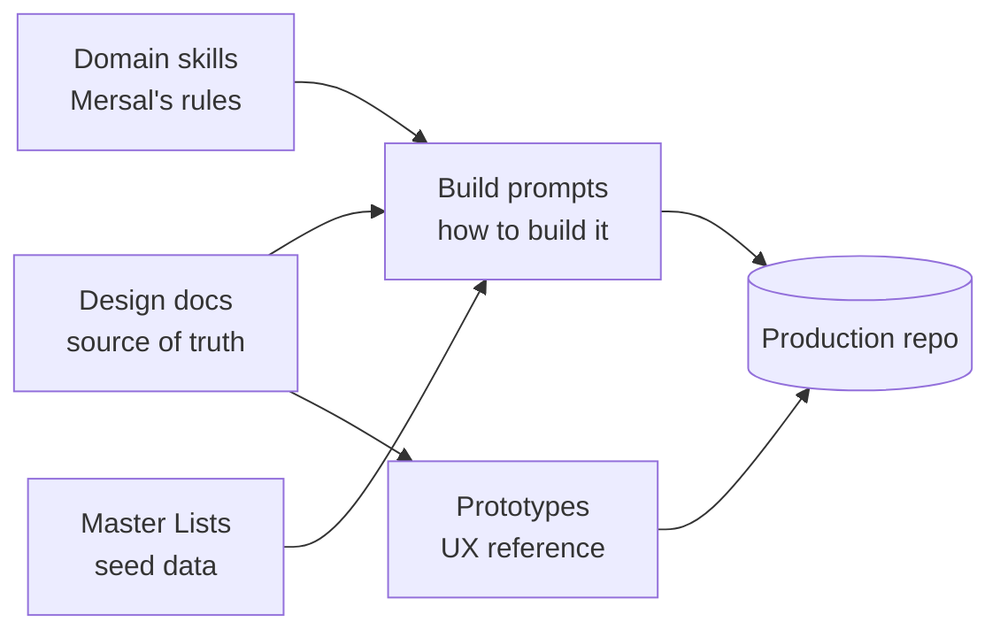

# Mersal HBMP — Healthcare Benefit Management Platform
### Design + Build Kit · project front door

This folder is a complete, self-contained kit to **design, prototype, and build** the Mersal Healthcare Benefit Management Platform (HBMP) — a service-oriented benefit-administration + EMR platform digitizing the end-to-end medical journey for Mersal Foundation's refugee beneficiaries.

It contains four things that work together:

| Layer | What it is | Where |
|-------|-----------|-------|
| **Design docs** | 43 deliverables + foundations — the single source of truth (vision → architecture → data → security → delivery → claims → branch scoping & clinical sensitivity → prescribing decision support & the approval engine) | `00-README-INDEX.md`, `0A`, `0B`, `0C`, `01`–`43` |
| **Prototypes** | Two working, clickable HTML UIs demonstrating the enterprise experience | `prototype-hbmp-multiscreen.html`, `prototype-approvals-worklist.html` |
| **Build prompts** | Phased Claude Code prompts that build the whole production app | `claude-code-prompts/` |
| **Domain skills** | 20 Mersal-specific Claude Code skills encoding the business rules | `claude-code-skills/` |
| **Reference data** | ICD-10, CPT, ATC-classified drugs, and the Egyptian drug list with per-drug indications (seed the master-data service) | `../Master Lists/`, `../Raw Files/` |

> **Status:** design DRAFT v0.9, reviewed & internally consistent. **Do not begin implementation** until the design set is approved by Mersal stakeholders (Medical, Operations, Security/DPO, Finance, IT). The prompts assume that gate has passed.

---

## How the pieces fit



- **Design docs** define *what* and *why* — every prompt reads them first. They cover the whole journey end to end: registration → eligibility → encounter → orders/prescriptions → fulfillment → approvals → and now **claims** (`36-claims-management.md`), which turns delivered, authorized services into reviewed, decided, and settled financial records — plus **branch scoping, practitioner specialty & clinical sensitivity** (`37-branch-scoping-and-clinical-sensitivity.md`), which scopes operational work to Mersal's six branches and default-denies sensitive (mental-health first) results outside the authoring doctor until a justified, time-boxed release is granted.
- **Skills** carry *Mersal's rules* (benefit logic, state machines, minimum-necessary zoning, brand system) so Claude Code applies them consistently.
- **Prompts** are the *build instructions*, phase by phase.
- **Prototypes** are the *UX target* the frontend must match.
- **Master Lists** are the *seed data* the master-data service ingests.

---

## Quick start

### 1. Review the design (humans)
Open `00-README-INDEX.md` (audience reading paths), then `0A-DESIGN-FOUNDATIONS.md` (vocabulary, stack, brand), `0B-DESIGN-SYSTEM-UI.md` (UI system), and `0C-OPEN-SOURCE-STACK.md` (the free/open-source, on-prem-first, cloud-ready infrastructure decision — $0 licensing, since Mersal is a charity — and the Azure→OSS mapping every infra choice follows). Click through `prototype-hbmp-multiscreen.html` in a browser to feel the experience. Route stakeholders to `01-product-vision.md`, `28-mvp-definition.md`, `29-delivery-plan.md`, and get sign-off.

### 2. Bootstrap the repository (engineers)
1. `git init` a new monorepo (structure below).
2. Copy the body of `claude-code-prompts/00-CLAUDE-MD-AND-CONVENTIONS.md` into a root **`CLAUDE.md`** — it loads into every Claude Code session (stack, conventions, security/audit/a11y rules, Definition of Done).
3. Copy each skill folder from `claude-code-skills/` into **`.claude/skills/`** (see `claude-code-skills/00-SKILLS-INDEX.md` for install + the phase→skill mapping).
4. Keep this `HBMP-Design/` folder and `../Master Lists/` reachable from the repo so prompts and loaders can read them.
5. Install generic engineering skills (PostgreSQL, OpenAPI, OpenTofu/Terraform, Helm/Kubernetes, OWASP, TDD, Mermaid…) from a marketplace.

### 3. Build, phase by phase (Claude Code)
Follow `claude-code-prompts/00-MASTER-PROMPT-LIST.md`. Run phases in dependency order, one focused session each; activate that phase's skills; review the diff and run tests before moving on:

```
0 → 0b → 1 → 2 → 2b → 3 → 4 → 5,6 → 14 → 7 → 8 → 10 → 10b
8b (admin) + 9 (frontend) run alongside; 11 hardening, 12 migration/go-live, 13 interop are gates.
14 (Branch Scoping & Clinical Sensitivity) is a cross-cutting RETROFIT of the built services and runs
   before 7 and 9 — approvals must be built member-scoped and blind to sensitive results, and the
   frontend needs the branch switcher + restricted-result state from the start.
10b (Claims Management) is post-v1 and requires authorizations, fulfillment and contract tariffs to be live.
```

Nothing is "done" until it meets the Definition of Done in `CLAUDE.md` (tests green, minimum-necessary + audit + accessibility enforced).

---

## Intended production repo structure
(from `claude-code-prompts/00-CLAUDE-MD-AND-CONVENTIONS.md`)

```
mersal-hbmp/
  CLAUDE.md                     # from claude-code-prompts/00-CLAUDE-MD-AND-CONVENTIONS.md
  .claude/skills/               # the 20 skills from claude-code-skills/
  docs/                         # ADRs, runbooks (see 34-technical-documentation.md)
  infra/                        # OpenTofu + Ansible + Helm per env/tier (25-deployment-architecture.md, 0C-OPEN-SOURCE-STACK.md)
  libs/                         # shared: contracts, auth, authz, audit-client, events, testing
  services/                     # identity patient policy eligibility emr orders approvals
                                # provider pharmacy notification reporting audit document
                                # masterdata case finance
  apps/
    web/                        # React role portals (RTL/a11y) — match the prototypes
    design-system/              # tokens + component library (0A §5, 0B)
  tools/                        # master-data loaders (../Master Lists ingestion)
  design/                       # a copy of HBMP-Design as living reference
```

---

## Non-negotiable invariants (enforced everywhere)
1. **Order/prescription consume is atomic, idempotent, duplicate-proof**; partial fulfillment leaves the remainder active (`23-state-machines.md`).
2. **Minimum-necessary, field-level** access per role — reception ≠ EMR, labs ≠ prescriptions, pharmacies ≠ results, finance ≠ diagnoses, doctors treat-only (`11-permission-matrix.md`).
3. **Immutable, hash-chained audit** on every mutation; soft-delete + history (`19-audit-strategy.md`).
4. **WCAG 2.2 AA + Arabic RTL**, color-blind-safe status, confirmed Mersal palette + official logo (`21`, `0A §5`, `0B`).
5. **Provider & tenant isolation**; break-glass specially audited; no external integration without a DPIA (`18`, `20`).

---

## Key entry points
- Design index: [`00-README-INDEX.md`](00-README-INDEX.md)
- Foundations & brand: [`0A-DESIGN-FOUNDATIONS.md`](0A-DESIGN-FOUNDATIONS.md) · UI system: [`0B-DESIGN-SYSTEM-UI.md`](0B-DESIGN-SYSTEM-UI.md)
- Build prompts: [`claude-code-prompts/00-MASTER-PROMPT-LIST.md`](claude-code-prompts/00-MASTER-PROMPT-LIST.md) · Conventions/CLAUDE.md: [`claude-code-prompts/00-CLAUDE-MD-AND-CONVENTIONS.md`](claude-code-prompts/00-CLAUDE-MD-AND-CONVENTIONS.md)
- Skills: [`claude-code-skills/00-SKILLS-INDEX.md`](claude-code-skills/00-SKILLS-INDEX.md)
- Prototypes: `prototype-hbmp-multiscreen.html` · `prototype-approvals-worklist.html`
- MVP / delivery: [`28-mvp-definition.md`](28-mvp-definition.md) · [`29-delivery-plan.md`](29-delivery-plan.md) · [`35-implementation-plan.md`](35-implementation-plan.md)
- Claims (Phase 10b, finance/claims audience): [`36-claims-management.md`](36-claims-management.md) → EPIC-13 in [`31-product-backlog.md`](31-product-backlog.md) → `US-CLM-*` in [`32-user-stories.md`](32-user-stories.md)
- Branch scoping, specialty & clinical sensitivity (Phase 14, security/DPO + architects): [`37-branch-scoping-and-clinical-sensitivity.md`](37-branch-scoping-and-clinical-sensitivity.md) → build prompt [`claude-code-prompts/phase-14-branch-scoping-and-sensitivity.md`](claude-code-prompts/phase-14-branch-scoping-and-sensitivity.md)

---

## Caveats worth knowing
- **Brand palette** is sampled from Mersal's live site (mersal-ngo.org) and WCAG-validated; reconcile against an official print brand book if one exists. The prototypes hotlink the real logo with a text fallback.
- **Prototypes** were verified by code review (this environment can't auto-run `file://`); if a screen renders oddly, report it.
- The design set uses **HIPAA/GDPR as principles**; the binding statute is **Egypt PDPL (Law 151/2020)** — have legal counsel validate (`20-compliance-checklist.md`).
- A few case/finance items reference stories generically (no `FR-FIN`/`FR-CASE` IDs in the backlog yet) — add them for strict traceability.

---

*Built from the Mersal HBMP design program. Everything here is pre-implementation: approved design first, then build via the phased prompts.*
